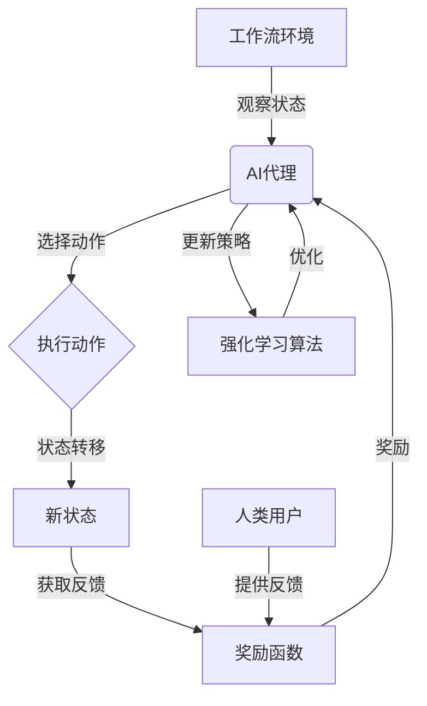

# AI人工智能代理工作流AI Agent Workflow：互动学习在工作流中的角色与方法

## 1. 背景介绍

### 1.1 问题的由来

在当今快节奏的商业环境中，工作流程的高效性和灵活性对于企业的成功至关重要。传统的工作流管理系统通常是基于预定义的规则和流程,缺乏动态调整和优化的能力,难以适应不断变化的业务需求。随着人工智能(AI)技术的快速发展,将AI代理引入工作流管理已成为一种新兴趻势,旨在提高工作流的智能化水平和适应性。

### 1.2 研究现状

目前,已有一些研究探索了将AI代理应用于工作流管理的方法。其中,一些研究侧重于使用规则引擎和决策树等技术来自动化工作流决策过程。另一些研究则关注于利用机器学习算法来预测和优化工作流性能。然而,这些方法通常是基于静态数据和预定义规则,难以有效地处理复杂的、动态变化的工作流场景。

### 1.3 研究意义

引入互动学习(Interactive Learning)的AI代理工作流管理系统,可以显著提高工作流的智能化水平和适应性。互动学习允许AI代理与人类用户进行实时交互,从而持续学习和优化工作流决策,使工作流能够动态调整以适应不断变化的业务需求。这种方法不仅可以提高工作流效率,还能增强工作流的透明度和可解释性,从而赢得用户的信任和采纳。

### 1.4 本文结构

本文将全面探讨AI代理工作流中互动学习的角色和方法。首先,我们将介绍互动学习在工作流中的核心概念和原理。接下来,详细阐述互动学习算法的原理和具体操作步骤。然后,我们将构建相关的数学模型并推导公式,并通过案例分析加深理解。此外,还将提供一个基于实际项目的代码实现示例,并对其进行详细解释和分析。最后,探讨互动学习在工作流中的实际应用场景,介绍相关工具和资源,总结未来发展趋势和挑战。

## 2. 核心概念与联系

互动学习(Interactive Learning)是一种人工智能范式,它允许AI代理与人类用户进行实时交互,持续学习和优化决策过程。在工作流管理中,互动学习AI代理可以通过与用户的交互来动态调整和优化工作流,使其能够适应不断变化的业务需求。

互动学习AI代理工作流的核心概念包括:

1. **人机协作(Human-AI Collaboration)**: AI代理与人类用户密切合作,相互学习和影响。人类用户可以向AI代理提供反馈和指导,而AI代理则利用这些信息来优化其决策过程。

2. **在线学习(Online Learning)**: AI代理在运行时持续学习,而不是基于静态数据和预定义规则进行训练。这使得AI代理能够动态地适应新的情况和需求。

3. **决策优化(Decision Optimization)**: AI代理利用从人类用户那里获得的反馈和数据,不断优化其工作流决策,以提高工作流的效率和质量。

4. **可解释性(Interpretability)**: AI代理的决策过程应该是透明的和可解释的,以赢得人类用户的信任和采纳。

5. **工作流建模(Workflow Modeling)**: 需要对工作流进行适当的建模,以便AI代理能够理解和优化工作流过程。

这些核心概念相互关联,共同构建了一个智能化、适应性强的工作流管理系统。人机协作和在线学习为AI代理提供了持续优化决策的能力,而决策优化则确保了工作流的高效性。可解释性有助于赢得用户的信任,而工作流建模则为AI代理提供了理解和优化工作流的基础。

## 3. 核心算法原理与具体操作步骤

### 3.1 算法原理概述

互动学习AI代理工作流的核心算法原理是基于强化学习(Reinforcement Learning)和在线学习(Online Learning)的思想。AI代理被视为一个智能体(Agent),它与工作流环境(Environment)进行交互,通过观察当前工作流状态(State)并执行相应的动作(Action),从而影响工作流的进展。

在每个时间步骤,AI代理会根据当前工作流状态选择一个动作,然后将这个动作应用于工作流环境。环境会根据这个动作转移到下一个状态,并返回一个奖励(Reward)给AI代理。AI代理的目标是最大化长期累积奖励,即优化工作流的整体性能。

为了实现这一目标,AI代理需要学习一个策略(Policy),即在给定工作流状态下选择最佳动作的映射函数。这个策略通过与人类用户的交互来不断优化和更新。具体来说,人类用户可以对AI代理的决策提供反馈(Feedback),这些反馈将被用作奖励信号,指导AI代理调整其策略。

通过不断地与环境交互、获取反馈并更新策略,AI代理可以逐步学习到一个优化的工作流决策策略,从而提高工作流的整体效率和质量。

### 3.2 算法步骤详解

互动学习AI代理工作流算法的具体步骤如下:

1. **初始化**:
   - 定义工作流环境,包括状态空间、动作空间和奖励函数。
   - 初始化AI代理的策略,可以使用随机策略或基于先验知识的启发式策略。

2. **观察当前状态**:
   - AI代理观察当前工作流的状态。

3. **选择动作**:
   - 根据当前策略,AI代理选择一个动作。

4. **执行动作**:
   - 将选择的动作应用于工作流环境。

5. **获取反馈**:
   - 环境根据执行的动作转移到下一个状态,并返回一个奖励给AI代理。
   - 人类用户也可以对AI代理的决策提供反馈,作为额外的奖励信号。

6. **更新策略**:
   - 根据获得的奖励,AI代理使用强化学习算法(如Q-Learning、策略梯度等)来更新其策略。

7. **重复步骤2-6**:
   - 重复上述步骤,直到工作流结束或达到预定的终止条件。

8. **策略评估**:
   - 评估最终学习到的策略在测试数据集上的性能。

9. **策略部署**:
   - 将学习到的优化策略部署到实际的工作流管理系统中。

在整个过程中,AI代理通过与人类用户的交互不断优化其策略,从而逐步提高工作流的效率和质量。人类用户的反馈对于指导AI代理的学习过程至关重要。

### 3.3 算法优缺点

**优点**:

1. **适应性强**: 互动学习AI代理工作流算法能够动态地适应不断变化的业务需求,提高工作流的灵活性。

2. **持续优化**: 通过与人类用户的交互,算法可以持续学习和优化工作流决策,从而不断提高工作流的效率和质量。

3. **可解释性**: 算法的决策过程是透明的和可解释的,有助于赢得人类用户的信任和采纳。

4. **人机协作**: 算法将人类专家的知识和经验与AI代理的学习能力相结合,实现人机协作,发挥各自的优势。

**缺点**:

1. **冷启动问题**: 在初始阶段,AI代理缺乏足够的数据和经验,可能会做出次优决策。

2. **数据质量依赖**: 算法的性能在很大程度上依赖于人类用户提供的反馈质量。

3. **复杂性**: 构建工作流环境模型和设计奖励函数可能是一个复杂的过程,需要专业知识和经验。

4. **计算开销**: 在线学习和策略优化过程可能需要大量的计算资源,尤其是在处理大规模工作流时。

### 3.4 算法应用领域

互动学习AI代理工作流算法可以应用于各种领域的工作流管理,包括但不限于:

1. **业务流程管理(BPM)**: 优化企业内部的各种业务流程,如采购流程、销售流程、人力资源流程等。

2. **软件开发流程**: 改进软件开发的各个阶段,如需求分析、设计、编码、测试、部署等。

3. **医疗保健流程**: 优化医疗诊断和治疗流程,提高医疗服务的效率和质量。

4. **制造流程**: 优化制造过程中的各个环节,如原材料采购、生产计划、质量控制等。

5. **物流运输流程**: 优化货物运输和配送的流程,提高物流效率和服务质量。

6. **客户服务流程**: 改进客户服务和支持流程,提升客户满意度。

7. **科研项目管理**: 优化科研项目的各个阶段,如立项、资源分配、实验设计、数据分析等。

总的来说,任何涉及复杂流程和决策的领域都可以从互动学习AI代理工作流算法中受益。

上图使用 Mermaid 流程图展示了互动学习AI代理工作流算法的核心流程。AI代理与工作流环境进行交互,观察当前状态并选择动作。执行动作后,环境转移到新状态并返回奖励。人类用户也可以提供反馈,作为额外的奖励信号。AI代理利用强化学习算法,根据获得的奖励不断更新和优化其策略。

## 4. 数学模型和公式详细讲解与举例说明

### 4.1 数学模型构建

为了形式化描述互动学习AI代理工作流问题,我们可以将其建模为一个马尔可夫决策过程(Markov Decision Process, MDP)。MDP是一种用于描述序列决策过程的数学框架,它由以下要素组成:

- 状态空间 $\mathcal{S}$: 工作流可能处于的所有状态的集合。
- 动作空间 $\mathcal{A}$: AI代理可以执行的所有动作的集合。
- 转移概率 $\mathcal{P}_{ss'}^a = \mathbb{P}(s'|s, a)$: 在状态 $s$ 下执行动作 $a$ 后,转移到状态 $s'$ 的概率。
- 奖励函数 $\mathcal{R}(s, a, s')$: 在状态 $s$ 下执行动作 $a$ 并转移到状态 $s'$ 时获得的奖励。
- 折扣因子 $\gamma \in [0, 1)$: 用于权衡即时奖励和长期累积奖励的重要性。

在互动学习AI代理工作流中,AI代理的目标是学习一个策略 $\pi: \mathcal{S} \rightarrow \mathcal{A}$,该策略将状态映射到动作,以最大化预期的长期累积奖励:

$$
J(\pi) = \mathbb{E}_\pi \left[ \sum_{t=0}^\infty \gamma^t r_t \right]
$$

其中 $r_t = \mathcal{R}(s_t, a_t, s_{t+1})$ 是在时间步 $t$ 获得的奖励。

### 4.2 公式推导过程

为了学习最优策略 $\pi^*$,我们可以使用强化学习算法,如 Q-Learning 或策略梯度方法。这些算法通过与环境交互并获取奖励,逐步更新一个价值函数或策略,以最大化长期累积奖励。

**Q-Learning 算法**

Q-Learning 算法旨在学习一个动作价值函数 $Q(s, a)$,表示在状态 $s$ 下执行动作 $a$ 后可获得的预期长期累积奖励。Q-Learning 的更新规则如下:

$$
Q(s_t, a_t) \leftarrow Q(s_t, a_t) + \alpha \left[ r_t + \gamma \max_{a'} Q