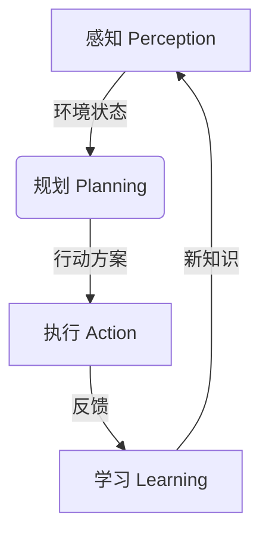

# AI人工智能代理工作流AI Agent WorkFlow：智能代理在广告营销系统中的应用

## 1. 背景介绍

### 1.1 问题的由来

在当今数字营销时代，企业面临着如何高效地将产品或服务推广给目标受众的挑战。传统的广告投放方式往往效率低下、成本高昂且难以精准定位。随着人工智能(AI)和大数据技术的飞速发展,智能代理(Intelligent Agent)应运而生,为解决这一难题提供了新的思路。

智能代理是一种基于人工智能技术的软件实体,能够自主地感知环境、规划行动并执行任务,从而代表用户完成特定目标。在广告营销领域,智能代理可以充当"虚拟营销人员",根据用户数据和行为模式,自动化地挖掘潜在客户、制定个性化营销策略并执行广告投放,极大提高了营销效率和精准度。

### 1.2 研究现状

近年来,智能代理在广告营销系统中的应用受到了广泛关注。学术界和工业界都在积极探索如何利用智能代理技术优化广告投放流程,提升营销绩效。一些知名公司如谷歌、Facebook和亚马逊已经在广告系统中大规模采用了智能代理技术。

然而,现有的智能代理系统还存在一些不足,例如:

- 决策过程缺乏透明度,难以解释代理的行为逻辑
- 对复杂动态环境的适应性不足
- 隐私保护和算法公平性等伦理问题有待解决

因此,设计一种高效、可解释、可靠且符合伦理的智能代理工作流程,对于提升广告营销系统的性能和用户体验至关重要。

### 1.3 研究意义

本文旨在探讨智能代理在广告营销系统中的应用,设计一种高效、可解释且符合伦理的智能代理工作流程。具体研究意义如下:

1. 提高广告投放的精准度和转化率,降低营销成本
2. 优化用户体验,提供个性化且非侵入式的广告推荐
3. 增强决策过程的透明度,提高系统的可解释性
4. 探讨智能代理在营销领域的伦理挑战及应对之策
5. 为智能代理在其他领域的应用提供借鉴和指导

### 1.4 本文结构  

本文首先介绍智能代理在广告营销系统中应用的背景、现状和意义。接下来阐述智能代理工作流程的核心概念,包括感知、规划、执行和学习等环节。然后详细解释工作流程中的核心算法原理,如协同过滤、强化学习等,并给出相应的数学模型和公式推导。

之后,我们将通过一个实际的广告投放案例,展示智能代理工作流程在项目中的具体实现,包括开发环境、代码实现和运行结果等。

在此基础上,探讨智能代理在广告营销等实际应用场景中的前景,并介绍相关的工具和学习资源。最后,总结研究成果,分析发展趋势和面临的挑战,并对未来研究方向进行展望。

## 2. 核心概念与联系

智能代理工作流程通常包括四个核心环节:感知(Perception)、规划(Planning)、执行(Action)和学习(Learning),如下图所示:

### 2.1 感知(Perception)

感知环节负责从环境中获取相关数据,构建对当前状态的理解。在广告营销场景中,感知模块需要收集用户数据(如人口统计信息、浏览历史、地理位置等)、营销数据(如产品信息、竞争对手数据等)以及其他相关数据(如新闻、天气等)。

常用的数据采集方法包括网页跟踪、移动应用埋点、社交媒体API等。数据预处理如去重、清洗、标准化等则有助于提高后续处理的质量。

### 2.2 规划(Planning)

规划环节根据感知获得的信息,制定行动策略以实现既定目标。在广告营销中,规划模块需要分析用户偏好,预测广告点击和转化率,并优化广告投放策略,包括选择投放时间、渠道、创意等。

常用的规划算法有协同过滤(Collaborative Filtering)、强化学习(Reinforcement Learning)、多武器臂赌博机(Multi-Armed Bandit)等。这些算法能够在探索(Exploration)和利用(Exploitation)之间寻求平衡,持续优化决策。

### 2.3 执行(Action)

执行环节负责根据规划得到的策略,在真实环境中采取相应行动。在广告营销中,执行模块需要调用广告平台API,实现广告的实际投放。

执行过程中,代理需要监控广告效果,并根据反馈数据(如点击率、转化率等)调整策略。同时,代理还需要处理异常情况,如网络故障、API限流等。

### 2.4 学习(Learning)

学习环节使代理能够从过去的经验中积累知识,不断优化自身的决策模型。在广告营销中,学习模块需要分析广告投放的反馈数据,更新用户画像、点击率预测模型等,为下一轮决策提供依据。

常用的学习算法有监督学习(如逻辑回归)、无监督学习(如聚类分析)和强化学习等。通过持续学习,代理能够适应环境的动态变化,提高长期决策的效果。

上述四个环节紧密联系,构成了智能代理的工作循环。感知和规划决定了代理的行为,而执行和学习则为下一轮决策提供了反馈和知识积累。这种闭环设计使得代理能够持续优化自身,更好地完成广告精准投放的目标。

## 3. 核心算法原理及具体操作步骤

在智能代理工作流程中,规划和学习环节涉及了多种核心算法,下面我们将详细介绍其中的关键算法原理及操作步骤。

### 3.1 算法原理概述

#### 3.1.1 协同过滤(Collaborative Filtering)

协同过滤是一种常用的个性化推荐算法,通过分析用户之间的相似性,为目标用户推荐其他相似用户喜欢的项目。在广告营销中,可以利用协同过滤发现具有相似兴趣和行为模式的用户群体,从而为他们推荐合适的广告。

主要分为两大类:基于用户(User-based)和基于项目(Item-based)。前者分析用户之间的相似度,后者分析项目之间的相似度。常用的相似度计算方法有余弦相似度、皮尔逊相关系数等。

#### 3.1.2 强化学习(Reinforcement Learning)

强化学习是一种基于环境交互的机器学习范式,智能体(Agent)通过试错,学习如何在特定环境中获取最大化的累积奖励。在广告投放中,可以将智能代理视为强化学习的智能体,通过不断尝试不同的广告策略并根据反馈调整行为,最终获得最优的投放效果。

常用的强化学习算法有Q-Learning、Deep Q-Network(DQN)、Policy Gradient等。这些算法能够在探索和利用之间寻求平衡,持续优化长期收益。

#### 3.1.3 多武器臂赌博机(Multi-Armed Bandit)

多武器臂赌博机是一种经典的在线学习和决策问题,描述了一种需要在多个选择中做出最优决策的场景。在广告投放中,可以将每个广告渠道视为一个武器臂,智能代理需要权衡探索(尝试新渠道)和利用(使用已知有效渠道)之间的平衡,以最大化总体收益。

常用的解决算法有ε-Greedy、Upper Confidence Bound(UCB)、Thompson Sampling等。这些算法通过概率控制或置信区间估计来平衡探索和利用,从而获得最优的长期收益。

### 3.2 算法步骤详解

#### 3.2.1 协同过滤算法步骤

以基于用户(User-based)的协同过滤为例,算法步骤如下:

1. 构建用户-项目评分矩阵
2. 计算用户之间的相似度(如余弦相似度)
3. 找到与目标用户最相似的K个邻居用户
4. 计算目标用户对项目i的预测评分,通常使用加权平均公式:

$$
r_{ui} = \overline{r_u} + \frac{\sum\limits_{v \in N(u,K)}sim(u,v)(r_{vi} - \overline{r_v})}{\sum\limits_{v \in N(u,K)}sim(u,v)}
$$

其中:
- $r_{ui}$是目标用户u对项目i的预测评分
- $\overline{r_u}$是用户u的平均评分
- $N(u,K)$是与用户u最相似的K个邻居
- $sim(u,v)$是用户u和v的相似度
- $r_{vi}$是用户v对项目i的评分
- $\overline{r_v}$是用户v的平均评分

5. 根据预测评分为目标用户推荐高分项目

该算法的优点是简单直观,缺点是无法处理新用户和新项目的冷启动问题。

#### 3.2.2 Q-Learning算法步骤

Q-Learning是一种常用的基于价值函数(Value Function)的强化学习算法,算法步骤如下:

1. 初始化Q表格(状态-动作值函数)
2. 对每个episode(即一个完整的试验过程):
    - 初始化状态s
    - 对每个时间步:
        - 选择动作a(基于ε-Greedy或其他策略)
        - 执行动作a,获得奖励r和新状态s'
        - 更新Q值:
        
$$Q(s,a) \leftarrow Q(s,a) + \alpha[r + \gamma \max_{a'}Q(s',a') - Q(s,a)]$$
        
        其中:
        - $\alpha$是学习率
        - $\gamma$是折现因子
        - $\max_{a'}Q(s',a')$是下一状态s'下所有可能动作a'的最大Q值
        - 更新s <- s'
    - 直到episode结束
    
3. 重复步骤2,直到收敛

Q-Learning通过不断尝试和更新Q表格,最终学习到一个最优的状态-动作值函数,指导智能体做出最佳决策。

### 3.3 算法优缺点

#### 协同过滤

优点:
- 简单直观,容易实现
- 能够为用户提供个性化推荐
- 无需了解项目内容,只需用户评分数据

缺点:
- 无法处理新用户和新项目的冷启动问题
- 对稀疏数据敏感,难以获得高质量的相似度计算
- 隐私和安全问题(如数据泄露)

#### 强化学习(Q-Learning)

优点:  
- 无需事先的环境模型,可以通过试错学习最优策略
- 能够处理连续和离散的状态空间
- 具有探索和利用的权衡机制

缺点:
- 状态空间和动作空间过大时,收敛缓慢
- 奖励函数的设计对算法性能影响很大
- 难以处理部分可观测环境(Partially Observable)

#### 多武器臂赌博机

优点:
- 简单高效,易于实现和理解
- 适用于在线学习和决策的场景
- 具有理论上的收敛性和有界性质

缺点: 
- 假设奖励分布是静态的,难以处理动态环境
- 只考虑单步奖励,忽略了长期收益
- 对上下文信息(如用户特征)的利用不足

### 3.4 算法应用领域

上述算法在广告营销系统中的应用场景包括但不限于:

- 个性化广告推荐(协同过滤)
- 广告投放策略优化(强化学习)  
- 多渠道广告分配(多武器臂赌博机)
- 用户行为预测(监督学习)
- 用户群体划分(无监督学习)

除了广告营销,这些算法在推荐系统、资源调度、机器人控制等领域也有广泛应用。

## 4. 数学模