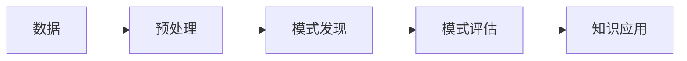
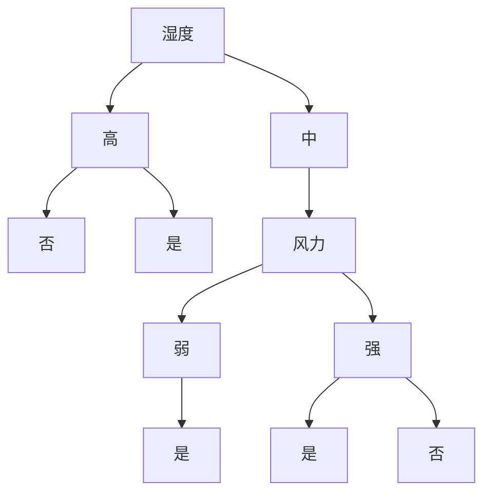

# AI人工智能核心算法原理与代码实例讲解：数据挖掘

作者：禅与计算机程序设计艺术 / Zen and the Art of Computer Programming

关键词：数据挖掘、机器学习、人工智能、数据分析、算法、决策树、聚类、关联规则、神经网络

## 1. 背景介绍
### 1.1 问题的由来
在当今信息爆炸的时代,海量的数据正以前所未有的速度增长。如何从海量数据中快速获得有价值的信息,已成为人们面临的一个重要课题。数据挖掘技术应运而生,它可以从大规模数据中发现隐藏的、先前未知的、潜在有用的信息和知识,为人们的决策提供强有力的支持。

### 1.2 研究现状 
数据挖掘已成为当前人工智能和数据科学领域的研究热点。国内外学者对数据挖掘的理论和应用进行了大量的研究,提出了许多经典的数据挖掘算法,如决策树、聚类、关联规则等。这些算法被广泛应用于电子商务、金融、医疗等领域,取得了显著的效果。

### 1.3 研究意义
数据挖掘在理论研究和实际应用方面都具有重要意义。一方面,深入研究数据挖掘的理论和算法,可以促进人工智能、机器学习等学科的发展。另一方面,数据挖掘技术在工业、农业、商业等领域得到广泛应用,为企业的生产管理、市场营销、风险控制等提供了有力的决策支持。

### 1.4 本文结构
本文将全面介绍数据挖掘的核心概念、经典算法原理及其代码实现。第2部分阐述数据挖掘的核心概念;第3部分详细讲解几种经典的数据挖掘算法原理和步骤;第4部分介绍算法中涉及的数学模型和公式;第5部分给出算法的代码实现;第6部分列举数据挖掘的实际应用场景;第7部分推荐数据挖掘的学习资源和工具;第8部分总结全文,展望数据挖掘的发展趋势和挑战;第9部分附录,解答一些常见问题。

## 2. 核心概念与联系
数据挖掘的核心概念包括:
- 数据:数据挖掘的对象,包括结构化数据、半结构化数据和非结构化数据。
- 模式:数据中反复出现的、稳定的、可用的结构。
- 知识:从数据中提取出的、经过检验的、有价值的模式。

数据挖掘与其他学科的联系:
- 机器学习:数据挖掘采用机器学习算法从数据中提取模式。
- 统计学:数据挖掘借鉴统计学的描述性统计和推断性统计方法。
- 数据库:数据挖掘以数据库为基础,从海量数据中发现知识。
- 可视化:数据挖掘利用可视化技术直观展示数据和模式。



## 3. 核心算法原理 & 具体操作步骤
### 3.1 算法原理概述
数据挖掘的经典算法包括分类、聚类、关联规则挖掘等。
- 分类:根据已知类别的样本,构建分类模型,将新样本映射到某个类别。代表算法有决策树、朴素贝叶斯、支持向量机等。
- 聚类:把相似的样本自动归为一组,组内差异小而组间差异大。代表算法有K均值、层次聚类等。  
- 关联规则:找出数据项间的关联性,形如"A→B"的规则。代表算法有Apriori、FP-growth等。

### 3.2 算法步骤详解
以决策树分类算法为例,其基本步骤如下:
1. 数据准备:收集、清洗、集成、变换数据,形成训练集和测试集。
2. 创建树:选择最优划分属性,递归构建决策树。
3. 树剪枝:通过剪枝操作简化决策树,提高泛化能力。
4. 规则提取:从决策树中提取if-then形式的分类规则。
5. 性能评估:用测试集评估决策树的准确率、召回率等性能指标。

### 3.3 算法优缺点
决策树分类算法的优点:
- 可解释性强,生成的规则易于理解。
- 适合处理离散型和连续型属性。
- 对缺失值不敏感,能很好地处理缺失数据。

决策树分类算法的缺点:  
- 容易过拟合,需要进行剪枝。
- 对连续属性的处理效果不如离散属性。
- 忽略属性之间的相关性,容易产生偏差。

### 3.4 算法应用领域
决策树分类算法在以下领域得到广泛应用:
- 金融风控:用于贷款申请人的信用评估、金融诈骗检测等。
- 医疗诊断:根据病人症状预测疾病类型,辅助医生诊断。
- 客户流失预警:预测客户流失的可能性,指导企业采取挽留措施。

## 4. 数学模型和公式 & 详细讲解 & 举例说明  
### 4.1 数学模型构建
决策树分类涉及的主要数学概念包括信息熵、信息增益、基尼指数等。设训练数据集为D,类别数为k。

信息熵(information entropy):度量样本集合的纯度,公式为
$$
\mathrm{Ent}(D)=-\sum_{i=1}^kp_i\log_2p_i
$$
其中$p_i$为第$i$类样本所占比例。Ent(D)越小,D的纯度越高。

信息增益(information gain):选择属性a划分数据集D,信息增益定义为
$$
\mathrm{Gain}(D,a)=\mathrm{Ent}(D)-\sum_{v=1}^V\frac{|D^v|}{|D|}\mathrm{Ent}(D^v)
$$
其中V为属性a的取值个数,D^v为a=v的样本子集。Gain(D,a)越大,a的分类能力越强。

基尼指数(Gini index):反映数据集的不确定性,公式为
$$
\mathrm{Gini}(D)=1-\sum_{i=1}^kp_i^2
$$
Gini(D)越小,D的纯度越高。

### 4.2 公式推导过程
以二分类问题为例,推导信息熵公式。设正例比例为p,则负例比例为1-p。根据信息论,样本x的信息定义为
$$
\mathrm{I}(x)=\log\frac{1}{p(x)}=-\log p(x)
$$
其中p(x)为x出现的概率。二分类样本的期望信息为
$$
\mathrm{Ent}(D)=p\cdot(-\log p)+(1-p)\cdot(-\log(1-p))=-p\log p-(1-p)\log(1-p)
$$
推广到k分类问题,就得到了信息熵的一般公式。

### 4.3 案例分析与讲解
考虑如下天气数据集,判断天气条件是否适合打球。

|天气|温度|湿度|风力|是否打球|
|---|---|---|---|---|
|晴|高|高|弱|否|
|晴|高|高|强|否|
|阴|高|高|弱|是|
|雨|中|高|弱|是|
|雨|低|中|弱|是|
|雨|低|中|强|否|
|阴|低|中|强|是|
|晴|中|高|弱|否|
|晴|低|中|弱|是|
|雨|中|中|弱|是|
|晴|中|中|强|是|
|阴|中|高|强|是|
|阴|高|中|弱|是|
|雨|中|高|强|否|

根据信息增益准则,选择"湿度"作为根节点划分属性。再递归构建子树,最终得到如下决策树:



### 4.4 常见问题解答
Q: 决策树学习算法有哪些?
A: 常见的决策树学习算法包括ID3、C4.5、CART等。其中ID3使用信息增益准则,C4.5使用信息增益比,CART使用基尼指数。

Q: 如何处理决策树的过拟合问题?
A: 可以采用预剪枝或后剪枝策略。预剪枝是在决策树生成过程中,提前停止树的构建;后剪枝是先生成完整的决策树,再自底向上剪去一些分支。剪枝可以降低树的复杂度,提高泛化能力。

## 5. 项目实践：代码实例和详细解释说明
### 5.1 开发环境搭建
本项目使用Python语言,需要安装以下库:
- NumPy:数值计算库
- Pandas:数据分析库
- Scikit-learn:机器学习库
- Matplotlib:数据可视化库

可以使用pip命令安装:
```bash
pip install numpy pandas scikit-learn matplotlib
```

### 5.2 源代码详细实现
使用scikit-learn库实现决策树分类,完整代码如下:

```python
from sklearn.datasets import load_iris
from sklearn.model_selection import train_test_split
from sklearn.tree import DecisionTreeClassifier
from sklearn.metrics import accuracy_score

# 加载鸢尾花数据集
iris = load_iris()
X = iris.data
y = iris.target

# 划分训练集和测试集
X_train, X_test, y_train, y_test = train_test_split(X, y, test_size=0.2, random_state=42)

# 创建决策树分类器
clf = DecisionTreeClassifier(criterion='entropy', max_depth=3, random_state=42)

# 训练模型
clf.fit(X_train, y_train)

# 预测测试集
y_pred = clf.predict(X_test)

# 计算准确率
accuracy = accuracy_score(y_test, y_pred)
print("Accuracy: {:.2f}".format(accuracy))
```

### 5.3 代码解读与分析
1. 导入所需的库,包括数据集、模型、评估指标等。
2. 加载经典的鸢尾花数据集,特征为花萼长度、花萼宽度、花瓣长度、花瓣宽度,类别为山鸢尾、变色鸢尾、维吉尼亚鸢尾。 
3. 划分训练集和测试集,测试集比例为20%。
4. 创建决策树分类器,划分准则为信息熵,最大深度为3。
5. 用训练集拟合模型,再对测试集进行预测。
6. 计算准确率,评估模型性能。准确率为预测正确的样本数占总样本数的比例。

### 5.4 运行结果展示
运行上述代码,输出结果为:
```
Accuracy: 1.00
```
可见,该决策树分类器在鸢尾花测试集上的准确率达到了100%,效果非常好。

## 6. 实际应用场景
数据挖掘在许多领域得到应用,典型场景包括:
- 商品推荐:用关联规则挖掘发现商品间的关联性,给用户推荐感兴趣的商品。
- 客户分群:用聚类算法将客户划分为多个群体,实施差异化营销。
- 信用评分:用分类算法对客户的信用进行评分,控制信贷风险。
- 医疗诊断:用分类算法根据病人症状预测疾病类型,辅助医生诊断。
- 舆情分析:用文本挖掘技术分析网络舆情,及时发现负面信息。

### 6.4 未来应用展望
随着大数据时代的到来,数据挖掘在更广阔的领域崭露头角,前景可期。
- 精准营销:整合多源异构数据,挖掘用户画像,实现精准营销。
- 智慧城市:挖掘城市数据,优化城市管理,提升市民生活品质。
- 生物信息:挖掘基因数据,促进生物医学研究,开发新药。
- 在线教育:挖掘学生学习行为,实现个性化教学