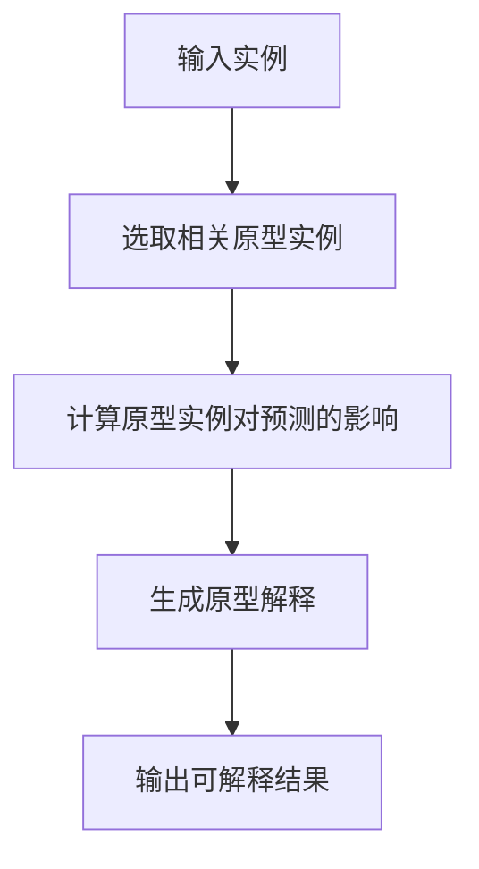

好的,我会认真撰写这篇文章。以下是正文部分:

# AI人工智能核心算法原理与代码实例讲解：模型可解释性

## 1. 背景介绍

### 1.1 问题的由来

随着人工智能技术的不断发展和广泛应用,AI模型的可解释性日益受到关注。传统的"黑箱"式机器学习模型缺乏透明度,其内部决策过程对人类是不可解释的。这种不可解释性不仅影响了模型的可信度,也制约了AI技术在一些关键领域(如医疗、金融等)的应用。

### 1.2 研究现状  

为提高AI模型的可解释性,研究人员提出了多种解释方法,主要包括:

1. **特征重要性分析**(Feature Importance)
2. **局部解释模型**(Local Interpretable Model-Agnostic Explanations, LIME)  
3. **沿着决策路径的解释**(Explanations Along the Decision Path)
4. **层次化神经网络可视化**(Layer-Wise Relevance Propagation, LRP)
5. **原型解释**(Prototype Explanations)

这些方法从不同角度揭示了模型内部的工作机理,但仍存在一些局限性,如解释的稳定性、可靠性、普适性等方面有待提高。

### 1.3 研究意义

提高AI模型的可解释性,有助于:

1. 增强人类对AI决策的信任度
2. 发现模型潜在的缺陷和偏差
3. 促进AI技术在关键领域的应用
4. 满足相关法律法规的合规要求  

因此,研究AI模型可解释性具有重要的理论意义和应用价值。

### 1.4 本文结构

本文将重点介绍一种新颖的可解释性方法——基于原型的模型解释(Prototype Explanations)。文章首先阐述该方法的核心概念和与其他方法的联系,然后详细讲解算法原理、数学模型、代码实现,并通过实例分析其应用场景。最后总结该方法的发展趋势和面临的挑战。

## 2. 核心概念与联系

基于原型的模型解释方法的核心思想是:利用原型实例(Prototype Instances)来解释模型对于某个特定输入实例的预测结果。所谓原型实例,是指能够很好地概括和代表某个类别的"典型"实例。

该方法的工作流程如下:

可以看出,这种方法与特征重要性分析、LIME等方法有一些相似之处,都是通过选取一些"参考实例"来解释模型预测。但基于原型的方法更加直观,原型实例本身就是数据中的真实案例,更易于人类理解。

另一方面,该方法也与层次化神经网络可视化方法有一些联系。后者是通过计算每个神经元对最终预测结果的相关性贡献,从而生成解释。而基于原型的方法则是计算原型实例对预测的影响程度,两者在一定程度上是相通的。

总的来说,基于原型的模型解释方法集合了以上多种方法的优点,是一种新颖且具有潜力的可解释性方法。

## 3. 核心算法原理 & 具体操作步骤  

### 3.1 算法原理概述

基于原型的模型解释算法的核心思想,是通过选取与输入实例在语义上最相关的原型实例集合,并量化每个原型实例对模型预测结果的影响程度,从而生成对预测的解释。

算法的具体流程如下:

1. 对于给定的输入实例x,基于某种相似性度量,从训练数据中选取与x最相关的k个原型实例集合P
2. 针对每个原型实例p∈P,计算其对模型预测f(x)的影响程度s(p)
3. 根据影响程度对原型实例集合P进行排序,选取前n个原型实例
4. 将这n个原型实例及其影响程度作为解释,输出给用户

其中,影响程度s(p)的计算是算法的核心部分,需要通过一些技巧来量化。我们将在下一节详细介绍其计算过程。

### 3.2 算法步骤详解  

1. **选取相关原型实例集合P**

我们需要度量输入实例x与训练数据中每个实例之间的相似性,并选取前k个最相似的实例作为原型实例集合P。相似性度量可以使用余弦相似度、欧氏距离等。

2. **计算原型实例的影响程度s(p)**

对于每个原型实例p∈P,我们定义其对预测f(x)的影响程度s(p)为:

$$s(p) = f(x) - f(x\odot m_p)$$

其中,m_p是一个掩码向量,将x中与p不同的特征位置mask为0。∘是元素级别的向量点乘运算。

可以看出,s(p)实际上是模型预测在"去除"了p中的不同特征后的变化量。如果s(p)较大,说明p对预测结果有很大影响。

为了提高解释的可靠性,我们可以引入一些扰动,计算多个扰动后的影响程度,取均值作为最终的s(p)。

3. **对原型实例排序并输出解释**

将原型实例集合P中的实例按照影响程度s(p)从大到小排序。然后选取前n个原型实例及其影响程度作为解释输出。

此外,我们还可以给出每个原型实例p属于的类别标签,以及p与输入实例x之间的相似度,使解释更加完整。

### 3.3 算法优缺点

**优点:**

1. 解释直观,易于理解
2. 利用了训练数据中的真实案例
3. 能够很好地解释"黑箱"模型
4. 可解释性与模型性能两手抓

**缺点:**  

1. 计算复杂度较高
2. 对异常值较为敏感  
3. 解释的全面性有待提高

### 3.4 算法应用领域

基于原型的模型解释算法可以应用于多个领域:

- **计算机视觉**: 解释图像分类、目标检测等模型
- **自然语言处理**: 解释文本分类、机器翻译等任务
- **推荐系统**: 解释个性化推荐的决策过程
- **医疗健康**: 解释疾病诊断、患者风险评估等模型
- **金融**: 解释贷款审批、信用评分等决策

总的来说,任何需要"黑箱"模型可解释性的场景,都可以尝试应用这一算法。

## 4. 数学模型和公式 & 详细讲解 & 举例说明

### 4.1 数学模型构建

我们将基于原型的模型解释问题形式化为一个优化问题:

给定:
- 输入实例 $x \in \mathcal{X}$
- 黑箱模型 $f: \mathcal{X} \rightarrow \mathcal{Y}$ 
- 训练数据集 $\mathcal{D} = \{(x_i, y_i)\}_{i=1}^N$

目标是找到一个原型实例集合 $\mathcal{P} \subset \mathcal{D}$ 和对应的影响权重 $\{w_p\}_{p \in \mathcal{P}}$，使得:

$$\underset{\mathcal{P}, w}{\mathrm{minimize}} \quad L(f(x), \hat{f}(x; \mathcal{P}, w)) + \Omega(\mathcal{P}, w)$$

其中:
- $\hat{f}(x; \mathcal{P}, w)$ 是基于原型集合 $\mathcal{P}$ 和权重 $w$ 对 $f(x)$ 的解释模型
- $L$ 是解释模型与真实模型之间的损失函数
- $\Omega$ 是正则化项,用于控制原型集合的大小和解释的简洁性

### 4.2 公式推导过程

我们选择使用线性解释模型:

$$\hat{f}(x; \mathcal{P}, w) = f(0) + \sum_{p \in \mathcal{P}} w_p s(p)$$

其中 $f(0)$ 是模型的偏置项,可以预先计算得到; $s(p)$ 是第3节中定义的原型实例 $p$ 对预测的影响程度。

将线性模型代入目标函数,可以得到:

$$\begin{aligned}
L &= \|f(x) - \hat{f}(x; \mathcal{P}, w)\|^2 \\
  &= \left\|f(x) - f(0) - \sum_{p \in \mathcal{P}} w_p s(p)\right\|^2
\end{aligned}$$

对于正则化项 $\Omega$,我们使用 $L_1$ 范数来实现原型集合的稀疏性:

$$\Omega(\mathcal{P}, w) = \lambda \sum_{p \in \mathcal{P}} |w_p|$$

其中 $\lambda > 0$ 是一个超参数,控制正则化的强度。

综合以上两个部分,我们的优化目标函数为:

$$\underset{\mathcal{P}, w}{\mathrm{minimize}} \quad \left\|f(x) - f(0) - \sum_{p \in \mathcal{P}} w_p s(p)\right\|^2 + \lambda \sum_{p \in \mathcal{P}} |w_p|$$

这是一个可以通过坐标下降等优化算法来高效求解的目标函数。

### 4.3 案例分析与讲解

我们以一个文本分类任务为例,说明基于原型的模型解释是如何工作的。

假设我们有一个新闻文本分类模型,用于将新闻文章分为"政治"、"经济"、"体育"等类别。现在我们输入一篇关于"贸易战"的新闻文章,模型将其预测为"政治"类别。

为了解释这个预测结果,我们的算法首先从训练数据中选取与输入文章最相似的10篇新闻作为原型实例集合P。然后计算每个原型实例对预测结果"政治"类别的影响程度s(p)。

假设算法选取的前3个最具影响力的原型实例分别是:

1) 一篇关于"中美贸易谈判"的新闻,影响程度0.8
2) 一篇报道"关税政策"的新闻,影响程度0.6  
3) 一篇讨论"进出口数据"的经济新闻,影响程度-0.3

可以看出,前两个原型实例都与"贸易战"话题密切相关,且对"政治"类别的预测有正面影响。而第3个原型实例则是一个"反例",说明该经济新闻对于"政治"类别的预测有负面影响。

通过这些具体的原型实例及其影响分数,我们可以清楚地解释模型将输入文章分类为"政治"类别的原因:主要是因为文章内容涉及贸易谈判、关税等与政治密切相关的主题。同时也说明,如果文章过多讨论经济数据而非政治方面的内容,则可能会对"政治"类别的预测产生负面影响。

这种基于真实案例的解释,比简单列出一些关键词或突出的文本特征更加直观和可信。

### 4.4 常见问题解答  

**Q1: 如何选取合适的原型实例数量k?**

A1: 原型实例数量k的选取需要权衡解释的完整性和简洁性。过多的原型实例会增加解释的复杂度,而过少则可能导致解释不全面。通常可以先设置一个较大的k值(如50),再结合实际情况适当减小,使解释足够简洁同时也不遗漏重要信息。

**Q2: 对异常值和噪声数据是否有影响?**

A2: 是的,基于原型的解释方法对异常值和噪声数据比较敏感。因为这些"离群"数据可能会被选为原型实例,从而影响解释的准确性。一种解决方案是在选取原型实例时,除了相似度之外还引入其他约束条件(如密度约束),尽量避免选取异常值。

**Q3: 解释的可靠性和稳定性如何?**

A3: 为提高解释的可靠性和稳定性,我们可以采取一些策略:
1) 引入扰动,计算多个扰动后的影响程度的均值
2) 设置阈值,过滤掉影