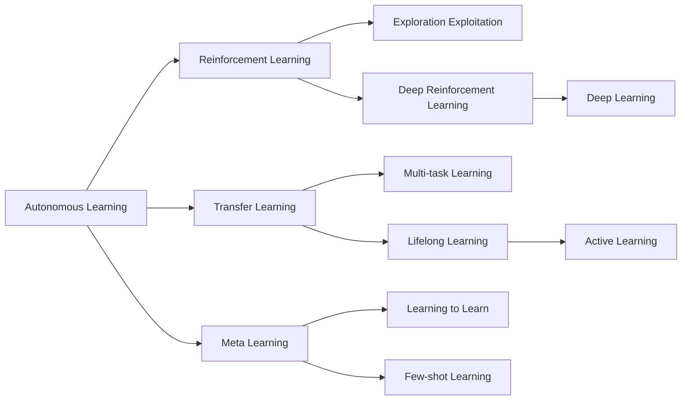

# AI人工智能核心算法原理与代码实例讲解：自主学习

关键词：人工智能, 自主学习, 强化学习, 深度学习, 迁移学习, 元学习, 终身学习

## 1. 背景介绍
### 1.1 问题的由来
人工智能(Artificial Intelligence, AI)自诞生以来就一直致力于让机器像人一样思考和学习。传统的机器学习方法大多需要依赖大量的人工标注数据和专家知识来训练模型,无法做到真正意义上的自主学习。而人类和动物却可以在很少监督或无监督的情况下,通过自主探索、主动学习来不断积累知识技能。因此,如何让AI系统像人一样从数据和经验中自主学习,进而适应不断变化的环境,是当前AI研究的一个重要课题。

### 1.2 研究现状
近年来,自主学习(Autonomous Learning)成为了AI领域的研究热点。一方面,深度强化学习的兴起为AI系统的自主决策提供了有力工具；另一方面,元学习、迁移学习等方法让AI系统具备了快速学习新任务的能力。一些代表性的研究成果包括:
- DeepMind的AlphaGo系列,通过深度强化学习和自博弈实现了超人的围棋水平[1]。 
- OpenAI Five,5个AI玩家通过自主学习最终战胜人类顶尖选手[2]。
- 谷歌提出了AutoML,让神经网络能够自动设计神经网络[3]。
- Finn等人提出了Model-Agnostic Meta-Learning(MAML),让模型能在新任务上快速适应[4]。

### 1.3 研究意义
自主学习让AI系统在面对未知环境和任务时,无需人工干预就能不断提升自身能力,是实现通用人工智能(Artificial General Intelligence, AGI)的关键。自主学习技术不仅可以极大提升AI系统的智能水平,还能广泛应用于无人驾驶、智能制造、智慧城市、医疗健康等领域,为人类生活带来巨大便利。同时,自主学习也为类脑智能和认知科学研究提供了新的视角。

### 1.4 本文结构
本文将重点介绍AI自主学习的核心算法原理和代码实现。第2部分阐述自主学习的核心概念及其内在联系。第3部分详细讲解几种主要的自主学习算法。第4部分给出算法背后的数学模型和公式推导。第5部分提供算法的代码实例。第6部分分析自主学习的应用场景。第7部分推荐相关学习资源。第8部分总结全文并展望自主学习的未来。

## 2. 核心概念与联系
自主学习的目标是让AI系统像人一样,通过主动探索、持续学习来自适应环境。其核心是寻求一种通用的学习范式,使系统能从少量先验知识出发,不断从数据中总结规律、提炼知识,进而解决新问题、适应新环境。这需要算法在 exploration(探索)和exploitation(利用)之间权衡,即开发新知识和利用已有知识。

从技术角度看,自主学习涉及多个AI分支领域:

- 强化学习(Reinforcement Learning): 通过agent与环境的交互,以trial-and-error的方式来最大化累积奖励,实现目标导向的序贯决策。
- 深度学习(Deep Learning): 通过多层神经网络来提取数据的高层特征,增强模型的表示能力。深度强化学习将二者结合,取得了显著成果。  
- 迁移学习(Transfer Learning): 将已学习过的知识迁移到新任务,减少所需训练数据,加速学习进程。
- 元学习(Meta Learning 或 Learning to Learn): 学习如何学习的能力,即从多个任务中学得一个通用的学习器(learner),使其能在新任务上快速适应。
- 多任务学习(Multi-task Learning): 同时学习多个相关任务,通过共享知识来提高泛化能力。
- 终身学习(Lifelong Learning): 在多个序贯任务上持续学习,将之前学到的知识保存并应用到后续任务中。
- 主动学习(Active Learning): 主动选择对学习最有益的数据样本,减少对标注数据的需求。

这些技术在自主学习中相辅相成,共同构建了一个能持续学习、不断进化的AI系统。下图展示了它们之间的内在联系:



## 3. 核心算法原理 & 具体操作步骤
### 3.1 算法原理概述
自主学习的核心是让agent学会解决一系列的sequential decision making问题。传统的监督学习通过优化模型在训练集上的平均损失,很难处理non-i.i.d 数据。而强化学习通过最大化长期累积奖励,能够显式地考虑 action 的长期影响。因此,强化学习成为了自主学习的主要范式。

一个标准的强化学习由 (S, A, T, R) 四元组定义:
- S: 状态集合(state space)
- A: 动作集合(action space)  
- T(s'|s,a): 状态转移概率(transition probability)
- R(s,a): 奖励函数(reward function)

agent的目标是学习一个策略(policy) π(a|s),使得在状态s下选择动作a可以获得最大的期望累积奖励(expected cumulative reward):

$$
\pi^* = \arg\max_{\pi} \mathbb{E}[\sum_{t=0}^{\infty} \gamma^t R(s_t,a_t)]
$$

其中 γ∈[0,1] 是折扣因子(discount factor),用于权衡当前和未来的奖励。求解最优策略 π^* 的过程称为策略优化(policy optimization),一般通过值函数(value function)或策略梯度(policy gradient)等方法实现。

### 3.2 算法步骤详解
自主学习一般分为以下几个步骤:

(1) 状态表示(state representation): 将原始的高维观测数据转换为紧凑的低维特征向量,一般采用深度神经网络。

(2) 探索与利用(exploration and exploitation): agent在与环境交互的过程中,要在探索新知识和利用已有知识之间权衡。常用的探索策略有 ϵ-greedy、UCB、Thompson Sampling等。

(3) 策略优化(policy optimization): 通过最大化累积奖励来优化策略。主要方法有值函数法(如Q-learning)和策略梯度法(如REINFORCE)。 

(4) 泛化与迁移(generalization and transfer): 将学到的知识泛化到新任务和环境中。可采用元学习、迁移学习等技术。

(5) 终身学习(lifelong learning): 在一系列任务上持续学习,通过知识的保存、迁移、遗忘等机制,不断提升系统性能。

### 3.3 算法优缺点
强化学习的优点是:
- 能够处理 sequential decision making 问题,显式考虑action的长期影响
- 不需要人工标注数据,通过reward signal 来指导学习
- 具有一定的探索能力,能在未知环境中学习

缺点是:  
- 样本效率低,需要大量的agent-environment交互
- 对reward function设计敏感,容易出现reward hacking
- 难以处理高维连续状态和动作空间

### 3.4 算法应用领域
强化学习已在很多领域取得成功,例如:
- 游戏: AlphaGo, OpenAI Five 等
- 机器人控制: 机器人行走、抓取等
- 推荐系统: 阿里的深度兴趣网络 
- 智能交通: 自动驾驶、交通信号控制
- 通信网络: 动态资源分配、路由选择
- 电商营销: 在线广告投放、个性化推荐

## 4. 数学模型和公式 & 详细讲解 & 举例说明
### 4.1 数学模型构建
强化学习的数学模型是马尔科夫决策过程(Markov Decision Process, MDP),用一个五元组 (S,A,T,R,γ) 表示:

- S: 有限状态集
- A: 有限动作集
- T: S × A × S → [0,1], 状态转移概率函数
- R: S × A × S → R, 奖励函数
- γ: 折扣因子

MDP满足马尔科夫性质,即下一状态仅取决于当前状态和动作:

$$
P(s_{t+1}|s_t,a_t,s_{t-1},a_{t-1},...)=P(s_{t+1}|s_t,a_t)
$$

agent的目标是最大化期望累积奖励:

$$
\max_{\pi} \mathbb{E}_{\pi}[\sum_{t=0}^{\infty}\gamma^t r_t]
$$

其中 π 是一个随机性策略(stochastic policy),表示在状态 s 下选择动作 a 的概率。

为了求解最优策略,引入值函数(value function):
- 状态值函数(state value function):
$$
V^{\pi}(s)=\mathbb{E}_{\pi}[\sum_{k=0}^{\infty}\gamma^k r_{t+k}|s_t=s]
$$
- 动作值函数(action value function):  
$$
Q^{\pi}(s,a)=\mathbb{E}_{\pi}[\sum_{k=0}^{\infty}\gamma^k r_{t+k}|s_t=s,a_t=a]
$$

最优值函数满足Bellman最优方程:

$$
V^*(s)=\max_a \sum_{s'} T(s'|s,a)[R(s,a,s')+\gamma V^*(s')]
$$
$$
Q^*(s,a)=\sum_{s'} T(s'|s,a)[R(s,a,s')+\gamma \max_{a'} Q^*(s',a')]
$$

### 4.2 公式推导过程
以Q-learning为例,推导其更新公式。Q-learning是一种异策略(off-policy)时序差分(Temporal Difference, TD)算法,通过最小化TD error来更新Q函数:

$$
Q(s_t,a_t) \leftarrow Q(s_t,a_t)+\alpha [r_t+\gamma \max_a Q(s_{t+1},a)-Q(s_t,a_t)]
$$

其中 α 是学习率。这个公式可以这样推导:

(1) 定义TD error:
$$
\delta_t = r_t+\gamma \max_a Q(s_{t+1},a)-Q(s_t,a_t)
$$

(2) 定义均方TD error:
$$
L=\mathbb{E}[\delta_t^2]
$$

(3) 对Q函数做梯度下降:
$$
\begin{aligned}
\nabla_Q L &= \mathbb{E}[\delta_t \nabla_Q \delta_t] \\
&= \mathbb{E}[\delta_t \nabla_Q (r_t+\gamma \max_a Q(s_{t+1},a)-Q(s_t,a_t))] \\
&= \mathbb{E}[-\delta_t \nabla_Q Q(s_t,a_t)] \\
&= -\mathbb{E}[\delta_t \cdot 1(s=s_t,a=a_t)]
\end{aligned}
$$

其中1(s=s_t,a=a_t)为示性函数。

(4) 根据随机梯度下降(Stochastic Gradient Descent),得到Q函数的更新公式:
$$
Q(s_t,a_t) \leftarrow Q(s_t,a_t)+\alpha \delta_t
$$

### 4.3 案例分析与讲解
下面我们以一个简单的迷宫游戏为例,说明Q-learning的具体应用。


- 状态空间S: 迷宫中的每个格子
- 动作空间A: 上、下、左、右
- 奖励函数R: 走到终点得+1,其他为0
- 折扣因子γ: 0.9

Q-learning的具体步骤:

(1) 随机初始化Q表格
```
Q = np.zeros((n_states, n_actions))
```

(2) 初始化当前状态s
```
s = env.reset()
```

(3) 在每个episode中:
- 根据ϵ-greedy选择动作a
```
if random.uniform(0, 1) < epsilon:
    a = env.action_space.sample() # 随机探索
else:
    a = np.argmax(Q[s, :]) # 选择Q值最大的动作
```
- 执行动作a,得到下一