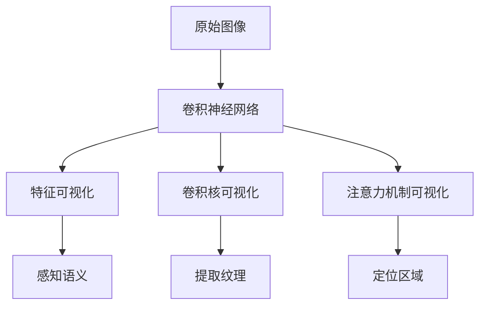

# AI人工智能深度学习算法：卷积神经网络的可视化技术

关键词：人工智能, 深度学习, 卷积神经网络, 可视化技术, 特征可视化, 卷积核可视化, 注意力机制可视化

## 1. 背景介绍
### 1.1  问题的由来
近年来,随着人工智能技术的飞速发展,深度学习算法在计算机视觉、自然语言处理等领域取得了令人瞩目的成就。作为深度学习的重要分支,卷积神经网络(Convolutional Neural Network, CNN)凭借其强大的特征提取和抽象能力,在图像分类、目标检测、语义分割等任务上表现出色。然而,CNN模型通常被视为一个"黑盒子",其内部工作机制对于研究人员和工程师来说并不透明。因此,如何理解CNN的决策过程,洞察其学习到的特征表示,成为了一个亟待解决的问题。

### 1.2  研究现状 
为了揭开CNN的神秘面纱,学术界和工业界都投入了大量精力开展CNN可视化研究。目前主流的CNN可视化技术可分为三大类:特征可视化、卷积核可视化和注意力机制可视化。特征可视化旨在理解CNN学习到的视觉概念,常用方法包括反卷积、导向反向传播等;卷积核可视化则试图揭示卷积层提取的局部纹理特征;注意力机制可视化则关注CNN在推理过程中关注的图像区域。尽管已有诸多可视化方法,但它们大多针对特定的CNN架构或任务,通用性和可解释性有待提高。

### 1.3  研究意义
发展CNN可视化技术具有重要意义:
1. 帮助研究人员理解CNN的工作原理,为算法改进提供启发。 
2. 提高CNN模型的可解释性和可信度,利于实际应用的推广。
3. 促进人工智能技术与认知科学、神经科学的交叉融合。

### 1.4  本文结构
本文将重点介绍CNN可视化的核心概念、主要算法、数学原理以及实践案例。全文组织结构如下:第2节阐述CNN可视化的核心概念;第3节详细讲解几种主流算法的原理和实现步骤;第4节介绍相关数学模型和公式推导;第5节通过代码实例演示可视化流程;第6节讨论CNN可视化在实际场景中的应用;第7节推荐相关学习资源和工具;第8节总结全文并展望未来研究方向。

## 2. 核心概念与联系
CNN可视化的目标是解释卷积神经网络学习到的特征表示,揭示其决策过程。以图像分类任务为例,CNN通过逐层卷积和池化操作,将原始图像转化为高层语义特征,再经过全连接层映射到类别标签。CNN可视化则是逆向解码这一过程,从特征激活、卷积核权重、注意力分布等方面入手,还原CNN感知到的视觉概念。

特征可视化聚焦于理解CNN高层特征所蕴含的语义信息。通过优化输入图像,使其在目标层产生最大激活,可以还原该层特征所对应的视觉模式。卷积核可视化则关注局部纹理特征的提取过程。通过显示卷积核权重,或将其作用于基础图案,可以观察到不同卷积核对边缘、纹理、颜色等低层特征的响应。注意力机制可视化旨在定位CNN关注的显著图像区域。常见做法是生成类激活图(Class Activation Mapping),即利用梯度信息反向计算不同空间位置对最终分类结果的贡献度。

总的来说,特征可视化、卷积核可视化和注意力机制可视化分别从语义、纹理、空间三个角度揭示CNN的内部机制。它们相辅相成,共同构成了CNN可视化的核心内容。下图概括了三种可视化技术的关联:

## 3. 核心算法原理 & 具体操作步骤
本节将重点介绍CNN可视化的三大类算法:特征可视化、卷积核可视化和注意力机制可视化。

### 3.1  算法原理概述
#### 3.1.1 特征可视化
特征可视化的核心思想是找到能够最大化激活目标层特定神经元的输入图像。数学上,这可以表述为一个优化问题:

$$\mathop{\arg\max}\limits_{I} \phi_l(I) - \lambda \mathcal{R}(I)$$

其中,$I$为输入图像,$\phi_l$为第$l$层特征图,$\mathcal{R}$为正则化项。优化过程通常采用梯度上升法,即:

$$I^{(t+1)} = I^{(t)} + \eta \frac{\partial \phi_l(I^{(t)})}{\partial I^{(t)}} - \lambda \frac{\partial \mathcal{R}(I^{(t)})}{\partial I^{(t)}}$$

直观来看,上述过程就是反复调整输入图像,使其在目标层产生最大激活响应。

#### 3.1.2 卷积核可视化
卷积核可视化旨在理解卷积层提取的局部纹理特征。最简单的做法是直接显示卷积核的权重矩阵,观察其形态特征。但由于卷积核尺寸较小(如3x3),难以察觉具体纹理。改进方法是将卷积核作用于某些基础图案,如高斯噪声图像,通过迭代优化噪声图像,放大卷积核的激活响应:

$$\mathop{\arg\max}\limits_{I} \sum_i \sum_j (I * K)_{ij}^2$$

其中,$I$为噪声图像,$K$为目标卷积核,$*$表示卷积操作。优化后的噪声图像能够揭示卷积核所提取的纹理特征。

#### 3.1.3 注意力机制可视化
注意力机制可视化用于定位CNN关注的显著图像区域。主流方法是类激活映射(CAM),其数学表达式为:

$$M_c(x,y) = \sum_k w_k^c f_k(x,y)$$

其中,$M_c(x,y)$表示类别$c$在位置$(x,y)$的激活度,$w_k^c$为全连接层权重,$f_k(x,y)$为卷积层特征图。CAM通过加权叠加卷积特征,生成一张与原图尺寸一致的热力图,直观反映出不同区域对分类结果的贡献程度。

### 3.2  算法步骤详解
以下分别详述三类算法的具体实现步骤。

#### 3.2.1 特征可视化
1. 选定目标卷积层和神经元
2. 初始化随机噪声图像 
3. 前向传播至目标层,计算选定神经元的激活值
4. 通过梯度上升法更新输入图像,提高激活值
5. 施加正则化,如L2范数,总变差(Total Variation)等,以获得更加规则的可视化结果 
6. 重复步骤3-5,直至激活值达到稳定
7. 输出优化后的图像,即为目标神经元感知的视觉概念

#### 3.2.2 卷积核可视化
1. 选定目标卷积层和卷积核
2. 初始化高斯噪声图像,尺寸与卷积核输入一致
3. 将噪声图像与卷积核进行卷积操作
4. 计算卷积响应图的L2范数,作为优化目标
5. 通过梯度上升法更新噪声图像,放大卷积响应
6. 重复步骤3-5,直至卷积响应达到稳定
7. 输出优化后的噪声图像,呈现卷积核提取的纹理特征

#### 3.2.3 注意力机制可视化
1. 在CNN最后一个卷积层后添加全局平均池化(GAP)层和全连接层
2. 正向传播,记录GAP层输出$f_k(x,y)$和全连接层权重$w_k^c$
3. 计算类激活图$M_c(x,y) = \sum_k w_k^c f_k(x,y)$
4. 将类激活图$M_c$上采样至原图尺寸
5. 叠加原图和类激活图,得到热力图
6. 输出热力图,直观展现CNN关注的区域

### 3.3  算法优缺点
特征可视化的优点是能够还原CNN高层特征所对应的视觉概念,加深对CNN感知能力的理解。但其缺点是计算开销大,且生成的图像往往含有一定的噪声和伪影。

卷积核可视化的优点是简单直观,能够定性分析卷积层提取的纹理特征。但其缺点是无法量化评估纹理的判别力,且对于较深层的卷积核,可解释性较差。

注意力机制可视化的优点是与原图对齐,可直观展现关键区域。但其缺点是仅适用于基于卷积特征的注意力机制,且在目标检测等像素级任务中表现欠佳。

### 3.4  算法应用领域
CNN可视化技术在多个领域有广泛应用:
- 计算机视觉:通过可视化理解图像分类、目标检测、语义分割等任务的内在机理,帮助优化CNN架构。
- 医学影像:利用可视化技术解释CNN诊断的依据,增强医生对AI辅助诊断的信任。
- 自动驾驶:应用注意力机制可视化评估CNN对道路场景的感知能力,提高自动驾驶系统的安全性。
- 认知科学:将CNN可视化作为探索人类视觉机制的工具,研究CNN与生物视觉系统的异同。

## 4. 数学模型和公式 & 详细讲解 & 举例说明
本节将详细讲解CNN可视化涉及的数学原理,并给出具体案例加以分析。

### 4.1  数学模型构建
CNN可视化的数学基础是凸优化理论。以特征可视化为例,其数学模型可表述为:

$$\begin{aligned}
\mathop{\arg\max}\limits_{I} \quad & \phi_l(I) - \lambda_1 \lVert I \rVert_2^2 - \lambda_2 \mathrm{TV}(I)\\
\mathrm{s.t.} \quad & I \in [0,1]^{H \times W \times C}
\end{aligned}$$

其中,$\phi_l(I)$表示第$l$层特征图的激活值,$\lVert I \rVert_2^2$为L2正则项,$\mathrm{TV}(I)$为总变差正则项:

$$\mathrm{TV}(I) = \sum_{i,j} \sqrt{(I_{i+1,j} - I_{i,j})^2 + (I_{i,j+1} - I_{i,j})^2}$$

总变差正则旨在平滑生成图像,抑制高频噪声。约束条件$I \in [0,1]^{H \times W \times C}$则将图像限制在合法的取值范围内。

### 4.2  公式推导过程
对于上述优化问题,可通过梯度上升法求解。关键是计算目标函数对输入图像$I$的梯度:

$$\nabla_I \mathcal{L} = \frac{\partial \phi_l(I)}{\partial I} - 2\lambda_1 I - \lambda_2 \nabla_I \mathrm{TV}(I)$$

其中,特征图$\phi_l(I)$对输入图像$I$的梯度可通过反向传播计算:

$$\frac{\partial \phi_l(I)}{\partial I} = \frac{\partial \phi_l}{\partial a_l} \frac{\partial a_l}{\partial z_l} \frac{\partial z_l}{\partial a_{l-1}} \cdots \frac{\partial a_1}{\partial z_1} \frac{\partial z_1}{\partial I}$$

其中,$a_l$为第$l$层激活值,$z_l$为第$l$层加权输入。

总变差项$\mathrm{TV}(I)$对输入图像$I$的梯度为:

$$\nabla_I \mathrm{TV}(I) = \sum_{i,j} \frac{2(I_{i,j} - I_{i-1,j}) + 2(I_{i,j} - I_{i,j-1})}{\sqrt{(I_{i,j} -