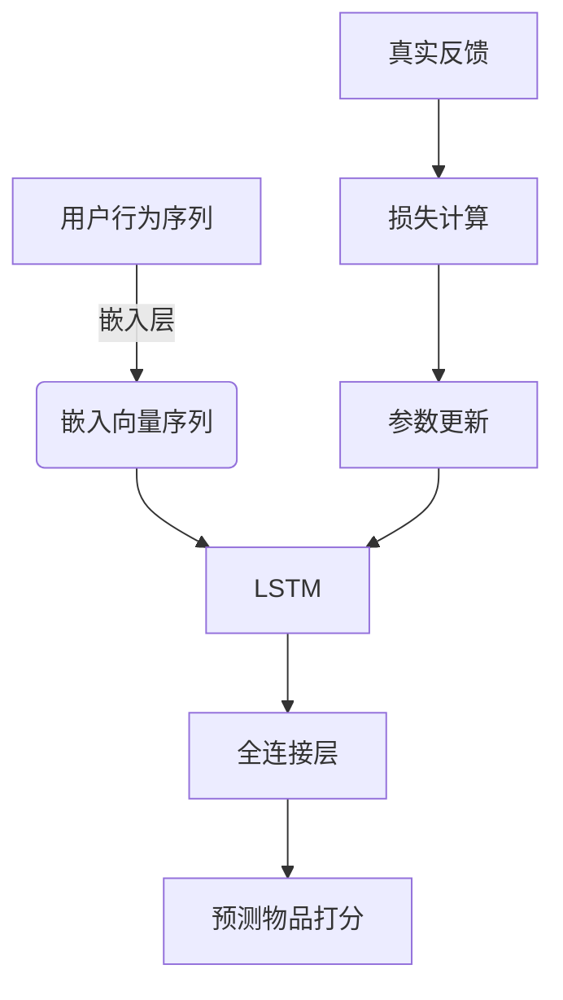

好的,我会严格遵守约束条件,以专业的技术语言写一篇有深度的技术博客。

# AI人工智能深度学习算法：在个性化推荐中的应用

## 1. 背景介绍

### 1.1 问题的由来

在当今信息时代,我们每天都会遇到大量的信息和选择。无论是在网上浏览新闻、购物还是观看视频,我们都面临着过多的选择。如何从海量信息中找到最符合个人需求和兴趣的内容,成为一个亟待解决的问题。传统的推荐系统依赖于人工设置规则或协同过滤算法,但这些方法往往效果有限,无法充分挖掘用户的个性化需求。

### 1.2 研究现状  

近年来,随着人工智能尤其是深度学习技术的迅猛发展,个性化推荐系统也取得了长足进步。深度学习能够自动从海量数据中提取有价值的特征,并对复杂的用户行为进行建模,从而实现精准的个性化推荐。目前,包括谷歌、亚马逊、网飞等科技巨头都在大力投资深度学习推荐算法的研发。

### 1.3 研究意义

个性化推荐不仅能提升用户体验,更能为企业带来可观的经济价值。一个优秀的推荐系统,能够精准把握用户需求,提高用户粘性,增加营收。同时,推荐系统也可以应用于信息过滤、决策支持等多个领域,具有广阔的应用前景。

### 1.4 本文结构

本文将全面介绍深度学习在个性化推荐领域的应用。我们将从核心概念出发,深入探讨推荐算法的原理和数学模型,并通过实例代码讲解具体的实现细节。最后,我们将分析实际应用场景,并对未来发展趋势和挑战进行展望。

## 2. 核心概念与联系

个性化推荐系统的核心目标是为每个用户推荐最合适的内容或商品。这需要系统能够理解用户的偏好,并从海量备选项中进行智能匹配。深度学习在以下几个关键环节发挥着重要作用:

1. **特征工程**: 传统的推荐系统需要人工设计特征,而深度学习能够自动从原始数据(如文本、图像等)中提取有价值的高阶特征,大大降低了特征工程的工作量。

2. **用户建模**: 深度学习可以通过神经网络对复杂的用户行为进行建模,捕捉用户的偏好、兴趣等隐含特征,为精准推荐奠定基础。

3. **内容理解**: 对于文本、图像等非结构化数据,深度学习能够自动提取语义信息,深入理解内容的主题、情感等,为匹配用户兴趣提供支持。  

4. **交互建模**: 许多推荐场景需要同时考虑用户和内容的交互关系,深度学习可以通过注意力机制等模型有效捕捉二者的高阶交互特征。

5. **在线学习**: 推荐系统需要持续学习用户的新行为,并实时调整推荐策略。深度学习具有良好的在线学习能力,能够高效地融合新数据。

总的来说,深度学习为个性化推荐系统带来了自动特征提取、端到端建模、在线学习等诸多优势,是实现精准个性化推荐的有力工具。

## 3. 核心算法原理与具体操作步骤  

### 3.1 算法原理概述

深度学习在个性化推荐领域的应用主要包括以下几种核心算法:

1. **基于协同过滤的嵌入模型**: 通过将用户和物品映射到同一低维嵌入空间,从而捕捉用户对物品的偏好关系。

2. **基于序列的推荐模型**: 将用户的历史行为序列作为输入,捕捉用户的动态兴趣,预测下一个可能感兴趣的物品。

3. **基于注意力机制的模型**: 通过注意力网络学习用户和物品之间的高阶交互特征,提高推荐的精确性。

4. **基于知识图谱的模型**: 融合结构化的知识图谱信息,增强对用户兴趣和物品属性的理解。

5. **多任务学习模型**: 同时学习多个相关任务(如评分预测、点击率预测等),提高模型的泛化能力。

6. **生成式对抗网络模型**: 通过对抗训练捕捉真实用户行为的分布,生成高质量的负样本,提高模型的鲁棒性。

7. **强化学习模型**: 将推荐过程建模为马尔可夫决策过程,通过强化学习直接优化长期累积奖励。

这些算法各有特色,可以根据具体场景和需求进行选择和组合。下面将详细介绍其中一些核心算法的原理和步骤。

### 3.2 算法步骤详解

这里我们重点介绍基于序列的推荐算法,它是目前个性化推荐领域应用最广泛的一类算法。该类算法的核心思想是:将用户的历史行为序列作为输入,通过递归神经网络(如RNN、LSTM等)对用户的动态兴趣进行建模,从而预测用户下一步可能感兴趣的物品。

具体的算法步骤如下:

1. **数据预处理**:将用户的历史行为数据(如浏览记录、购买记录等)转化为行为序列,每个序列由多个交互记录组成。

2. **构建输入**:将每个交互记录映射为一个嵌入向量,作为RNN的输入。例如,可以将用户ID和物品ID分别通过嵌入层映射为低维稠密向量。

3. **序列建模**:使用RNN(如LSTM)对输入的行为序列进行建模,捕捉用户的动态兴趣。具体来说,LSTM在每个时间步根据当前输入和上一状态计算新的隐状态,隐状态编码了用户当前的兴趣偏好。

4. **输出预测**:在最后一个时间步,LSTM的隐状态向量被送入一个全连接层,计算出所有候选物品的打分,得分最高的物品即为推荐结果。

5. **模型训练**:将预测的物品打分与真实的用户反馈(如点击、购买等)计算损失,然后通过反向传播算法优化LSTM和嵌入层的参数。

该算法的优点是能够有效捕捉用户动态变化的兴趣,并对长期行为序列建模。它已被广泛应用于电商、音乐、视频等多个推荐场景。

### 3.3 算法优缺点

基于序列的推荐算法具有以下优点:

1. **捕捉动态兴趣**:能够学习用户兴趣的动态变化,提高推荐的实时性和精确度。

2. **长期建模**:LSTM等递归网络能够对较长的行为序列进行建模,捕捉长期兴趣。

3. **无需人工特征**:端到端的学习方式,无需人工设计特征,降低了工程量。

4. **灵活可扩展**:可以与注意力机制、知识图谱等其他技术相结合,构建更加复杂和强大的模型。

同时,该算法也存在一些缺点和局限性:

1. **数据稀疏问题**:对于全新用户或物品,由于缺乏历史数据,模型的推荐效果会受到影响。

2. **隐式反馈问题**:该算法主要基于用户的隐式反馈(如浏览记录),对于缺乏显式反馈(如评分)的场景,效果可能不佳。

3. **计算开销大**:对于大规模数据集,训练LSTM等递归模型的计算开销较大,需要投入更多的算力资源。

4. **难以理解黑盒**:深度学习模型本身是一个黑盒,很难对推荐结果进行解释和理解。

因此,在实际应用中,需要根据场景的特点选择合适的算法,或结合其他技术手段来弥补不足。

### 3.4 算法应用领域

基于序列的推荐算法以及深度学习推荐技术广泛应用于以下领域:

1. **电子商务推荐**: 根据用户的浏览、购买记录,为其推荐感兴趣的商品。

2. **新闻推荐**: 分析用户的新闻浏览习惯,推荐用户可能感兴趣的新闻资讯。

3. **视频/音乐推荐**: 根据用户观看、收听记录,推荐个性化的视频、音乐内容。

4. **社交媒体推荐**: 在社交平台上,推荐用户可能感兴趣的人物、主题、内容等。

5. **广告推荐**: 在互联网广告投放中,为用户推荐合适的广告素材。

6. **个性化搜索**: 根据用户的搜索历史,为其提供个性化的搜索结果排序。

7. **课程推荐**: 在在线教育平台上,推荐适合用户的个性化课程。

8. **游戏推荐**: 根据玩家的游戏体验,推荐其可能喜欢的新游戏。

总的来说,只要涉及用户行为序列和个性化内容推荐的场景,都可以尝试应用基于序列的深度学习推荐算法。

## 4. 数学模型和公式详细讲解与举例说明

在介绍核心算法原理的过程中,我们涉及到了一些关键的数学模型和公式,下面将对它们进行详细的讲解和举例说明。

### 4.1 数学模型构建

我们以基于序列的推荐算法为例,构建其数学模型。假设有 $M$ 个用户和 $N$ 个物品,用 $\mathcal{U}=\{u_1,u_2,\ldots,u_M\}$ 表示用户集合, $\mathcal{V}=\{v_1,v_2,\ldots,v_N\}$ 表示物品集合。每个用户 $u$ 有一个长度为 $L$ 的行为序列 $S_u=\{v_{u,1},v_{u,2},\ldots,v_{u,L}\}$,其中 $v_{u,t}\in\mathcal{V}$ 表示用户 $u$ 在时间步 $t$ 产生的行为(如浏览、购买某个物品)。

我们的目标是基于用户的历史行为序列 $S_u$,预测用户在下一时间步 $t=L+1$ 可能产生的行为,即感兴趣的物品 $\hat{v}_{u,L+1}$。

为了实现这一目标,我们使用一个基于LSTM的序列模型,将用户的历史行为序列 $S_u$ 作为输入,LSTM 在每个时间步 $t$ 根据当前输入 $v_{u,t}$ 和上一隐状态 $\mathbf{h}_{t-1}$ 计算新的隐状态 $\mathbf{h}_t$:

$$\mathbf{h}_t = \text{LSTM}(\mathbf{e}_{v_{u,t}}, \mathbf{h}_{t-1})$$

其中 $\mathbf{e}_{v_{u,t}}\in\mathbb{R}^d$ 是物品 $v_{u,t}$ 的嵌入向量,通过查找嵌入矩阵 $\mathbf{E}\in\mathbb{R}^{N\times d}$ 获得:

$$\mathbf{e}_{v_{u,t}} = \mathbf{E}[v_{u,t}]$$

在最后一个时间步 $t=L$,LSTM 的隐状态向量 $\mathbf{h}_L$ 被视为用户的当前兴趣表示,送入一个全连接层计算所有候选物品的打分:

$$\hat{y}_{u,v} = \mathbf{w}_v^\top \mathbf{h}_L + b_v, \forall v\in\mathcal{V}$$

其中 $\mathbf{w}_v$ 和 $b_v$ 分别是全连接层的权重和偏置。得分最高的物品即为预测的下一