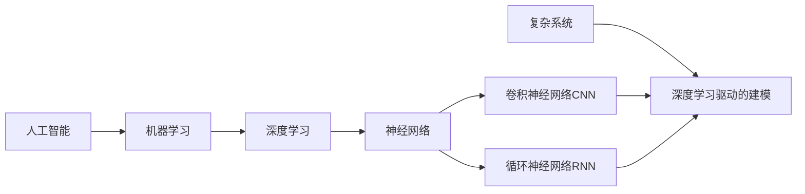

# AI人工智能深度学习算法：在复杂系统建模中的应用

关键词：人工智能、深度学习、复杂系统、建模、神经网络、卷积神经网络、循环神经网络

## 1. 背景介绍 
### 1.1 问题的由来
随着科技的飞速发展,人类社会正面临着前所未有的复杂性挑战。从全球气候变化到金融市场波动,从城市交通拥堵到疾病传播动力学,我们所处的世界充满了错综复杂、相互关联的系统。传统的建模方法已经难以应对如此高度非线性、多尺度、动态演化的复杂系统。亟需创新的建模范式和强大的计算工具,而人工智能,尤其是深度学习技术的崛起,为破解复杂系统建模难题带来了新的曙光。

### 1.2 研究现状
近年来,深度学习在计算机视觉、自然语言处理等领域取得了突破性进展,展现出强大的特征学习和建模能力。一些研究者开始将深度学习方法应用到复杂系统建模中,并取得了可喜的成果。例如,Jiang等人利用卷积神经网络对城市交通流进行预测[1],大幅提升了预测精度;Alipanahi等人使用递归神经网络对蛋白质二级结构进行预测[2],性能超越了传统机器学习方法;Reichstein等人综述了深度学习在地球系统科学建模中的应用[3],展望了诱人的发展前景。这些研究表明,深度学习有望成为复杂系统建模的新范式。

### 1.3 研究意义
深度学习驱动的复杂系统建模具有重要的理论和实践意义:

1. 拓展建模新思路。深度学习以数据为驱动,可以自适应地学习复杂系统内在的高维非线性规律,突破了传统物理机理建模的局限,为复杂系统建模开辟新路径。
2. 提升预测和决策水平。基于深度学习的复杂系统模型,能够对关键变量做出更准确的预测,辅助人类做出更明智的决策,在智慧城市、精准医疗、金融科技等领域具有广阔应用前景。
3. 加深对复杂性的理解。通过可解释的深度学习技术,我们有望从复杂系统海量数据中挖掘出隐藏的关联模式和动力学机制,加深对复杂性本质的理解,推动复杂科学的发展。

### 1.4 本文结构
本文将系统阐述深度学习在复杂系统建模中的应用。第2节介绍相关的核心概念;第3节讲解核心算法原理和操作步骤;第4节建立数学模型并给出详细公式推导;第5节通过代码实例演示具体实现;第6节分析实际应用场景;第7节推荐相关工具和资源;第8节总结全文并展望未来;第9节附录常见问题解答。

## 2. 核心概念与联系
- 复杂系统:由大量相互作用的子系统或个体组成,呈现出涌现、自组织、非线性、多尺度等特性的系统,如生态系统、经济系统、脑神经系统等。
- 人工智能:研究、开发用于模拟、延伸和扩展人的智能的理论、方法、技术及应用系统的一门新的技术科学。
- 机器学习:人工智能的核心,使计算机具有自我学习和自我完善的能力,无需明确编程即可适应环境改变。
- 深度学习:机器学习的一个分支,通过构建具有多层次结构的人工神经网络,模拟人脑的学习机制,实现复杂特征的自动学习和抽象。
- 神经网络:一种模仿生物神经网络(动物的中枢神经系统,特别是大脑)的结构和功能的数学模型或计算模型。
- 卷积神经网络(CNN):一种结构类似于生物视觉系统的前馈神经网络,擅长处理网格拓扑结构的数据,广泛应用于图像识别等领域。
- 循环神经网络(RNN):一种适合处理序列数据的神经网络,通过引入循环连接,保留了历史输入信息,在语音识别、自然语言处理等领域表现突出。

下图展示了这些核心概念之间的联系:

深度学习作为机器学习的一个分支,源于对人工神经网络的研究。卷积神经网络和循环神经网络是两类重要的深度学习模型,分别擅长处理图像和序列数据。将它们应用于复杂系统建模,可以自动学习内在规律,克服传统建模方法的局限。理解这些概念之间的联系,是掌握深度学习复杂系统建模的基础。

## 3. 核心算法原理 & 具体操作步骤
### 3.1 算法原理概述
深度学习的核心是通过构建多层神经网络,逐层抽象和学习特征表示。以最经典的多层感知机(MLP)为例,每一层可以表示为:
$$
\mathbf{h}^{(l)} = f^{(l)}(\mathbf{W}^{(l)}\mathbf{h}^{(l-1)} + \mathbf{b}^{(l)})
$$
其中$\mathbf{h}^{(l)}$是第$l$层的隐藏状态,$\mathbf{W}^{(l)}$和$\mathbf{b}^{(l)}$分别是权重矩阵和偏置向量,$f^{(l)}$是激活函数。网络通过前向传播计算输出,然后通过反向传播算法更新参数以最小化损失函数。这一过程不断迭代,直到模型性能达到要求。

卷积神经网络在此基础上引入了卷积和池化等操作,可以高效处理网格结构数据。循环神经网络则引入了循环连接,可以建模序列数据中的长程依赖。

### 3.2 算法步骤详解
以利用 LSTM 循环神经网络进行时间序列预测为例,详细步骤如下:

1. 数据准备:收集足够长的历史时间序列数据,并进行预处理,如缺失值插补、异常值平滑、归一化等。
2. 数据集划分:将数据划分为训练集、验证集和测试集。通常采用滑动窗口的方式生成样本,即以固定长度的历史序列去预测未来一个或多个时间步的值。
3. 模型构建:根据任务需求设计 LSTM 网络的架构,如隐藏层数、隐藏单元数、是否双向等。还需要选择损失函数(如均方误差)和优化算法(如 Adam)。
4. 模型训练:送入训练数据,通过前向传播计算输出并评估损失,再通过反向传播更新模型参数。通常采用小批量梯度下降,并以 Early Stopping 等策略控制迭代次数以防止过拟合。 
5. 模型评估:在验证集上评估模型性能,如果不满意则返回步骤3调整模型。常用的评估指标有均方根误差(RMSE)、平均绝对误差(MAE)等。
6. 模型测试:在测试集上测试模型的泛化性能,并与其他基准模型进行比较。
7. 模型应用:将训练好的模型部署到实际系统中,用于实时或离线的预测任务。

### 3.3 算法优缺点
优点:
- 深度学习可以自动学习复杂的非线性模式,减少了对专家知识的依赖
- 端到端的建模方式,直接从原始数据中学习,避免了复杂的特征工程
- 具有强大的表达能力,可以处理高维度、大规模的数据

缺点:
- 需要大量的训练数据和计算资源,训练过程耗时较长  
- 模型通常是黑盒,可解释性较差,难以给出直观的因果解释
- 对参数和超参数较为敏感,调参需要一定的经验和技巧

### 3.4 算法应用领域
深度学习在以下复杂系统建模领域得到了广泛应用:

- 智慧城市:交通流量预测、人口迁移模式识别、城市能耗优化等
- 金融科技:股票趋势预测、信用风险评估、异常交易检测等  
- 生物医学:药物分子筛选、基因表达模式识别、疾病诊断预测等
- 地球科学:气象预报、气候变化归因、遥感图像分析等
- 工业控制:设备健康监测、产品质量预测、生产调度优化等

下面以智慧交通中的车流量预测为例,展示如何建立数学模型并推导公式。

## 4. 数学模型和公式 & 详细讲解 & 举例说明
### 4.1 数学模型构建
考虑一个城市道路网络,每条道路的车流量构成一个时间序列。我们的目标是根据过去一段时间的车流量数据,预测未来一段时间内每条道路的车流量走势。

令 $\mathcal{G=(V,E)}$ 表示道路网络,其中 $\mathcal{V}$ 是道路节点集合,$\mathcal{E}$ 是道路连接集合。每个节点 $i \in \mathcal{V}$ 在第 $t$ 个时间步的车流量为 $x_i^{(t)}$。我们将 $T$ 个历史时间步的车流量数据组成输入序列:
$$
\mathbf{X}_i = [x_i^{(t-T+1)}, \cdots, x_i^{(t)}] \in \mathbb{R}^T
$$
目标是预测未来 $\tau$ 个时间步的车流量序列:
$$
\mathbf{Y}_i = [x_i^{(t+1)}, \cdots, x_i^{(t+\tau)}] \in \mathbb{R}^\tau
$$
我们构建一个图卷积循环神经网络模型,综合利用道路网络的空间拓扑结构和车流量的时间动态特性。

### 4.2 公式推导过程
模型的关键是图卷积和时间递推两个部分。图卷积可以聚合节点的邻居信息,捕捉网络的空间依赖。设计如下的图卷积层:
$$
\mathbf{h}_i^{(l)} = \sigma(\sum_{j \in \mathcal{N}_i} \frac{1}{c_{ij}} \mathbf{W}^{(l)} \mathbf{h}_j^{(l-1)})
$$
其中 $\mathbf{h}_i^{(l)}$ 是节点 $i$ 在第 $l$ 层的隐藏状态,$\mathcal{N}_i$ 是节点 $i$ 的邻居集合,$c_{ij}$ 是归一化常数,可以简单取为 $|\mathcal{N}_i|$。$\mathbf{W}^{(l)}$ 是权重矩阵,$\sigma$ 是激活函数,如 ReLU。

在此基础上引入 GRU 单元实现时间递推:
$$
\mathbf{r}_i^{(t)} = \sigma(\mathbf{W}_r \mathbf{h}_i^{(t-1)} + \mathbf{U}_r \mathbf{x}_i^{(t)}) \\
\mathbf{u}_i^{(t)} = \sigma(\mathbf{W}_u \mathbf{h}_i^{(t-1)} + \mathbf{U}_u \mathbf{x}_i^{(t)}) \\
\tilde{\mathbf{h}}_i^{(t)} = \tanh(\mathbf{W} (\mathbf{r}_i^{(t)} \odot \mathbf{h}_i^{(t-1)}) + \mathbf{U} \mathbf{x}_i^{(t)}) \\
\mathbf{h}_i^{(t)} = \mathbf{u}_i^{(t)} \odot \mathbf{h}_i^{(t-1)} + (1 - \mathbf{u}_i^{(t)}) \odot \tilde{\mathbf{h}}_i^{(t)}
$$
其中 $\mathbf{r}_i^{(t)}$ 是重置门,$\mathbf{u}_i^{(t)}$ 是更新门,$\odot$ 表示按元素乘法。GRU通过门控机制自