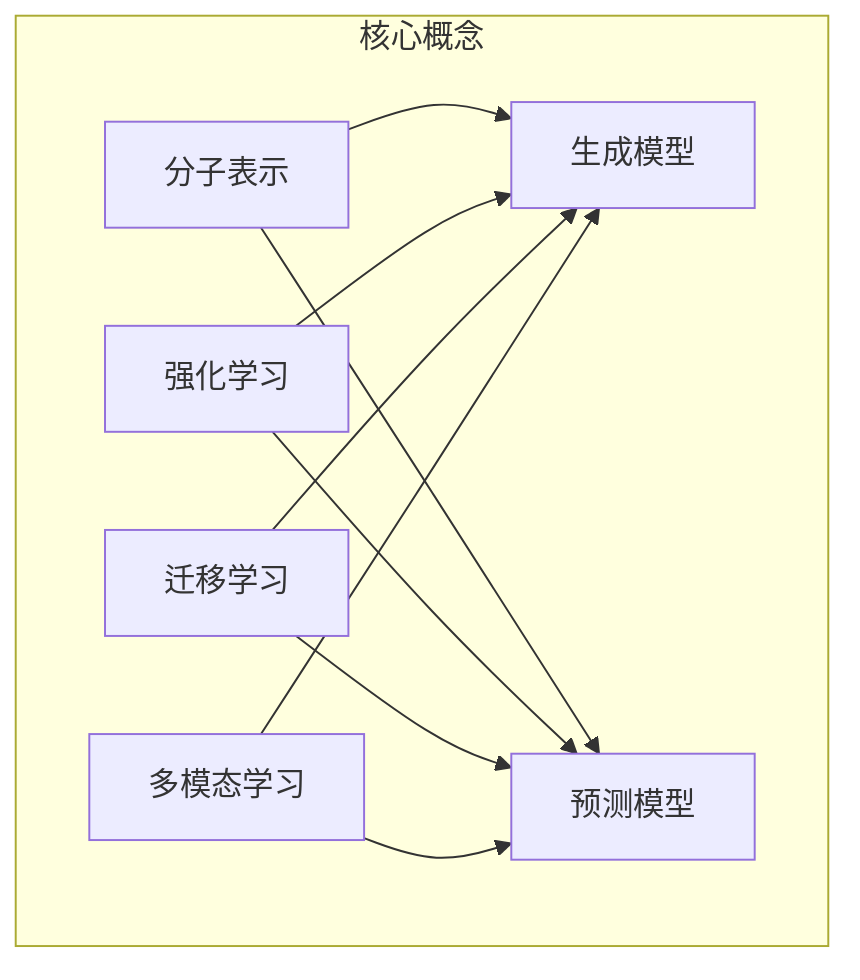

以下是《AI人工智能深度学习算法：在药物研发中的应用》一文的正文内容：

# AI人工智能深度学习算法：在药物研发中的应用

## 1. 背景介绍

### 1.1 问题的由来

药物研发是一个漫长、昂贵且充满挑战的过程。从发现潜在的药物分子到完成临床试验和获得监管部门的批准,通常需要耗费数十亿美元和10多年的时间。在这一过程中,科学家们面临着巨大的挑战,需要筛选和评估大量的化合物,并预测它们与生物靶点的相互作用。

传统的药物研发方法主要依赖于实验室实验和动物试验,这些方法不仅成本高昂,而且效率低下。随着计算能力的提高和大数据的出现,人工智能(AI)和深度学习算法为药物研发带来了新的机遇,有望显著提高研发效率并降低成本。

### 1.2 研究现状

近年来,AI在药物研发领域的应用日益受到重视。深度学习算法已被用于多个阶段,包括靶点识别、分子设计、虚拟筛选、毒性预测和临床试验优化等。一些主要的研究进展包括:

- 使用生成对抗网络(GAN)和变分自编码器(VAE)等深度学习模型生成新的分子结构。
- 应用卷积神经网络(CNN)和图神经网络(GNN)等模型预测化合物与靶点的相互作用。
- 利用强化学习算法优化分子结构,以提高所需特性(如活性、选择性或药代动力学)。
- 将自然语言处理(NLP)技术应用于生物医学文献挖掘,加速新靶点和新机理的发现。

尽管取得了一些进展,但AI在药物研发中的应用仍处于初级阶段,存在诸多挑战有待解决。

### 1.3 研究意义

AI和深度学习算法在药物研发中的应用具有重大意义:

1. **加快研发速度**:AI算法可以快速筛选和优化大量化合物,大大缩短研发周期。
2. **降低研发成本**:减少了昂贵的实验和临床试验,从而降低整体研发成本。
3. **提高成功率**:AI模型可以更准确地预测化合物的活性、选择性和毒性,提高临床试验的成功率。
4. **发现新靶点**:通过文献挖掘和数据分析,AI有助于发现新的疾病靶点和作用机理。
5. **个性化医疗**:AI算法可以帮助开发出更有效、更安全的个性化治疗方案。

### 1.4 本文结构

本文将全面介绍AI深度学习算法在药物研发中的应用。首先阐述核心概念和算法原理,然后详细讲解数学模型和公式推导,并通过实际案例进行分析和讲解。接下来,我们将介绍项目实践中的代码实现和运行结果。最后,探讨实际应用场景、未来发展趋势和面临的挑战。

## 2. 核心概念与联系

在药物研发中应用AI深度学习算法涉及多个核心概念,包括:

1. **分子表示**:将分子结构转换为机器可以理解的数字表示,如SMILES字符串、分子指纹或图结构等。
2. **生成模型**:使用GAN、VAE等深度生成模型生成新的分子结构。
3. **预测模型**:利用CNN、GNN等模型预测化合物与靶点的相互作用,评估活性、选择性和毒性。
4. **强化学习**:通过反复试验优化分子结构,提高所需的药物特性。
5. **迁移学习**:利用预训练模型加速模型训练和微调。
6. **多模态学习**:整合分子结构、生物活性数据、文献等多源数据。

这些概念相互关联,共同构建了AI在药物研发中的应用框架。

## 3. 核心算法原理 & 具体操作步骤  

### 3.1 算法原理概述

AI在药物研发中的应用主要基于以下几种核心算法:

1. **生成对抗网络(GAN)**:由生成器和判别器组成,用于生成新的分子结构。生成器从噪声中生成候选分子,判别器判断其真伪,两者相互对抗促进彼此提高。

2. **变分自编码器(VAE)**:将分子编码为潜在空间的向量表示,并从潜在空间解码生成新分子。通过重构损失和KL散度损失进行训练。

3. **卷积神经网络(CNN)**:在分子指纹或网格表示上应用卷积操作,用于预测分子与靶点的相互作用。

4. **图神经网络(GNN)**:在分子图结构上进行信息传播,捕获分子拓扑结构特征,用于分子属性预测。

5. **强化学习(RL)**:将分子优化问题建模为马尔可夫决策过程,使用策略梯度或Q-Learning等算法,通过反复试验优化分子结构。

6. **自然语言处理(NLP)**:应用文本挖掘和知识图谱技术从生物医学文献中提取有价值的信息。

这些算法在不同任务中发挥着关键作用,并常常相互配合以发挥协同效应。

### 3.2 算法步骤详解

以下是基于GAN的分子生成算法的具体步骤:

1. **数据预处理**:将分子结构转换为SMILES字符串,构建训练数据集。

2. **定义生成器和判别器**:
   - 生成器G是一个多层感知机或循环神经网络,将随机噪声z映射为SMILES字符串。
   - 判别器D是一个二分类模型(如CNN或RNN),判断输入的SMILES字符串是真实分子还是生成器生成的假分子。

3. **模型训练**:
   - 生成器G从噪声z中生成假分子 $G(z)$
   - 判别器D对真实分子和生成分子进行二分类: $D(x_{real}), D(G(z))$
   - 生成器G的目标是最大化判别器D对生成分子的置信度: $\max_G \log(D(G(z)))$
   - 判别器D的目标是最大化对真实分子的置信度,最小化对生成分子的置信度: $\max_D \log(D(x_{real})) + \log(1 - D(G(z)))$
   - 生成器G和判别器D通过对抗训练相互促进

4. **分子生成**:在训练收敛后,利用生成器G从随机噪声中生成新的SMILES字符串,解码为分子结构。

5. **结果评估**:使用各种评价指标(如相似性、唯一性、合成可行性、药效团等)评估生成分子的质量。

这种对抗训练方式使生成器能够生成更加逼真和多样的分子结构。

### 3.3 算法优缺点

**优点**:

- 能够高效生成新颖且合理的分子结构
- 无需人工定义复杂的评分函数或规则
- 可以通过对抗训练不断改进生成质量
- 生成模型具有很强的泛化能力

**缺点**:

- 训练过程不稳定,容易模式崩溃
- 难以直接优化生成分子的特定性质
- 生成分子的多样性仍有待提高
- 需要大量高质量的训练数据

### 3.4 算法应用领域

AI深度学习算法在药物研发的多个阶段发挥着重要作用:

1. **靶点识别**:通过文本挖掘和知识图谱技术从文献中发现新的疾病靶点和作用机理。

2. **分子生成**:利用GAN、VAE等生成模型设计新的分子结构。

3. **虚拟筛选**:使用CNN、GNN等模型对大量化合物进行高通量虚拟筛选,预测与靶点的相互作用。

4. **活性/ADMET预测**:预测分子的生物活性、选择性、吸收、代谢、排除和毒性等重要性质。

5. **分子优化**:通过强化学习等技术优化分子结构,提高所需的药效学特性。

6. **临床试验优化**:利用AI算法优化患者入组标准、给药方案等,提高临床试验的成功率。

7. **精准医疗**:结合基因组学和表型数据,开发个性化的诊断和治疗方案。

AI技术在药物研发的全生命周期中发挥着越来越重要的作用。

## 4. 数学模型和公式 & 详细讲解 & 举例说明

### 4.1 数学模型构建

许多AI算法在药物研发中的应用都基于概率模型和优化理论。以下是一些常见的数学模型:

1. **生成对抗网络(GAN)**

GAN由生成器G和判别器D组成,是一种基于博弈论的模型。生成器G试图生成逼真的假样本来欺骗判别器D,而判别器D则努力区分真实样本和生成样本。

生成器G和判别器D的目标函数可表示为:

$$\min_G \max_D V(D,G) = \mathbb{E}_{x\sim p_{data}(x)}[\log D(x)] + \mathbb{E}_{z\sim p_z(z)}[\log(1-D(G(z)))]$$

其中 $p_{data}(x)$ 是真实数据分布, $p_z(z)$ 是噪声先验分布。

在理想情况下,生成器G将学习到真实数据分布 $p_{data}(x)$。

2. **变分自编码器(VAE)** 

VAE是一种基于显式密度估计的生成模型,它将数据 $x$ 编码为潜在变量 $z$ 的分布 $q_\phi(z|x)$,然后从 $z$ 解码重构数据 $\hat{x}=p_\theta(x|z)$。

VAE的主要目标是最大化边际对数似然 $\log p_\theta(x)$,可通过最大化证据下界(ELBO)来近似优化:

$$\mathcal{L}(\theta,\phi;x) = -D_{KL}(q_\phi(z|x)||p_\theta(z)) + \mathbb{E}_{q_\phi(z|x)}[\log p_\theta(x|z)]$$

其中第一项是KL散度正则项,第二项是重构损失。通过重参数技巧,可以使用随机梯度下降来优化ELBO。

3. **图神经网络(GNN)**

GNN是处理图结构数据的有效模型。在分子场景中,分子可以表示为无向图 $\mathcal{G}=(\mathcal{V},\mathcal{E})$,其中 $\mathcal{V}$ 是原子节点集合, $\mathcal{E}$ 是化学键边集合。

GNN通过信息传播过程捕获图拓扑结构特征:

$$h_v^{(k+1)} = \gamma\left(h_v^{(k)}, \square_{u\in\mathcal{N}(v)}\phi\left(h_v^{(k)}, h_u^{(k)}, e_{vu}\right)\right)$$

其中 $h_v^{(k)}$ 是节点 $v$ 在第 $k$ 层的表示, $\mathcal{N}(v)$ 是节点 $v$ 的邻居集合, $\gamma$ 和 $\phi$ 是可学习的神经网络。

通过层层传播,GNN可以生成整个分子图的表示,用于各种下游任务。

这些模型为AI在药物研发中的应用奠定了数学基础,并在具体算法中得到广泛应用。

### 4.2 公式推导过程

以变分自编码器(VAE)为例,我们来推导其目标函数ELBO的具体形式。

VAE的目标是最大化边际对数似然 $\log p_\theta(x)$:

$$\begin{aligned}
\log p_\theta(x) &= \log\int p_\theta(x,z)dz\\
               &= \log\int\frac{p_\theta(x,z)q_\phi(z|x)}{q_\phi(z|x)}dz\\
               &= \log\mathbb{E}_{q_\phi(z|x)}\left[\frac{p_\theta