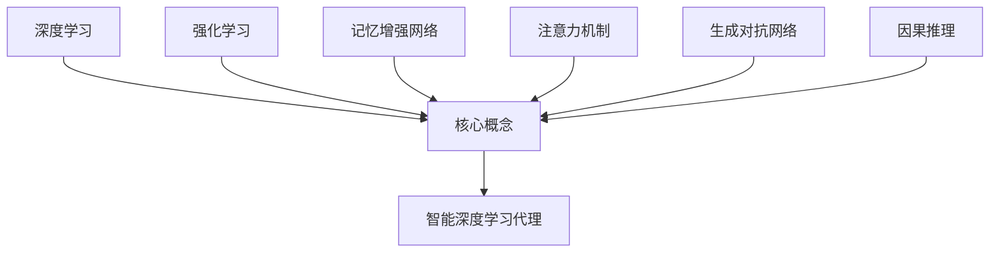
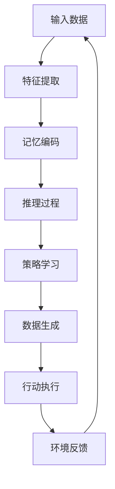

# AI人工智能深度学习算法：智能深度学习代理的构建基础

## 1. 背景介绍

### 1.1 问题的由来

在当今时代,人工智能(AI)已经渗透到我们生活的方方面面。从智能手机的语音助手到自动驾驶汽车,从推荐系统到医疗诊断,AI无处不在。然而,构建真正智能的AI代理仍然是一个巨大的挑战。传统的机器学习算法虽然取得了一些成功,但它们往往局限于特定的任务和数据集,缺乏通用性和适应性。

为了创建通用人工智能(Artificial General Intelligence, AGI),我们需要一种新的范式,能够模拟人类大脑的灵活性和推理能力。深度学习(Deep Learning)作为一种强大的机器学习技术,展现出了巨大的潜力。通过构建深层神经网络,深度学习可以从原始数据中自动学习特征表示,并对复杂模式进行建模。

然而,单独的深度学习模型并不足以实现AGI。我们需要将多个深度学习模型集成到一个智能代理中,使其能够感知环境,理解上下文,做出决策并采取行动。这就需要一个统一的框架,将感知、推理、规划和控制等不同功能模块无缝集成。

### 1.2 研究现状

近年来,研究人员已经提出了多种深度学习智能代理的框架,如深度强化学习(Deep Reinforcement Learning)、深度记忆网络(Deep Memory Networks)和深度生成模型(Deep Generative Models)等。这些框架在特定任务上取得了令人鼓舞的成果,但仍然存在一些局限性:

1. **缺乏通用性**: 大多数现有框架专注于特定的任务或领域,难以直接推广到其他领域。
2. **数据效率低下**: 训练这些模型通常需要大量的数据,而人类学习则更加高效。
3. **可解释性差**: 神经网络的内部工作机制通常是一个黑箱,难以解释其决策过程。
4. **缺乏因果推理**: 现有模型往往关注于模式识别,而忽视了对因果关系的建模。
5. **缺乏持续学习**: 大多数模型在训练后就固化了,无法像人类那样持续学习和适应新的环境。

为了克服这些限制,我们需要一种新的深度学习智能代理框架,能够融合多种技术,提供更强大、更通用的人工智能能力。

### 1.3 研究意义

构建智能深度学习代理框架对于实现人工通用智能(AGI)至关重要。一个成功的框架将为我们提供以下重要意义:

1. **推动人工智能的发展**: 智能代理是实现真正智能系统的关键,将极大推动人工智能领域的进步。
2. **提高决策效率**: 智能代理可以快速分析复杂环境,做出明智决策,提高生产效率和管理水平。
3. **拓展应用领域**: 通用的智能代理框架可应用于多个领域,如机器人、自动驾驶、智能助理等。
4. **促进跨学科融合**: 构建智能代理需要计算机科学、认知科学、神经科学等多学科的知识融合。
5. **加深对智能的理解**: 研究智能代理有助于我们更好地理解人类智能的本质及其工作原理。

总之,智能深度学习代理的研究将为人工智能的发展注入新的动力,开辟新的应用前景,并加深我们对智能的认识。

### 1.4 本文结构  

本文将系统地介绍智能深度学习代理的构建基础。我们将首先探讨核心概念和技术,如深度学习、强化学习、记忆增强网络等。接下来,我们将详细阐述智能代理的核心算法原理和数学模型。然后,我们将通过一个实际项目案例,展示如何使用这些技术构建一个智能代理系统。最后,我们将讨论智能代理的实际应用场景、发展趋势和面临的挑战。

通过本文,读者将全面了解智能深度学习代理的理论基础和实践技术,为未来的研究和应用奠定坚实的基础。

## 2. 核心概念与联系

在构建智能深度学习代理之前,我们需要了解几个核心概念及其相互关系。这些概念包括:

1. **深度学习(Deep Learning)**: 深度学习是一种基于人工神经网络的机器学习技术,能够从原始数据中自动学习特征表示。它已在计算机视觉、自然语言处理等领域取得了巨大成功。

2. **强化学习(Reinforcement Learning)**: 强化学习是一种基于奖励信号的机器学习范式,代理通过与环境交互并获得奖励来学习最优策略。它在决策和控制问题中有着广泛应用。

3. **记忆增强网络(Memory Augmented Networks)**: 记忆增强网络通过引入外部记忆模块,赋予神经网络记忆和推理能力。这种架构有助于解决传统神经网络在处理序列数据时的局限性。

4. **注意力机制(Attention Mechanism)**: 注意力机制允许神经网络动态地关注输入数据的不同部分,从而更好地捕捉长期依赖关系和上下文信息。这在自然语言处理和计算机视觉等任务中非常有用。

5. **生成对抗网络(Generative Adversarial Networks, GANs)**: GANs是一种生成模型,由生成器和判别器两个对抗网络组成。它可以学习到数据的潜在分布,并生成新的、逼真的样本。

6. **因果推理(Causal Inference)**: 因果推理是推断因果关系的过程,而不仅仅是关联或相关性。它对于构建具有推理能力的智能代理至关重要。

这些概念相互关联、相辅相成。例如,我们可以将强化学习与深度学习相结合,构建深度强化学习(Deep Reinforcement Learning)系统;或者将记忆增强网络与注意力机制相结合,提高序列数据的处理能力。

智能深度学习代理的构建需要将这些概念和技术有机地集成,形成一个统一的框架。这种跨领域的融合将为人工智能系统带来全新的能力和可能性。

## 3. 核心算法原理与具体操作步骤

### 3.1 算法原理概述

智能深度学习代理的核心算法原理是将多种深度学习技术融合在一个统一的框架中,实现感知、推理、规划和控制等多重功能。这个框架的基本思路如下:

1. **感知模块**: 使用深度学习模型(如卷积神经网络和递归神经网络)从原始输入数据(如图像、文本等)中提取特征表示。

2. **记忆模块**: 采用记忆增强网络,为代理提供长期记忆和推理能力,存储和关联过去的经验。

3. **推理模块**: 利用注意力机制和因果推理技术,推断输入数据的语义含义和潜在因果关系。

4. **规划模块**: 基于强化学习算法,代理与环境交互并获得奖励信号,从而学习到最优的决策策略。

5. **生成模块**: 使用生成对抗网络等生成模型,代理可以生成新的数据样本,用于数据增广、模拟等目的。

6. **控制模块**: 根据推理和规划的结果,代理执行相应的动作,影响和改变环境状态。

这些模块通过端到端的训练相互协作,形成一个闭环的智能系统。代理持续从环境中获取数据、学习新的知识,并作出明智的决策和行动。

该算法的优点在于融合了多种先进技术,提供了通用的人工智能能力。它不仅能够感知和理解复杂环境,还能基于记忆和推理做出决策,并通过行动改变环境。这种端到端的学习范式使得代理能够持续适应和进化。

### 3.2 算法步骤详解

智能深度学习代理算法的具体步骤如下:

1. **输入数据**:代理从环境获取原始输入数据,如图像、文本、声音等。

2. **特征提取**:将输入数据馈送到感知模块,使用深度学习模型(如CNN、RNN等)自动提取特征表示。

3. **记忆编码**:将提取的特征表示与代理当前的记忆状态相结合,并使用记忆增强网络进行编码和存储。

4. **推理过程**:
    a. 使用注意力机制关注输入数据的不同部分,捕捉上下文信息。
    b. 基于记忆状态和注意力机制的结果,进行高级推理和因果建模。
    c. 输出对输入数据的理解和解释。

5. **策略学习**:
    a. 将推理结果和当前环境状态作为输入,馈送到强化学习模块。
    b. 代理与环境交互,获得奖励信号,并根据策略网络输出动作。
    c. 使用策略梯度等算法优化策略网络,学习最优策略。

6. **数据生成**:
    a. 基于推理结果和策略,使用生成对抗网络生成新的数据样本。
    b. 将生成的数据用于数据增广、模拟等目的。

7. **行动执行**:根据学习到的最优策略,代理执行相应的动作,影响和改变环境状态。

8. **持续学习**:代理获取新的环境反馈,并重复上述步骤,持续学习和适应新的情况。

该算法的关键在于模块之间的紧密集成和端到端的训练方式。每个模块都会影响和被其他模块影响,形成一个相互作用的闭环系统。这种范式赋予了代理灵活的适应性和通用的智能能力。

### 3.3 算法优缺点

智能深度学习代理算法具有以下优点:

1. **通用性强**:集成了多种深度学习技术,提供了感知、推理、规划和控制等通用的人工智能能力。

2. **适应性好**:端到端的训练方式使得代理能够持续学习和适应新的环境。

3. **可解释性高**:通过推理模块,代理可以解释其决策过程和行为原因。

4. **高效学习**:融合了强化学习,代理可以通过与环境交互高效地学习最优策略。

5. **创造力强**:生成模块赋予了代理生成新数据样本的能力,有助于数据增广和模拟。

然而,该算法也存在一些潜在的缺点和挑战:

1. **训练复杂度高**:集成多种深度学习技术,端到端训练的复杂度很高,需要大量的计算资源。

2. **数据需求量大**:为了获得良好的性能,该算法需要大量的训练数据,包括环境数据和人类注释数据。

3. **鲁棒性不足**:神经网络模型对噪声和对抗性攻击敏感,可能导致代理做出不可预测的决策。

4. **缺乏常识推理**:尽管具有推理能力,但代理缺乏人类般的常识知识和经验。

5. **解释性有限**:虽然比黑箱模型更可解释,但神经网络内部机制仍然难以完全理解。

6. **伦理和安全问题**:高度智能的代理系统可能带来潜在的伦理和安全隐患,需要格外谨慎。

总的来说,智能深度学习代理算法是一个前景广阔但也充满挑战的研究方向。我们需要进一步完善和优化这一算法,以实现真正的人工通用智能。

### 3.4 算法应用领域

智能深度学习代理算法由于其通用