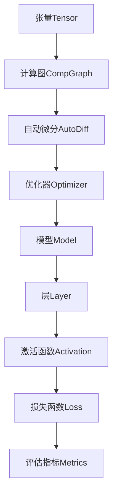

以下是《AI人工智能深度学习算法：深度学习软件框架的掌握与应用》的正文内容:

# AI人工智能深度学习算法：深度学习软件框架的掌握与应用

## 1. 背景介绍

### 1.1 问题的由来

在过去的几十年里,人工智能(AI)技术取得了长足的进步,尤其是在机器学习和深度学习领域。随着数据量的激增和计算能力的提高,深度学习模型展现出了前所未有的性能,在计算机视觉、自然语言处理、语音识别等领域取得了突破性的成就。

然而,训练和部署深度学习模型并非易事。深度神经网络通常包含数百万甚至数十亿个参数,需要大量的计算资源进行训练。此外,不同的深度学习任务需要不同的网络架构和超参数配置,这增加了模型开发和优化的复杂性。

### 1.2 研究现状

为了简化深度学习模型的开发过程,降低进入门槛,多个知名科技公司和开源社区推出了深度学习框架。这些框架提供了标准化的接口、预训练模型和自动化工具,使得研究人员和工程师能够更高效地构建、训练和部署深度学习模型。

目前,主流的深度学习框架包括TensorFlow、PyTorch、Keras、MXNet、Caffe等。每个框架都有其独特的设计理念和优势,适用于不同的场景和需求。例如,TensorFlow擅长于分布式训练和生产部署,PyTorch则提供了动态计算图和Python先行编程范式,更加灵活和直观。

### 1.3 研究意义

掌握深度学习框架对于开发人员、研究人员和企业来说都是至关重要的。深入理解框架的原理和用法,可以帮助我们更好地利用深度学习技术解决实际问题,提高模型的性能和效率。同时,熟练使用框架也有助于加快模型开发周期,降低重复工作的成本。

此外,随着深度学习技术在各行各业的不断渗透,对高素质的深度学习工程师和研究人员的需求也将持续增长。掌握主流深度学习框架将为个人职业发展提供有力的支撑。

### 1.4 本文结构

本文将全面介绍深度学习框架的核心概念、算法原理、数学模型、实践案例和应用场景。我们将重点探讨TensorFlow和PyTorch这两个主流框架,并提供详细的代码示例和解释。文章最后,我们还将讨论深度学习框架的未来发展趋势和挑战。

通过本文的学习,读者将能够掌握以下内容:

- 深度学习框架的核心概念和工作原理
- 构建、训练和优化深度神经网络模型的方法
- 深度学习算法的数学基础和理论推导
- 使用框架进行实践项目开发的技能
- 深度学习框架在不同领域的应用场景
- 深度学习框架的发展趋势和未来挑战

## 2. 核心概念与联系

在深入探讨深度学习框架的细节之前,我们先来了解一些核心概念和它们之间的联系。这些概念贯穿于整个深度学习框架的设计和实现过程中,对于理解框架的工作原理至关重要。

1. **张量(Tensor)**: 张量是深度学习框架中的基本数据结构,用于表示多维数组。它是构建神经网络模型的基础单元。

2. **计算图(Computational Graph)**: 计算图是一种用于表示数学运算的数据结构,它将复杂的计算过程分解为一系列基本操作的有向无环图。深度学习框架使用计算图来定义和执行神经网络模型的前向传播和反向传播过程。

3. **自动微分(Automatic Differentiation)**: 自动微分是一种高效计算导数的技术,它通过应用链式法则来计算复杂函数的梯度。深度学习框架利用自动微分来实现反向传播算法,从而更新神经网络的权重和偏置。

4. **优化器(Optimizer)**: 优化器是用于更新神经网络参数的算法,它根据计算出的梯度值来调整权重和偏置,以最小化损失函数。常见的优化器包括随机梯度下降(SGD)、Adam、RMSProp等。

5. **模型(Model)**: 模型是深度学习框架中的核心组件,它定义了神经网络的架构和参数。模型由多个层组成,每一层执行特定的数学运算,如卷积、池化或全连接操作。

6. **层(Layer)**: 层是构成神经网络模型的基本单元。每一层都执行特定的数学运算,如卷积、池化或全连接操作,并将结果传递给下一层。通过堆叠多个层,我们可以构建出复杂的深度神经网络模型。

7. **激活函数(Activation Function)**: 激活函数是应用于神经网络层输出的非线性函数,它引入了非线性,使得神经网络能够学习复杂的映射关系。常见的激活函数包括ReLU、Sigmoid、Tanh等。

8. **损失函数(Loss Function)**: 损失函数用于衡量模型预测值与真实值之间的差异。在训练过程中,我们旨在最小化损失函数,从而使模型的预测结果更加准确。常见的损失函数包括均方误差(MSE)、交叉熵(Cross-Entropy)等。

9. **评估指标(Evaluation Metrics)**: 评估指标用于衡量模型的性能,如准确率、精确率、召回率等。在训练和测试过程中,我们通常会跟踪这些指标来监控模型的表现。

这些核心概念相互关联,共同构建了深度学习框架的基础架构。理解它们的含义和作用对于掌握框架的使用至关重要。

## 3. 核心算法原理 & 具体操作步骤

### 3.1 算法原理概述

深度学习框架的核心算法原理主要包括前向传播(Forward Propagation)和反向传播(Backpropagation)两个过程。

**前向传播**是指将输入数据通过神经网络层层传递,计算出最终的输出。在这个过程中,每一层都执行特定的数学运算,如卷积、池化或全连接操作,并将结果传递给下一层。前向传播的目的是获得模型对于给定输入的预测值。

**反向传播**则是一种用于计算梯度的算法,它根据预测值与真实值之间的差异(损失函数),计算出每个参数对损失函数的梯度。这些梯度值随后被用于更新神经网络的权重和偏置,从而使模型的预测结果更加准确。

反向传播算法基于链式法则,通过自动微分技术高效地计算复杂函数的梯度。它从输出层开始,逐层向后传播误差信号,计算出每个层的梯度,最终得到模型参数的梯度。

### 3.2 算法步骤详解

以下是深度学习框架中前向传播和反向传播算法的具体步骤:

**前向传播步骤**:

1. 初始化模型参数(权重和偏置)
2. 获取输入数据
3. 对于每一层:
   a. 执行层的数学运算(如卷积、池化或全连接)
   b. 应用激活函数(如ReLU、Sigmoid或Tanh)
   c. 将结果传递给下一层
4. 计算最终输出

**反向传播步骤**:

1. 计算输出层的损失函数
2. 对于每一层(从输出层开始,逐层向后传播):
   a. 计算当前层的梯度
   b. 根据链式法则,计算上一层的梯度
3. 更新模型参数(权重和偏置)使用优化器算法(如SGD、Adam或RMSProp)

在实际应用中,我们通常会重复执行前向传播和反向传播的过程,直到模型收敛或达到预期的性能。此外,还可以应用一些技术来加速训练过程,如批量normalization、dropout等。

### 3.3 算法优缺点

前向传播和反向传播算法具有以下优点:

- **高效计算梯度**: 利用自动微分技术,可以高效地计算复杂函数的梯度,避免了手动计算导数的繁琐过程。
- **可扩展性强**: 算法可以应用于各种类型的神经网络架构,包括卷积神经网络、递归神经网络和transformer等。
- **端到端训练**: 整个神经网络可以通过反向传播算法进行端到端的训练,无需手动设计特征提取器。

然而,这些算法也存在一些缺点和限制:

- **消失/爆炸梯度问题**: 在训练深度神经网络时,梯度可能会随着层数的增加而exponentially消失或爆炸,导致训练困难。
- **局部最优解**: 反向传播算法基于梯度下降,容易陷入局部最优解,无法找到全局最优解。
- **黑盒性质**: 虽然神经网络可以学习复杂的映射关系,但其内部机制往往是一个黑盒,难以解释和理解。

### 3.4 算法应用领域

前向传播和反向传播算法广泛应用于各种深度学习任务,包括但不限于:

- **计算机视觉**: 图像分类、目标检测、语义分割、图像生成等。
- **自然语言处理**: 机器翻译、文本分类、情感分析、问答系统等。
- **语音识别**: 自动语音识别、语音合成等。
- **推荐系统**: 个性化推荐、协同过滤等。
- **金融**: 股票预测、欺诈检测、风险管理等。
- **医疗**: 医学图像分析、疾病诊断、药物发现等。

随着深度学习技术的不断发展和应用领域的扩展,前向传播和反向传播算法在未来将会发挥更加重要的作用。

## 4. 数学模型和公式 & 详细讲解 & 举例说明

### 4.1 数学模型构建

在深度学习框架中,我们通常使用神经网络作为数学模型来拟合输入和输出之间的映射关系。一个典型的神经网络模型可以表示为:

$$
\hat{y} = f(x; \theta)
$$

其中:

- $x$ 是输入数据
- $\hat{y}$ 是模型的预测输出
- $f$ 是由神经网络定义的函数映射
- $\theta$ 是神经网络的可训练参数(权重和偏置)

神经网络由多个层组成,每一层执行特定的数学运算。例如,全连接层的计算过程可以表示为:

$$
h = \phi(W^Tx + b)
$$

其中:

- $x$ 是层的输入
- $h$ 是层的输出
- $W$ 是权重矩阵
- $b$ 是偏置向量
- $\phi$ 是激活函数,引入非线性

对于卷积层,其计算过程可以表示为:

$$
h_{ij} = \phi\left(\sum_{m}\sum_{n}w_{mn}x_{(i+m)(j+n)} + b\right)
$$

其中:

- $x$ 是输入特征图
- $h$ 是输出特征图
- $w$ 是卷积核权重
- $b$ 是偏置
- $\phi$ 是激活函数

通过堆叠多个层,我们可以构建出复杂的深度神经网络模型,用于拟合各种输入和输出之间的映射关系。

### 4.2 公式推导过程

在训练神经网络模型时,我们需要最小化一个损失函数 $\mathcal{L}$,该函数衡量模型预测值与真实值之间的差异。常见的损失函数包括均方误差(MSE)和交叉熵损失(Cross-Entropy Loss)。

对于回归任务,我们通常使用均方误差损失函数:

$$
\mathcal{L}_{MSE} = \frac{1}{N}\sum_{i=1}^{N}(y_i - \hat{y}_i)^2
$$

其中 $y_i$ 是真实值, $\hat{y}_i$ 是模型预测值,