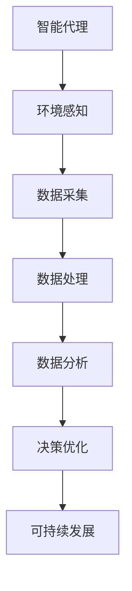

以下是《AI代理在环境监控与可持续性分析的工作流应用》的文章正文部分：

# AI代理在环境监控与可持续性分析的工作流应用

## 1. 背景介绍

### 1.1 问题的由来

随着工业化和城市化的快速发展，环境污染和资源消耗问题日益严重。传统的环境监测和可持续性分析方法往往存在着成本高、效率低下、数据质量参差不齐等问题。因此,亟需开发出一种高效、智能化的环境监控与可持续性分析系统,以应对日益严峻的环境挑战。

### 1.2 研究现状  

近年来,人工智能(AI)技术在各个领域得到了广泛应用,环境监控与可持续性分析也不例外。研究人员已经开始探索利用AI代理进行环境数据采集、处理和分析的可能性。然而,现有的AI代理系统通常仅关注特定的环境因素,缺乏全面的监控和分析能力。此外,这些系统往往缺乏灵活性和可扩展性,难以适应不断变化的环境条件和需求。

### 1.3 研究意义

开发一种基于AI代理的环境监控与可持续性分析工作流系统,可以显著提高环境数据的采集效率和分析质量,为制定有效的环境保护和可持续发展策略提供科学依据。该系统不仅能够实时监测各种环境指标,还能够通过机器学习和数据挖掘技术发现隐藏的环境问题,预测未来的环境变化趋势,并提出相应的优化方案。

### 1.4 本文结构

本文首先介绍AI代理在环境监控与可持续性分析中的核心概念和技术,包括智能代理、环境感知、数据处理和分析等。接下来,详细阐述了系统的核心算法原理和数学模型,并通过实例进行了说明和讨论。然后,介绍了系统的实际应用场景和开发实践,包括代码实现和运行结果展示。最后,探讨了该系统的未来发展趋势和面临的挑战,并提供了相关的学习资源和工具推荐。

## 2. 核心概念与联系

环境监控与可持续性分析工作流系统涉及多个核心概念,包括智能代理、环境感知、数据处理和分析等,它们之间存在着紧密的联系。



智能代理是整个系统的核心,负责环境感知、数据采集、处理和分析等任务。环境感知模块通过各种传感器和技术手段收集环境数据,如空气质量、水质、噪音等。数据采集模块负责从各种来源获取相关数据,并进行预处理和存储。数据处理模块则对采集的数据进行清洗、整合和转换,为后续的分析做好准备。

数据分析模块运用机器学习、数据挖掘等技术,从海量环境数据中发现隐藏的模式和趋势,并进行预测和建模。决策优化模块基于分析结果,提出改善环境质量和促进可持续发展的策略和方案。最终,这些策略和方案将指导相关部门制定环境政策和管理措施,推动社会的可持续发展。

## 3. 核心算法原理 & 具体操作步骤

### 3.1 算法原理概述

该系统的核心算法主要包括三个部分:环境数据采集与预处理、机器学习建模与分析、决策优化与方案生成。

环境数据采集与预处理阶段,系统通过各种传感器和数据源收集环境数据,并对这些数据进行清洗、整合和标准化处理,为后续的分析做好准备。

在机器学习建模与分析阶段,系统利用监督学习、非监督学习和强化学习等算法,从处理后的环境数据中发现隐藏的模式和趋势,构建预测模型,并对未来的环境变化进行预测和模拟。

决策优化与方案生成阶段,系统基于机器学习模型的分析结果,运用优化算法和决策理论,生成改善环境质量和促进可持续发展的策略和方案。

### 3.2 算法步骤详解

1. **环境数据采集与预处理**
   - 数据采集:通过物联网传感器、遥感卫星、政府公开数据等渠道采集环境数据,包括空气质量、水质、噪音、能源消耗等。
   - 数据清洗:处理缺失值、异常值和重复数据等问题。
   - 数据整合:将来自不同来源的数据进行标准化和融合。
   - 数据标准化:将数据转换为统一的格式和量纲,便于后续处理。

2. **机器学习建模与分析**
   - 特征工程:从原始数据中提取有意义的特征,作为机器学习模型的输入。
   - 模型训练:利用监督学习、非监督学习和强化学习等算法,从历史数据中学习环境变化的模式和规律。
   - 模型评估:使用测试数据对模型进行评估,确保其具有良好的预测性能。
   - 预测与模拟:利用训练好的模型,对未来的环境变化进行预测和模拟。

3. **决策优化与方案生成**
   - 目标函数构建:根据可持续发展的目标,构建优化目标函数,如最小化污染排放、最大化资源利用效率等。
   - 约束条件设置:考虑现实中的各种限制条件,如技术水平、经济成本、法律法规等。
   - 优化算法选择:根据问题的特点,选择合适的优化算法,如线性规划、动态规划、遗传算法等。
   - 方案生成与评估:运行优化算法,生成改善环境质量和促进可持续发展的策略和方案,并对方案进行评估和迭代优化。

### 3.3 算法优缺点

**优点:**

- 高效性:利用AI技术自动化环境数据采集、处理和分析,大大提高了工作效率。
- 准确性:机器学习算法能够从海量数据中发现隐藏的模式和趋势,提高了分析的准确性。
- 智能决策:优化算法能够综合考虑多种约束条件,生成科学合理的决策方案。
- 可扩展性:模块化设计,易于扩展和集成新的数据源、算法和功能模块。

**缺点:**

- 数据质量依赖:算法的性能很大程度上依赖于输入数据的质量和量。
- 算法偏差:机器学习算法可能存在偏差,导致模型预测结果不准确。
- 计算资源需求高:训练复杂的机器学习模型和运行优化算法需要大量的计算资源。
- 解释性差:一些机器学习模型缺乏解释性,难以解释其内部工作机制。

### 3.4 算法应用领域

该算法可以应用于多个环境监控与可持续性分析领域,包括但不限于:

- 空气质量监测与控制
- 水资源管理与保护
- 土壤污染预防与治理
- 噪音污染监测与控制
- 能源消耗优化与节约
- 生态环境保护与恢复
- 气候变化预测与应对
- 城市可持续发展规划

## 4. 数学模型和公式 & 详细讲解 & 举例说明

### 4.1 数学模型构建

在环境监控与可持续性分析中,我们需要构建数学模型来描述环境系统的行为,并对其进行预测和优化。常用的数学模型包括:

1. **时间序列模型**

时间序列模型用于描述和预测环境指标随时间的变化趋势,常用的模型有自回归移动平均模型(ARMA)、指数平滑模型等。

$$
y_t = c + \phi_1 y_{t-1} + \phi_2 y_{t-2} + ... + \phi_p y_{t-p} + \theta_1 \epsilon_{t-1} + \theta_2 \epsilon_{t-2} + ... + \theta_q \epsilon_{t-q} + \epsilon_t
$$

其中,$ y_t $表示时间 $ t $时的观测值,$ \phi_i $和$ \theta_j $分别为自回归和移动平均部分的系数,$ \epsilon_t $为白噪声项。

2. **回归模型**

回归模型用于描述环境指标与其他变量之间的关系,常用的模型有线性回归、逻辑回归等。

$$
y = \beta_0 + \beta_1 x_1 + \beta_2 x_2 + ... + \beta_n x_n + \epsilon
$$

其中,$ y $为因变量,$ x_i $为自变量,$ \beta_i $为回归系数,$ \epsilon $为随机误差项。

3. **机器学习模型**

机器学习模型可以从环境数据中自动学习隐藏的模式和规律,常用的模型有决策树、支持向量机、神经网络等。

对于神经网络模型,其数学表达式为:

$$
y = f\left(\sum_{i=1}^n w_i x_i + b\right)
$$

其中,$ x_i $为输入变量,$ w_i $为权重,$ b $为偏置项,$ f $为激活函数。

### 4.2 公式推导过程

以线性回归模型为例,我们可以通过最小二乘法推导出回归系数的解析解。

假设有 $ n $个观测样本 $ (x_1, y_1), (x_2, y_2), ..., (x_n, y_n) $,其中 $ x_i = (x_{i1}, x_{i2}, ..., x_{ip}) $为 $ p $个自变量的观测值。我们希望找到一个线性函数 $ y = \beta_0 + \beta_1 x_1 + ... + \beta_p x_p $,使得预测值 $ \hat{y}_i $与实际观测值 $ y_i $之间的残差平方和最小。

定义残差平方和为:

$$
Q = \sum_{i=1}^n (y_i - \hat{y}_i)^2 = \sum_{i=1}^n \left(y_i - \beta_0 - \sum_{j=1}^p \beta_j x_{ij}\right)^2
$$

对 $ \beta_0, \beta_1, ..., \beta_p $分别取偏导数并令其等于0,可得:

$$
\begin{aligned}
\frac{\partial Q}{\partial \beta_0} &= -2 \sum_{i=1}^n \left(y_i - \beta_0 - \sum_{j=1}^p \beta_j x_{ij}\right) = 0 \\
\frac{\partial Q}{\partial \beta_j} &= -2 \sum_{i=1}^n x_{ij} \left(y_i - \beta_0 - \sum_{k=1}^p \beta_k x_{ik}\right) = 0, \quad j = 1, 2, ..., p
\end{aligned}
$$

解这个方程组,就可以得到回归系数 $ \beta_0, \beta_1, ..., \beta_p $的最小二乘估计值。

### 4.3 案例分析与讲解

假设我们希望建立一个模型,预测某城市的 $ PM_{2.5} $浓度。我们收集了该城市过去一年中每天的 $ PM_{2.5} $浓度数据,以及气温、风速、湿度等气象数据。

1. **时间序列模型**

我们可以使用 ARMA 模型来拟合和预测 $ PM_{2.5} $浓度的时间序列数据:

```python
from statsmodels.tsa.arima_model import ARMA

# 加载数据
data = pd.read_csv('pm25.csv')
pm25 = data['pm25']

# 拟合 ARMA 模型
model = ARMA(pm25, order=(2, 1)).fit()

# 预测未来 10 天的 PM2.5 浓度
forecast = model.forecast(steps=10)[0]
```

2. **回归模型**

我们可以使用多元线性回归模型,探究 $ PM_{2.5} $浓度与气温、风速、湿度等变量之间的关系:

```python
from sklearn.linear_model import LinearRegression

# 加载数据
data = pd.read_csv('pm25.csv')
X = data[['temp', 'wind', 'humidity']]
y = data['pm25']

# 拟合线性回归模型
model = LinearRegression().fit(X, y)

# 预测 PM2.5 浓度
new_data = [[20, 3, 60