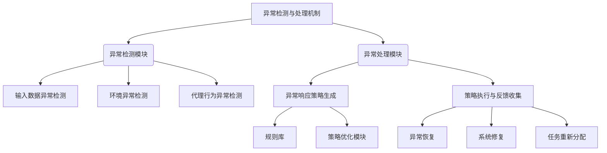

以下是对《AI代理工件流中的异常检测与处理机制》这一主题的技术博客文章正文部分。

# AI代理工作流中的异常检测与处理机制

## 1. 背景介绍

### 1.1 问题的由来

在现代软件系统中,AI代理扮演着越来越重要的角色。AI代理被广泛应用于各种领域,如自动化流程、智能助理、决策支持系统等。然而,AI代理在执行工作流时可能会遇到各种异常情况,如输入数据异常、环境变化、代理行为异常等,这些异常可能会导致代理无法正常工作,甚至产生严重后果。因此,及时发现和处理这些异常情况对于确保AI代理的可靠性和安全性至关重要。

### 1.2 研究现状  

目前,已有一些研究探讨了AI代理异常检测与处理的方法,但大多数方法都存在一定局限性。一些方法仅关注特定类型的异常,如输入数据异常或代理行为异常,但忽视了其他类型异常。另一些方法则过于依赖人工规则或监督学习,难以应对复杂动态环境中的新型异常。此外,大多数现有方法缺乏系统性和通用性,难以适应不同领域和场景的需求。

### 1.3 研究意义

设计一种通用的、自适应的异常检测与处理机制,对于提高AI代理的可靠性和安全性具有重要意义。通过及时发现和处理各种类型的异常情况,可以避免AI代理产生错误行为或决策,从而降低潜在风险。同时,一个健壮的异常处理机制也有助于提高AI代理的鲁棒性,使其能够适应复杂动态环境的变化。此外,该机制还可以为AI代理的持续优化和改进提供有价值的反馈,促进其不断进步。

### 1.4 本文结构

本文将首先介绍AI代理工作流中异常检测与处理的核心概念及其相互关系。接下来,详细阐述异常检测与处理的核心算法原理及具体操作步骤。然后,构建相应的数学模型并推导关键公式,并通过案例分析加深理解。此外,还将展示一个实际项目中的代码实现,并对代码进行解读和分析。最后,探讨该机制在实际应用场景中的应用前景,介绍相关工具和资源,总结研究成果并展望未来发展趋势和面临的挑战。

## 2. 核心概念与联系

上图展示了AI代理工作流中异常检测与处理机制的核心概念及其相互关系。该机制主要由两个模块组成:异常检测模块和异常处理模块。

异常检测模块负责监控AI代理工作流的各个环节,及时发现可能出现的异常情况。具体来说,它包括以下三个子模块:

1. **输入数据异常检测**:检测输入到AI代理的数据是否存在异常,如缺失值、异常值、噪声等。
2. **环境异常检测**:监测AI代理运行的环境是否发生变化,如硬件故障、网络中断等。
3. **代理行为异常检测**:评估AI代理的行为或决策是否存在异常,如偏离预期、低效率等。

异常处理模块则负责根据检测到的异常情况生成相应的响应策略,并执行该策略以恢复系统正常运行。该模块包括以下子模块:

1. **异常响应策略生成**:基于规则库和策略优化模块,生成针对特定异常情况的响应策略。
2. **策略执行与反馈收集**:执行生成的响应策略,并收集执行过程中的反馈信息,用于优化策略。

策略执行可能涉及以下几种操作:异常恢复(如重新初始化系统)、系统修复(如更新软硬件组件)、任务重新分配(如将任务转移到其他代理)等。

通过异常检测与处理机制的有机协作,AI代理能够实时监控工作流,及时发现并应对各种异常情况,从而提高系统的可靠性和鲁棒性。同时,该机制还为AI代理的持续优化提供了反馈渠道,有助于不断改进其性能。

## 3. 核心算法原理及具体操作步骤

### 3.1 算法原理概述

AI代理工作流中的异常检测与处理机制的核心算法原理可概括为以下三个主要步骤:

1. **异常检测**:利用监控技术(如统计建模、深度学习等)实时监测AI代理工作流的输入数据、环境和行为,发现潜在异常。

2. **异常分类与评估**:对检测到的异常进行分类(如输入异常、环境异常、行为异常等),并评估其严重程度和影响范围。

3. **策略生成与执行**:根据异常类型和评估结果,从规则库中选择合适的响应策略,或基于机器学习优化生成新策略。然后执行该策略,并收集反馈以优化未来的策略。

该算法的关键在于能够有效地检测各种类型的异常,准确分类和评估异常,并生成合理的响应策略。同时,通过持续优化策略生成模块,算法可以不断适应新的异常情况,提高异常处理的效率和准确性。

### 3.2 算法步骤详解

1. **输入数据异常检测**

   - 统计建模方法:构建输入数据的统计模型(如高斯混合模型),监测新数据是否与模型显著偏离。
   - 基于深度学习的异常检测:使用自编码器等深度神经网络模型学习输入数据的正常模式,将偏离该模式的数据视为异常。

2. **环境异常检测**

   - 系统监控:持续监控系统指标(如CPU利用率、内存使用情况等),当指标异常时触发异常警报。
   - 预测性维护:基于机器学习模型预测系统组件何时可能发生故障,提前采取措施。

3. **代理行为异常检测**

   - 规则检查:事先定义代理行为的规则约束,检查行为是否违反这些规则。
   - 行为模式分析:使用序列模型(如HMM、LSTM等)学习代理正常行为模式,将偏离模式的行为视为异常。

4. **异常分类与评估**

   - 异常分类:基于异常的来源和性质,将其分为输入异常、环境异常、行为异常等类别。
   - 异常评估:评估异常的严重程度(如低、中、高风险)和影响范围(如局部影响、全局影响)。

5. **策略生成**

   - 规则库查询:根据异常类型和评估结果,在规则库中查找对应的响应策略。
   - 机器学习策略优化:如果规则库中无合适策略,则基于历史数据训练机器学习模型(如强化学习、在线规划等)生成新策略。

6. **策略执行与反馈收集**

   - 策略执行:执行生成的响应策略,如重启系统、修复组件、重新分配任务等。
   - 反馈收集:收集策略执行过程中的反馈数据,如执行时间、资源消耗、是否成功恢复等。

7. **策略优化**

   - 反馈分析:分析收集到的反馈数据,评估策略的有效性和效率。
   - 模型更新:基于反馈数据,更新策略生成模块(如调整规则库、重新训练机器学习模型等),以优化未来的策略生成。

上述步骤构成了一个闭环过程,通过持续监控、响应、反馈和优化,不断提高异常检测与处理的准确性和效率。

### 3.3 算法优缺点

**优点:**

1. **全面性**:该算法能够检测和处理多种类型的异常,包括输入数据异常、环境异常和代理行为异常,覆盖面广。

2. **自适应性**:算法通过机器学习技术持续优化策略生成模块,能够适应新的异常情况,提高异常处理的鲁棒性。

3. **高效性**:算法将异常检测、分类、评估和策略生成有机结合,提高了异常处理的整体效率。

4. **可扩展性**:算法的模块化设计使其具有良好的可扩展性,可根据需求方便地集成新的异常检测或处理组件。

**缺点:**

1. **复杂性**:算法涉及多种技术(如统计建模、深度学习、规则推理、强化学习等),实现和调优过程复杂。

2. **数据需求**:某些模块(如基于深度学习的异常检测、策略优化等)对训练数据有较高要求,可能需要大量的历史数据。

3. **计算开销**:持续监控和模型训练可能会带来较大的计算开销,对硬件资源要求较高。

4. **噪声敏感性**:某些异常检测方法(如统计建模)可能对噪声数据较为敏感,导致误报率较高。

### 3.4 算法应用领域

该算法可广泛应用于各种需要AI代理参与的领域,如:

- **自动化流程**:确保工厂自动化流程中机器人的正常运行,及时发现和处理异常情况。
- **智能助理**:为智能助理(如语音助手、聊天机器人等)提供异常检测和处理机制,提高其可靠性。
- **自动驾驶**:监测自动驾驶汽车的传感器数据、环境变化和行为决策,及时发现和应对异常,确保行车安全。
- **金融风控**:检测金融交易数据和决策过程中的异常行为,防范金融风险。
- **医疗诊断**:发现医疗数据和诊断过程中的异常,提高诊断的准确性和安全性。

总的来说,任何涉及AI代理参与的复杂系统,都可以应用该算法提高系统的可靠性和鲁棒性。

## 4. 数学模型和公式及详细讲解与举例说明

在AI代理工作流中的异常检测与处理过程中,需要构建数学模型对异常情况进行量化描述,并推导相关公式指导算法设计。本节将介绍一种基于高斯混合模型(GMM)的输入数据异常检测方法,并详细讲解其数学原理、公式推导及应用案例。

### 4.1 数学模型构建

假设输入数据$\boldsymbol{x} = (x_1, x_2, \ldots, x_d)$为$d$维连续随机变量,其概率密度函数可用高斯混合模型(GMM)表示:

$$
p(\boldsymbol{x}|\boldsymbol{\pi}, \boldsymbol{\mu}, \boldsymbol{\Sigma}) = \sum_{k=1}^{K} \pi_k \mathcal{N}(\boldsymbol{x}|\boldsymbol{\mu}_k, \boldsymbol{\Sigma}_k)
$$

其中:

- $K$是混合成分的个数
- $\boldsymbol{\pi} = (\pi_1, \pi_2, \ldots, \pi_K)$是混合系数,满足$\sum_{k=1}^{K}\pi_k=1$且$\pi_k \geq 0$
- $\boldsymbol{\mu}_k$是第$k$个高斯成分的均值向量
- $\boldsymbol{\Sigma}_k$是第$k$个高斯成分的协方差矩阵
- $\mathcal{N}(\boldsymbol{x}|\boldsymbol{\mu}_k, \boldsymbol{\Sigma}_k)$是第$k$个高斯成分的概率密度函数

对于给定的输入数据集$\mathcal{D} = \{\boldsymbol{x}_1, \boldsymbol{x}_2, \ldots, \boldsymbol{x}_N\}$,我们可以使用期望最大化(EM)算法估计GMM的参数$\boldsymbol{\theta} = \{\boldsymbol{\pi}, \boldsymbol{\