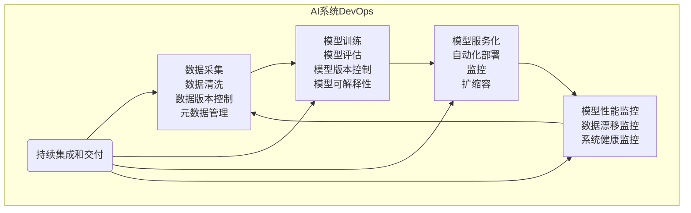

# AI系统DevOps原理与代码实战案例讲解

## 1. 背景介绍

### 1.1 问题的由来

在当今快速发展的数字时代，人工智能(AI)系统已经广泛应用于各个领域,包括金融、医疗、制造、零售等。随着AI系统的复杂性和规模不断增加,有效地管理和维护这些系统变得前所未有的重要。传统的软件开发运维实践已经无法满足AI系统的特殊需求,因此出现了AI系统DevOps的概念。

AI系统与传统软件系统有着本质的不同,主要体现在以下几个方面:

1. **数据驱动**: AI系统高度依赖于大量的训练数据,数据的质量和可获取性直接影响着模型的性能。
2. **模型复杂性**: AI模型通常涉及复杂的数学计算和优化算法,需要大量的计算资源和专门的硬件加速器。
3. **不确定性**: AI系统的行为存在一定的不确定性,难以完全预测和控制。
4. **持续学习**: AI系统需要不断地从新数据中学习,以适应环境的变化和新的需求。

这些特点使得AI系统的开发、部署和运维过程变得更加复杂和具有挑战性。传统的软件开发生命周期和运维实践无法很好地应对这些挑战,因此需要一种新的方法来管理AI系统的整个生命周期。

### 1.2 研究现状

近年来,AI系统DevOps作为一种新兴的实践,受到了广泛的关注和研究。一些著名的科技公司,如Google、Amazon和Microsoft,已经开始探索和实践AI系统DevOps。同时,一些开源社区也在积极推动AI系统DevOps的发展,例如Kubeflow、MLOps等。

目前,AI系统DevOps主要关注以下几个方面:

1. **数据管理**: 包括数据采集、清洗、版本控制、元数据管理等。
2. **模型开发**: 涉及模型训练、评估、版本控制、可解释性等。
3. **模型部署**: 包括模型服务化、自动化部署、监控、扩缩容等。
4. **持续集成和交付(CI/CD)**: 实现从代码到生产环境的自动化流程。
5. **监控和可观测性**: 监控模型性能、数据漂移、系统健康状况等。
6. **安全和隐私**: 保护数据隐私,防止对抗性攻击等。

尽管AI系统DevOps取得了一定的进展,但仍然存在许多挑战和未解决的问题,例如缺乏统一的标准和最佳实践、工具链不完整、缺乏专业人才等。

### 1.3 研究意义

AI系统DevOps对于企业和组织来说具有重要的意义:

1. **提高效率和质量**: 通过自动化和标准化的流程,可以加快AI系统的开发和部署速度,提高质量和一致性。
2. **降低风险和成本**: 有效的DevOps实践可以降低人为错误的风险,减少重复工作,从而降低总体成本。
3. **促进协作和沟通**: DevOps强调跨团队协作和沟通,有助于打破开发、运维和其他团队之间的壁垒。
4. **提高可靠性和可维护性**: DevOps实践可以提高AI系统的可靠性、可观测性和可维护性,确保系统的稳定运行。
5. **加快创新**: 通过自动化和标准化的流程,企业可以更快地将新的AI技术和模型投入生产,加快创新步伐。

因此,研究和实践AI系统DevOps对于企业和组织来说是非常有意义的,可以帮助它们更好地利用AI技术,提高竞争力。

### 1.4 本文结构

本文将全面介绍AI系统DevOps的原理和实践。文章的主要结构如下:

1. 背景介绍
2. 核心概念与联系
3. 核心算法原理与具体操作步骤
4. 数学模型和公式详细讲解与举例说明
5. 项目实践:代码实例和详细解释说明
6. 实际应用场景
7. 工具和资源推荐
8. 总结:未来发展趋势与挑战
9. 附录:常见问题与解答

通过本文的学习,读者将全面了解AI系统DevOps的基本概念、核心原理、算法实现、数学模型、实际应用场景,以及相关工具和资源。最后,本文还将总结未来的发展趋势和面临的挑战,为读者提供一个全面的视角。

## 2. 核心概念与联系

在深入探讨AI系统DevOps的原理和实践之前,我们需要先了解一些核心概念及其之间的关系。这些概念构成了AI系统DevOps的基础,对于理解和实践AI系统DevOps至关重要。

### 2.1 DevOps

DevOps是一种软件开发和运维的理念和实践,旨在通过自动化和标准化的流程,缩短软件开发和部署周期,提高软件质量和可靠性。DevOps强调开发和运维团队之间的紧密协作,打破传统的壁垒,实现持续集成、持续交付和持续部署。

DevOps的核心理念包括:

- **自动化**: 通过自动化工具和脚本,实现软件开发、测试、部署和运维的自动化,减少人工操作和错误。
- **协作**: 开发和运维团队之间紧密协作,共享责任和目标,形成一个统一的团队。
- **持续交付**: 通过自动化流程,实现代码从开发到测试、部署和生产环境的快速迭代和交付。
- **监控和反馈**: 持续监控系统的性能和健康状况,并及时获取反馈,进行改进和优化。

DevOps的实践通常涉及以下几个关键领域:

- **基础设施自动化**: 使用基础设施即代码(Infrastructure as Code)的方式,自动化基础设施的配置和管理。
- **持续集成和交付(CI/CD)**: 实现代码的自动化构建、测试和部署,加快交付速度。
- **监控和日志管理**: 收集和分析系统的监控数据和日志,及时发现和解决问题。
- **容器和微服务**: 采用容器和微服务架构,提高系统的灵活性和可扩展性。

DevOps的实践已经被广泛应用于传统的软件开发和运维领域,但对于AI系统来说,还需要一些特殊的考虑和扩展。

### 2.2 AI系统的特殊性

与传统的软件系统相比,AI系统具有以下一些特殊性:

1. **数据驱动**: AI系统高度依赖于大量的训练数据,数据的质量和可获取性直接影响着模型的性能。因此,数据管理成为AI系统DevOps的一个重要环节。

2. **模型复杂性**: AI模型通常涉及复杂的数学计算和优化算法,需要大量的计算资源和专门的硬件加速器。这对基础设施和资源管理提出了新的挑战。

3. **不确定性**: AI系统的行为存在一定的不确定性,难以完全预测和控制。这需要更加强大的监控和可观测性能力。

4. **持续学习**: AI系统需要不断地从新数据中学习,以适应环境的变化和新的需求。这要求DevOps流程能够支持模型的持续训练和更新。

5. **安全和隐私**: AI系统涉及大量的数据,包括一些敏感数据,因此需要特别关注数据的安全性和隐私保护。

6. **可解释性**: AI模型的决策过程通常是一个黑箱,缺乏透明度和可解释性。这对于一些关键应用场景(如医疗、金融等)是不可接受的,需要提高模型的可解释性。

这些特殊性使得传统的DevOps实践无法完全满足AI系统的需求,因此需要进行一些扩展和调整,形成AI系统DevOps。

### 2.3 AI系统DevOps

AI系统DevOps是一种新兴的实践,旨在应对AI系统的特殊性,实现AI系统的高效开发、部署和运维。它在传统DevOps的基础上,增加了一些特殊的考虑和扩展,包括:

1. **数据管理**: 包括数据采集、清洗、版本控制、元数据管理等,确保数据的质量和可追溯性。

2. **模型开发**: 涉及模型训练、评估、版本控制、可解释性等,确保模型的质量和可靠性。

3. **模型部署**: 包括模型服务化、自动化部署、监控、扩缩容等,确保模型的高效运行和可伸缩性。

4. **持续集成和交付(CI/CD)**: 实现从代码到生产环境的自动化流程,包括数据处理、模型训练、测试和部署等环节。

5. **监控和可观测性**: 监控模型性能、数据漂移、系统健康状况等,及时发现和解决问题。

6. **安全和隐私**: 保护数据隐私,防止对抗性攻击等,确保AI系统的安全性。

AI系统DevOps的实践需要涵盖AI系统的整个生命周期,包括数据管理、模型开发、模型部署、运维监控等多个环节。同时,它也需要与传统的DevOps实践相结合,形成一个完整的解决方案。

下面的 Mermaid 流程图展示了AI系统DevOps的核心流程:

在上面的流程图中,我们可以看到AI系统DevOps的核心环节包括数据管理、模型开发、模型部署和运维监控。这些环节通过持续集成和交付(CI/CD)流程进行自动化和集成,形成一个闭环。

下面我们将详细介绍每个环节的核心原理和具体实现。

## 3. 核心算法原理与具体操作步骤

在AI系统DevOps中,有一些核心算法和原理贯穿于整个流程,包括数据处理、模型训练、模型评估、模型部署等多个环节。本节将重点介绍这些核心算法的原理、具体操作步骤,以及优缺点和应用领域。

### 3.1 算法原理概述

#### 3.1.1 数据处理算法

数据处理是AI系统DevOps中的重要环节,包括数据采集、清洗、特征工程等步骤。常见的数据处理算法包括:

- **数据清洗算法**: 用于处理缺失值、异常值和噪声数据,如均值插补、中值插补、基于模型的插补等。
- **特征工程算法**: 用于从原始数据中提取有用的特征,如一热编码、主成分分析(PCA)、特征选择等。
- **数据增强算法**: 通过一些变换(如旋转、平移、缩放等)生成新的训练数据,以增加数据量和多样性。

#### 3.1.2 模型训练算法

模型训练是AI系统DevOps中的核心环节,常见的模型训练算法包括:

- **监督学习算法**: 如线性回归、逻辑回归、支持向量机(SVM)、决策树、随机森林、神经网络等。
- **无监督学习算法**: 如聚类算法(K-Means、DBSCAN等)、降维算法(PCA、t-SNE等)、关联规则挖掘等。
- **强化学习算法**: 如Q-Learning、策略梯度、Actor-Critic等。
- **迁移学习算法**: 通过迁移已有模型的知识,加快新模型的训练过程。
- **联邦学习算法**: 在保护数据隐私的前提下,利用多个数据源进行联合