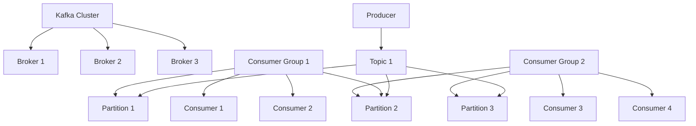

# AI系统Kafka原理与代码实战案例讲解

## 1. 背景介绍

### 1.1 问题的由来

在当今大数据时代，海量数据的实时处理和传输成为了一个巨大的挑战。传统的消息队列系统往往无法满足大规模分布式系统对高吞吐量、可伸缩性和容错性的需求。Apache Kafka作为一种分布式流处理平台,应运而生。

Kafka最初由LinkedIn公司内部的工程师开发,用于解决大规模日志收集和处理的问题。随后,它被捐赠给Apache软件基金会,成为一个开源项目。Kafka的设计目标是提供一个统一的、高吞吐量的数据管道,能够实时处理大量数据流,并确保数据的可靠性和持久性。

### 1.2 研究现状

近年来,Kafka已经成为大数据生态系统中不可或缺的一部分。它被广泛应用于各种场景,如日志收集、消息系统、数据管道、流处理等。许多知名公司如Netflix、Uber、Twitter等都在生产环境中大规模使用Kafka。

然而,Kafka的复杂性也给开发者和运维人员带来了一定的挑战。理解Kafka的核心概念、架构设计和内部原理对于高效地使用和管理Kafka系统至关重要。此外,随着数据量的不断增长,如何优化Kafka的性能、扩展性和可靠性也成为了研究的热点话题。

### 1.3 研究意义

本文旨在深入探讨Kafka的核心原理和架构设计,并通过实战案例帮助读者掌握Kafka的使用和开发技巧。具体来说,本文的研究意义包括:

1. **理解核心概念**: 阐释Kafka中的关键概念,如Topic、Partition、Broker、Producer、Consumer等,为后续的原理分析和实践奠定基础。

2. **揭示内部原理**: 剖析Kafka的核心算法和数学模型,如分区复制机制、日志压缩算法、消费位移管理等,帮助读者深入理解Kafka的设计思想和实现细节。

3. **实战案例分析**: 通过代码示例和详细解释,演示如何在实际项目中使用Kafka进行数据收集、传输和处理,并分享最佳实践和常见问题解答。

4. **性能优化与扩展**: 探讨Kafka的性能优化策略和扩展方法,帮助读者构建高效、可靠的Kafka集群,满足不断增长的数据需求。

5. **推动技术发展**: 总结Kafka的未来发展趋势和面临的挑战,为读者提供前瞻性的技术视角,推动相关领域的创新和进步。

### 1.4 本文结构

本文将按照以下结构进行阐述:

1. 背景介绍
2. 核心概念与联系
3. 核心算法原理与具体操作步骤
4. 数学模型和公式详细讲解与举例说明
5. 项目实践:代码实例和详细解释说明
6. 实际应用场景
7. 工具和资源推荐
8. 总结:未来发展趋势与挑战
9. 附录:常见问题与解答

## 2. 核心概念与联系

在深入探讨Kafka的原理之前,我们需要先了解Kafka中的几个核心概念及它们之间的关系。这些概念构成了Kafka的基础框架,对于理解后续内容至关重要。

### 2.1 Broker

Broker是Kafka集群中的一个节点实例。一个Kafka集群通常由多个Broker组成,它们一起存储和处理数据。每个Broker都是一个独立的进程实例,可以在同一台机器或不同机器上运行。

### 2.2 Topic

Topic是Kafka中的数据流,它是数据记录(Record)的逻辑集合。生产者(Producer)将消息发布到特定的Topic,而消费者(Consumer)则从Topic中消费消息。每个Topic在Kafka集群中被分割为一个或多个Partition。

### 2.3 Partition

Partition是Topic的一个物理分区,用于提高Kafka的吞吐量和容错性。每个Partition是一个有序、不可变的消息序列,由一系列的消息记录组成。Partition中的消息记录按照追加的顺序进行存储,并被分配一个连续的offset值,用于标识消息在Partition中的位置。

### 2.4 Producer

Producer是向Kafka集群发送消息的客户端。它将消息发布到指定的Topic中,并选择合适的Partition来存储消息。Producer可以通过配置不同的分区策略来控制消息的分布,如按键(Key)分区或者轮询(Round-Robin)分区。

### 2.5 Consumer

Consumer是从Kafka集群消费消息的客户端。它订阅一个或多个Topic,并从指定的Partition中读取消息。Consumer可以组成一个消费者组(Consumer Group),实现消息的负载均衡和容错。每个消费者组中的消费者只能消费Topic的一部分Partition,从而实现并行消费。

### 2.6 Consumer Group

Consumer Group是Kafka中的一个逻辑概念,表示一组消费者共享同一个消费进度。每个消费者组内的消费者只能消费Topic的一部分Partition,而不同消费者组之间可以并行消费同一个Topic。这种设计确保了消息只被消费一次,并提高了消费的并行度和容错性。

### 2.7 Offset

Offset是Kafka中用于标识消息在Partition中位置的一个连续的数字值。每个Partition中的消息都被赋予一个唯一的Offset,从0开始递增。Consumer通过跟踪和维护Offset来确定下一条要消费的消息位置。

### 2.8 Replication

Replication是Kafka的一个关键特性,用于实现数据的冗余备份和容错。每个Partition都有一个Leader Replica和多个Follower Replica,它们分布在不同的Broker上。Producer只能将消息发送到Leader Replica,而Follower Replica则通过复制Leader上的数据来保持数据的一致性。当Leader Replica出现故障时,其中一个Follower Replica会被选举为新的Leader,从而确保数据的可用性和持久性。

### 2.9 核心概念关系图

为了更好地理解这些核心概念之间的关系,我们可以使用Mermaid流程图进行可视化表示:

在这个流程图中,我们可以清晰地看到Kafka集群由多个Broker组成,每个Topic被分割为多个Partition,Producer向Topic发送消息,而Consumer则通过消费者组从Partition中消费消息。同时,每个Partition都有多个副本分布在不同的Broker上,以实现数据冗余和容错。

## 3. 核心算法原理与具体操作步骤

### 3.1 算法原理概述

Kafka的核心算法主要包括以下几个方面:

1. **分区复制机制**: 通过将Topic分割为多个Partition,并在不同Broker上维护Partition的多个副本,实现数据的冗余备份和容错。

2. **日志压缩算法**: 采用基于时间和大小的日志压缩策略,有效地减小数据存储空间,提高存储效率。

3. **消费位移管理**: 通过维护每个Consumer Group在每个Partition上的消费位移(Offset),实现消息的精确定位和重复消费控制。

4. **负载均衡算法**: 采用分区分配策略和消费者组协议,实现Producer和Consumer之间的负载均衡和容错。

5. **流式处理模型**: 将数据视为持续不断的流,支持实时数据处理和转换,满足低延迟、高吞吐量的需求。

在接下来的小节中,我们将详细探讨这些核心算法的具体原理和操作步骤。

### 3.2 算法步骤详解

#### 3.2.1 分区复制机制

Kafka的分区复制机制是实现数据冗余和容错的关键。它的工作原理如下:

1. 每个Topic被分割为多个Partition,每个Partition在集群中有多个副本(Replica)。

2. 其中一个副本被指定为Leader Replica,负责处理所有的生产者请求和消费者请求。

3. 其他副本被称为Follower Replica,它们从Leader Replica复制数据,以保持数据的一致性。

4. 当Leader Replica出现故障时,其中一个Follower Replica会被选举为新的Leader,从而确保数据的可用性。

5. Producer将消息发送到Leader Replica,Leader Replica将消息写入本地日志文件,并将消息复制到所有Follower Replica。

6. 只有当消息被成功复制到所需数量的Follower Replica时,Producer才会收到确认响应。

7. Consumer从Leader Replica读取消息,并维护自己在每个Partition上的消费位移(Offset)。

该机制的优点是提高了数据的可靠性和容错性,但也增加了一定的开销和复杂性。Kafka通过优化复制流程和引入批量处理等策略,来提高性能和效率。

#### 3.2.2 日志压缩算法

随着时间的推移,Kafka中的数据量会不断增长,导致存储空间的压力越来越大。为了解决这个问题,Kafka采用了基于时间和大小的日志压缩策略。具体步骤如下:

1. Kafka将每个Partition的数据存储在一系列的日志段(Log Segment)中,每个日志段都有一个固定的大小限制。

2. 当一个日志段被写满时,Kafka会自动创建一个新的日志段,继续写入数据。

3. Kafka会定期检查旧的日志段,根据配置的保留策略(基于时间或大小),决定是否需要删除或压缩这些日志段。

4. 对于需要压缩的日志段,Kafka会执行以下操作:
   a. 对于具有相同键(Key)的消息记录,只保留最后一条记录,删除之前的旧记录。
   b. 对于没有键(Key)的消息记录,Kafka会保留最后一批连续的记录,删除之前的旧记录。

5. 压缩后的日志段会被重新写入新的日志文件,从而释放磁盘空间。

这种日志压缩算法可以有效地减小数据存储空间,提高存储效率。同时,由于只保留最新的消息记录,它也确保了数据的一致性和正确性。

#### 3.2.3 消费位移管理

在Kafka中,Consumer需要跟踪和维护自己在每个Partition上的消费位移(Offset),以确保消息被正确消费,并避免重复消费或丢失消息。Kafka采用了一种分布式的消费位移管理机制,具体步骤如下:

1. 每个Consumer Group在Kafka集群中维护一个专门的内部Topic,称为__consumer_offsets。

2. 当Consumer从Partition中消费消息时,它会定期将自己的消费位移提交到__consumer_offsets Topic中。

3. 消费位移以键值对的形式存储,其中键是{Consumer Group, Topic, Partition}的组合,值是Consumer在该Partition上的最新消费位移。

4. 当Consumer重新启动或加入Consumer Group时,它会从__consumer_offsets Topic中读取最新的消费位移,并从该位置开始消费消息。

5. 如果__consumer_offsets Topic中没有存储某个Partition的消费位移,Consumer会从Partition的最早位置(Offset=0)开始消费。

6. Kafka还提供了自动位移提交和手动位移提交两种模式,以满足不同的需求和场景。

通过这种分布式的消费位移管理机制,Kafka可以实现消息的精确定位和重复消费控制,确保数据的一致性和可靠性。同时,它也提高了系统的容错性和可扩展性,因为消费位移信息是分布式存储的,不会因为单个Consumer的故障而丢失。

#### 3.2.4 负载均衡算法

Kafka采用了多种负载均衡算法,以确保Producer和Consumer之间的负载均