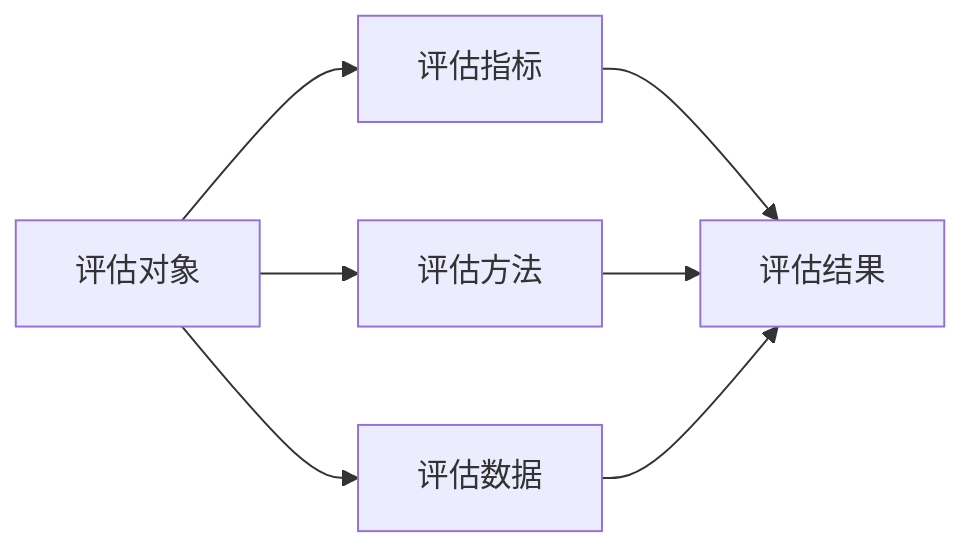

# AI系统性能评估原理与代码实战案例讲解

关键词：AI系统、性能评估、评估指标、评估方法、代码实战

## 1. 背景介绍
### 1.1 问题的由来
随着人工智能技术的飞速发展,AI系统在各行各业得到了广泛应用。然而,不同的AI系统性能千差万别,如何科学、客观、全面地评估一个AI系统的性能,成为了一个亟待解决的问题。没有一个统一的AI系统性能评估标准和方法,就无法对不同AI系统进行比较,也无法判断AI系统是否达到预期性能要求,这将极大影响AI产业的健康发展。

### 1.2 研究现状
目前,国内外学术界和工业界已经开始重视AI系统性能评估的研究。一些标准化组织如ISO、IEEE等已经成立了相关工作组,开始制定AI系统性能评估的标准和规范。各大科技公司如谷歌、微软、亚马逊等也纷纷推出了自己的AI系统性能评估工具和平台。但总的来说,AI系统性能评估的研究还处于起步阶段,评估指标和方法还不够成熟和完善,评估结果的可解释性和可信度有待提高。

### 1.3 研究意义
AI系统性能评估研究对于推动人工智能技术和产业的发展具有重要意义:

1. 有利于建立科学、客观、公正的AI系统性能评估标准,规范AI系统的开发和应用。 
2. 有利于比较不同AI系统的性能优劣,为用户选择和决策提供参考依据。
3. 有利于发现AI系统的不足和问题,促进AI系统的优化和改进。
4. 有利于加强AI系统的可解释性、可控性和安全性,提高用户对AI系统的信任。

### 1.4 本文结构
本文将重点介绍AI系统性能评估的原理、方法和实战。全文分为9个部分:第1部分是背景介绍；第2部分是核心概念；第3部分是核心算法原理；第4部分是数学模型和公式；第5部分是代码实例讲解；第6部分是应用场景；第7部分是工具和资源推荐；第8部分是未来展望；第9部分是附录。

## 2. 核心概念与联系
要评估一个AI系统的性能,首先要明确AI系统性能评估的核心概念:

- **评估对象**:是指要评估性能的AI系统,可以是一个算法、模型、软件或平台。
- **评估指标**:是指用来衡量AI系统性能的定量或定性指标,如准确率、召回率、响应时间等。
- **评估方法**:是指用来测试和评价AI系统性能的具体方法,如留出法、交叉验证法等。 
- **评估数据**:是指用来评估AI系统性能的数据集,包括训练集、验证集和测试集。
- **评估结果**:是指AI系统经过评估得出的性能数值或等级,代表了AI系统的性能水平。

这些核心概念之间的联系如下图所示:



由上图可见,评估一个AI系统的性能,需要从评估指标、评估方法、评估数据三个维度入手,最终得出评估结果。三者缺一不可,相辅相成。

## 3. 核心算法原理 & 具体操作步骤
### 3.1 算法原理概述
AI系统性能评估的核心是通过一系列算法和方法,利用评估数据测试评估对象,得出相应的评估指标,最终给出评估结果。常见的评估算法包括:

- 留出法 Hold-Out
- 交叉验证法 Cross Validation
- 自助法 Bootstrap
- McNemar检验
- Friedman检验
- ROC曲线
- 混淆矩阵 Confusion Matrix
- 成本敏感曲线 Cost Curve

### 3.2 算法步骤详解
下面以最常用的留出法为例,详细讲解其算法步骤:

1. 将评估数据集随机划分为训练集和测试集两部分,比例一般为7:3或8:2。
2. 用训练集训练评估对象,得到模型。
3. 用测试集测试模型,得到预测结果。
4. 将预测结果与真实标签对比,计算评估指标如准确率、召回率、F1值等。
5. 重复以上步骤多次,每次划分不同的训练集和测试集,最后取平均值作为最终评估结果。

代码实现如下:

```python
from sklearn.model_selection import train_test_split
from sklearn.metrics import accuracy_score

# 划分训练集和测试集
X_train, X_test, y_train, y_test = train_test_split(X, y, test_size=0.2)

# 训练模型
model.fit(X_train, y_train) 

# 测试模型
y_pred = model.predict(X_test)

# 计算准确率
accuracy = accuracy_score(y_test, y_pred)
```

### 3.3 算法优缺点
留出法的优点是简单直观,易于实现,但缺点是评估结果易受随机划分影响,稳定性不够高。

交叉验证法通过多次划分和评估,可以得到更稳定、更可靠的评估结果,是比较推荐的评估方法。但其计算开销较大。

自助法通过有放回地抽样来构造不同的训练集和测试集,也能提高评估的稳定性,且计算量较交叉验证法小。

### 3.4 算法应用领域
AI系统性能评估算法可应用于各种类型的AI系统,如分类、回归、聚类、异常检测等,适用领域十分广泛。在实际应用中,要根据AI系统的特点和需求,选择合适的评估算法。

## 4. 数学模型和公式 & 详细讲解 & 举例说明
### 4.1 数学模型构建
AI系统性能评估中用到的数学模型主要有混淆矩阵和ROC曲线。

混淆矩阵是一个用于总结分类模型预测结果的矩阵,如下所示:

$$
\begin{matrix}
 & Actual Positive & Actual Negative \\
Predicted Positive & TP & FP \\  
Predicted Negative & FN & TN
\end{matrix}
$$

其中,TP、FP、FN、TN分别表示:
- TP: True Positive,预测为正例,实际也为正例
- FP: False Positive,预测为正例,实际为负例  
- FN: False Negative,预测为负例,实际为正例
- TN: True Negative,预测为负例,实际也为负例

ROC曲线则是反映分类器性能的曲线,以不同阈值下的假正例率FPR为横坐标,真正例率TPR为纵坐标绘制而成。曲线下面积AUC越大,说明分类器性能越好。

### 4.2 公式推导过程
基于混淆矩阵,可以推导出一系列评估指标的计算公式:

- 准确率 Accuracy = $\frac{TP+TN}{TP+FP+FN+TN}$
- 精确率 Precision = $\frac{TP}{TP+FP}$  
- 召回率 Recall = $\frac{TP}{TP+FN}$
- F1值 F1-score = $\frac{2*Precision*Recall}{Precision+Recall}$

ROC曲线中的FPR和TPR的计算公式为:
- FPR = $\frac{FP}{FP+TN}$ 
- TPR = $\frac{TP}{TP+FN}$

### 4.3 案例分析与讲解
下面以一个二分类问题为例,演示如何计算混淆矩阵和评估指标。假设一个分类模型在测试集上的预测结果如下:

```
真实标签: [1, 0, 0, 1, 1, 0, 1, 0, 1, 0]  
预测标签: [1, 0, 1, 1, 0, 0, 1, 1, 1, 0]
```

可以得到混淆矩阵为:

$$
\begin{matrix}
 & Actual Positive & Actual Negative \\
Predicted Positive & 4 & 2 \\
Predicted Negative & 1 & 3
\end{matrix}
$$

代入公式计算各项指标:

- 准确率 Accuracy = $\frac{4+3}{4+2+1+3}=0.7$
- 精确率 Precision = $\frac{4}{4+2}=0.67$
- 召回率 Recall = $\frac{4}{4+1}=0.8$  
- F1值 F1-score = $\frac{2*0.67*0.8}{0.67+0.8}=0.73$

可见,该分类模型在测试集上的性能还有待提高。

### 4.4 常见问题解答
1. 如何处理多分类问题的评估?
多分类问题可以为每个类别单独计算评估指标,再求宏平均或微平均。也可以将多分类问题转化为多个二分类问题,对每个二分类问题进行评估。

2. 如何评估回归问题的性能?
回归问题常用的评估指标有均方误差MSE、平均绝对误差MAE、决定系数R^2等。MSE计算公式为:

$$MSE=\frac{1}{n}\sum_{i=1}^n(y_i-\hat{y}_i)^2$$

其中$y_i$为真实值,$\hat{y}_i$为预测值,n为样本数。MAE和R^2的计算类似。

3. 无监督学习如何评估?  
无监督学习如聚类、异常检测等任务,可以用轮廓系数Silhouette、Calinski-Harabasz指数等内部指标来评估。这些指标衡量的是聚类的内聚度和分离度。也可以用外部指标如Rand指数、互信息等来评估,但需要人工标注的真实类别。

## 5. 项目实践:代码实例和详细解释说明
### 5.1 开发环境搭建
首先需要搭建Python开发环境,安装必要的库如Numpy、Pandas、Scikit-learn、Matplotlib等。可以使用Anaconda、Pycharm等集成开发工具。

### 5.2 源代码详细实现
下面以Scikit-learn为例,演示如何进行模型训练和评估的完整代码:

```python
import numpy as np
from sklearn.datasets import load_iris
from sklearn.model_selection import train_test_split
from sklearn.preprocessing import StandardScaler
from sklearn.svm import SVC
from sklearn.metrics import accuracy_score, confusion_matrix, classification_report 

# 加载数据集
iris = load_iris()
X = iris.data
y = iris.target

# 划分训练集和测试集
X_train, X_test, y_train, y_test = train_test_split(X, y, test_size=0.2, random_state=42)

# 数据标准化
scaler = StandardScaler()
X_train_scaled = scaler.fit_transform(X_train)
X_test_scaled = scaler.transform(X_test)

# 训练SVM分类器
svc = SVC()
svc.fit(X_train_scaled, y_train)

# 在测试集上预测
y_pred = svc.predict(X_test_scaled)

# 计算准确率
accuracy = accuracy_score(y_test, y_pred)
print("Accuracy: ", accuracy)

# 计算混淆矩阵
cm = confusion_matrix(y_test, y_pred)
print("Confusion Matrix: \n", cm)

# 计算分类报告
cr = classification_report(y_test, y_pred)  
print("Classification Report: \n", cr)
```

### 5.3 代码解读与分析
以上代码主要分为以下几个步骤:

1. 加载经典的鸢尾花数据集。该数据集包含4个特征,3个类别,共150个样本。
2. 将数据集划分为训练集和测试集,比例为8:2。
3. 对数据进行标准化处理,使各个特征的均值为0,方差为1。这有利于提升模型性能。
4. 训练SVM分类器。SVM是一种经典的分类算法,通过寻找最大间隔超平面来进行分类。
5. 在测试集上进行预测,得到预测标签。
6. 计算准确率、混淆矩阵、分类报告等评估指标,全面评价模型性能。

### 5.4 运行结果展示
运行以上代码,可以得到如下输出结果:

```
Accuracy:  1.0
Confusion Matrix: 
 [[11  0  0]
 [ 0 12  0] 
 [ 0  0  7]]
Classification Report:
               precision    recall  f1-score   support