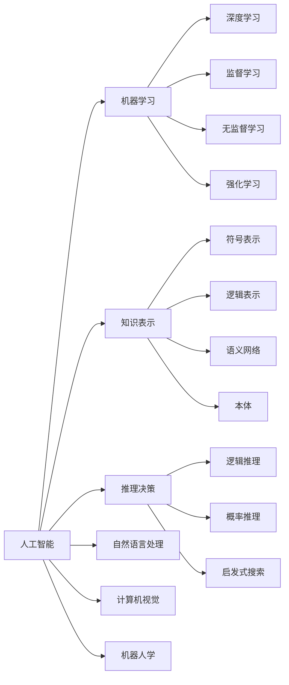

# AI系统设计原理与代码实战案例讲解

关键词：人工智能、系统设计、算法原理、数学模型、代码实战

## 1. 背景介绍
### 1.1 问题的由来
人工智能(Artificial Intelligence, AI)作为计算机科学的一个分支,旨在研究如何让计算机模拟甚至超越人类的智能。近年来,随着计算机硬件性能的飞速提升和海量数据的积累,AI技术取得了突破性进展,在图像识别、自然语言处理、智能决策等领域展现出了强大的能力,受到学术界和工业界的高度关注。
### 1.2 研究现状
当前,AI系统设计与开发面临诸多挑战:1)算法模型复杂多样,针对不同应用场景需要选择合适的模型;2)海量数据给模型训练带来巨大开销;3)模型的可解释性有待提高;4)AI系统的鲁棒性和安全性亟需加强。这些问题的解决有赖于AI理论基础的突破和工程实践的积累。
### 1.3 研究意义 
系统阐述AI系统设计的核心原理,梳理前沿算法模型,剖析数学基础,结合代码实战案例,将有助于读者全面深入地理解AI技术内涵,掌握AI系统开发的基本方法,快速上手AI项目实践。本文有望成为AI初学者的启蒙读物和AI开发者的案头指南。
### 1.4 本文结构
本文将分为九个部分展开论述。第一部分介绍研究背景;第二部分阐释AI的核心概念;第三部分深入剖析经典算法原理;第四部分系统讲解相关数学基础;第五部分通过代码实例演示AI系统开发的关键环节;第六部分列举AI技术的典型应用场景;第七部分推荐相关学习资源;第八部分总结全文并展望AI未来;第九部分附录常见问题解答。

## 2. 核心概念与联系
人工智能的核心概念包括:
- 机器学习:让计算机从数据中自动学习知识的方法,是实现AI的主要途径。按学习范式可分为监督学习、无监督学习、强化学习等。
- 深度学习:基于深度神经网络的表征学习方法,能够从海量复杂数据中提取高层特征,是当前AI的热点研究方向。
- 知识表示:以计算机可理解的形式表示知识,为AI系统的推理决策提供支持。主要包括符号表示、逻辑表示、语义网络、本体等。  
- 推理决策:根据已有知识和观测数据,推导出新的结论或作出决策。常见方法有逻辑推理、概率推理、启发式搜索等。
- 自然语言处理:让计算机理解、生成和处理人类语言,实现人机交互。涉及句法分析、语义理解、机器翻译、对话系统等任务。
- 计算机视觉:让计算机理解和分析视觉信息,实现对图像和视频的识别、检测、分割等。
- 机器人学:研究机器人的感知、规划、控制和交互,实现机器人的自主行为。涉及计算机视觉、自然语言、运动规划等AI技术。

这些概念相互关联、相辅相成,构成了完整的AI技术体系。机器学习是AI的核心,为各类任务提供通用的求解框架。深度学习作为机器学习的新范式,极大地推动了AI的进步。知识表示、推理决策是AI的基础,使计算机具备类人的认知和思维能力。自然语言处理、计算机视觉、机器人学是AI的主要应用方向,体现了AI在感知、理解、交互等方面的能力。

## 3. 核心算法原理 & 具体操作步骤
### 3.1 算法原理概述
AI系统设计涉及多种机器学习算法,本节重点介绍监督学习、无监督学习、强化学习三大类别的代表性算法。

监督学习旨在学习从输入到输出的映射函数,需要使用标注数据进行训练。经典算法包括:
- K近邻(KNN):根据样本的特征空间距离进行分类。
- 决策树:通过递归地构建树形结构实现分类。
- 支持向量机(SVM):在特征空间中寻找最优分类超平面。
- 逻辑回归:对样本的后验概率进行建模。

无监督学习旨在发现数据内在的结构和关系,不需要标注信息。代表性算法有:
- K均值聚类:把样本划分为K个簇,每个簇内样本相似度高。  
- 主成分分析(PCA):通过正交变换把数据投影到低维空间。
- 奇异值分解(SVD):把矩阵分解为若干正交矩阵和对角阵的乘积。

强化学习旨在通过智能体与环境的交互学习最优策略。核心算法包括:
- 值函数方法:学习状态或状态-动作对的价值函数,如Q-learning。
- 策略梯度方法:直接学习最优策略的参数,如REINFORCE。
- 演员-评论家方法:结合值函数和策略梯度,互相促进,如DDPG。

### 3.2 算法步骤详解
以KNN算法为例,详细说明其工作原理和实现步骤。给定训练集 $D=\{(x_1,y_1),...,(x_N,y_N)\}$,其中 $x_i$ 为第 $i$ 个样本的特征向量, $y_i$ 为其对应的类别标签。KNN分类器的主要步骤如下:
1. 计算测试样本 $x$ 与每个训练样本 $x_i$ 的距离 $d(x,x_i)$,常用欧氏距离:
$$d(x,x_i)=\sqrt{\sum_{j=1}^p(x^{(j)}-x_i^{(j)})^2}$$
其中 $p$ 为特征维度, $x^{(j)}$ 表示 $x$ 的第 $j$ 维特征。
2. 选取与 $x$ 距离最近的 $K$ 个训练样本,记为 $N_K(x)$。 
3. 在 $N_K(x)$ 中应用多数表决规则决定 $x$ 的类别 $\hat{y}$:
$$\hat{y} = \arg\max_{c} \sum_{x_i\in N_K(x)} I(y_i=c)$$
其中 $c$ 遍历所有可能的类别, $I$ 为指示函数。

KNN的优点是思想简单、易于实现,缺点是计算开销大、容易受噪声干扰。针对高维数据,可采用KD树等数据结构加速最近邻搜索。此外,K值的选取对分类性能影响较大,需要根据具体任务调优。

### 3.3 算法优缺点
本小节总结比较不同类型算法的优缺点:
- 监督学习算法一般需要大量标注数据,训练时间较长,但可解释性强,适合有明确目标的任务。
- 无监督学习算法不需要标注数据,可自动发现数据模式,但结果不确定性大,主要用于数据预处理和特征提取。  
- 强化学习算法通过反复试错优化策略,不需要显式监督,但采样效率低,对奖励函数设计要求高。
- 深度学习在多个领域取得突破,能够端到端学习复杂特征,但需要海量数据和算力,且泛化能力有待提高。

### 3.4 算法应用领域
不同的机器学习算法在AI系统中有不同的应用场景:
- 分类算法如KNN、决策树多用于文本分类、垃圾邮件识别等任务。
- SVM在小样本学习、异常检测等方面表现出色。
- 聚类算法可用于客户划分、社交网络分析等。 
- PCA常用于数据降维和特征抽取。
- 强化学习在智能体控制、对话系统、推荐系统等领域大放异彩。

## 4. 数学模型和公式 & 详细讲解 & 举例说明
### 4.1 数学模型构建
以逻辑回归模型为例,说明如何使用数学语言描述机器学习问题。逻辑回归是二分类问题的常用模型,对样本的后验概率进行建模。令 $y\in\{0,1\}$ 表示类别标签, $x\in \mathbb{R}^p$ 为 $p$ 维特征向量,逻辑回归模型假设:

$$P(Y=1|x)=\frac{1}{1+e^{-(\beta_0+\beta_1x_1+...+\beta_px_p)}}=\frac{1}{1+e^{-\beta^Tx}}$$

其中 $\beta=(\beta_0,\beta_1,...,\beta_p)^T$ 为模型参数。可将上式简写为:

$$P(Y=1|x)=\frac{1}{1+e^{-\beta^Tx}}=\pi(x)$$

反之有:

$$P(Y=0|x)=1-\pi(x)=\frac{e^{-\beta^Tx}}{1+e^{-\beta^Tx}}$$

从而得到样本 $(x,y)$ 的似然函数:

$$P(Y=y|x)=\pi(x)^y(1-\pi(x))^{1-y}$$

对于 $N$ 个独立同分布的样本 $\{(x_1,y_1),...,(x_N,y_N)\}$,其对数似然函数为:

$$l(\beta)=\sum_{i=1}^N[y_i\log\pi(x_i)+(1-y_i)\log(1-\pi(x_i))]$$

最大化 $l(\beta)$ 即可得到 $\beta$ 的极大似然估计。

### 4.2 公式推导过程
对 $l(\beta)$ 求关于 $\beta$ 的一阶导数:

$$\begin{aligned}
\frac{\partial l}{\partial \beta_j} &= \sum_{i=1}^N \left[ y_i\frac{1}{\pi(x_i)}\frac{\partial \pi(x_i)}{\partial \beta_j} + (1-y_i)\frac{1}{1-\pi(x_i)} \left(-\frac{\partial \pi(x_i)}{\partial \beta_j}\right)\right] \\
&= \sum_{i=1}^N \left[ y_i\frac{e^{-\beta^Tx_i}}{1+e^{-\beta^Tx_i}}(-x_{ij}) + (1-y_i)\frac{1}{1+e^{-\beta^Tx_i}}x_{ij}\right] \\
&= \sum_{i=1}^N (y_i-\pi(x_i))x_{ij}
\end{aligned}$$

令导数等于0,得到 $\beta$ 的极大似然估计满足:

$$\sum_{i=1}^N (y_i-\pi(x_i))x_{ij}=0, \quad j=0,1,...,p$$

上式没有 $\beta$ 的解析解,需要通过数值优化方法求解,常用的有梯度下降法、牛顿法等。

### 4.3 案例分析与讲解
下面以一个简单的二维数据集为例,演示逻辑回归的建模过程。假设有10个样本,每个样本包含两个特征 $x_1$、$x_2$ 和一个二值标签 $y$,如下表所示:

| 样本编号 | $x_1$ | $x_2$ | $y$ |
|:------:|:------:|:------:|:------:|
| 1 | 1.1 | 2.0 | 0 |
| 2 | 1.8 | 1.6 | 0 |  
| 3 | 2.5 | 1.8 | 0 |
| 4 | 3.2 | 2.2 | 0 |
| 5 | 4.0 | 1.2 | 1 |
| 6 | 4.5 | 0.8 | 1 |
| 7 | 5.1 | 1.6 | 1 |
| 8 | 5.8 | 1.0 | 1 |
| 9 |