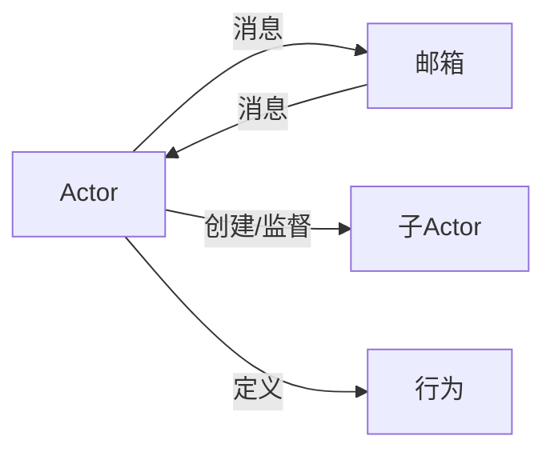

# Actor Model原理与代码实例讲解

## 1. 背景介绍
### 1.1 问题的由来
在当今高度互联和分布式的计算环境中,构建可扩展、高性能且容错的并发系统变得越来越具有挑战性。传统的多线程并发模型由于其固有的复杂性、竞态条件和死锁问题,使得开发人员难以编写正确且高效的并发程序。Actor Model作为一种解决方案应运而生,为构建大规模分布式系统提供了一种全新的编程范式。

### 1.2 研究现状
Actor Model最初由Carl Hewitt等人在1973年提出,经过多年的发展和完善,已成为构建高并发、分布式系统的重要模型之一。目前,Actor Model已被广泛应用于各种编程语言和框架中,如Erlang、Akka(Scala/Java)、Orleans(.NET)等。这些语言和框架提供了对Actor Model的原生支持,极大地简化了并发编程的复杂性。

### 1.3 研究意义 
深入研究Actor Model对于构建高质量的分布式系统具有重要意义:

1. 提高系统的可扩展性:Actor Model通过将应用程序划分为多个独立的Actor,每个Actor负责处理特定的任务,使得系统能够灵活地扩展和适应不断增长的需求。

2. 增强系统的容错能力:Actor之间通过消息传递进行通信,每个Actor都是独立且隔离的,即使某个Actor发生故障,也不会影响整个系统的运行,提高了系统的容错性。

3. 简化并发编程:Actor Model将并发编程的复杂性封装在Actor内部,开发人员只需关注Actor的行为和消息处理,无需显式地处理线程同步和通信,大大简化了并发编程的难度。

### 1.4 本文结构
本文将从以下几个方面对Actor Model进行深入探讨:

1. 介绍Actor Model的核心概念和基本原理。
2. 详细讲解Actor Model的工作机制和消息传递模式。
3. 通过数学模型和公式推导,阐明Actor Model的理论基础。 
4. 结合具体的代码实例,演示如何使用Actor Model构建并发应用程序。
5. 探讨Actor Model在实际应用场景中的优势和挑战。
6. 总结Actor Model的未来发展趋势和面临的机遇与挑战。

## 2. 核心概念与联系
在Actor Model中,有以下几个核心概念:

- Actor:是一个并发计算的基本单元,封装了状态和行为。每个Actor都有一个唯一的地址,用于接收和处理消息。Actor之间通过消息传递进行通信和协作。

- 消息:是Actor之间通信的基本单位。消息可以包含任意的数据结构,如简单的字符串、数字,或复杂的对象。Actor接收到消息后,根据消息的内容执行相应的操作。

- 邮箱:每个Actor都有一个关联的邮箱,用于缓存发送给该Actor的消息。邮箱按照先进先出(FIFO)的顺序存储消息,保证消息的有序处理。

- 行为:定义了Actor如何处理接收到的消息。当Actor接收到一个消息时,会根据当前的行为对消息进行处理,并可能改变自身的状态或向其他Actor发送新的消息。

- 监督:Actor Model引入了监督机制,用于管理和协调Actor之间的关系。监督者Actor负责创建、管理和监控其子Actor,并定义了子Actor的失败处理策略。

下面是Actor Model的核心概念之间的关系图:



## 3. 核心算法原理 & 具体操作步骤
### 3.1 算法原理概述
Actor Model的核心算法是基于消息传递的并发模型。每个Actor都是一个独立的计算单元,通过接收和处理消息来执行计算任务。Actor之间的通信是异步的,通过发送消息来实现。

### 3.2 算法步骤详解
1. 创建Actor:根据需要创建一个或多个Actor,每个Actor都有唯一的地址。

2. 发送消息:当一个Actor需要与另一个Actor通信时,它会向目标Actor发送一个消息。消息会被放入目标Actor的邮箱中。

3. 处理消息:Actor从邮箱中获取消息,并根据当前的行为对消息进行处理。处理消息可能涉及以下操作:
   - 改变Actor的内部状态
   - 向其他Actor发送新的消息
   - 创建新的子Actor
   - 改变Actor的行为

4. 响应结果:如果需要,Actor可以将处理结果发送回消息的发送者。

5. 重复步骤2-4:Actor不断地接收和处理消息,直到满足特定的终止条件。

### 3.3 算法优缺点
优点:
- 提供了一种简单且易于理解的并发编程模型。
- 通过消息传递实现Actor之间的解耦,提高了系统的可扩展性和容错性。
- 避免了共享状态和锁的使用,减少了并发编程的复杂性。

缺点:
- 消息传递的开销可能较大,特别是在大规模系统中。
- 调试和追踪Actor之间的消息流可能具有挑战性。
- 不适合所有类型的问题,特别是那些需要大量共享状态的问题。

### 3.4 算法应用领域
Actor Model适用于以下领域:

- 分布式系统:Actor Model天然适合构建分布式系统,每个Actor可以运行在不同的节点上,通过消息传递进行通信。

- 实时系统:Actor Model可以提供低延迟和高吞吐量,适用于实时系统,如游戏服务器、金融交易系统等。

- 并行计算:Actor Model可以将计算任务分解为多个Actor,通过并行执行提高系统的性能。

- 容错系统:Actor Model的监督机制和错误隔离特性,使得系统能够更好地应对故障和异常情况。

## 4. 数学模型和公式 & 详细讲解 & 举例说明
### 4.1 数学模型构建
我们可以使用一个简化的数学模型来描述Actor Model的行为。假设一个Actor系统由n个Actor组成,每个Actor可以看作一个状态机。

定义Actor i的状态为$s_i$,它的行为函数为$f_i$,邮箱中的消息序列为$m_i$。

那么,Actor i在接收到消息$m$后,其状态转移可以表示为:

$s_i' = f_i(s_i, m)$

其中,$s_i'$表示Actor i在处理消息$m$后的新状态。

### 4.2 公式推导过程
根据Actor Model的消息传递机制,我们可以将整个系统的状态转移表示为:

$S' = F(S, M)$

其中:
- $S$表示整个Actor系统的状态,是所有Actor状态的集合,即$S = {s_1, s_2, ..., s_n}$。
- $M$表示所有Actor邮箱中的消息序列,即$M = {m_1, m_2, ..., m_n}$。
- $F$表示系统的状态转移函数,它将每个Actor的行为函数$f_i$应用于相应的状态和消息。

### 4.3 案例分析与讲解
考虑一个简单的Actor系统,包含两个Actor:A和B。Actor A的初始状态为$s_A = 0$,Actor B的初始状态为$s_B = 0$。

Actor A的行为函数$f_A$定义如下:
- 如果接收到消息"increment",则将状态加1。
- 如果接收到消息"double",则将状态乘以2。

Actor B的行为函数$f_B$定义如下:
- 如果接收到消息"square",则将状态平方。

假设Actor A的邮箱中有消息序列$m_A = {"increment", "double"}$,Actor B的邮箱中有消息序列$m_B = {"square"}$。

根据状态转移公式,经过一轮消息处理后,Actor A的状态变为:
$s_A' = f_A(f_A(s_A, "increment"), "double") = (0 + 1) * 2 = 2$

Actor B的状态变为:
$s_B' = f_B(s_B, "square") = 0^2 = 0$

因此,经过一轮消息处理后,整个系统的状态变为$S' = {2, 0}$。

### 4.4 常见问题解答
1. Actor Model中的消息传递是同步还是异步的?
答:Actor Model中的消息传递是异步的。发送者将消息发送到目标Actor的邮箱中,无需等待消息被处理完成。这种异步通信方式提高了系统的并发性和性能。

2. Actor Model如何处理消息的顺序?
答:Actor Model保证每个Actor内部消息的处理顺序与其到达邮箱的顺序一致。但是,不同Actor之间的消息处理顺序是不确定的,取决于消息的到达时间和Actor的调度策略。

3. Actor Model中的错误处理机制是什么?
答:Actor Model通过监督机制来处理错误。每个Actor都可以有一个监督者Actor,负责管理和监控其子Actor的生命周期。当子Actor发生错误时,监督者Actor可以根据预定义的策略(如重启、停止等)来处理错误,从而提高系统的容错性。

## 5. 项目实践:代码实例和详细解释说明
### 5.1 开发环境搭建
本节将使用Akka框架和Scala语言来演示Actor Model的实际应用。首先,需要搭建开发环境:

1. 安装JDK(Java Development Kit)。
2. 安装Scala编程语言。
3. 安装SBT(Scala Build Tool)构建工具。
4. 创建一个SBT项目,并添加Akka依赖。

### 5.2 源代码详细实现
下面是一个简单的Actor系统的Scala代码实现:

```scala
import akka.actor.{Actor, ActorRef, ActorSystem, Props}

// 定义消息类型
case object Increment
case object Double
case object Square
case object GetResult

// 定义Actor A
class ActorA extends Actor {
  var state = 0

  override def receive: Receive = {
    case Increment => state += 1
    case Double    => state *= 2
    case GetResult => sender() ! state
  }
}

// 定义Actor B
class ActorB extends Actor {
  var state = 0

  override def receive: Receive = {
    case Square    => state = state * state
    case GetResult => sender() ! state
  }
}

// 创建Actor系统和Actor实例
val system = ActorSystem("ActorSystem")
val actorA = system.actorOf(Props[ActorA], "ActorA")
val actorB = system.actorOf(Props[ActorB], "ActorB")

// 发送消息
actorA ! Increment
actorA ! Double
actorB ! Square

// 获取结果
implicit val timeout = Timeout(5.seconds)
val futureResultA = (actorA ? GetResult).mapTo[Int]
val futureResultB = (actorB ? GetResult).mapTo[Int]

futureResultA.onComplete {
  case Success(result) => println(s"Actor A result: $result")
  case Failure(ex)     => println(s"Actor A failed: ${ex.getMessage}")
}

futureResultB.onComplete {
  case Success(result) => println(s"Actor B result: $result")
  case Failure(ex)     => println(s"Actor B failed: ${ex.getMessage}")
}
```

### 5.3 代码解读与分析
1. 定义消息类型:使用样例对象(case object)定义了四种消息类型:Increment、Double、Square和GetResult。

2. 定义Actor A:ActorA有一个整型状态state,初始值为0。它的receive方法定义了如何处理不同的消息:
   - 收到Increment消息时,将状态加1。
   - 收到Double消息时,将状态乘以2。
   - 收到GetResult消息时,将当前状态发送给消息的发送者。

3. 定义Actor B:ActorB也有一个整型状态state,初始值为0。它的receive方法定义了如何处理不同的消息:
   - 收到Square消息时,将状态平方。
   - 收到GetResult消息时,将当前状态发送给消息的发送者。

4. 创建Actor系统和Actor实例:使用ActorSystem创建了一个名为"ActorSystem"的Actor系统,并使用Props创建了ActorA和ActorB的实例。

5. 发送消息:使用!操作符向ActorA发送了Increment和Double消息,向ActorB发送了Square消息。

6. 获取结果:使用?操作符向ActorA和ActorB发送GetResult消息,并使用Future接收结果。通过onComplete回调函数处理结果或异常。