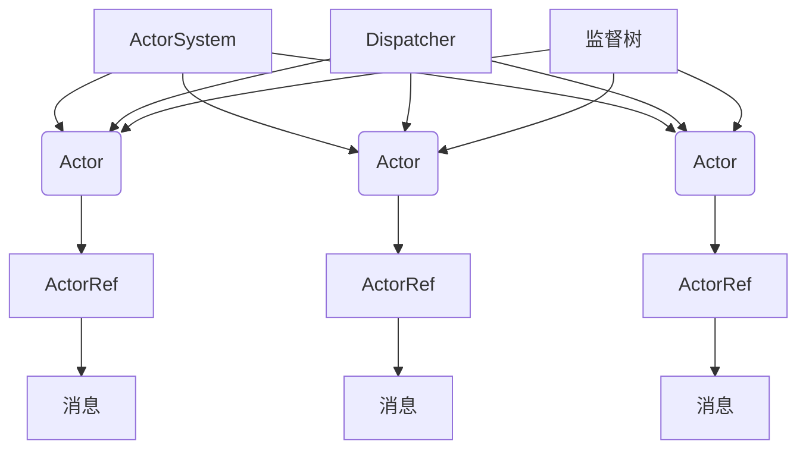
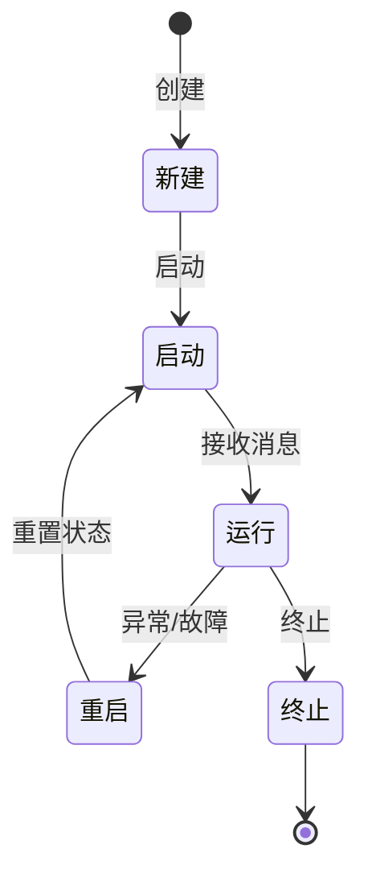
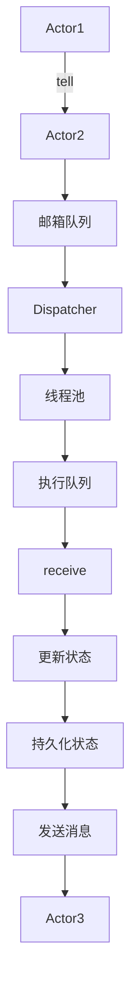
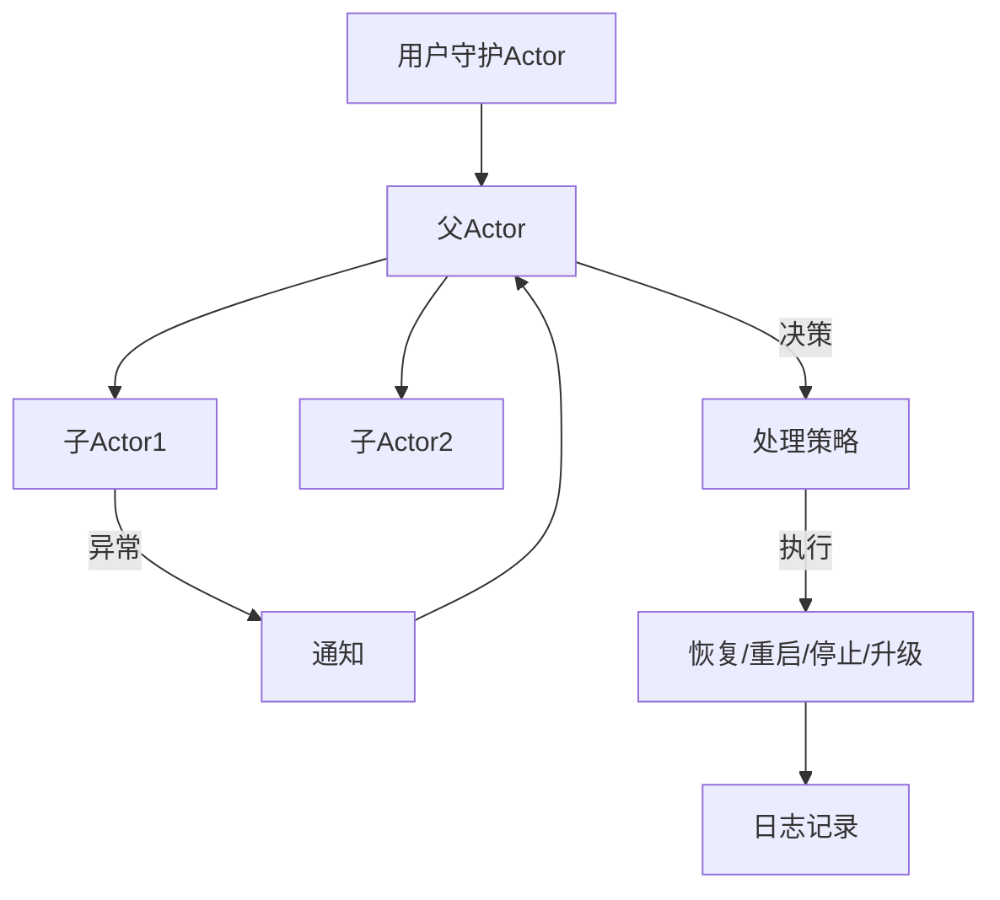

# Akka原理与代码实例讲解

## 1. 背景介绍

### 1.1 问题的由来

在现代分布式系统和高并发应用程序的开发中,传统的线程模型面临着诸多挑战。线程的创建、上下文切换和资源管理都需要大量的系统开销,而且线程之间也容易出现死锁、竞争条件等并发问题。同时,随着系统规模的扩大,传统线程模型在可伸缩性和容错性方面也存在局限性。

为了解决这些问题,Actor模型(Actor Model)应运而生。Actor模型是一种基于消息传递的并发计算模型,它将系统划分为多个独立的、轻量级的Actor实体,每个Actor都有自己的状态和行为,通过发送和接收消息来协调工作。Actor模型天生支持并发和分布式,同时也提供了较好的容错能力和可伸缩性。

### 1.2 研究现状

Actor模型最早由卡尔·休伊特(Carl Hewitt)等人在20世纪70年代提出,后来在Erlang语言中得到了成功应用。近年来,随着分布式系统和云计算的兴起,Actor模型受到了越来越多的关注和研究。目前,已经有多种编程语言和框架支持Actor模型,如Scala的Akka、Java的Quasar、C++的CAF(C++ Actor Framework)等。

其中,Akka是基于Scala语言构建的一个开源工具包,它提供了一个强大的Actor模型实现,并支持多种编程语言(Scala、Java和.NET)。Akka不仅支持本地Actor,还支持远程Actor和集群Actor,可以轻松构建分布式、高并发、高可用的应用程序。

### 1.3 研究意义

掌握Akka框架及其底层Actor模型原理,对于开发高性能、高可用的分布式系统和高并发应用程序具有重要意义。通过学习Akka,我们可以:

1. 理解Actor模型的设计思想和核心概念,掌握基于Actor的并发编程范式。
2. 学习Akka框架的使用方法,快速开发分布式、高并发、容错的应用程序。
3. 深入了解Akka的内部实现机制,包括Actor生命周期管理、消息路由、监督机制等。
4. 探索Actor模型在大规模分布式系统、微服务架构、物联网等领域的应用。

### 1.4 本文结构  

本文将全面介绍Akka框架及其底层Actor模型的原理和实践。主要内容包括:

1. Actor模型的核心概念和设计理念
2. Akka框架的架构和组件
3. Actor生命周期管理和消息处理机制
4. 监督机制和容错设计
5. 远程Actor和集群Actor
6. 基于Akka的实际应用案例和代码示例
7. Akka的最佳实践和常见问题解答

通过理论和实践相结合,读者可以全面掌握Akka及Actor模型,为开发高性能分布式系统奠定坚实基础。

## 2. 核心概念与联系

Actor模型是一种基于消息传递的并发计算模型,它将系统划分为多个独立的、轻量级的Actor实体。每个Actor都有自己的状态和行为,通过发送和接收消息来协调工作。Actor之间是完全隔离和无共享的,这种天然的无锁特性使得Actor模型能够很好地解决并发编程中的诸多问题。

在Akka框架中,Actor是一个非常重要的核心概念,整个框架的设计和实现都围绕着Actor模型展开。下面我们来介绍Akka中几个关键的核心概念:

1. **Actor**:Actor是Akka系统中的基本计算单元,它是一个具有状态的对象,可以响应消息、执行计算、改变状态、发送消息等。每个Actor都有一个唯一的地址,用于标识和通信。

2. **ActorSystem**:ActorSystem是Actor的运行时环境,它管理着Actor的生命周期,并为Actor提供调度、配置、日志记录等基础设施。一个ActorSystem可以托管多个Actor。

3. **ActorRef**:ActorRef是Actor的引用,通过ActorRef可以向Actor发送消息。ActorRef是轻量级的,可以在不同的进程或节点之间传递。

4. **消息**:Actor之间通过发送和接收消息进行通信,消息可以是任何类型的不可变对象。

5. **Dispatcher**:Dispatcher负责Actor消息的调度和执行,它决定了Actor如何处理接收到的消息。

6. **监督树**:Akka采用了一种层次化的监督结构,父Actor负责监督子Actor的行为,并决定在子Actor出现故障时如何处理。这种设计提高了系统的容错能力和弹性。

这些核心概念相互关联、相互作用,共同构建了Akka框架的基础架构。下面我们将详细介绍Akka的工作原理和实现细节。

## 3. 核心算法原理 & 具体操作步骤

### 3.1 算法原理概述

Akka的核心算法原理主要包括以下几个方面:

1. **Actor生命周期管理**:Akka中的Actor由ActorSystem进行创建和管理,每个Actor都有自己的生命周期,包括启动(Start)、运行(Run)和终止(Stop)等阶段。

2. **消息处理机制**:Actor通过发送和接收消息进行通信,消息由Dispatcher进行调度和执行。Akka采用了一种称为"事件驱动模型"(Event-Driven Model)的消息处理机制,Actor在接收到消息时会触发相应的行为。

3. **监督机制**:Akka采用了一种层次化的监督结构,父Actor负责监督子Actor的行为,并决定在子Actor出现故障时如何处理。这种设计提高了系统的容错能力和弹性。

4. **路由机制**:Akka提供了多种消息路由策略,如随机路由、轮询路由、广播路由等,用于在多个Actor之间分发消息,实现负载均衡和高可用性。

5. **远程通信**:Akka支持Actor之间的远程通信,可以在不同的进程或节点之间发送消息,实现分布式系统的构建。

6. **集群管理**:Akka提供了集群管理功能,可以自动发现和加入集群,实现Actor的动态伸缩和故障转移。

下面我们将详细介绍Akka的核心算法原理和具体操作步骤。

### 3.2 算法步骤详解

#### 3.2.1 Actor生命周期管理

Akka中的Actor由ActorSystem进行创建和管理,每个Actor都有自己的生命周期,包括以下几个阶段:

1. **创建(Construction)**:Actor通过ActorSystem的`actorOf`方法进行创建,此时Actor处于"新建"状态。

2. **启动(Start)**:Actor在创建后会自动进入"启动"阶段,此时Actor已经准备好接收消息了。

3. **运行(Run)**:Actor在运行期间会不断地接收消息并执行相应的行为,可以改变自身状态、发送消息等。

4. **重启(Restart)**:如果Actor出现了异常或故障,它可能会被重启。重启后,Actor会进入"启动"阶段,状态被重置。

5. **终止(Stop)**:Actor可以主动终止自身,也可能被其监督者终止。终止后,Actor将不再接收任何消息。

Actor的生命周期由ActorSystem进行管理,开发者可以通过实现Actor的回调方法(如`preStart`、`postStop`等)来定制Actor的行为。

#### 3.2.2 消息处理机制

Actor通过发送和接收消息进行通信,消息由Dispatcher进行调度和执行。Akka采用了一种称为"事件驱动模型"(Event-Driven Model)的消息处理机制,Actor在接收到消息时会触发相应的行为。

消息处理机制的具体步骤如下:

1. **发送消息**:Actor通过`tell`方法向另一个Actor发送消息,消息会被放入目标Actor的邮箱队列中。

2. **调度消息**:Dispatcher从Actor的邮箱队列中取出消息,并将其放入线程池的执行队列中。

3. **执行消息**:线程池中的工作线程从执行队列中取出消息,并执行Actor的`receive`方法,处理该消息。

4. **更新状态**:Actor在处理消息时可以更新自身状态,也可以发送新的消息给其他Actor。

5. **持久化状态(可选)**:Actor可以选择将状态持久化到外部存储(如数据库)中,以实现状态恢复。

Akka的消息处理机制采用了异步、非阻塞的设计,能够充分利用CPU资源,提高系统的吞吐量和响应能力。同时,Akka还提供了多种消息调度策略,如基于线程池的调度、基于事件流的调度等,可以根据应用场景进行选择和配置。

#### 3.2.3 监督机制

Akka采用了一种层次化的监督结构,父Actor负责监督子Actor的行为,并决定在子Actor出现故障时如何处理。这种设计提高了系统的容错能力和弹性。

监督机制的具体步骤如下:

1. **创建监督树**:在创建Actor时,需要指定其父Actor。这样就形成了一棵监督树,根节点是用户守护Actor(User Guardian Actor)。

2. **监控子Actor**:父Actor会持续监控子Actor的行为,如果子Actor出现异常或故障,父Actor会收到相应的通知。

3. **决策处理**:父Actor需要根据子Actor的故障类型和自身的监督策略,决定如何处理该故障。可选的处理策略包括:
   - 恢复(Resume):忽略该故障,让子Actor继续运行。
   - 重启(Restart):终止并重启子Actor,子Actor会进入"启动"阶段,状态被重置。
   - 停止(Stop):终止子Actor,不再重启。
   - 升级(Escalate):将故障升级到父Actor的父Actor,由更高层次的监督者处理。

4. **执行处理**:父Actor执行相应的处理策略,完成故障的处理。

5. **日志记录**:Akka会将监督事件和处理过程记录到日志中,方便问题排查和调试。

Akka的监督机制采用了"让它崩溃"(Let it Crash)的理念,即当Actor出现故障时,不应该试图修复它,而是让它崩溃,然后由监督者决定如何处理。这种设计简化了错误处理逻辑,提高了系统的健壮性和可维护性。

#### 3.2.4 路由机制

Akka提供了多种消息路由策略,用于在多个Actor之间分发消息,实现负载均衡和高可用性。常见的路由策略包括:

1. **随机路由(Random Router)**:将消息随机发送给路由组中的某个Actor。

2. **轮询路由(Round-Robin Router)**:按照循环顺序将消息发送给路由组中的Actor。

3. **广播路由(Broadcast Router)**:将消息发送给路由组中的所有Actor。

4. **散列路由(Consistent H