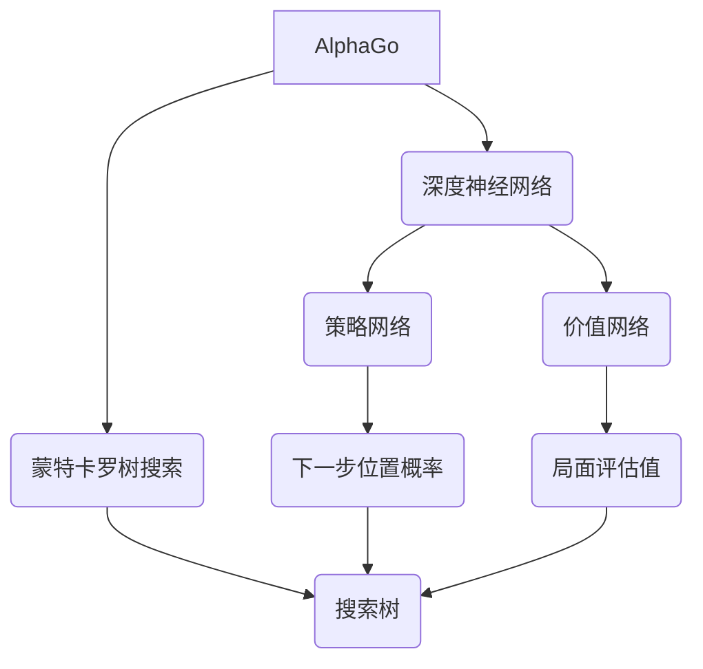

# AlphaGo原理与代码实例讲解

## 1. 背景介绍

### 1.1 问题的由来

人工智能在棋盘游戏领域的发展一直是一个具有挑战性的课题。国际象棋、西洋棋等游戏早已被计算机程序超越人类水平,但是圍棋(Go)却长期以来被认为是人工智能领域最为艰巨的挑战之一。

圍棋起源于中国,是一种需要长期战略布局和精密计算的抽象策略游戏。游戏在19×19的棋盘上进行,双方交替落子。虽然规则简单,但圍棋的可能性空间巨大,估计高达$10^{170}$,远超国际象棋等棋类游戏。这使得用蛮力搜索的方式来解决圍棋问题变得几乎不可能。

### 1.2 研究现状

长期以来,人工智能领域的专家们都在努力攻克圍棋这一"最后的堡垒"。早期的圍棋程序主要基于人工编写的规则和评估函数,性能有限。近年来,通过构建更大规模的神经网络,结合深度学习和强化学习等技术,圍棋程序的实力得到了极大提升。

2015年,人工智能公司DeepMind开发的AlphaGo程序在对弈人类职业圍棋高手李世乭时,以5:0的总比分获胜,这是人工智能首次在全盘游戏中击败人类顶尖高手,引发了全球关注。2016年,升级版的AlphaGo程序更是以3:0的比分战胜了世界冠军柯洁,彻底改写了人工智能在圍棋领域的历史。

### 1.3 研究意义

AlphaGo的出现不仅标志着人工智能在游戏领域取得了里程碑式的成就,更为重要的是,它所采用的技术和算法可以为人工智能在其他复杂问题领域的应用提供借鉴和启发。AlphaGo融合了深度神经网络、蒙特卡罗树搜索、强化学习等多种先进技术,在处理高维数据、长期规划、高效搜索等方面都有独到之处。

研究AlphaGo的原理和实现细节,有助于我们深入理解人工智能在复杂问题求解中所采用的策略和方法,为未来在其他领域的应用打下基础。同时,AlphaGo的出现也为人工智能发展注入了新的动力,吸引了更多的科研人员和资金投入,必将推动整个人工智能领域向前迈进。

### 1.4 本文结构

本文将全面介绍AlphaGo的核心原理和实现细节,内容安排如下:

- 第2部分阐述AlphaGo所涉及的核心概念,包括深度神经网络、蒙特卡罗树搜索、策略网络和价值网络等,并说明它们之间的关系。
- 第3部分重点讲解AlphaGo的核心算法原理和具体操作步骤,包括算法概述、步骤详解、优缺点分析和应用领域介绍。
- 第4部分深入探讨AlphaGo所采用的数学模型和公式,包括模型构建、公式推导、案例分析和常见问题解答。
- 第5部分提供AlphaGo的代码实例,包括开发环境搭建、源代码实现细节、代码解读分析和运行结果展示。
- 第6部分介绍AlphaGo在实际应用中的场景,并对未来的应用前景进行展望。
- 第7部分为读者推荐相关的学习资源、开发工具、论文资料和其他有价值的资源。
- 第8部分总结AlphaGo的研究成果,并对未来的发展趋势和面临的挑战进行前瞻性分析。
- 第9部分是附录,回答一些常见的问题。

通过对AlphaGo原理与实现的全面解析,希望能够帮助读者深入理解这一具有里程碑意义的人工智能系统,领会其中蕴含的思想和方法,为将来在其他领域的实践提供参考和借鉴。

## 2. 核心概念与联系

AlphaGo是一个集成了多种人工智能技术的复杂系统,其核心概念主要包括:

1. **深度神经网络(Deep Neural Networks)**:AlphaGo使用了两个深度卷积神经网络,分别担任策略网络和价值网络的角色。这些神经网络通过对大量的人类对局数据进行训练,学习圍棋知识。

2. **策略网络(Policy Network)**:策略网络的任务是预测在当前局面下,下一步的最佳落子位置及其概率分布。它的输出是一个概率向量,代表了每个合法位置的概率值。

3. **价值网络(Value Network)**:价值网络的任务是评估当前局面对于下一步执行方的胜率。它的输出是一个标量值,范围在[-1,1]之间,正值表示执行方胜率更高,负值表示执行方胜率更低。

4. **蒙特卡罗树搜索(Monte Carlo Tree Search)**:AlphaGo使用了增强版的蒙特卡罗树搜索算法,在策略网络和价值网络的指导下,高效地构建搜索树,探索可能的走子序列。

5. **搜索树(Search Tree)**:蒙特卡罗树搜索过程中,会不断地构建和扩展一棵搜索树。树的每个节点代表一种局面,边代表落子位置。通过这棵树,AlphaGo可以查看并评估大量的可能走子。

在AlphaGo的工作流程中,策略网络提供下一步的落子概率分布,作为蒙特卡罗树搜索的先验知识;价值网络对局面进行评估,为搜索树中的节点提供正负馀值评分;蒙特卡罗树搜索则在策略网络和价值网络的指导下,高效地探索可能的走子序列。

三者相互协作,发挥各自的优势:策略网络提供"直觉"判断,价值网络提供局面评估,而蒙特卡罗树搜索则在这些基础上通过lookahead的方式做出更精确的计算。通过这种方式,AlphaGo在保留了人类直觉和模式识别能力的同时,又具备了极强的计算能力和长期战略规划能力。

## 3. 核心算法原理与具体操作步骤

### 3.1 算法原理概述

AlphaGo的核心算法是一种增强版的蒙特卡罗树搜索(Monte Carlo Tree Search,MCTS)算法。传统的MCTS算法主要用于确定性的情况,而AlphaGo所面临的圍棋是一个信息完备但行为随机的对抗性游戏,因此需要对MCTS算法进行改进和增强。

AlphaGo的MCTS算法主要分为四个阶段:

1. **选择(Selection)**:从树根开始,递归地选择最有前景的子节点,直到遇到叶节点或者未探索的节点为止。
2. **扩展(Expansion)**:对遇到的未探索节点,利用神经网络输出对其进行评估和扩展。
3. **模拟(Simulation)**:从新扩展的节点开始,采用快速的随机模拟,直到产生终局状态。
4. **反向传播(Backpropagation)**:将模拟的结果反向传播到树中的所有祖先节点,更新节点的统计值。

在这个过程中,AlphaGo综合运用了策略网络和价值网络对每个节点进行评估:

- 策略网络$p(a|s)$为每个合法落子位置$a$给出了一个概率值,作为先验知识辅助选择最有前景的节点。
- 价值网络$v(s)$则对当前局面$s$给出了一个[-1,1]范围内的评估值,作为叶节点的评分基准。

通过大量的模拟和反向传播,搜索树不断得到扩展和更新,直至搜索资源(如时间和内存)耗尽。最终,AlphaGo会根据叶节点的访问统计值,选择概率最大的那个落子位置作为最终的走子。

AlphaGo的MCTS算法借助了深度神经网络的强大能力,极大地提高了圍棋程序的表现力。与传统的基于规则和评估函数的程序相比,AlphaGo更加"人性化",能够自主学习和总结人类大师的对局数据,获取高质量的知识库;同时,它又具备了超越人类的长期计算和规划能力。这种人机合璧的方式,正是AlphaGo取得巨大成功的关键所在。

### 3.2 算法步骤详解

下面将详细介绍AlphaGo增强版MCTS算法的具体执行步骤:

1. **初始化**

   - 根据当前局面状态$s_0$,创建根节点$v_0$。
   - 计算出根节点的先验概率向量$\boldsymbol{p}=p(a|s_0)$,即策略网络对于每个合法落子位置的概率分布。
   - 计算出根节点的评估值$v=v(s_0)$,即价值网络对当前局面的评估分数。

2. **选择(Selection)**

   - 从根节点$v_0$开始,递归地选择最有前景的子节点,按照下面的公式计算每个子节点$v$的分数$Q(v)$:

   $$Q(v) = Q(parentOf(v)) + U(v)$$

   其中,

   $$U(v) = c_\text{puct} \times \frac{P(v)}{1+N(v)} \times \sqrt{\sum_{v'} N(v')}$$

   - $Q(parentOf(v))$是父节点的评分值。
   - $P(v)$是该节点对应走子的先验概率,来自策略网络。
   - $N(v)$是该节点的访问次数。
   - $c_\text{puct}$是一个调节参数,控制探索和利用的平衡。

   上式中的第二项$U(v)$被称为UCB(Upper Confidence Bounds),它融合了节点的先验概率和访问统计,用于权衡探索(exploration)和利用(exploitation)。

   - 选择分数$Q(v)$最大的子节点,重复上述过程,直到遇到叶节点或未探索的节点为止。

3. **扩展(Expansion)**

   - 对于遇到的未探索节点$v_\text{leaf}$,通过策略网络和价值网络对其进行评估:
     - 计算先验概率向量$\boldsymbol{p}_\text{leaf} = p(a|s_\text{leaf})$
     - 计算评估值$v_\text{leaf} = v(s_\text{leaf})$
   - 将$\boldsymbol{p}_\text{leaf}$和$v_\text{leaf}$存储在$v_\text{leaf}$节点中。
   - 从$\boldsymbol{p}_\text{leaf}$中采样一个合法落子位置$a$。
   - 创建对应于$a$的新节点$v_\text{new}$,将其作为$v_\text{leaf}$的子节点添加到搜索树中。

4. **模拟(Simulation)**

   - 从新扩展的节点$v_\text{new}$开始,进行快速的随机模拟,产生一个终局状态。
   - 在模拟过程中,可以利用一个快速的轻量级策略网络来指导模拟。
   - 终局状态的结果可以是执行方获胜(+1分)、对手获胜(-1分)或平局(0分)。

5. **反向传播(Backpropagation)**

   - 将模拟的终局结果作为评分值$v_\text{terminal}$,反向传播到$v_\text{new}$及其所有祖先节点。
   - 对于每个遇到的节点$v$,更新以下统计值:
     - 总访问次数: $N(v) \leftarrow N(v) + 1$
     - 累积评分值: $W(v) \leftarrow W(v) + v_\text{terminal}$
     - 节点评分: $Q(v) = \frac{W(v)}{N(v)}$

6. **重复步骤2-5**,不断地扩展搜索树,直至