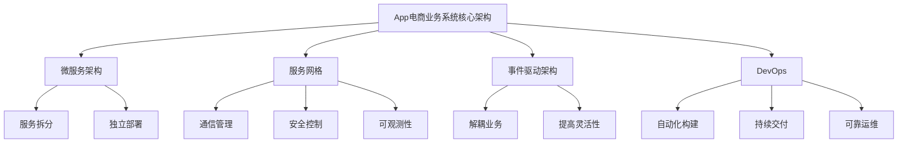
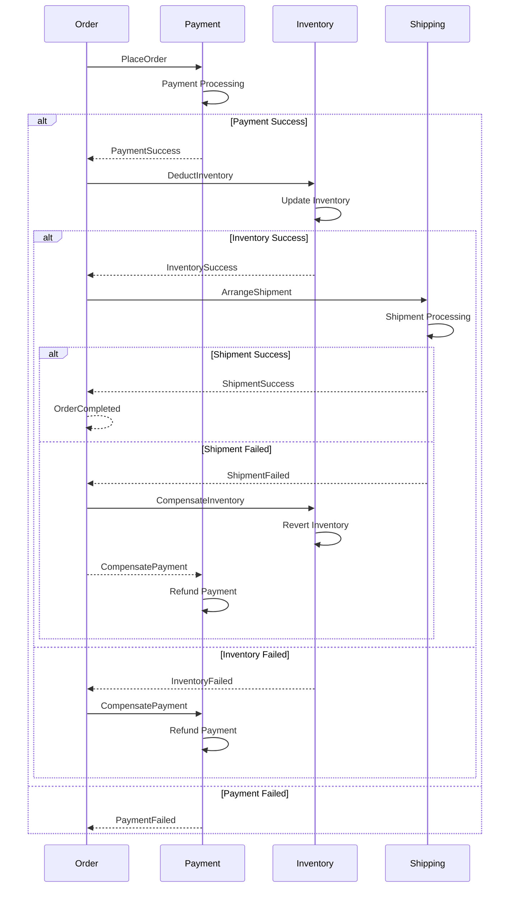

# App电商业务系统核心架构设计

## 1. 背景介绍

### 1.1 问题的由来

随着移动互联网和电子商务的飞速发展,App电商业务系统已经成为了当今主流的商业模式之一。传统的电商系统面临着诸多挑战,例如用户体验不佳、业务响应慢、系统扩展性差等,这些都严重影响了企业的经营效率和用户体验。因此,构建一个高效、可扩展、安全的App电商业务系统核心架构变得至关重要。

### 1.2 研究现状

目前,业界已经提出了多种App电商系统架构方案,例如:

- **单体架构**:将所有业务逻辑集中在一个进程中运行,简单但扩展性差。
- **垂直拆分架构**:根据业务领域进行拆分,形成多个相对独立的系统,提高了并行扩展能力。
- **微服务架构**:将系统拆分为一系列小服务,每个服务独立部署运行,具有良好的扩展性和灵活性。

然而,这些架构方案或多或少都存在一些缺陷,如系统复杂度高、服务治理难度大、数据一致性问题等,因此需要结合实际业务场景进行优化和创新。

### 1.3 研究意义

构建一个高效、可靠、安全的App电商业务系统核心架构,对于企业来说意义重大:

- 提升系统的响应速度和吞吐量,为用户提供流畅的购物体验。
- 实现业务快速迭代和系统平滑扩展,支撑业务的可持续发展。
- 降低系统维护成本,提高开发效率,缩短产品上线周期。
- 保障系统的安全性和数据的一致性,维护企业和用户利益。

### 1.4 本文结构

本文将围绕App电商业务系统的核心架构设计展开讨论,内容包括:

- 核心概念与联系
- 核心算法原理与具体操作步骤
- 数学模型和公式详细讲解与案例分析  
- 项目实践:代码实例和详细解释说明
- 实际应用场景分析
- 工具和资源推荐
- 总结:未来发展趋势与挑战
- 附录:常见问题与解答

## 2. 核心概念与联系

在设计App电商业务系统核心架构时,需要理解和掌握以下几个核心概念及其内在联系:

### 2.1 微服务架构

微服务架构是一种将单一应用程序划分为多个小型服务的架构模式,每个服务运行在自己的进程中,服务之间通过轻量级机制(如HTTP API)进行通信。微服务架构的优点包括:

- 每个服务可独立部署、扩展和维护
- 不同服务可使用不同的编程语言和技术栈
- 提高了系统的可靠性和容错能力

然而,微服务架构也带来了一些挑战,如服务发现、负载均衡、熔断、链路追踪等,需要引入相应的解决方案。

### 2.2 服务网格

服务网格(Service Mesh)是一个专门用于处理服务间通信的基础设施层,它位于服务实例之间,负责可靠地在服务实例之间传递请求。服务网格通常包括以下功能:

- 负载均衡
- 服务发现
- 流量控制
- 链路追踪
- 安全控制
- 故障恢复

引入服务网格可以显著降低应用程序的复杂性,开发人员可以专注于业务逻辑的开发,而将通信相关的复杂性交给服务网格处理。

### 2.3 事件驱动架构

事件驱动架构(Event-Driven Architecture,EDA)是一种软件架构模式,其中事件作为系统组件之间传递信息的媒介。当发生特定事件时,会触发相关的事件处理程序执行相应的操作。

在App电商系统中,事件驱动架构可以用于解耦各个业务模块,提高系统的可扩展性和灵活性。例如,当用户下单时,可以触发一个"订单创建"事件,该事件将被多个订阅者(如支付模块、物流模块等)监听并执行相应的操作。

### 2.4 DevOps

DevOps是一种文化理念、运动和一组过程实践,旨在通过自动化软件交付和基础设施变更过程来缩短软件开发生命周期。DevOps的核心思想是打破开发(Dev)和运维(Ops)之间的壁垒,实现两者的紧密协作。

在App电商系统的构建过程中,DevOps实践可以提高交付效率、缩短上线周期、提升系统可靠性。例如,通过持续集成(CI)和持续交付(CD)实现自动化构建、测试和部署。

### 2.5 关系与联系

上述核心概念之间存在着密切的关系和联系:

- 微服务架构为App电商系统提供了基础框架,将复杂的业务拆分为多个独立的服务。
- 服务网格为微服务架构提供了通信、安全、可观测等基础设施支持。
- 事件驱动架构进一步解耦了微服务之间的依赖关系,提高了系统的灵活性和扩展性。
- DevOps实践则贯穿了整个系统的构建、测试、部署和运维过程,确保高效、可靠的交付。

这些概念和实践的有机结合,构成了App电商业务系统核心架构的基础。



## 3. 核心算法原理与具体操作步骤

在App电商业务系统核心架构中,有几个关键算法和原理需要重点关注,包括负载均衡算法、一致性哈希算法、分布式事务处理等。

### 3.1 算法原理概述

#### 3.1.1 负载均衡算法

负载均衡是一种计算机网络技术,用于在多个计算机(计算机集群)、网络连接、CPU、磁盘驱动器或其他资源中分配负载,以优化资源使用、最大化吞吐量、最小化响应时间,并避免过载的情况。常见的负载均衡算法包括:

- 轮询(Round Robin)
- 加权轮询(Weighted Round Robin)
- 最少连接(Least Connections)
- 源地址哈希(Source Hash)

#### 3.1.2 一致性哈希算法

一致性哈希算法(Consistent Hashing)是一种分布式哈希算法,常用于负载均衡和分布式缓存等场景。它的核心思想是将整个哈希值空间组织成一个虚拟的圆环,并将节点(服务器或缓存)均匀地映射到这个圆环上。当需要查找某个键值对应的节点时,只需计算键的哈希值,并在圆环上顺时针查找离该哈希值最近的节点即可。

一致性哈希算法具有以下优点:

- 加入或删除节点只会影响相邻的数据,整个系统的数据分布变化较小。
- 数据分布均匀,负载较为均衡。
- 具有较好的扩展性和容错能力。

#### 3.1.3 分布式事务处理

在分布式系统中,事务处理是一个极具挑战的问题。由于数据分散在多个节点上,单个节点无法对整个事务进行原子性控制。常见的分布式事务处理方案包括:

- 两阶段提交协议(2PC)
- 三阶段提交协议(3PC)
- 基于消息队列的最终一致性方案
- 基于saga模式的长运行事务处理

### 3.2 算法步骤详解

#### 3.2.1 负载均衡算法

以加权轮询(Weighted Round Robin)算法为例,其具体步骤如下:

1. 为每个服务器节点分配一个权重值,权重值越高,被选中的概率越大。
2. 构建一个权重数组,每个节点在数组中按照权重值重复出现相应次数。
3. 使用一个游标(cursor)指向权重数组的第一个元素。
4. 每次选择服务器时,返回游标指向的元素对应的服务器节点。
5. 游标向后移动一个位置,如果到达数组末尾,则循环回到数组开头。

```
// 示例权重数组
weights = [5, 1, 1]
// 对应的服务器节点
nodes = ["node1", "node2", "node3"]
// 构建权重数组
weighted_array = ["node1", "node1", "node1", "node1", "node1", "node2", "node3"]
// 初始游标位置
cursor = 0

// 选择服务器节点
def get_server():
    server = weighted_array[cursor]
    cursor = (cursor + 1) % len(weighted_array)
    return server
```

#### 3.2.2 一致性哈希算法

一致性哈希算法的具体步骤如下:

1. 定义一个哈希函数,用于计算节点和键的哈希值。
2. 为每个节点计算哈希值,并将其映射到一个环形空间(如0~2^32-1)上。
3. 对于每个键,计算其哈希值,并在环形空间上顺时针查找离该哈希值最近的节点。
4. 如果需要添加或删除节点,只需重新计算该节点的哈希值,并在环形空间上进行映射即可。

```python
import hashlib

# 定义哈希函数
def hash(key):
    return int(hashlib.sha1(key.encode()).hexdigest(), 16)

# 定义环形空间大小
RING_SIZE = 2 ** 32

# 节点映射
nodes = {}

# 添加节点
def add_node(node):
    node_hash = hash(node)
    nodes[node_hash] = node

# 删除节点
def remove_node(node):
    node_hash = hash(node)
    del nodes[node_hash]

# 查找键对应的节点
def get_node(key):
    key_hash = hash(key)
    node_hashes = sorted(nodes.keys())
    for node_hash in node_hashes:
        if node_hash >= key_hash:
            return nodes[node_hash]
    # 循环到开头
    return nodes[node_hashes[0]]
```

#### 3.2.3 分布式事务处理

以基于saga模式的长运行事务处理为例,其具体步骤如下:

1. 将业务流程拆分为多个本地事务(步骤)。
2. 按顺序执行每个本地事务,如果成功则继续执行下一步,否则执行补偿操作。
3. 补偿操作的目的是撤销已执行步骤的影响,使整个流程回滚到初始状态。
4. 每个本地事务都需要实现正向操作和补偿操作。
5. 使用事件驱动架构或消息队列来协调各个步骤的执行和补偿。



### 3.3 算法优缺点

#### 3.3.1 负载均衡算法

**优点**:

- 提高了系统的吞吐量和响应速度。
- 增强了系统的可靠性和容错能力。
- 实现了资源的合理利用和负载分担。

**