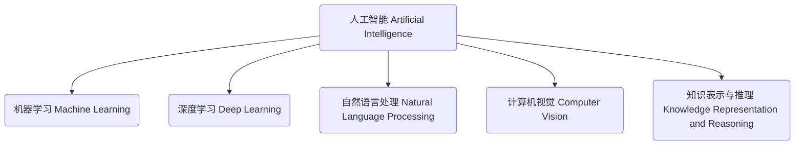

以下是根据您提供的要求和模板，撰写的技术博客文章正文部分：

# Artificial Intelligence (AI) 原理与代码实战案例讲解

## 1. 背景介绍

### 1.1 问题的由来

人工智能(Artificial Intelligence, AI)是当代科技发展的热点领域之一,它旨在使计算机系统能够模仿人类的认知功能,如学习、推理、规划、感知和语言交互等。随着大数据时代的到来,海量数据的出现为AI的发展提供了源源不断的燃料。与此同时,计算能力的飞速提升、算法的不断优化以及存储容量的持续扩大,为AI技术的实际应用奠定了坚实的基础。

### 1.2 研究现状  

近年来,AI技术在多个领域取得了长足进步,尤其是在计算机视觉、自然语言处理、决策系统等领域。以深度学习为代表的AI算法展现出了强大的数据处理能力,在图像识别、语音识别、机器翻译等任务中取得了超越人类的卓越表现。与此同时,强化学习等技术也在游戏领域和控制系统中得到了广泛应用。

### 1.3 研究意义

AI技术的发展将深刻影响未来社会的方方面面,包括交通、医疗、教育、制造业等众多领域。AI系统有望帮助人类提高生产效率、优化资源配置、提供个性化服务等,从而促进经济社会的可持续发展。同时,AI技术在解决一些复杂问题方面也具有巨大潜力,如疾病诊断、天气预报、金融风险评估等。因此,深入研究AI的原理和实践应用具有重要的理论意义和现实价值。

### 1.4 本文结构

本文将全面介绍AI的核心概念、算法原理、数学模型、代码实现以及实际应用场景。内容将由浅入深、理论联系实践,力求为读者提供系统的AI知识框架。文章最后还将对AI的发展趋势和面临的挑战进行展望和探讨。

## 2. 核心概念与联系

AI是一个庞大的概念,它包含了多个子领域和技术,如机器学习(Machine Learning)、深度学习(Deep Learning)、自然语言处理(Natural Language Processing)、计算机视觉(Computer Vision)、知识表示与推理(Knowledge Representation and Reasoning)等。这些技术相互关联、相辅相成,共同构成了AI的理论基础和技术支柱。

机器学习是AI的核心,它赋予了系统从数据中自主学习和获取经验的能力。深度学习则是机器学习的一个分支,它通过构建深层神经网络模型来模拟人类大脑的信息处理过程,在图像、语音等领域展现出了卓越的性能。自然语言处理和计算机视觉则分别研究如何让计算机理解和生成自然语言、分析和识别图像或视频信息。而知识表示与推理则关注如何在计算机系统中表示和操作符号知识,以支持复杂的推理和决策过程。

## 3. 核心算法原理与具体操作步骤

### 3.1 算法原理概述

AI领域的核心算法主要包括以下几类:

1. **监督学习算法**: 利用带有标签的训练数据,学习出一个从输入到输出的映射函数,常用于分类和回归任务。典型算法有支持向量机、决策树、逻辑回归等。

2. **无监督学习算法**: 对未标注的数据进行聚类和降维,发现数据内在的模式和结构。常见算法有K-Means、主成分分析、关联规则挖掘等。

3. **深度学习算法**: 通过构建多层神经网络模型对数据建模,能自动从数据中学习出多级特征表示。包括卷积神经网络、递归神经网络、生成对抗网络等。

4. **强化学习算法**: 通过与环境的交互,不断试错并根据反馈调整策略,以获取最大化的长期回报。例如Q-Learning、策略梯度等。

5. **自然语言处理算法**: 用于处理和分析自然语言数据,如词向量表示、注意力机制、序列到序列模型等。

6. **计算机视觉算法**: 对图像和视频数据进行分析和理解,如目标检测、语义分割、视频跟踪等。

这些算法各具特色,针对不同的问题场景和数据特征,需要选择合适的算法模型和配置超参数。

### 3.2 算法步骤详解

以监督学习算法为例,一般分为以下几个步骤:

1. **数据预处理**:对原始数据进行清洗、标准化、特征工程等,将其转换为算法可以接受的格式。

2. **划分数据集**: 将预处理后的数据划分为训练集、验证集和测试集。

3. **选择模型**:根据问题特点和数据特征,选择合适的算法模型,如线性模型、决策树或神经网络等。

4. **模型训练**: 使用训练集对模型进行训练,通过优化算法如梯度下降法来不断调整模型参数,使模型在训练集上达到最优性能。

5. **模型验证**: 在验证集上评估模型的泛化性能,根据指标如准确率、精确率、召回率等进行模型选择和调参。

6. **模型测试**: 在隔离的测试集上对最终模型进行评估,获得最终的模型性能指标。

7. **模型部署**: 将训练好的模型集成到实际的应用系统中,并进行持续的模型优化和更新迭代。

以上步骤是一个通用的流程,具体的算法实现细节会因算法类型和应用场景的不同而有所差异。

### 3.3 算法优缺点

不同的AI算法都有其独特的优缺点,需要根据具体问题进行权衡选择:

1. **监督学习算法**:
    - 优点:模型可解释性较强,训练速度较快,对小规模数据表现良好。
    - 缺点:需要大量标注数据,存在数据偏差风险,难以学习复杂的非线性映射。

2. **无监督学习算法**:
    - 优点:无需人工标注,可自动发现数据内在模式,对未知数据具有很强的适用性。
    - 缺点:结果的可解释性较差,对噪声和异常值敏感,难以直接用于预测任务。

3. **深度学习算法**:
    - 优点:对非线性数据有强大的拟合能力,可自动学习数据的层次特征表示。
    - 缺点:需要大量数据和计算资源,模型可解释性较差,存在过拟合风险。

4. **强化学习算法**:
    - 优点:无需事先的训练数据,可通过试错不断优化决策策略。
    - 缺点:收敛性能不确定,训练过程计算量大,难以应用于高维连续空间。

5. **自然语言处理算法**:
    - 优点:能够高效处理自然语言数据,实现自动化的语义理解和生成。
    - 缺点:需要大量标注语料,对领域外的语言数据泛化能力较差。

6. **计算机视觉算法**:
    - 优点:能够对图像和视频数据进行智能分析和理解。
    - 缺点:对噪声和遮挡等情况较为敏感,需要大量的训练数据。

总的来说,没有放之四海而皆准的算法,需要根据具体问题的特点和数据特征,选择合适的算法模型。在实际应用中,也常常需要对多种算法进行组合和集成,以发挥算法的优势、弥补不足。

### 3.4 算法应用领域

AI算法在诸多领域得到了广泛应用,主要包括:

1. **计算机视觉**:图像分类、目标检测、语义分割、视频跟踪等。
2. **自然语言处理**:机器翻译、文本分类、情感分析、问答系统等。
3. **语音与音频处理**:语音识别、语音合成、音乐生成、噪声消除等。
4. **决策与规划**:智能决策系统、机器人路径规划、智能调度等。  
5. **金融**:金融风险评估、智能投资顾问、反欺诈检测等。
6. **医疗健康**:医学影像分析、智能辅助诊断、药物设计等。
7. **智能交通**:智能驾驶、交通流量预测与调度等。
8. **安全防御**:入侵检测、垃圾邮件过滤、视频监控等。
9. **游戏**:电子游戏AI、游戏策略优化等。
10. **推荐系统**:个性化推荐、内容推荐等。

总的来说,AI算法在任何涉及大量数据处理、模式识别、决策优化的领域都有广阔的应用前景。

## 4. 数学模型和公式详细讲解与举例说明

### 4.1 数学模型构建

AI算法通常需要将问题形式化为数学模型,才能对其进行分析和求解。以监督学习为例,其数学模型可表示为:

给定一个训练数据集 $\mathcal{D}=\{(x_i, y_i)\}_{i=1}^N$,其中 $x_i$ 为输入特征向量, $y_i$ 为对应的标签或目标值。我们希望学习一个模型 $f(x; \theta)$ 来拟合这个数据集,使得对于任意新的输入 $x$,模型预测 $\hat{y}=f(x; \theta)$ 都可以很好地近似真实的目标值 $y$。

模型 $f$ 的具体形式由算法类型决定,例如线性回归模型为 $f(x; \theta)=\theta^Tx$,逻辑回归模型为 $f(x; \theta)=\sigma(\theta^Tx)$。其中 $\theta$ 为需要学习的模型参数。

为了找到最优的模型参数 $\theta^*$,我们需要定义一个损失函数或目标函数 $J(\theta)$,用于衡量模型输出与真实值之间的差异:

$$J(\theta) = \frac{1}{N}\sum_{i=1}^N L(y_i, f(x_i; \theta))$$

其中 $L$ 为具体的损失函数,如均方误差损失、交叉熵损失等。模型训练的目标就是求解能够最小化损失函数的最优参数 $\theta^*$:

$$\theta^* = \arg\min_\theta J(\theta)$$

这是一个最优化问题,通常采用数值优化算法如梯度下降法等来迭代求解。

对于其他类型的算法,如聚类、降维等,也可以构建类似的数学模型,不过目标函数的具体形式会有所不同。

### 4.2 公式推导过程

以线性回归模型为例,我们来推导如何求解最优参数 $\theta^*$。

首先,我们定义线性回归模型为:

$$f(x; \theta) = \theta_0 + \theta_1x_1 + \theta_2x_2 + \cdots + \theta_dx_d = \theta^Tx$$

其中 $x=(1, x_1, x_2, \cdots, x_d)^T$ 为增广的特征向量。

我们采用均方误差损失函数:

$$J(\theta) = \frac{1}{2N}\sum_{i=1}^N(y_i - f(x_i; \theta))^2$$

目标是最小化损失函数:

$$\theta^* = \arg\min_\theta J(\theta)$$

对 $J(\theta)$ 关于 $\theta$ 求偏导数并令其等于0,可得:

$$\begin{aligned}
\frac{\partial J}{\partial \theta_j} &= -\frac{1}{N}\sum_{i=1}^N(y_i - \theta^Tx_i)x_{ij} = 0\\
\Rightarrow \sum_{i=1}^N(y_i - \theta^Tx_i)x_{ij} &= 0 \qquad (j=0,1,\cdots,d)
\end{aligned}$$

将上式用矩阵形式表示,可得:

$$X^T(y - X\theta)