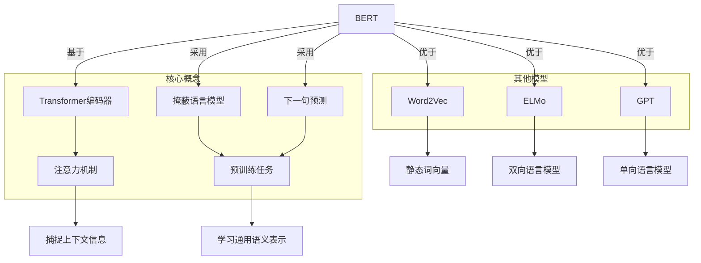
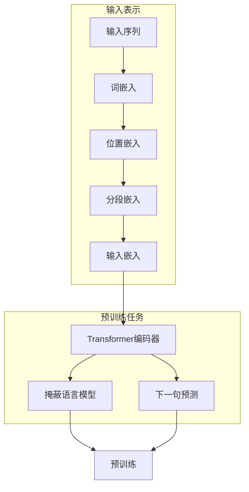

以下是标题为《BERT原理与代码实例讲解》的技术博客文章正文内容:

# BERT 原理与代码实例讲解

## 1. 背景介绍

### 1.1 问题的由来

在自然语言处理(NLP)领域,机器如何真正理解人类语言一直是一个巨大的挑战。传统的NLP模型通常采用单向语言模型或浅层神经网络结构,难以有效捕捉语义和上下文信息。随着深度学习技术的发展,Transformer等注意力机制模型在NLP任务中取得了突破性进展。2018年,谷歌的AI研究人员发表了BERT(Bidirectional Encoder Representations from Transformers)预训练模型,引起了学术界和工业界的广泛关注。

### 1.2 研究现状  

BERT是第一个在大规模语料库上进行双向预训练的NLP模型,能有效捕捉语句中词语的上下文信息。它基于Transformer编码器结构,通过掩蔽语言模型(Masked LM)和下一句预测(Next Sentence Prediction)两个预训练任务,学习通用的语义表示。BERT在多项NLP任务上取得了state-of-the-art的表现,如文本分类、问答系统、序列标注等,极大推动了NLP技术的发展。

### 1.3 研究意义

理解BERT的原理和实现细节,对于学习和应用先进的NLP模型至关重要。本文将深入探讨BERT的核心概念、算法原理、数学模型推导,并通过代码实例讲解其实现细节。读者可以全面掌握BERT模型的理论基础和实践技能,为未来开发更先进的NLP系统奠定坚实基础。

### 1.4 本文结构

本文首先介绍BERT的核心概念和与其他模型的联系,然后深入剖析BERT的算法原理和数学模型推导过程,配合案例分析进行详细讲解。接下来通过代码实例演示BERT的实现细节,并展示运行结果。最后探讨BERT在实际应用中的场景,分享学习和开发资源,总结模型的发展趋势和面临的挑战。

## 2. 核心概念与联系

BERT的核心概念包括:

1. **Transformer编码器**: BERT基于Transformer的编码器结构,通过多头注意力机制有效捕捉词语的上下文信息。

2. **掩蔽语言模型(Masked LM)**: BERT采用掩蔽语言模型作为预训练任务之一,通过预测被掩蔽词语,学习通用的语义表示。

3. **下一句预测(Next Sentence Prediction)**: BERT的另一个预训练任务是判断两个句子是否相邻,帮助模型捕捉句子间的关系。

与之前的Word2Vec、ELMo和GPT等模型相比,BERT具有以下优势:

- 相较Word2Vec的静态词向量,BERT学习的是动态的上下文化词向量表示。
- 相较ELMo的双向语言模型,BERT在更大规模语料上进行了预训练,表现更优。
- 相较GPT的单向语言模型,BERT能同时利用左右上下文信息。

BERT的创新之处在于首次将Transformer编码器应用于NLP预训练模型,并通过掩蔽语言模型和下一句预测两种预训练任务,学习通用的双向语义表示。

## 3. 核心算法原理与具体操作步骤

### 3.1 算法原理概述

BERT的核心算法原理可概括为两个主要部分:

1. **Transformer编码器**: BERT使用了Transformer的编码器结构,通过多头注意力机制捕捉输入序列中词语的上下文信息。

2. **双向预训练**: BERT在大规模语料库上进行了双向预训练,包括掩蔽语言模型(Masked LM)和下一句预测(Next Sentence Prediction)两个任务。

具体来说:

1. **输入表示**:将输入序列转换为词嵌入、位置嵌入和分段嵌入的综合表示。

2. **Transformer编码器**:输入嵌入序列经过多层Transformer编码器,每层包含多头注意力和前馈神经网络。

3. **掩蔽语言模型**:随机掩蔽输入序列中的部分词语,利用上下文预测被掩蔽词语。

4. **下一句预测**:判断两个输入序列是否为连续的句子,捕捉句子间的关系。

5. **双向预训练**:在大规模语料库上同时优化上述两个预训练任务的目标函数。

通过上述双向预训练,BERT能够学习到通用的上下文语义表示,为下游NLP任务提供强大的语义表示能力。

### 3.2 算法步骤详解

1. **输入处理**:
   - 将输入序列按WordPiece算法切分为词元(Token)序列。
   - 为每个词元添加相应的词嵌入向量。
   - 为每个词元添加位置嵌入,编码其在序列中的位置信息。
   - 为每个序列添加分段嵌入,区分属于句子A还是句子B。
   - 将词嵌入、位置嵌入和分段嵌入相加,作为最终的输入表示。

2. **Transformer编码器**:
   - 输入表示经过N层Transformer编码器,每层包含以下子层:
     - 多头注意力(Multi-Head Attention):允许每个词元关注其他相关词元,捕捉长距离依赖关系。
     - 前馈神经网络(Feed-Forward Network):对每个词元的表示进行非线性变换。
     - 残差连接(Residual Connection):将子层输出与输入相加,提高梯度传播效率。
     - 层归一化(Layer Normalization):加速模型收敛,提高训练稳定性。

3. **掩蔽语言模型**:
   - 在输入序列中随机选择15%的词元进行掩蔽,被掩蔽词元有80%概率用[MASK]替换,10%概率用随机词元替换,剩余10%保持不变。
   - 利用Transformer编码器的输出,对被掩蔽的词元进行预测,目标是预测正确的词元。

4. **下一句预测**:
   - 对于训练样本中的两个序列(句子A和句子B),有50%概率是连续的句子,50%概率是无关的句子。
   - 利用Transformer编码器的输出,通过二分类器判断两个序列是否为连续句子。

5. **双向预训练**:
   - 将掩蔽语言模型和下一句预测两个任务的损失函数相加,构成最终的预训练损失函数。
   - 在大规模语料库上最小化损失函数,通过梯度下降算法更新BERT模型参数。

通过上述双向预训练过程,BERT能够学习到通用的上下文语义表示,为后续的下游NLP任务提供强大的语义表示能力。

### 3.3 算法优缺点

**优点**:

1. **双向上下文表示**:BERT能够同时利用输入序列的左右上下文信息,捕捉更丰富的语义信息。
2. **大规模预训练**:在大规模语料库上进行预训练,学习到通用的语义表示,提高了迁移能力。
3. **注意力机制**:基于Transformer的多头注意力机制,能够捕捉长距离依赖关系。
4. **可微调**:BERT预训练模型可在下游任务上进行微调,快速适应新任务。

**缺点**:

1. **序列长度限制**:由于内存限制,BERT只能处理长度有限的序列(通常512个词元)。
2. **训练成本高昂**:BERT的预训练过程需要消耗大量计算资源,对硬件要求较高。
3. **缺乏序列级交互**:BERT无法直接对输入序列进行生成,主要用于编码和理解任务。

### 3.4 算法应用领域

BERT及其变体模型已被广泛应用于多个NLP任务和领域,包括但不限于:

1. **文本分类**: 新闻分类、情感分析、垃圾邮件检测等。
2. **序列标注**: 命名实体识别、关系抽取、事件检测等。
3. **问答系统**: 阅读理解、开放域问答等。
4. **文本生成**: 文本续写、对话系统、文本摘要等。
5. **机器翻译**: 利用BERT作为编码器,提高翻译质量。
6. **信息检索**: 语义匹配、相关性排序等。

此外,BERT模型也被应用于计算机视觉、音频处理等其他领域,展现出强大的迁移学习能力。

## 4. 数学模型和公式详细讲解与举例说明

### 4.1 数学模型构建

BERT的数学模型主要包括以下几个部分:

1. **输入表示**
2. **Transformer编码器**
3. **掩蔽语言模型**
4. **下一句预测**
5. **预训练损失函数**

我们将逐一介绍每个部分的数学模型。

**输入表示**:

对于给定的输入序列$X = (x_1, x_2, ..., x_n)$,我们首先将其映射为词嵌入矩阵$E_w$、位置嵌入矩阵$E_p$和分段嵌入矩阵$E_s$,然后将它们相加作为最终的输入表示$H^0$:

$$H^0 = E_w(X) + E_p(X) + E_s(X)$$

其中,$E_w(x_i) \in \mathbb{R}^{d_{model}}$表示第$i$个词元的词嵌入向量,$E_p(x_i) \in \mathbb{R}^{d_{model}}$表示第$i$个词元的位置嵌入向量,$E_s(x_i) \in \mathbb{R}^{d_{model}}$表示第$i$个词元的分段嵌入向量。$d_{model}$是模型的隐状态维度。

**Transformer编码器**:

输入表示$H^0$经过$N$层Transformer编码器,每层包含以下子层:

1. **多头注意力(Multi-Head Attention)**:

$$\begin{aligned}
&\text{MultiHead}(Q, K, V) = \text{Concat}(\text{head}_1, ..., \text{head}_h)W^O\\
&\text{where } \text{head}_i = \text{Attention}(QW_i^Q, KW_i^K, VW_i^V)
\end{aligned}$$

其中,$Q$、$K$、$V$分别表示查询(Query)、键(Key)和值(Value)矩阵。$W_i^Q \in \mathbb{R}^{d_{model} \times d_k}, W_i^K \in \mathbb{R}^{d_{model} \times d_k}, W_i^V \in \mathbb{R}^{d_{model} \times d_v}$是投影矩阵,$W^O \in \mathbb{R}^{hd_v \times d_{model}}$是输出线性变换矩阵。

2. **前馈神经网络(Feed-Forward Network)**:

$$\text{FFN}(x) = \max(0, xW_1 + b_1)W_2 + b_2$$

其中,$W_1 \in \mathbb{R}^{d_{model} \times d_{ff}}, W_2 \in \mathbb{R}^{d_{ff} \times d_{model}}$是线性