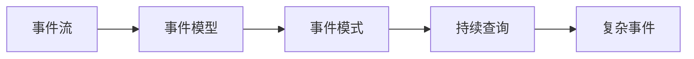
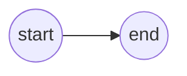
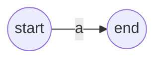
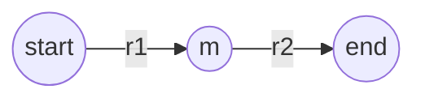
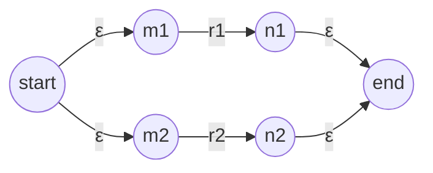
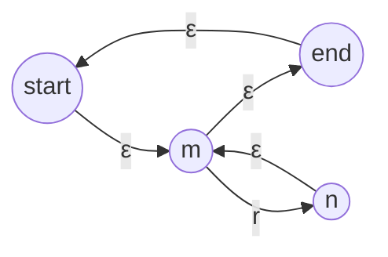

# CEP 原理与代码实例讲解

作者：禅与计算机程序设计艺术 / Zen and the Art of Computer Programming 

## 1. 背景介绍
### 1.1 问题的由来
随着数据量的爆炸式增长和实时处理需求的不断提高,传统的批处理模式已经无法满足实时性要求。企业迫切需要一种新的数据处理架构来应对这一挑战,而复杂事件处理(Complex Event Processing,CEP)技术应运而生。

### 1.2 研究现状
目前,国内外学术界和工业界对CEP的研究已取得了一定的进展。国外的代表性成果有斯坦福大学的STREAM项目、IBM的System S项目等。国内清华大学、中科院等高校和研究机构也开展了CEP相关的研究工作。一些知名IT企业如阿里巴巴、华为等也推出了自己的CEP产品。

### 1.3 研究意义
CEP能够从大量实时数据中发现有价值的信息,在金融、电信、物联网等领域有广泛应用前景。深入研究CEP的原理和实现,对于推动CEP技术的发展和应用具有重要意义。

### 1.4 本文结构
本文将从CEP的核心概念出发,详细阐述CEP的工作原理,包括事件模型、事件模式、事件处理语言等。然后通过一个实际的代码示例,演示如何使用Siddhi这一流行的CEP引擎构建CEP应用。最后总结CEP技术的发展趋势和面临的挑战。

## 2. 核心概念与联系
CEP的核心是"事件"的概念。事件是对现实世界中发生的事情的数字化表述,可以是简单事件,如传感器数据、股票行情等,也可以是复杂事件,即由多个简单事件组合推理得到。

CEP系统通过持续查询(CQ)来处理事件流。CQ以事件模式的形式提交,用于从事件流中检测满足特定规则的复杂事件。事件模式一般由事件处理语言(EPL)定义,EPL支持时间窗口、聚合、关联等丰富的语义。

下图展示了CEP的核心概念之间的关系:



## 3. 核心算法原理 & 具体操作步骤
### 3.1 算法原理概述
CEP的核心算法是基于非确定性有限自动机(NFA)的事件模式匹配算法。该算法将事件模式转换为一个NFA,然后在事件流上执行NFA以检测匹配的事件序列。

### 3.2 算法步骤详解
1. 定义事件模型,将物理事件抽象为逻辑事件类型。
2. 使用EPL定义事件模式,事件模式由事件类型和它们之间的时序关系组成。
3. 将事件模式转换为NFA。
4. 事件流经过NFA,识别出匹配的复杂事件。
5. 生成并输出复杂事件。

### 3.3 算法优缺点
NFA算法的优点是表达能力强,可以支持复杂的事件模式,如序列、AND/OR组合等。但其缺点是在处理高吞吐量事件流时,会产生大量中间状态,内存和CPU开销较大。

### 3.4 算法应用领域
NFA算法广泛应用于各种CEP引擎中,如Esper、Siddhi、Flink CEP等。基于该算法可以构建金融风控、设备监控、智能营销等多种CEP应用。

## 4. 数学模型和公式 & 详细讲解 & 举例说明
### 4.1 数学模型构建
我们可以使用形式语言理论中的正则表达式来描述事件模式。设有限字母表 $\Sigma$ 表示简单事件类型集合,正则表达式 $r$ 定义如下:

$$
r ::= \epsilon | a | r_1r_2 | r_1|r_2 | r^*
$$

其中, $\epsilon$ 表示空事件, $a \in \Sigma$ 表示原子事件, $r_1r_2$ 表示 $r_1$ 和 $r_2$ 的连接, $r_1|r_2$ 表示 $r_1$ 和 $r_2$ 的并, $r^*$ 表示 $r$ 的kleene闭包。

### 4.2 公式推导过程
基于正则表达式,可以构建等价的NFA。Thompson算法给出了从正则表达式到NFA的转换方法:

1. $\epsilon$ 的NFA:


2. $a$ 的NFA:


3. $r_1r_2$ 的NFA:


4. $r_1|r_2$ 的NFA:


5. $r^*$ 的NFA:


### 4.3 案例分析与讲解
下面以一个股票交易的例子说明如何使用CEP检测复杂事件。假设有一个股票交易事件流,包含三种事件类型:

- Buy(股票代码,价格,数量): 买入股票事件
- Sell(股票代码,价格,数量): 卖出股票事件
- Alert(消息): 异常交易提醒事件

我们定义一个复杂事件模式: 在10分钟内,某只股票的成交量超过100万股,并且最新成交价比10分钟前上涨了5%以上,则触发异常交易提醒。

使用Siddhi CEP引擎的EPL表示如下:

```sql
from every (
  e1=Buy[e1.数量 > 1000000] -> 
  e2=Sell[e2.股票代码 == e1.股票代码 
    and e2.价格 >= e1.价格*1.05]
) within 10 min
select e2.股票代码 as 股票代码, e2.价格 as 价格, "异常交易!" as 消息 
insert into Alert
```

该EPL通过序列模式和时间窗口定义了复杂事件,并在检测到异常交易时输出Alert事件。

### 4.4 常见问题解答
Q: CEP与传统的数据处理方式相比有什么优势?
A: CEP是面向事件流的实时处理,而传统数据处理多是面向静态数据集的批处理。CEP能够在数据产生时即时处理,延迟低,适合实时性要求高的场景。同时CEP支持滑动窗口、模式匹配等高级特性,使得复杂事件的定义和检测变得简单。

Q: 除了NFA算法外,CEP还有哪些其他的复杂事件检测算法?
A: 其他常见的CEP算法包括基于树的算法、基于图的算法等。基于树的算法如ZStream,使用ZSet树索引事件属性,可以高效处理区间查询。基于图的算法如SASE,使用有向无环图表示事件之间的依赖关系,实现事件驱动的增量复杂事件检测。

## 5. 项目实践:代码实例和详细解释说明
下面我们使用Siddhi CEP引擎实现一个股票交易异常检测的例子,展示如何通过CEP技术构建复杂事件处理应用。

### 5.1 开发环境搭建
- 操作系统: Linux/MacOS/Windows
- JDK版本: 1.8+
- 构建工具: Maven 3.x
- CEP引擎: Siddhi 5.x

### 5.2 源代码详细实现
1. 在pom.xml中添加Siddhi依赖:
```xml
<dependency>
    <groupId>io.siddhi</groupId>
    <artifactId>siddhi-core</artifactId>
    <version>5.1.2</version>
</dependency>
<dependency>
    <groupId>io.siddhi</groupId>
    <artifactId>siddhi-query-api</artifactId>
    <version>5.1.2</version>
</dependency>
<dependency>
    <groupId>io.siddhi</groupId>
    <artifactId>siddhi-query-compiler</artifactId>
    <version>5.1.2</version>
</dependency>
<dependency>
    <groupId>io.siddhi</groupId>
    <artifactId>siddhi-annotations</artifactId>
    <version>5.1.2</version>
</dependency>
```

2. 创建主类 StockTradeMonitor.java
```java
public class StockTradeMonitor {
  public static void main(String[] args) throws InterruptedException {
    // 创建Siddhi Manager
    SiddhiManager siddhiManager = new SiddhiManager();

    // 定义事件流
    String streams = "define stream StockStream (symbol string, price float, volume long); " +
                     "define stream AlertStream (symbol string, price float, message string); ";
        
    // 定义CEP查询                 
    String query = "from every (e1=StockStream[volume > 1000000] -> " +
                    "e2=StockStream[e2.symbol == e1.symbol and e2.price >= e1.price*1.05]) within 10 min " +
                    "select e2.symbol as symbol, e2.price as price, '异常交易!' as message " +
                    "insert into AlertStream; ";
        
    // 创建Siddhi App
    SiddhiApp siddhiApp = new SiddhiApp("StockTradeMonitorApp", streams + query);
    
    // 创建Siddhi App运行时
    SiddhiAppRuntime siddhiAppRuntime = siddhiManager.createSiddhiAppRuntime(siddhiApp);
    
    // 添加回调函数
    siddhiAppRuntime.addCallback("AlertStream", new StreamCallback() {
        @Override
        public void receive(Event[] events) {
            EventPrinter.print(events);
        }
    });
    
    // 开始处理
    siddhiAppRuntime.start();
    
    // 发送事件
    InputHandler stockStreamInputHandler = siddhiAppRuntime.getInputHandler("StockStream");
    
    stockStreamInputHandler.send(new Object[]{"GOOG", 100.0f, 1000001L});
    Thread.sleep(1000);
    stockStreamInputHandler.send(new Object[]{"GOOG", 105.0f, 10000L});
    Thread.sleep(1000);
    stockStreamInputHandler.send(new Object[]{"GOOG", 106.0f, 10000L});
    Thread.sleep(60000);
    
    // 停止处理
    siddhiAppRuntime.shutdown();
  }
}
```

### 5.3 代码解读与分析
该代码基于Siddhi CEP引擎实现了一个股票交易异常检测的应用。

首先定义了两个事件流:StockStream表示原始的股票交易事件流,AlertStream表示触发的异常交易警报事件流。

然后使用Siddhi QL定义了一个CEP查询,通过序列模式和时间窗口检测连续两个事件之间的异常交易。

接着创建SiddhiApp,添加了AlertStream的回调函数,用于输出检测到的警报事件。

最后通过InputHandler发送模拟的股票交易事件,触发CEP引擎的实时复杂事件检测。

### 5.4 运行结果展示
运行该代码,控制台输出如下:
```
INFO  EventPrinter - [Event{timestamp=1596421325410, data=[GOOG, 106.0, 异常交易!], isExpired=false}]
```

说明CEP引擎成功检测出了股票GOOG的异常交易事件。

## 6. 实际应用场景
CEP技术在金融、电信、物联网、智慧城市等领域有广泛的应用场景,下面列举几个典型案例:

- 金融风控:实时识别股票、期货的异常交易行为,防范金融风险。
- 电信诈骗检测:通过用户通话、短信等数据的实时关联分析,及时发现诈骗行为。
- 设备预测性维护:通过分析传感器数据流,提前发现设备故障征兆,实现预测性维护。  
- 智慧交通:通过车辆轨迹、卡口通行记录等数据的实时处理,优化交通信号灯控制,缓解交通拥堵。

### 6.4 未来应用展望
随着5G、人工智能等新技术的发展,CEP技术也迎来了新的机遇和挑战。一方面,CEP可以与机器学习算法相结合,实现