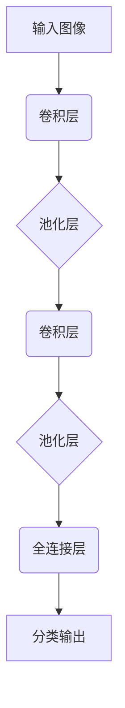

# CIFAR-10图像分类

## 1. 背景介绍

### 1.1 问题的由来

在当今数字时代,图像数据的产生和传播呈现出前所未有的规模和速度。从社交媒体平台上分享的照片,到卫星遥感图像,再到医疗影像诊断,图像数据无处不在。然而,海量的图像数据也带来了新的挑战——如何高效、准确地对图像进行分类和识别?这就催生了图像分类任务的兴起。

图像分类是计算机视觉领域的一个核心任务,旨在将给定的图像数据按照预定义的类别进行正确划分。它广泛应用于多个领域,如目标检测、场景理解、内容审查等。传统的图像分类方法主要依赖于手工设计的特征提取和分类器,但这种方法存在一些缺陷,例如特征设计的主观性、对变化的鲁棒性较差等。

### 1.2 研究现状  

近年来,随着深度学习技术的蓬勃发展,基于深度神经网络的图像分类方法取得了突破性的进展。卷积神经网络(Convolutional Neural Network, CNN)因其在图像数据上表现出色而备受关注。CNN能够自动从图像数据中学习到多层次的特征表示,并基于这些特征进行分类,从而克服了传统方法的不足。

目前,CNN在多个公开的图像分类基准数据集上取得了领先的性能,如ImageNet、CIFAR等。其中,CIFAR-10数据集因其中等的规模和合理的难度,成为了图像分类算法的重要评测数据集之一。

### 1.3 研究意义

CIFAR-10数据集由60,000张32x32的彩色图像组成,涵盖10个类别:飞机、汽车、鸟类、猫、鹿、狗、青蛙、马、船和卡车。尽管图像分辨率较低,但由于类内变化较大、类间差异较小,给分类算法带来了一定挑战。因此,在CIFAR-10上取得优异的分类性能,能够较好地验证算法的有效性和泛化能力。

本文将重点介绍如何使用CNN对CIFAR-10数据集进行图像分类。我们将详细阐述CNN在该任务中的应用原理、网络架构设计、训练技巧等,并给出相应的代码实现。通过这个案例,读者能够深入理解CNN在图像分类中的作用,掌握相关的理论知识和实践技能。

### 1.4 本文结构  

本文的结构安排如下:

- 第2部分介绍CNN在图像分类任务中的核心概念,包括卷积运算、池化层、全连接层等; 
- 第3部分详细阐述CNN在CIFAR-10分类中的算法原理和具体实现步骤;
- 第4部分对CNN模型的数学基础进行解析,包括损失函数、优化方法等;
- 第5部分给出基于PyTorch的代码实现,并对关键模块进行解释;
- 第6部分讨论CNN在其他领域的应用场景;
- 第7部分推荐相关的学习资源和开发工具;
- 第8部分总结CNN在图像分类中的发展趋势和面临的挑战;
- 第9部分列出常见的问题和解答。

## 2. 核心概念与联系

卷积神经网络(Convolutional Neural Network, CNN)是一种专门用于处理网格结构数据(如图像)的深度神经网络。CNN由多个卷积层和池化层交替组成,能够自动从数据中学习出多层次的特征表示,并通过全连接层对特征进行分类或回归。

CNN在图像分类任务中的工作原理如下所示:



上图描述了CNN的基本结构和数据流向。我们将在下面几节中详细介绍每个组件的作用和原理。

### 2.1 卷积层

卷积层是CNN的核心组件,它通过卷积运算在输入数据上学习特征。卷积运算的基本思想是,使用一个可学习的滤波器(也称为卷积核)在输入数据上滑动,对每个局部区域进行加权求和,得到该区域的特征响应。通过在整个输入数据上滑动卷积核,我们可以获得一个特征映射(feature map)。

卷积层的优点在于,它能够有效地捕获输入数据的局部模式,并保持数据的空间结构信息。此外,卷积核的参数在整个输入数据上共享,大大减少了模型的参数数量,从而提高了计算效率和防止过拟合。

### 2.2 池化层

池化层通常跟在卷积层之后,其作用是对卷积层输出的特征映射进行下采样,减小特征映射的维度。常用的池化操作包括最大池化(max pooling)和平均池化(average pooling)。

池化层的优点是:
1. 减小了特征映射的维度,降低了计算复杂度; 
2. 提高了模型的平移不变性,使得模型对输入的微小平移更加鲁棒;
3. 引入了一定的空间不变性,使模型能够捕获更广阔的视野。

### 2.3 全连接层

在CNN的最后几层,通常会使用全连接层对前面卷积层和池化层学习到的特征进行整合,并产生最终的分类或回归输出。全连接层的每个神经元与上一层的所有神经元相连,因此参数量较大。

全连接层的作用是将分布式的特征表示映射到样本的标记空间。在分类任务中,最后一个全连接层的输出维度等于类别数,并使用Softmax激活函数将输出转化为概率分布,从而得到每个类别的预测概率。

### 2.4 核心概念总结

CNN的核心思想是:
1. 使用卷积层自动学习输入数据的多层次特征表示; 
2. 通过池化层对特征进行下采样,提高模型的鲁棒性;
3. 使用全连接层将分布式特征映射到标记空间,产生最终的输出。

这种层次化的结构使得CNN能够在低层次捕获简单的视觉模式(如边缘、纹理等),而在高层次则能捕获更加抽象和复杂的模式,从而对输入数据形成端到端的建模。CNN在图像分类等计算机视觉任务中表现出色,是深度学习在该领域的杀手级应用。

## 3. 核心算法原理 & 具体操作步骤  

### 3.1 算法原理概述

CNN在CIFAR-10图像分类任务中的工作原理可概括为以下几个步骤:

1. **数据预处理**:将CIFAR-10数据集的图像进行适当的预处理,如数据增强、标准化等,以提高模型的泛化能力。

2. **网络架构设计**:设计CNN的网络架构,包括卷积层、池化层和全连接层的排列顺序、参数设置等。常用的网络架构有AlexNet、VGGNet、ResNet等。

3. **前向传播**:输入预处理后的图像数据,通过CNN网络的层层计算,得到最终的分类输出概率分布。

4. **损失计算**:将模型的预测输出与真实标记计算损失,常用的损失函数有交叉熵损失。

5. **反向传播**:基于损失,使用优化算法(如SGD、Adam等)计算每个参数的梯度,并更新网络参数。

6. **模型评估**:在验证集或测试集上评估模型的分类性能,如准确率、精确率、召回率等指标。

7. **模型微调**:根据评估结果,对网络架构、超参数、正则化策略等进行微调,以进一步提升模型性能。

上述步骤在训练过程中不断迭代,直至模型在验证集上的性能不再提升为止。最终得到的模型可在测试集上进行评估,并应用于实际的图像分类任务中。

### 3.2 算法步骤详解

我们将详细介绍CNN在CIFAR-10分类任务中的具体实现步骤。

#### 3.2.1 数据预处理

CIFAR-10数据集中的图像尺寸为32x32x3(高度x宽度x通道数),属于较低分辨率的彩色图像。为了提高模型的泛化能力,我们可以对数据进行一些预处理操作:

1. **数据增强**:通过一些随机变换(如翻转、裁剪、旋转等)对训练数据进行增强,以扩大数据集的多样性。
2. **标准化**:将图像像素值归一化到[0,1]或[-1,1]的范围内,以加速模型收敛。
3. **转换为张量**:将图像数据和标签转换为PyTorch张量,以便输入到模型中。

#### 3.2.2 网络架构设计

CNN的网络架构设计是一个重要的决策环节,它直接影响了模型的性能和计算效率。对于CIFAR-10这样的中等规模数据集,我们可以设计一个适中深度的CNN架构,例如:

```python
import torch.nn as nn

class CIFAR10CNN(nn.Module):
    def __init__(self):
        super(CIFAR10CNN, self).__init__()
        self.conv_layers = nn.Sequential(
            nn.Conv2d(3, 32, kernel_size=3, padding=1),
            nn.BatchNorm2d(32),
            nn.ReLU(),
            nn.Conv2d(32, 64, kernel_size=3, padding=1),
            nn.BatchNorm2d(64),
            nn.ReLU(),
            nn.MaxPool2d(2, 2),
            nn.Conv2d(64, 128, kernel_size=3, padding=1),
            nn.BatchNorm2d(128),
            nn.ReLU(),
            nn.Conv2d(128, 128, kernel_size=3, padding=1),
            nn.BatchNorm2d(128),
            nn.ReLU(),
            nn.MaxPool2d(2, 2),
        )
        self.fc_layers = nn.Sequential(
            nn.Linear(128 * 4 * 4, 512),
            nn.ReLU(),
            nn.Dropout(0.5),
            nn.Linear(512, 10)
        )

    def forward(self, x):
        x = self.conv_layers(x)
        x = x.view(x.size(0), -1)
        x = self.fc_layers(x)
        return x
```

上述架构包含以下主要组件:

- **卷积层块**:由4个卷积层组成,每两个卷积层之间使用批归一化(BatchNorm)和ReLU激活函数。第3和第4层之后使用最大池化层进行下采样。
- **全连接层块**:包含两个全连接层,中间使用ReLU激活函数和Dropout正则化。最后一层的输出维度为10,对应CIFAR-10的10个类别。

该架构的总参数量约为1.25M,深度适中、参数量可控,能够在CIFAR-10数据集上取得较好的性能。

#### 3.2.3 前向传播

定义好网络架构后,我们可以实现前向传播过程,将输入图像数据通过CNN获得分类输出。以上述CIFAR10CNN模型为例:

```python
def forward(self, x):
    x = self.conv_layers(x)  # 卷积层块
    x = x.view(x.size(0), -1)  # 展平特征
    x = self.fc_layers(x)  # 全连接层块
    return x
```

1. 输入图像`x`首先通过`conv_layers`块,经过一系列卷积、批归一化、激活和池化操作,提取出多尺度的特征映射。
2. 将特征映射展平为一维向量,作为全连接层的输入。
3. 经过`fc_layers`块的全连接层和激活函数的处理,得到最终的10维输出向量,对应10个类别的预测分数。

#### 3.2.4 损失计算和反向传播

在得到模型预测输出后,我们需要计算损失函数,并基于损失对网络参数进行反向传播更新。

对于CIFAR-10这种多分类任务,我们通常使用交叉熵损失函数:

```python
import torch.nn.functional as F

criterion = nn.CrossEntropyLoss()
outputs = model(images)  # 前向传播获取预测输出
loss = criterion(outputs, labels)  # 计算损失
```

`outputs`是模型的预测输出,`labels`是图像的真实标签。交叉熵损失函数会自动对`outputs`应用