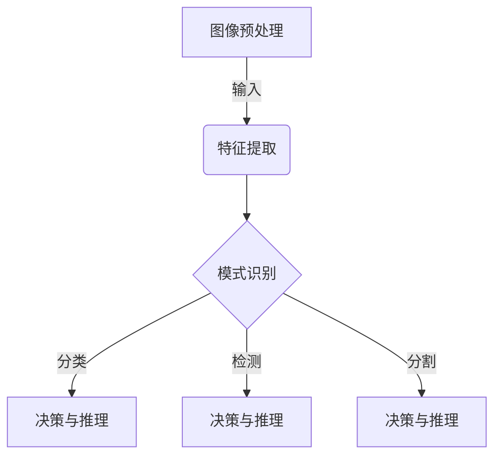
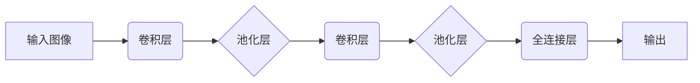

# Computer Vision原理与代码实例讲解

## 1. 背景介绍

### 1.1 问题的由来

计算机视觉(Computer Vision, CV)是人工智能领域的一个重要分支,旨在使计算机能够从数字图像或视频中获取有意义的高层次理解和推理。随着数字图像和视频数据的快速增长,计算机视觉技术在各个领域都有着广泛的应用前景,如安防监控、自动驾驶、机器人视觉、医疗影像分析等。

然而,让机器真正"看懂"图像并不是一件简单的事情。人类大脑对视觉信息的理解是一个复杂的过程,需要将低层次的像素信息转化为高层次的语义理解。而计算机系统则需要通过复杂的算法来模拟这一过程。

### 1.2 研究现状

早期的计算机视觉系统主要依赖于传统的机器学习算法,如支持向量机、决策树等,通过手工设计特征来对图像进行分类和识别。这些算法需要大量的领域知识和人工参与,且难以处理复杂的视觉任务。

近年来,随着深度学习技术的快速发展,基于深度神经网络的计算机视觉模型取得了突破性的进展。卷积神经网络(Convolutional Neural Network, CNN)、循环神经网络(Recurrent Neural Network, RNN)等模型能够自动从大量数据中学习特征表示,显著提高了计算机视觉系统的性能。

### 1.3 研究意义

计算机视觉技术的发展对于推动人工智能的进步具有重要意义。视觉是人类获取外界信息的主要途径之一,计算机视觉系统的性能直接影响着人工智能系统对真实世界的理解和决策能力。

此外,计算机视觉技术在诸多领域都有着广阔的应用前景,如自动驾驶、机器人视觉、医疗影像分析、安防监控等,对于提高生产效率、保障公共安全、促进医疗健康等方面具有重要价值。

### 1.4 本文结构

本文将全面介绍计算机视觉的核心原理和实践技术。首先阐述计算机视觉的基本概念和发展历程,然后重点讲解当前主流的基于深度学习的计算机视觉算法,包括卷积神经网络、目标检测、语义分割等。接下来详细讲解算法的数学原理和实现细节,并通过实际代码示例加深理解。最后探讨计算机视觉在实际应用中的场景,分析未来的发展趋势和面临的挑战。

## 2. 核心概念与联系

计算机视觉涉及多个核心概念,包括图像预处理、特征提取、模式识别、决策与推理等,这些概念相互关联,构成了完整的计算机视觉系统。

1. **图像预处理**:原始图像数据通常需要进行预处理,如去噪、增强对比度、几何变换等,以提高后续处理的效果。

2. **特征提取**:从预处理后的图像中提取出具有一定语义的特征表示,如边缘、角点、纹理等低层次特征,或者通过深度学习自动学习高层次的特征表示。

3. **模式识别**:根据提取的特征,对图像中的模式进行识别和理解,主要包括分类(classification)、检测(detection)和分割(segmentation)三大任务。

4. **决策与推理**:基于模式识别的结果,对场景进行高层次的理解和决策,如目标跟踪、行为分析、场景理解等。

这些核心概念紧密相连,共同构建了计算机视觉系统的基本框架。下面将详细介绍其中的关键技术和算法原理。

## 3. 核心算法原理 & 具体操作步骤

### 3.1 算法原理概述

当前主流的计算机视觉算法主要基于深度学习技术,尤其是卷积神经网络(Convolutional Neural Network, CNN)。CNN由多个卷积层和池化层组成,能够自动从图像数据中学习层次化的特征表示。

1. **卷积层**:通过滑动卷积核在图像上进行卷积操作,提取局部特征。卷积核的权重在训练过程中不断更新,以学习最优特征检测器。

2. **池化层**:对卷积层的输出进行下采样,减小特征图的分辨率,提高模型的鲁棒性和不变性。

3. **全连接层**:将前面层的特征图展平,并通过全连接层对特征进行高层次的组合和非线性变换,最终输出预测结果。

通过反向传播算法和梯度下降优化,CNN可以在大量标注数据上进行端到端的训练,自动学习最优的特征表示和分类器。

### 3.2 算法步骤详解

以图像分类任务为例,CNN的具体操作步骤如下:

1. **数据预处理**:将输入图像缩放到固定尺寸,并进行归一化,以满足网络输入要求。

2. **前向传播**:输入图像经过多个卷积层和池化层,提取出层次化的特征表示。

    - 卷积层:
        - 滑动卷积核在图像上进行卷积运算 $$(N \times C_\text{in} \times H \times W) \cdot (C_\text{out} \times C_\text{in} \times K \times K) \rightarrow (N \times C_\text{out} \times H' \times W')$$
        - 对卷积结果加上偏置,并通过激活函数(如ReLU)引入非线性
    - 池化层:
        - 常用最大池化或平均池化,降低特征分辨率,提高特征的平移不变性

3. **全连接层**:将最后一层卷积层的特征图展平,输入到全连接层,进行高层次的特征组合和分类。

4. **损失计算**:将全连接层的输出与真实标签计算损失(如交叉熵损失)。

5. **反向传播**:根据损失对网络参数(卷积核权重和偏置)计算梯度。

6. **参数更新**:使用优化算法(如SGD、Adam等)根据梯度更新网络参数。

7. **迭代训练**:重复3-6步骤,直至模型收敛或达到预期性能。

通过上述端到端的训练过程,CNN能够自动学习出最优的特征表示和分类器,实现准确的图像分类。

### 3.3 算法优缺点

CNN在计算机视觉任务上表现出色,但也存在一些优缺点:

**优点**:

1. **自动特征学习**:CNN能够自动从数据中学习出多层次的特征表示,而无需人工设计特征。

2. **平移不变性**:卷积操作和池化操作赋予了CNN一定的平移不变性,使其对目标位置的变化具有一定鲁棒性。

3. **参数共享**:卷积核在整个图像上共享参数,大大减少了网络参数量,提高了训练效率。

4. **可解释性**:CNN的低层卷积核往往能够学习出类似于边缘、纹理等人类可解释的低层特征。

**缺点**:

1. **需要大量数据**:CNN通常需要大量标注数据进行有效训练,否则容易出现过拟合。

2. **对旋转和缩放不够鲁棒**:CNN对目标的旋转和缩放变换不够鲁棒,需要进行数据增强等技术来提高不变性。

3. **计算复杂度高**:CNN的卷积操作和大量参数导致计算复杂度较高,对硬件要求较高。

4. **缺乏形状建模能力**:CNN主要关注局部特征,缺乏对目标整体形状的建模能力。

总的来说,CNN是一种强大的视觉特征学习模型,但也存在一些局限性,需要通过改进和结合其他技术来弥补不足。

### 3.4 算法应用领域

CNN在计算机视觉领域有着广泛的应用,主要包括以下几个方面:

1. **图像分类(Image Classification)**:根据图像内容对图像进行分类,如场景分类、物体分类等。

2. **目标检测(Object Detection)**:在图像中定位并识别出感兴趣的目标,如人脸检测、车辆检测等。

3. **语义分割(Semantic Segmentation)**:对图像中的每个像素进行分类,将图像分割成含义相同的多个区域。

4. **实例分割(Instance Segmentation)**:在语义分割的基础上,将属于同一个实例的像素区域分开。

5. **图像生成(Image Generation)**:利用生成对抗网络(GAN)等模型,生成逼真的图像数据。

6. **视频理解(Video Understanding)**:结合CNN和RNN等模型,对视频进行动作识别、目标跟踪等分析。

除了上述核心任务外,CNN还广泛应用于医疗影像分析、自动驾驶、机器人视觉等诸多领域,成为解决实际问题的有力工具。

## 4. 数学模型和公式 & 详细讲解 & 举例说明

### 4.1 数学模型构建

CNN的核心操作是卷积(Convolution)和池化(Pooling),下面将详细介绍它们的数学原理。

**卷积操作**

卷积操作的数学表达式为:

$$
(I * K)(i, j) = \sum_{m} \sum_{n} I(i+m, j+n) K(m, n)
$$

其中:
- $I$是输入特征图(Feature Map)
- $K$是卷积核(Kernel)
- $i, j$是输出特征图的像素坐标
- $m, n$是卷积核的坐标偏移

卷积操作实际上是在输入特征图上滑动卷积核,并在每个位置上计算加权和。通过学习卷积核的权重,可以提取出输入图像的不同特征。

**池化操作**

池化操作的目的是下采样特征图,降低分辨率,提高模型的不变性。常用的池化操作有最大池化(Max Pooling)和平均池化(Average Pooling)。

最大池化的数学表达式为:

$$
\text{pool}(i, j) = \max\limits_{(m, n) \in R} I(i+m, j+n)
$$

其中$R$是池化区域,通常为$2 \times 2$或$3 \times 3$的矩形区域。最大池化取该区域内的最大值作为输出。

平均池化的数学表达式为:

$$
\text{pool}(i, j) = \frac{1}{|R|} \sum_{(m, n) \in R} I(i+m, j+n)
$$

其中$|R|$表示池化区域的面积,平均池化取该区域内的平均值作为输出。

通过卷积和池化操作的交替使用,CNN能够逐层提取出更加抽象和高层次的特征表示。

### 4.2 公式推导过程

下面以卷积操作为例,推导其数学表达式。

设输入特征图为$I$,卷积核为$K$,输出特征图为$O$。我们希望在输出特征图的每个位置$(i, j)$上,计算输入特征图与卷积核的加权和。

首先,定义卷积核$K$的大小为$(k_h, k_w)$,其中$k_h$和$k_w$分别表示高度和宽度。则卷积核的元素可以表示为$K(m, n)$,其中$m \in [0, k_h-1]$, $n \in [0, k_w-1]$。

接下来,在输入特征图$I$上,从位置$(i, j)$开始,取一个与卷积核大小相同的区域,记为$I(i+m, j+n)$,其中$m \in [0, k_h-1]$, $n \in [0, k_w-1]$。

则输出特征图$O$在位置$(i, j)$处的值可以表示为:

$$
\begin{aligned}
O(i, j) &= \sum_{m=0}^{k_h-1} \sum