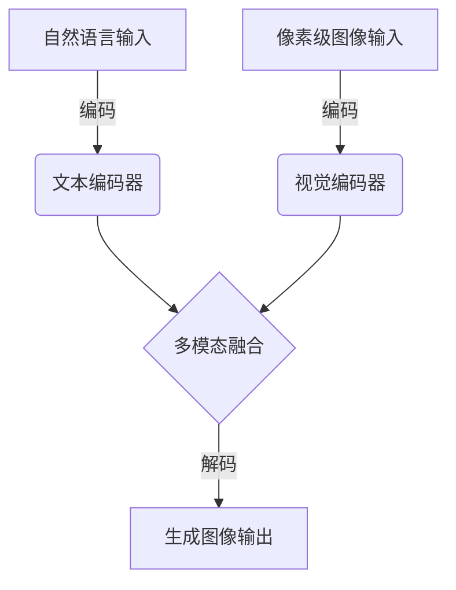
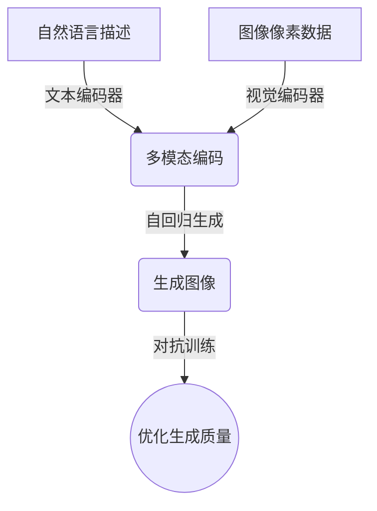

# DALL-E 2原理与代码实例讲解

## 1. 背景介绍

### 1.1 问题的由来

在过去几年中，生成式人工智能模型取得了令人瞩目的进展,尤其是在自然语言处理和计算机视觉领域。然而,大多数现有模型都专注于单一模态,要么生成文本,要么生成图像。而现实世界中,信息通常以多模态形式存在,例如图像和文本的组合。因此,开发能够理解和生成多模态数据的人工智能模型,成为了一个极具挑战性的研究课题。

### 1.2 研究现状 

为了解决这一问题,研究人员提出了多模态人工智能模型,试图让机器同时理解和生成图像、文本、语音等多种模态数据。其中,OpenAI公司开发的DALL-E 2模型是一款突破性的多模态生成模型,它能够根据自然语言描述生成相应的高质量图像,展现出令人惊叹的创造力和想象力。

### 1.3 研究意义

DALL-E 2的出现,标志着人工智能技术在多模态理解和生成方面取得了重大突破。这不仅有助于推动计算机视觉、自然语言处理等领域的发展,还可以为多种应用场景带来全新的体验,如设计、教育、娱乐等。因此,深入探究DALL-E 2的原理和实现方式,对于推动人工智能技术的进步具有重要意义。

### 1.4 本文结构

本文将全面介绍DALL-E 2的核心概念、算法原理、数学模型、代码实现和应用场景。首先,我们将探讨DALL-E 2的核心思想和与其他模型的关联。接下来,详细阐述其算法原理和数学模型,并通过案例分析加深理解。然后,我们将提供DALL-E 2的代码实现示例,并对关键部分进行解读和分析。最后,讨论DALL-E 2在实际应用中的潜力,以及未来的发展趋势和挑战。

## 2. 核心概念与联系

DALL-E 2是一种基于Transformer架构的大型语言模型,它能够同时处理文本和图像数据。与传统的单模态模型不同,DALL-E 2采用了一种新颖的多模态融合方法,将自然语言和像素级图像数据编码到同一个潜在空间中,从而实现了跨模态的理解和生成。

DALL-E 2的核心思想源自于自注意力机制和Transformer架构,这使得它能够有效地捕捉输入数据中的长程依赖关系。与此同时,DALL-E 2还借鉴了生成对抗网络(GAN)的思路,通过对抗训练来提高生成图像的质量和逼真度。

除了DALL-E 2之外,还有一些其他的多模态模型也取得了不错的成绩,如:

- **CLIP (Contrastive Language-Image Pre-training)**: 由OpenAI开发,能够学习自然语言和图像之间的对应关系,用于图像分类和检索等任务。
- **VilBERT**: 由谷歌开发,是一种基于Transformer的双流多模态模型,可以同时处理文本和图像输入。
- **ViLT (Vision-and-Language Transformer)**: 由微软开发,采用统一的Transformer架构对视觉和语言进行联合建模。

虽然这些模型在架构和应用场景上有所不同,但它们都体现了将自然语言和计算机视觉相结合的共同趋势,为多模态人工智能的发展奠定了坚实的基础。

## 3. 核心算法原理 & 具体操作步骤

### 3.1 算法原理概述

DALL-E 2的核心算法原理可以概括为以下三个关键步骤:

1. **多模态编码**: 将自然语言描述和图像像素数据分别编码为向量表示,并将它们融合到同一个潜在空间中。
2. **自回归生成**: 基于编码后的多模态表示,模型通过自回归(auto-regressive)方式逐步生成图像的像素值。
3. **对抗训练**: 通过生成对抗网络(GAN)的方式,提高生成图像的质量和逼真度。

### 3.2 算法步骤详解

1. **多模态编码**

   DALL-E 2使用了两个独立的编码器,分别对自然语言描述和图像像素数据进行编码。

   - 文本编码器: 采用了Transformer的编码器部分,将自然语言描述转换为向量表示。
   - 视觉编码器: 使用卷积神经网络(CNN)和Transformer编码器,将图像像素数据编码为向量表示。

   这两个编码器的输出向量被拼接在一起,形成一个多模态融合的表示,用于后续的图像生成过程。

2. **自回归生成**

   基于多模态融合的表示,DALL-E 2采用自回归(auto-regressive)的方式逐步生成图像的像素值。具体来说,模型会预测图像的第一个像素值,然后基于这个预测值和之前的输入,预测下一个像素值,如此循环,直到生成完整的图像。

   这个过程可以用数学公式表示为:

   $$p(x) = \prod_{t=1}^{T} p(x_t | x_{<t}, c)$$

   其中,$ x $表示生成的图像像素序列,$ c $表示多模态融合的条件向量(来自文本和图像编码器的输出),$ T $是序列长度。模型的目标是最大化生成图像像素序列$ x $的条件概率$ p(x|c) $。

3. **对抗训练**

   为了提高生成图像的质量和逼真度,DALL-E 2借鉴了生成对抗网络(GAN)的思路,引入了一个判别器(Discriminator)模块。判别器的作用是区分生成的图像和真实的图像,而生成器(Generator)则试图"欺骗"判别器,生成更加逼真的图像。

   生成器和判别器相互对抗、相互学习,最终达到一种动态平衡,从而提高生成图像的质量。这个过程可以用下面的公式表示:

   $$\min_G \max_D V(D, G) = \mathbb{E}_{x \sim p_{\text{data}}(x)}[\log D(x)] + \mathbb{E}_{z \sim p_z(z)}[\log(1 - D(G(z)))]$$

   其中,$ G $表示生成器,$ D $表示判别器,$ z $是生成器的输入噪声,目标是最小化生成器的损失函数,最大化判别器的损失函数。

### 3.3 算法优缺点

**优点**:

- 能够根据自然语言描述生成高质量、逼真的图像,展现出惊人的创造力和想象力。
- 通过多模态融合,实现了跨模态的理解和生成,突破了传统单模态模型的局限性。
- 算法原理清晰,具有很好的可解释性和可扩展性。
- 生成的图像质量高,细节丰富,能够捕捉输入描述的关键信息。

**缺点**:

- 训练过程复杂,需要大量的计算资源和高质量的数据集。
- 生成的图像可能存在一定的偏差或失真,与描述不完全匹配。
- 对于一些抽象或复杂的概念,生成效果可能不太理想。
- 存在一定的偏差风险,如生成具有潜在偏见或不当内容的图像。

### 3.4 算法应用领域

DALL-E 2的算法原理和生成能力,使其在多个领域具有广阔的应用前景:

1. **创意设计**: 设计师可以利用DALL-E 2根据文字描述快速生成图像素材,大大提高工作效率和创意表达能力。
2. **教育和科普**: 教师可以使用DALL-E 2生成直观的图像,帮助学生更好地理解抽象概念。
3. **辅助艺术创作**: 艺术家可以使用DALL-E 2生成灵感素材,激发创作灵感。
4. **视觉辅助**: 为视觉障碍人士提供基于文字描述的图像生成服务,帮助他们更好地理解周围环境。
5. **游戏和娱乐**: 在游戏、动画和虚拟现实等领域,DALL-E 2可以生成丰富的视觉内容,提升沉浸感和互动体验。
6. **科研探索**: 在计算机视觉、自然语言处理等领域,DALL-E 2可以用于生成数据集、可视化研究成果等。

总的来说,DALL-E 2的多模态生成能力为多个领域带来了新的可能性,有望推动人工智能技术的进一步发展和应用。

## 4. 数学模型和公式 & 详细讲解 & 举例说明

### 4.1 数学模型构建

DALL-E 2的数学模型基于Transformer架构,主要包括以下几个关键组件:

1. **文本编码器(Text Encoder)**

   文本编码器采用标准的Transformer编码器结构,将自然语言描述编码为向量表示。具体来说,给定一个长度为$ N $的文本序列$ X = (x_1, x_2, \dots, x_N) $,编码器通过自注意力机制捕捉单词之间的依赖关系,并产生对应的隐藏状态向量序列$ H = (h_1, h_2, \dots, h_N) $。

2. **视觉编码器(Visual Encoder)**

   视觉编码器由卷积神经网络(CNN)和Transformer编码器组成,用于编码图像像素数据。首先,CNN提取图像的低级视觉特征;然后,Transformer编码器捕捉这些特征之间的长程依赖关系,生成最终的视觉表示向量序列。

3. **多模态融合(Multimodal Fusion)**

   文本编码器和视觉编码器的输出向量被拼接在一起,形成一个多模态融合的表示向量序列$ Z = (z_1, z_2, \dots, z_M) $,其中$ M $是序列长度。这个融合表示将作为生成器的输入,用于图像生成。

4. **自回归生成器(Autoregressive Generator)**

   生成器采用自回归(auto-regressive)的方式,逐步生成图像的像素值。具体来说,给定之前生成的像素序列$ y_{<t} $和多模态融合表示$ Z $,生成器预测下一个像素值$ y_t $的条件概率分布:

   $$p(y_t | y_{<t}, Z) = \text{Generator}(y_{<t}, Z)$$

   通过最大化该条件概率分布,生成器可以逐步生成完整的图像像素序列$ Y = (y_1, y_2, \dots, y_T) $,其中$ T $是序列长度。

5. **对抗训练(Adversarial Training)**

   为了提高生成图像的质量和逼真度,DALL-E 2引入了一个判别器(Discriminator)模块,与生成器进行对抗训练。判别器的目标是区分真实图像和生成图像,而生成器则试图"欺骗"判别器,生成更加逼真的图像。

   这个对抗过程可以用下面的公式表示:

   $$\min_G \max_D V(D, G) = \mathbb{E}_{x \sim p_{\text{data}}(x)}[\log D(x)] + \mathbb{E}_{z \sim p_z(z)}[\log(1 - D(G(z)))]$$

   其中,$ G $表示生成器,$ D $表示判别器,$ z $是生成器的输入噪声(来自多模态融合表示$ Z $),目标是最小化生成器的损失函数,最大化判别器的损失函数。通过这种对抗训练,生成器和判别器相互学习,最终达到一种动态平衡,从而提高生成图像的质量和逼真度。

### 4.2 公式推导过程

在上一节中,我们介绍了DALL-E 2