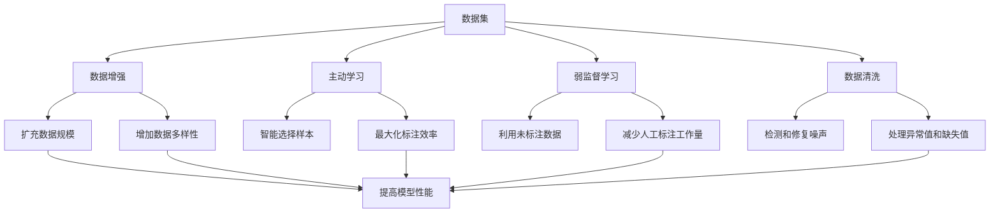

# Dataset 原理与代码实例讲解

## 1. 背景介绍

### 1.1 问题的由来

在当今的数据驱动时代，数据集(Dataset)扮演着至关重要的角色。无论是机器学习、深度学习还是其他数据科学领域,高质量的数据集都是实现卓越性能的关键因素。然而,构建高质量的数据集并非一蹴而就,它需要经过精心的设计、清洗、标注和优化等过程。

传统的数据采集方式通常是人工手动完成的,这种方式不仅耗时耗力,而且容易出现人为错误和偏差。随着数据量的不断增长,人工处理数据的效率和准确性已经无法满足现代数据科学的需求。因此,如何高效、准确地构建高质量数据集成为了一个亟待解决的问题。

### 1.2 研究现状

为了解决上述问题,研究人员提出了多种自动化构建数据集的方法,包括数据增强(Data Augmentation)、主动学习(Active Learning)、弱监督学习(Weak Supervision)等。这些方法旨在利用机器学习算法和人工智能技术,自动化数据采集、清洗、标注和优化等过程,从而大幅提高数据集构建的效率和质量。

目前,自动化构建数据集的研究主要集中在以下几个方面:

1. **数据增强技术**: 通过对现有数据进行变换(如旋转、缩放、翻转等)来生成新的数据样本,从而扩充数据集的规模和多样性。
2. **主动学习算法**: 通过智能地选择最有价值的数据样本进行人工标注,从而最大化标注效率和数据质量。
3. **弱监督学习方法**: 利用大量未标注数据和少量标注数据,通过迭代学习的方式自动标注数据,从而减少人工标注的工作量。
4. **数据清洗和优化技术**: 通过机器学习算法自动检测和修复数据中的噪声、异常值和缺失值,提高数据质量。

虽然上述方法取得了一定的进展,但是自动化构建高质量数据集仍然面临着诸多挑战,如数据偏差、噪声处理、标注一致性等问题。因此,需要进一步深入研究和创新,以满足不断增长的数据需求。

### 1.3 研究意义

自动化构建高质量数据集对于推动数据科学的发展具有重要意义:

1. **提高数据科学应用的性能**: 高质量的数据集可以为机器学习算法提供更好的训练基础,从而提高模型的准确性和泛化能力,推动数据科学应用的性能提升。
2. **降低数据采集和处理成本**: 自动化构建数据集可以大幅减少人工劳动,降低数据采集和处理的成本,使更多的企业和组织能够获取所需的高质量数据。
3. **促进数据科学的民主化**: 随着自动化构建数据集技术的发展,数据科学将不再是少数专家的专利,更多的人都可以参与到数据科学的实践中来。
4. **推动新兴应用领域的发展**: 自动化构建数据集技术可以为新兴的应用领域(如自动驾驶、医疗影像等)提供所需的高质量数据支持,从而推动这些领域的快速发展。

综上所述,自动化构建高质量数据集不仅是数据科学发展的必由之路,也是推动人工智能技术落地应用的关键一环。深入研究和创新这一领域,对于提高数据科学的效率和质量、降低成本、促进民主化以及推动新兴应用领域的发展都具有重要意义。

### 1.4 本文结构

本文将全面介绍自动化构建数据集的原理和实践。文章首先阐述了自动化构建数据集的背景和意义,然后详细讲解了数据增强、主动学习、弱监督学习和数据清洗优化等核心技术的原理和算法。接下来,通过代码实例和案例分析,展示了如何在实际项目中应用这些技术构建高质量数据集。最后,本文总结了该领域的发展趋势和面临的挑战,并对未来的研究方向进行了展望。

通过本文的学习,读者将全面掌握自动化构建数据集的理论基础和实践技能,为数据科学的发展做出自己的贡献。

## 2. 核心概念与联系

在自动化构建数据集的过程中,涉及到多个核心概念,这些概念相互关联、相辅相成,共同推动了该领域的发展。本节将介绍这些核心概念及其内在联系。



1. **数据集(Dataset)**: 数据集是机器学习和深度学习等数据科学应用的基础,它包含了大量的数据样本和相应的标签(如果是监督学习)。高质量的数据集对于模型的训练和性能至关重要。

2. **数据增强(Data Augmentation)**: 数据增强技术通过对现有数据进行变换(如旋转、缩放、翻转等)来生成新的数据样本,从而扩充数据集的规模和增加数据的多样性。这有助于提高模型的泛化能力,防止过拟合。

3. **主动学习(Active Learning)**: 主动学习算法通过智能地选择最有价值的数据样本进行人工标注,从而最大化标注效率和数据质量。这种方法可以在有限的标注预算下获得更高质量的数据集。

4. **弱监督学习(Weak Supervision)**: 弱监督学习方法利用大量未标注数据和少量标注数据,通过迭代学习的方式自动标注数据,从而减少人工标注的工作量。这种方法可以极大地降低数据采集和处理的成本。

5. **数据清洗(Data Cleaning)**: 数据清洗技术通过机器学习算法自动检测和修复数据中的噪声、异常值和缺失值,提高数据质量。高质量的数据集是模型性能提升的关键。

上述核心概念相互关联、相辅相成,共同推动了自动化构建高质量数据集的发展。数据增强和主动学习可以扩充数据规模、增加数据多样性,并最大化标注效率;弱监督学习可以利用未标注数据,减少人工标注工作量;数据清洗则可以提高数据质量,为模型训练提供良好的基础。通过有机结合这些技术,我们可以高效地构建出高质量的数据集,从而提高数据科学应用的性能。

## 3. 核心算法原理与具体操作步骤

### 3.1 算法原理概述

自动化构建高质量数据集的核心算法主要包括数据增强、主动学习、弱监督学习和数据清洗优化等技术。下面将分别介绍这些算法的基本原理。

#### 数据增强算法原理

数据增强算法的核心思想是通过对现有数据进行一系列变换操作(如旋转、缩放、翻转、裁剪、噪声添加等),从而生成新的数据样本,扩充数据集的规模和多样性。这种方法可以有效防止模型过拟合,提高模型的泛化能力。

常见的数据增强方法包括:

- **几何变换**: 如旋转、缩放、翻转、裁剪等。
- **颜色空间变换**: 如亮度调整、对比度调整、颜色抖动等。
- **噪声注入**: 如高斯噪声、椒盐噪声等。
- **混合变换**: 将多种变换方法组合使用。

#### 主动学习算法原理

主动学习算法的核心思想是通过智能地选择最有价值的数据样本进行人工标注,从而最大化标注效率和数据质量。这种方法可以在有限的标注预算下获得更高质量的数据集。

主动学习算法通常包括以下几个步骤:

1. **初始化**: 从未标注数据中随机选择少量样本进行人工标注,构建初始训练集。
2. **模型训练**: 使用初始训练集训练机器学习模型。
3. **样本选择**: 根据一定的策略(如不确定性采样、代表性采样等),从未标注数据中选择最有价值的样本。
4. **人工标注**: 对选择的样本进行人工标注,并将其加入训练集。
5. **迭代训练**: 重复步骤2-4,直到达到预期的性能或耗尽标注预算。

#### 弱监督学习算法原理

弱监督学习算法的核心思想是利用大量未标注数据和少量标注数据,通过迭代学习的方式自动标注数据,从而减少人工标注的工作量。这种方法可以极大地降低数据采集和处理的成本。

弱监督学习算法通常包括以下几个步骤:

1. **初始化**: 使用少量标注数据训练初始模型。
2. **伪标注**: 使用初始模型对未标注数据进行伪标注,生成伪标注数据集。
3. **模型训练**: 将标注数据和伪标注数据合并,训练新的模型。
4. **迭代训练**: 重复步骤2-3,直到模型性能收敛或达到预期效果。

#### 数据清洗优化算法原理

数据清洗优化算法的核心思想是通过机器学习算法自动检测和修复数据中的噪声、异常值和缺失值,提高数据质量。高质量的数据集是模型性能提升的关键。

常见的数据清洗优化方法包括:

- **异常值检测**: 如基于统计方法(如箱线图、Z-Score等)或基于机器学习模型(如隔离森林、一类支持向量机等)的异常值检测算法。
- **缺失值处理**: 如删除缺失值、插值法(如均值插补、最近邻插补等)或基于机器学习模型(如多重插补等)的缺失值处理算法。
- **噪声过滤**: 如基于滤波器(如中值滤波、高斯滤波等)或基于机器学习模型(如自编码器等)的噪声过滤算法。
- **数据规范化**: 如Min-Max标准化、Z-Score标准化等,用于消除数据的量纲差异。

上述算法原理为自动化构建高质量数据集奠定了理论基础,下一节将详细介绍这些算法的具体操作步骤。

### 3.2 算法步骤详解

#### 数据增强算法步骤

数据增强算法的具体步骤如下:

1. **选择增强方法**: 根据数据类型和任务需求,选择合适的数据增强方法,如几何变换、颜色空间变换、噪声注入等。

2. **定义变换参数**: 对于每种增强方法,定义相应的变换参数,如旋转角度、缩放比例、噪声强度等。

3. **构建变换管道**: 将多种增强方法按照一定顺序组合成变换管道,以实现更复杂的数据增强效果。

4. **应用变换**: 遍历原始数据集,对每个样本应用变换管道,生成新的增强样本。

5. **合并数据集**: 将原始数据集和增强数据集合并,构建扩充后的新数据集。

以图像数据为例,下面是一个使用Python和OpenCV库实现数据增强的代码示例:

```python
import cv2
import numpy as np

# 定义数据增强函数
def data_augmentation(image):
    # 随机选择一种增强方法
    aug_method = np.random.choice(['rotation', 'flip', 'brightness', 'noise'])
    
    if aug_method == 'rotation':
        # 随机旋转角度
        angle = np.random.randint(-30, 30)
        rows, cols = image.shape[:2]
        M = cv2.getRotationMatrix2D((cols / 2, rows / 2), angle