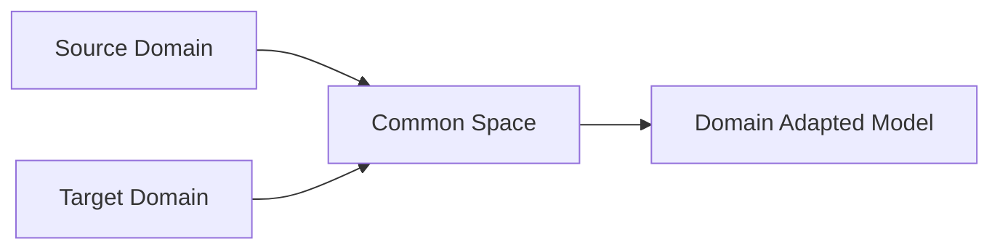

# Domain Adaptation原理与代码实例讲解

关键词：Domain Adaptation, 迁移学习, 源域, 目标域, 特征对齐, 对抗学习, 深度学习, 代码实现

## 1. 背景介绍
### 1.1  问题的由来
在现实世界中,我们经常会遇到这样一个问题:在一个领域(源域)上训练得到的机器学习模型,如何才能很好地应用到另一个不同但相关的领域(目标域)中。由于不同领域数据的分布差异,直接将源域模型应用到目标域通常会导致性能显著下降。为了解决这个问题,Domain Adaptation(领域自适应)应运而生。

### 1.2  研究现状
近年来,Domain Adaptation已成为迁移学习领域的研究热点之一。许多学者提出了各种方法来解决Domain Adaptation问题,例如基于特征变换的方法、基于实例权重的方法、基于子空间学习的方法等。近期,随着深度学习的发展,一些工作将深度神经网络与Domain Adaptation相结合,利用深度网络强大的特征学习和表示能力来缩小源域和目标域之间的差异,取得了显著的效果提升。

### 1.3  研究意义 
Domain Adaptation的研究意义主要体现在以下几个方面:
1. 大大提高了机器学习模型的泛化能力和实用价值,使其能更好地适应不同场景。
2. 节省了在目标域上重新标注数据和训练模型的时间和成本。
3. 推动了迁移学习理论的发展,为解决更多实际问题提供了新的思路。

### 1.4  本文结构
本文将重点介绍Domain Adaptation的基本概念、经典方法、最新进展,以及如何用代码实现这些方法。全文结构如下:

第2节介绍Domain Adaptation涉及的一些核心概念。第3节详细讲解几种主流的Domain Adaptation算法。第4节给出这些算法背后的数学原理。第5节通过代码实例演示如何用Python和PyTorch实现Domain Adaptation。第6节列举一些Domain Adaptation的实际应用场景。第7节推荐一些学习Domain Adaptation的资源。第8节总结全文,并展望Domain Adaptation未来的发展方向。第9节的附录部分解答一些常见问题。

## 2. 核心概念与联系
在正式介绍Domain Adaptation算法之前,我们先来了解几个核心概念:

- Domain(领域):由特征空间X和边缘概率分布P(X)组成,记作 $\mathcal{D}=\{\mathcal{X},P(X)\}$。
- Source Domain(源域):拥有大量标注样本的域,通常用 $\mathcal{D}_s=\{\mathcal{X}_s,P(X_s)\}$ 表示。
- Target Domain(目标域):需要进行预测的目标域,样本通常是未标注的,记作 $\mathcal{D}_t=\{\mathcal{X}_t,P(X_t)\}$。
- Domain Shift(领域偏移):源域和目标域的边缘概率分布不同,即 $P(X_s) \neq P(X_t)$。
- Domain Adaptation(领域自适应):在源域和目标域之间存在Domain Shift的情况下,如何将源域的知识迁移到目标域,使得在目标域上的学习性能得到提升。

下图给出了Domain Adaptation的示意图,其目标就是学习一个映射函数,将源域和目标域的特征映射到一个共同的特征空间,使得两个域的特征分布尽可能接近。



## 3. 核心算法原理 & 具体操作步骤
### 3.1  算法原理概述
Domain Adaptation的主流方法大致可分为以下三类:

1. 基于特征变换的方法:通过特征变换将源域和目标域数据映射到一个共同的特征空间,使得两个域的特征分布尽可能一致。代表性工作有TCA、JDA等。
  
2. 基于实例权重的方法:通过对源域样本赋予不同的权重,使加权后的源域数据分布与目标域接近。代表性工作有KMM、KLIEP等。

3. 基于对抗学习的方法:引入域判别器来判断样本来自源域还是目标域,通过对抗训练使得特征提取器提取的特征能够骗过域判别器。代表性工作有DANN、ADDA等。

下面我们以DANN(Domain-Adversarial Neural Networks)为例,详细讲解其算法步骤。

### 3.2  算法步骤详解
DANN由三部分组成:特征提取器(feature extractor)、标签预测器(label predictor)和域判别器(domain discriminator)。其主要步骤如下:

1. 特征提取器将源域和目标域数据映射到一个共同的特征空间。
2. 标签预测器以及域判别器分别连接在特征提取器之后。
3. 标签预测器负责预测源域样本的标签,其损失函数为交叉熵损失。
4. 域判别器负责判断样本来自源域还是目标域,其损失函数也是交叉熵损失。但在反向传播时,特征提取器的梯度需要反转,即Gradient Reversal Layer(GRL)。
5. 整个网络的损失函数为标签预测损失和域判别损失之和,通过联合优化这两个损失,使得特征提取器学习到domain-invariant的特征表示。
6. 测试时,将目标域数据输入到特征提取器和标签预测器,即可得到目标域的预测结果。

### 3.3  算法优缺点
DANN的优点在于:
1. 端到端训练,无需事先对数据进行特征工程。
2. 利用了深度网络强大的特征学习能力,特征提取和域自适应同时优化。
3. 通过对抗学习缩小源域和目标域的分布差异,从而提高了模型的泛化性。

DANN的缺点包括:  
1. 对抗训练不够稳定,容易训练崩溃。
2. 域判别器只考虑了域级别的分布差异,没有考虑类内差异。
3. 超参数较多,调参比较困难。

### 3.4  算法应用领域
Domain Adaptation在许多领域都有广泛应用,例如:
- 计算机视觉:如何将合成图像上训练的模型应用到真实图像。
- 自然语言处理:不同领域的文本分类、情感分析等。
- 语音识别:不同人群、不同环境下的语音识别。
- 行为识别:不同场景下的人体行为识别。

## 4. 数学模型和公式 & 详细讲解 & 举例说明
### 4.1  数学模型构建
我们定义源域样本为 $D_s=\{(x_i^s,y_i^s)\}_{i=1}^{n_s}$,目标域样本为 $D_t=\{x_j^t\}_{j=1}^{n_t}$。
特征提取器 $G_f$ 将输入映射为特征向量,标签预测器 $G_y$ 将特征向量映射为标签,域判别器 $G_d$ 用于区分特征来自源域还是目标域。

DANN的数学模型如下:

$$
\begin{aligned}
\min _{G_{f}, G_{y}} \max _{G_{d}} & \mathcal{L}\left(D_{s}, D_{t} ; G_{f}, G_{y}, G_{d}\right) \\
=& \frac{1}{n_{s}} \sum_{i=1}^{n_{s}} L_{y}\left(G_{y}\left(G_{f}\left(x_{i}^{s}\right)\right), y_{i}^{s}\right) \\
&-\frac{\lambda}{n_{s}+n_{t}}\left(\sum_{i=1}^{n_{s}} \log \left(G_{d}\left(G_{f}\left(x_{i}^{s}\right)\right)\right)+\sum_{j=1}^{n_{t}} \log \left(1-G_{d}\left(G_{f}\left(x_{j}^{t}\right)\right)\right)\right)
\end{aligned}
$$

其中第一项是源域上的标签预测损失,第二项是域对抗损失。$\lambda$ 为平衡两个损失的权重系数。

### 4.2  公式推导过程
上述模型的推导过程如下:
1. 首先考虑标签预测损失,即监督损失。我们希望特征提取器 $G_f$ 和标签预测器 $G_y$ 能够最小化源域样本的预测误差:

$$\min _{G_{f}, G_{y}} \frac{1}{n_{s}} \sum_{i=1}^{n_{s}} L_{y}\left(G_{y}\left(G_{f}\left(x_{i}^{s}\right)\right), y_{i}^{s}\right)$$

其中 $L_y$ 为交叉熵损失函数。

2. 然后考虑域对抗损失。域判别器 $G_d$ 的目标是最大化源域样本预测为源域的概率,以及目标域样本预测为目标域的概率:

$$\max _{G_{d}} \frac{1}{n_{s}+n_{t}}\left(\sum_{i=1}^{n_{s}} \log \left(G_{d}\left(G_{f}\left(x_{i}^{s}\right)\right)\right)+\sum_{j=1}^{n_{t}} \log \left(1-G_{d}\left(G_{f}\left(x_{j}^{t}\right)\right)\right)\right)$$

而特征提取器 $G_f$ 的目标是最小化上述概率,即骗过域判别器:

$$\min _{G_{f}} \frac{1}{n_{s}+n_{t}}\left(\sum_{i=1}^{n_{s}} \log \left(G_{d}\left(G_{f}\left(x_{i}^{s}\right)\right)\right)+\sum_{j=1}^{n_{t}} \log \left(1-G_{d}\left(G_{f}\left(x_{j}^{t}\right)\right)\right)\right)$$

3. 最后将监督损失和域对抗损失相加,得到DANN的完整数学模型。

### 4.3  案例分析与讲解
下面我们以手写数字识别为例来说明DANN的应用。假设我们有两个数据集:MNIST和USPS,它们都包含了0~9十个数字的手写图像,但是两个数据集的数据分布不同。我们希望训练一个模型,使其能在MNIST上训练后很好地迁移到USPS数据集上。

我们可以将MNIST视为源域,USPS视为目标域。首先在MNIST上训练一个CNN分类器,然后在USPS上进行测试,可以发现准确率会大幅下降。这说明两个域的数据分布存在较大差异。

接下来我们使用DANN进行Domain Adaptation。将源域和目标域数据一起输入到特征提取器中,提取的特征一方面被标签预测器用于预测标签,另一方面被域判别器用于判别域标签。通过联合优化标签预测损失和域对抗损失,特征提取器逐渐学习到了domain-invariant的特征表示。在USPS上测试,可以发现准确率得到了显著提升。

### 4.4  常见问题解答
Q: DANN能否处理源域和目标域标签空间不一致的情况?
A: 不能,DANN假设源域和目标域的标签空间是一致的,否则无法进行知识迁移。如果标签空间不一致,需要考虑更复杂的异构迁移学习方法。

Q: DANN的目标域数据是否必须是完全未标注的?
A: 不是,DANN也可以利用少量的目标域标注数据,这被称为"少量shot"的Domain Adaptation。将这些标注数据加入到监督损失中训练,可以进一步提高泛化性能。

Q: DANN是否对源域和目标域数据的比例有要求?  
A: 通常源域数据应该多于目标域数据,但具体比例没有严格要求。如果两个域数据量相差悬殊,可以考虑对数据量较少的域进行过采样,或者对数据量较多的域进行欠采样,以平衡两个域的数据量。

## 5. 项目实践：代码实例和详细解释说明
### 5.1  开发环境搭建
首先需要安装以下依赖库:
- Python 3.x
- PyTorch 1.x
- NumPy
- Matplotlib

可以使用pip一键安装:
```
pip install torch numpy matplotlib
```

### 5.2  源代码详细实现
下面给出了用PyTorch实现DANN的核心代码:

```python
import torch
import torch.nn as nn
import torch.optim as optim
from torch.autograd import Function

class FeatureExtractor(nn.Module):
    def __init__(self):
        super(FeatureExtractor, self).__init__()
        self