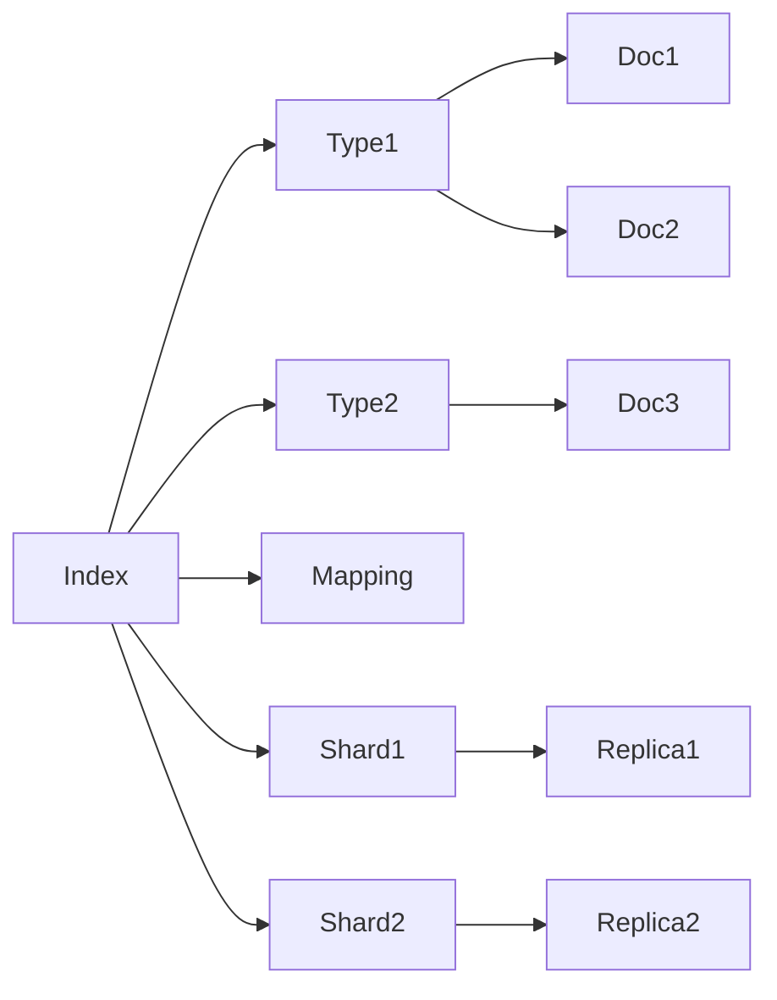

# ES搜索原理与代码实例讲解

## 1. 背景介绍

### 1.1 问题的由来

随着互联网的迅猛发展,信息数据的规模呈现爆炸式增长。如何从海量数据中快速准确地检索出用户所需的信息,成为了一个亟待解决的问题。传统的关系型数据库如MySQL在处理大规模数据检索时性能较差,无法满足实时搜索的需求。于是,一种高性能、可扩展、近实时的分布式搜索引擎应运而生,那就是Elasticsearch(简称ES)。

### 1.2 研究现状

目前,Elasticsearch已经成为了全文搜索领域的标杆性产品。根据DB-Engines的数据显示,Elasticsearch是最受欢迎的企业级搜索引擎,市场份额高达70%以上。国内外很多知名互联网公司如Github、Stack Overflow、Wikipedia、新浪、百度等都采用了Elasticsearch来构建自己的搜索系统。

### 1.3 研究意义

深入研究Elasticsearch的原理和应用,对于构建高效的搜索引擎系统具有重要意义:

1. 可以深入理解搜索引擎的工作原理,掌握其核心算法和数据结构。
2. 学习如何利用Elasticsearch进行海量数据的存储、检索、分析,提升系统性能。
3. 总结Elasticsearch在实际项目中的最佳实践,避免踩坑,提高开发效率。
4. 探索Elasticsearch的应用场景和局限性,为选型提供参考。

### 1.4 本文结构

本文将从以下几个方面对Elasticsearch搜索原理进行深入探讨:

- 介绍Elasticsearch的核心概念与基本原理
- 剖析Elasticsearch的核心算法和数据结构 
- 结合数学模型和公式推导Elasticsearch相关度评分机制
- 通过代码实例讲解如何使用Elasticsearch API进行索引和搜索
- 总结Elasticsearch的实际应用场景和面临的挑战
- 分享Elasticsearch相关的学习资源和开发工具

## 2. 核心概念与联系

要想深入理解Elasticsearch的原理,首先需要掌握其核心概念:

- 文档(Document):可以被索引的基本数据单位。通常是一个JSON对象,包含多个字段。
- 索引(Index):文档的容器,类似于关系型数据库中的database概念。一个索引包含多个文档。  
- 类型(Type):一个索引可以定义一个或多个类型,用于逻辑上区分文档。不过在7.x版本后Type已被废弃。
- 映射(Mapping):定义文档字段的数据类型、分词方式、是否索引等,类似数据库的schema。
- 分片(Shard):Elasticsearch将索引分成多个分片,分布在不同节点,提高系统可用性。
- 副本(Replica):分片的副本,用于提高查询性能和数据安全性。

这些概念的关系可以用下图表示:



## 3. 核心算法原理 & 具体操作步骤

### 3.1 算法原理概述

Elasticsearch基于Lucene实现,采用了倒排索引(Inverted Index)的数据结构来提高全文检索效率。倒排索引中存储了单词到文档的映射关系,检索时无需扫描全部文档,而是通过查找关键词快速得到包含该词的文档列表。

### 3.2 算法步骤详解

1. 文档解析:将原始文档解析成一系列Token(词元),创建 Document 对象。

2. 文档索引:

- 对 Token 进行语言处理,提取词干、过滤停用词等,得到 Term(词)。
- 创建倒排索引。将 Term 映射到包含它的 Document,形成 <Term, Posting List> 的键值对。
- 将 Document 写入分片,持久化到磁盘。

3. 查询处理:
- 对查询语句进行词法、语法分析,得到语法树。  
- 根据语法树生成查询计划,优化查询。
- 执行查询,计算文档相关度得分,返回结果。

### 3.3 算法优缺点

优点:
- 查询速度快,不需要扫描全部文档。
- 可以很好地支持复杂的查询语法,如布尔查询、短语查询、模糊查询等。
- 采用 TF-IDF 算法,能够按照关键词在文档和语料库中的重要程度返回结果。

缺点: 
- 索引文件庞大,占用存储空间。
- 插入、更新操作相对较慢,不适合频繁写入场景。
- 只能对词进行查询,无法直接查询字符串。需要先分词再查询。

### 3.4 算法应用领域

- 全文检索:如百度、Google等搜索引擎。
- 日志分析:ELK 技术栈中的 Logstash 和 Kibana。
- 数据分析:与 Hadoop、Spark 等大数据框架结合使用。
- 站内搜索:电商网站商品搜索,论坛帖子搜索等。

## 4. 数学模型和公式 & 详细讲解 & 举例说明

### 4.1 数学模型构建

Elasticsearch 采用布尔模型(Boolean Model)和向量空间模型(Vector Space Model)来表示查询和文档:

- 布尔模型:用布尔操作符(AND、OR、NOT)将查询表示为布尔表达式,如 "apple AND pie"。
- 向量空间模型:将文档和查询都表示成多维向量,两者的相似度可以用向量夹角余弦来衡量。

### 4.2 公式推导过程

#### 4.2.1 TF-IDF 评分

Elasticsearch使用TF-IDF算法来评估文档与查询的相关性。TF-IDF分数的计算公式为:

$$
score(q,d) = \sum_{t \in q} tf(t,d) \cdot idf(t)^2
$$

其中:
- $q$表示查询,$d$表示文档
- $t$表示查询中的词
- $tf(t,d)$表示词频(Term Frequency),即$t$在$d$中出现的次数
- $idf(t)$表示逆文档频率(Inverse Document Frequency),用来衡量$t$的稀有程度:

$$
idf(t) = 1 + \log \frac{N}{df(t) + 1}
$$

其中$N$为文档总数,$df(t)$为包含$t$的文档数。

#### 4.2.2 向量空间模型

将文档$d$表示成向量: 

$$
\vec{d} = (w_{1,d}, w_{2,d}, ..., w_{n,d})
$$

其中$w_{i,d}$是词$t_i$在文档$d$中的权重,通常用TF-IDF值表示:

$$
w_{i,d} = tf(t_i,d) \cdot idf(t_i) 
$$

同理,查询$q$也表示成向量:

$$
\vec{q} = (w_{1,q}, w_{2,q}, ..., w_{n,q})  
$$

两个向量的相似度可以用余弦相似度来衡量:

$$
\cos(\vec{q},\vec{d}) = \frac{\vec{q} \cdot \vec{d}}{|\vec{q}| \cdot |\vec{d}|} = \frac{\sum_{i=1}^n w_{i,q} \cdot w_{i,d}}{\sqrt{\sum_{i=1}^n w_{i,q}^2} \cdot \sqrt{\sum_{i=1}^n w_{i,d}^2}}
$$

### 4.3 案例分析与讲解

假设有以下两个文档:

- d1: "Elasticsearch is a distributed search engine"
- d2: "Lucene is a search library"  

查询语句为:

- q: "Elasticsearch Lucene"

计算过程如下:

1. 将文档和查询都转换成向量:
```
d1 = (1, 0, 1, 1, 1, 1) 
d2 = (0, 1, 1, 0, 1, 0)
q  = (1, 1, 0, 0, 0, 0)
```

2. 计算各词的逆文档频率:
```
idf("Elasticsearch") = log(2/1 + 1) = 0.4 
idf("Lucene") = log(2/1 + 1) = 0.4
idf("is") = log(2/2 + 1) = 0
idf("a") = log(2/2 + 1) = 0
idf("distributed") = log(2/1 + 1) = 0.4
idf("search") = log(2/2 + 1) = 0  
idf("engine") = log(2/1 + 1) = 0.4
idf("library") = log(2/1 + 1) = 0.4
```

3. 带入公式,得到文档的相关度分数:
```
score(q, d1) = 1*0.4 + 0*0.4 + 0*0 + 0*0 + 0*0.4 + 0*0 = 0.4
score(q, d2) = 0*0.4 + 1*0.4 + 0*0 + 0*0 + 0*0.4 + 0*0.4 = 0.4  
```

可见d1和d2的相关度分数相同,搜索结果会并列返回。

### 4.4 常见问题解答

Q: 为什么文档的相关度分数会不一样?
A: 文档的相关度分数取决于查询词在文档中的出现频率、独特性,以及查询词的权重。出现频率高、独特性强的词有较大贡献。

Q: 多个字段查询时,如何区分字段的权重?  
A: 可以通过指定^boost参数来提升某个字段的权重,如title^2表示title字段的重要性是默认值的2倍。

Q: 如何理解TF-IDF算法?
A: TF-IDF用于评估一个词对文档的重要程度。TF衡量词频,即一个词在文档中出现的频繁程度;IDF衡量一个词的独特性,即包含该词的文档越少,词的独特性越高。两者的乘积TF-IDF越大,说明词对文档的重要性越高。

## 5. 项目实践：代码实例和详细解释说明

### 5.1 开发环境搭建

首先需要安装并运行Elasticsearch,可以从官网下载二进制包解压启动,也可以用Docker运行:

```bash
docker run -d --name es -p 9200:9200 -p 9300:9300 -e "discovery.type=single-node" elasticsearch:7.12.0
```

接着创建一个Maven项目,添加Elasticsearch Java Client的依赖:

```xml
<dependency>
    <groupId>org.elasticsearch.client</groupId>
    <artifactId>elasticsearch-rest-high-level-client</artifactId>
    <version>7.12.0</version>
</dependency>
```

### 5.2 源代码详细实现

#### 5.2.1 建立索引

```java
public void createIndex(String index) throws IOException {
    CreateIndexRequest request = new CreateIndexRequest(index);
    CreateIndexResponse response = client.indices().create(request, RequestOptions.DEFAULT);
    System.out.println(response.isAcknowledged());
}
```

#### 5.2.2 定义Mapping

```java
public void putMapping(String index) throws IOException {
    PutMappingRequest request = new PutMappingRequest(index);
    request.source(
        "{\n" +
        "  \"properties\": {\n" +
        "    \"title\": {\n" +
        "      \"type\": \"text\",\n" +
        "      \"analyzer\": \"ik_max_word\"\n" +
        "    },\n" +
        "    \"content\": {\n" +
        "      \"type\": \"text\",\n" +
        "      \"analyzer\": \"ik_smart\"\n" +
        "    }\n" +
        "  }\n" +
        "}", 
        XContentType.JSON);
    AcknowledgedResponse response = client.indices().putMapping(request, RequestOptions.DEFAULT);
    System.out.println(response.isAcknowledged());
}
```

#### 5.2.3 索引文档

```java
public void indexDoc(String index, String id, String jsonDoc) throws IOException {
    IndexRequest request = new IndexRequest(index);
    request.id(id);
    request.source(jsonDoc, XContentType.JSON);
    IndexResponse response = client.index(request, RequestOptions.DEFAULT);
    System.out.println(response.status());
}
```

#### 5.2.4 条件查询

```java
public void termQuery(String index, String field, String value) throws IOException {
    SearchRequest request = new SearchRequest(index); 
    SearchSourceBuilder builder = new SearchSourceBuilder();
    builder.query(QueryBuilders.termQuery(field, value));
    request.source(builder);
    SearchResponse response = client.search(request, RequestOptions.DEFAULT);
    
    for (SearchHit hit : response.getHits().getHits()) {
        System.out.