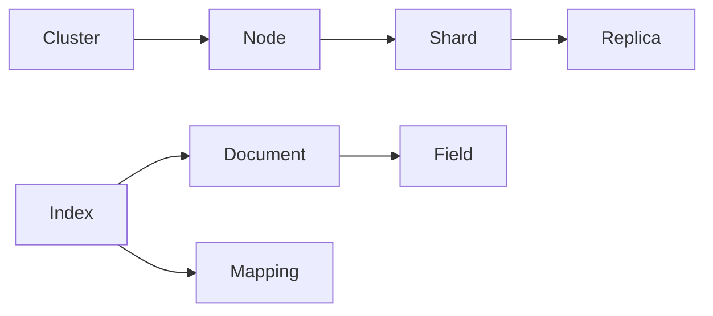
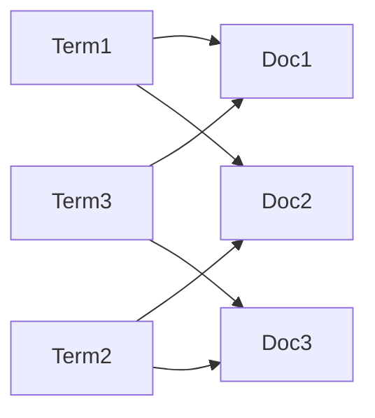
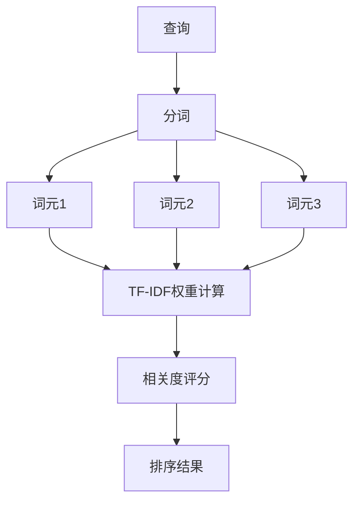
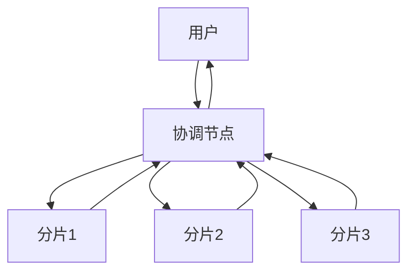

# ElasticSearch原理与代码实例讲解

## 1. 背景介绍
### 1.1 问题的由来
在当今大数据时代，海量数据的存储和检索是一个巨大的挑战。传统的关系型数据库在处理大规模数据时，性能和扩展性都面临瓶颈。为了应对这一挑战，ElasticSearch应运而生。ElasticSearch是一个基于Lucene的分布式搜索和分析引擎，能够提供实时的全文搜索和分析能力。

### 1.2 研究现状
目前，ElasticSearch已经成为全文搜索领域的主流解决方案之一。越来越多的企业和组织开始使用ElasticSearch来处理海量数据的存储和检索问题。同时，学术界也对ElasticSearch的原理和应用进行了广泛的研究。许多研究者提出了改进ElasticSearch性能和功能的方法。

### 1.3 研究意义
深入研究ElasticSearch的原理和应用，对于提升海量数据处理的效率和性能具有重要意义。通过理解ElasticSearch的内部机制，我们可以更好地利用其强大的功能，并针对具体的应用场景进行优化。同时，ElasticSearch的研究也有助于推动全文搜索技术的发展。

### 1.4 本文结构
本文将从以下几个方面对ElasticSearch进行深入探讨：
- 首先介绍ElasticSearch的核心概念和基本原理 
- 然后重点讲解ElasticSearch的核心算法和数学模型
- 接着通过代码实例演示ElasticSearch的具体应用
- 最后总结ElasticSearch的发展趋势和面临的挑战

## 2. 核心概念与联系

在讨论ElasticSearch的原理之前，我们需要了解一些核心概念：

- 索引(Index)：ElasticSearch中的索引可以理解为关系型数据库中的"数据库"。它是一个存储关联数据的地方。
- 文档(Document)：文档是ElasticSearch中的最小数据单元，类似于关系型数据库中的一行记录。一个文档可以是结构化或非结构化的数据，以JSON格式表示。
- 字段(Field)：每个文档都由一个或多个字段组成，类似于关系型数据库中的列。每个字段都有自己的数据类型，如字符串、数值、布尔值等。
- 映射(Mapping)：映射定义了一个文档及其包含的字段如何被存储和索引。它类似于关系型数据库中的表结构定义。
- 集群(Cluster)：ElasticSearch可以运行在多个服务器上，组成一个集群。一个集群有一个唯一标识，默认为"elasticsearch"。
- 节点(Node)：集群中的每个服务器称为一个节点。一个节点有一个唯一标识，默认情况下是一个随机的UUID。
- 分片(Shard)：当索引的数据量很大时，可以将索引划分为多个分片。每个分片本身也是一个完整的索引，可以托管在集群中的不同节点上。
- 副本(Replica)：为了提高查询性能和容错能力，可以为每个分片创建一个或多个副本。副本是主分片的完整拷贝，可以搜索和处理请求。

下图展示了ElasticSearch的核心概念之间的关系：

从图中可以看出，一个ElasticSearch集群由多个节点组成，每个节点可以包含一个或多个分片。每个分片可以有零个或多个副本。一个索引包含多个文档，每个文档由多个字段组成。索引的结构由映射定义。

理解了这些核心概念，我们就可以更好地理解ElasticSearch的工作原理。接下来，我们将重点讨论ElasticSearch的核心算法。

## 3. 核心算法原理 & 具体操作步骤
### 3.1 算法原理概述
ElasticSearch的核心是建立在全文搜索引擎库Lucene之上的。Lucene提供了强大的索引和搜索功能，包括倒排索引、文本分析、相关度排序等。ElasticSearch在Lucene的基础上进行了分布式扩展，使其能够支持PB级别的数据存储和毫秒级的搜索响应。

ElasticSearch的核心算法主要包括：

1. 倒排索引(Inverted Index)
2. 文本分析(Text Analysis) 
3. 相关度评分(Relevance Scoring)
4. 分布式搜索(Distributed Search)

下面我们将详细讨论每一个算法。

### 3.2 算法步骤详解

#### 3.2.1 倒排索引
倒排索引是实现全文搜索的核心数据结构。它将文档中的词语映射到包含它们的文档，实现从词语到文档的快速查找。建立倒排索引的主要步骤如下：

1. 将文档分割成一个个单词(Term)，这个过程称为分词(Tokenization)。
2. 对每个单词进行标准化处理，如转换为小写、去除停用词等，这个过程称为文本规范化(Text Normalization)。
3. 对规范化后的单词进行语言处理，如提取词干、同义词转换等，这个过程称为词元化(Lemmatization)。
4. 为每个词元创建一个包含它的文档列表的数据结构，即倒排列表(Posting List)。
5. 将倒排列表写入磁盘，构建倒排索引文件。

倒排索引的结构如下图所示：

从图中可以看出，每个词元(Term)都对应一个包含它的文档列表。当用户搜索某个关键词时，ElasticSearch会查找该词元的倒排列表，快速获取包含该词元的文档。

#### 3.2.2 文本分析
文本分析是将文本转换为词元(Term)的过程，是建立倒排索引的基础。ElasticSearch提供了强大的文本分析功能，可以对不同语言的文本进行分词、过滤、规范化等处理。文本分析的主要步骤如下：

1. 字符过滤(Character Filtering)：对原始文本进行预处理，如去除HTML标签、转换特殊字符等。
2. 分词(Tokenization)：将文本分割成一个个单词(Term)。不同语言有不同的分词规则，如英语通常按照空格和标点符号分词，而中文需要按照词的边界分词。
3. 词元过滤(Token Filtering)：对分词后的结果进行过滤，如转换为小写、去除停用词、同义词转换等。
4. 词元化(Lemmatization)：将词元转换为标准形式，如提取词干、将复数转换为单数等。

下图展示了文本分析的过程：

ElasticSearch提供了多种内置的分析器(Analyzer)，如Standard Analyzer、Whitespace Analyzer、Keyword Analyzer等。同时，用户也可以通过组合字符过滤器、分词器、词元过滤器来自定义分析器，以满足特定的需求。

#### 3.2.3 相关度评分
相关度评分是搜索引擎的核心功能之一，用于衡量文档与查询的相关程度。ElasticSearch使用了基于TF-IDF(Term Frequency-Inverse Document Frequency)的评分模型，结合了布尔模型和向量空间模型的特点。

相关度评分的主要步骤如下：

1. 计算每个词元在文档中的词频(TF)和在所有文档中的文档频率(DF)。
2. 根据词频和文档频率，计算每个词元的逆文档频率(IDF)，公式为：
   $$ IDF(t) = log(\frac{N}{DF(t)}) $$
   其中，$N$为索引中的文档总数，$DF(t)$为包含词元$t$的文档数。
3. 对于查询中的每个词元，计算其在每个文档中的权重(Weight)，公式为：
   $$ Weight(t,d) = TF(t,d) \times IDF(t) $$
   其中，$TF(t,d)$为词元$t$在文档$d$中的词频。
4. 将查询中每个词元的权重相加，得到文档的相关度评分。
5. 根据相关度评分对搜索结果进行排序。

下图展示了相关度评分的过程：

需要注意的是，ElasticSearch的相关度评分还考虑了其他因素，如词元的位置、词元的距离、文档的长度等，以提高搜索的准确性。用户也可以通过自定义相似度算法(Similarity)来改变评分策略。

#### 3.2.4 分布式搜索
ElasticSearch的一大特点是支持分布式搜索，可以将海量数据分散存储在多个节点上，并在搜索时并行处理，以提高搜索效率。分布式搜索的主要步骤如下：

1. 将索引划分为多个分片(Shard)，每个分片可以存储在不同的节点上。
2. 为每个分片创建一个或多个副本(Replica)，以提高可用性和搜索性能。
3. 当用户发起搜索请求时，请求会被发送到集群中的一个协调节点(Coordinating Node)。
4. 协调节点将请求转发给所有相关的分片，每个分片并行执行搜索。
5. 每个分片将搜索结果返回给协调节点。
6. 协调节点对所有分片的搜索结果进行合并、排序、分页等处理，并将最终结果返回给用户。

下图展示了分布式搜索的过程：

ElasticSearch的分布式架构具有高可用、可扩展、负载均衡等特点。通过增加节点和分片，可以线性扩展存储容量和搜索性能。同时，ElasticSearch还提供了多种分片分配策略和路由机制，以实现更高效的数据分布和查询路由。

### 3.3 算法优缺点
ElasticSearch的核心算法具有以下优点：

1. 倒排索引实现了高效的全文搜索，支持快速的词元匹配和文档检索。
2. 文本分析功能强大，支持多语言分词和自定义分析器，可以灵活地处理各种文本数据。
3. 相关度评分采用了成熟的TF-IDF模型，结合了多种因素，可以提供高质量的搜索结果排序。
4. 分布式搜索架构具有高可用、可扩展、负载均衡等特点，可以支持海量数据的存储和查询。

同时，ElasticSearch的算法也存在一些局限性：

1. 倒排索引的构建和维护成本较高，尤其是在大规模数据更新时，可能会影响索引速度。
2. 文本分析的准确性依赖于分词和语言处理的质量，对于某些语言和领域，可能需要专门的优化。
3. 相关度评分的计算比较复杂，涉及多个因素，调整和优化的难度较大。
4. 分布式架构引入了额外的复杂性，如分片分配、数据同步、故障恢复等，需要专门的运维和管理。

### 3.4 算法应用领域
ElasticSearch的核心算法广泛应用于各种全文搜索和数据分析场景，主要包括：

1. 网站搜索：如电商网站、新闻网站、博客等，提供快速、准确的关键词搜索功能。
2. 日志分析：如应用程序日志、访问日志等，实现实时的日志收集、检索和分析。
3. 指标监控：如服务器指标、应用程序指标等，实现实时的数据采集