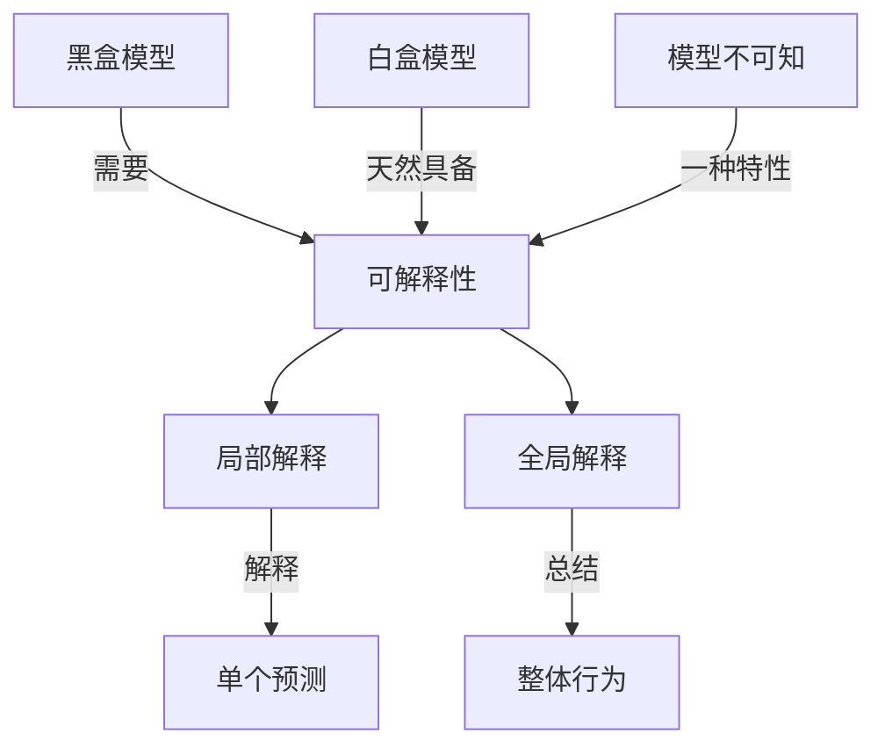

# Explainable AI (XAI)原理与代码实例讲解

关键词：可解释人工智能、机器学习、深度学习、XAI、模型解释、特征重要性、因果推理、反事实解释、代码实例

## 1. 背景介绍
### 1.1  问题的由来
人工智能(AI)技术的飞速发展,使得越来越多的决策任务交由AI系统来完成。然而,许多先进的AI模型如深度神经网络,其内部决策机制对于人类而言是一个"黑箱",难以理解和信任。这导致了AI系统在某些敏感领域(如医疗诊断、金融风控等)的应用受到限制。因此,如何让AI模型的决策过程变得透明可解释,成为了一个亟需解决的问题。

### 1.2  研究现状 
针对AI模型可解释性的研究,学术界提出了一个新的研究方向——可解释人工智能(Explainable AI, XAI)。XAI旨在开发各种方法和技术,来解释AI模型的内部工作机制,揭示其决策依据。目前XAI领域的研究主要包括:特征重要性分析、因果推理、反事实解释、概念激活向量等。一些代表性的XAI方法有LIME、SHAP、LRP、CAV等。

### 1.3  研究意义
XAI研究对于推动AI技术的发展和应用具有重要意义:

1. 提高用户对AI系统的信任。当AI模型的决策过程变得可解释时,用户更容易理解和接受其给出的建议。

2. 促进人机协作。可解释性使得人类专家能够结合自身知识对AI的判断结果进行分析和质疑,形成人机互补、优势互补的协作关系。

3. 发现模型缺陷。通过解释分析,我们可以发现模型存在的偏差和漏洞,为算法改进提供方向。

4. 满足法规要求。在一些强监管行业,法规要求决策系统必须提供解释,XAI 技术能够帮助企业满足合规性要求。

### 1.4  本文结构
本文将重点介绍XAI领域的核心概念、主要技术方法、相关数学原理以及代码实践。内容安排如下:

- 第2部分:介绍XAI的核心概念,以及各概念之间的联系。  
- 第3部分:重点讲解几种主流的XAI算法,包括原理、步骤、优缺点和应用场景。
- 第4部分:介绍XAI算法所涉及的数学模型与公式,并给出详细推导和案例分析。  
- 第5部分:通过代码实例,演示XAI算法的具体实现过程。
- 第6部分:讨论XAI技术在实际场景中的应用现状和未来展望。
- 第7部分:推荐XAI领域的学习资源、开发工具和相关文献。
- 第8部分:总结全文,分析XAI未来的发展趋势和面临的挑战。
- 第9部分:附录,列出XAI研究中的常见问题与解答。

## 2. 核心概念与联系
可解释人工智能的核心概念包括:

- 可解释性(Explainability):指AI系统能够向人类用户解释其决策依据和推理过程的能力。可解释性是XAI的根本目标。

- 黑盒模型(Black-box Model):指内部结构和决策机制难以理解和解释的AI模型,如深度神经网络。XAI主要针对黑盒模型展开研究。

- 白盒模型(White-box Model):指内部逻辑透明,决策过程易于理解和解释的模型,如决策树、线性回归等。

- 模型不可知(Model-agnostic):指XAI方法适用于多种模型,不依赖于特定模型结构。模型不可知是XAI方法的重要特性之一。

- 局部解释(Local Explanation):针对模型的单个预测结果进行解释,揭示该判断背后的关键因素,如"患者X被诊断为肺癌,主要依据是CT影像中的肿块阴影"。

- 全局解释(Global Explanation):对模型的整体行为和决策模式进行概括和总结,如"在判断肺癌时,该模型最看重CT影像中的肿块信息,其次是年龄和吸烟史因素"。

下图展示了上述核心概念之间的关系:

由图可见,可解释性是XAI的核心,它连接了局部解释和全局解释两个层次。XAI主要针对黑盒模型,而白盒模型天然具有可解释性。此外,模型不可知是XAI方法需要具备的重要特性。

## 3. 核心算法原理 & 具体操作步骤
### 3.1 算法原理概述
目前XAI领域提出了多种解释算法,本节重点介绍几种主流方法的基本原理。

#### 3.1.1 LIME

LIME(Local Interpretable Model-agnostic Explanations)是一种局部解释方法。其基本思想是:在黑盒模型的预测样本附近,构建一个可解释的白盒模型(通常是线性模型)来近似黑盒模型的局部行为,然后用白盒模型来解释黑盒模型的预测结果。

#### 3.1.2 SHAP 

SHAP(Shapley Additive Explanations)基于博弈论中的Shapley值概念,将特征对模型预测结果的贡献度分配问题,转化为博弈论中的收益分配问题。通过计算每个特征的Shapley值,得到其对预测结果的贡献大小,从而实现模型解释。

#### 3.1.3 LRP

LRP(Layer-wise Relevance Propagation)是一种适用于神经网络的解释方法。LRP通过定义神经元的相关性,将模型输出的预测分数逐层反向传播到输入层,最终得到每个输入特征对预测结果的贡献度。

#### 3.1.4 CAV

CAV(Concept Activation Vector)通过引入"概念"这一中间表示,实现对神经网络的解释。CAV首先识别出待解释样本所属的人类可理解的高层概念,然后度量这些概念对模型决策的重要程度,从而生成解释。

### 3.2 算法步骤详解
下面以LIME为例,详细讲解其算法步骤。

输入:
- 黑盒模型 $f$
- 待解释样本 $x$
- 解释类别 $label$

输出:
- 局部解释结果

算法步骤:

1. 在样本 $x$ 附近采样生成扰动数据集 $Z$。扰动方式可以是随机遮挡部分特征。

2. 利用黑盒模型 $f$ 对扰动数据集 $Z$ 进行预测,得到预测概率向量 $f(z)$。

3. 计算每个扰动样本 $z$ 与原始样本 $x$ 的距离 $\pi_x(z)$,常用的距离度量有欧氏距离、余弦相似度等。

4. 基于距离 $\pi_x(z)$ 对扰动样本赋予权重 $w_z$,距离越近权重越大。常用的权重函数有指数核函数:

$$
w_z=exp(-\frac{D(x,z)^2}{\sigma^2}) 
$$

其中 $\sigma$ 为核宽度参数。

5. 在扰动数据集 $Z$ 上训练一个可解释的白盒模型 $g$(通常是线性模型),使其尽可能拟合黑盒模型 $f$ 的局部预测结果。白盒模型 $g$ 的目标函数为:

$$
min_{g} \sum_{z\in Z} w_z \cdot (f(z)_{label} - g(z))^2 + \Omega(g)
$$

其中 $f(z)_{label}$ 表示黑盒模型对扰动样本 $z$ 的预测概率向量中第 $label$ 个元素,$\Omega(g)$ 为白盒模型的复杂度正则项。

6. 白盒模型 $g$ 学习完成后,其系数即可反映原始样本 $x$ 中各特征对预测结果的贡献度。系数的绝对值越大,说明相应特征越重要。

7. 根据特征重要性排序,选择若干最重要的特征,生成局部解释结果。例如:"样本 $x$ 被预测为 $label$,主要是因为特征 $A$ 取值较大,而特征 $B$ 取值较小"。

LIME 通过局部近似的方式,用白盒模型来解释黑盒模型,其优点是模型无关、计算效率高,但局部近似也导致解释的准确性存在局限。

### 3.3 算法优缺点
以下总结了几种主要XAI算法的优缺点:

| 算法 | 优点 | 缺点 |
|:----:|:----:|:----:|
| LIME | 模型无关,计算高效 | 局部近似,解释准确性一般 |
| SHAP | 基于博弈论,解释全面 | 计算复杂度高 |
| LRP | 适用于神经网络 | 依赖模型结构,泛化性差 |
| CAV | 引入概念,解释更加语义化 | 概念获取需要人工参与 |

### 3.4 算法应用领域
XAI算法在多个领域得到应用,如:

- 医疗诊断:解释AI诊断模型的判断依据,帮助医生进行分析和决策。
- 金融风控:解释AI风控模型的风险判断逻辑,满足监管合规要求。  
- 自动驾驶:解释自动驾驶模型的决策过程,增强系统的可信度。
- 智能推荐:解释推荐模型给出推荐的原因,提高用户接受度。

## 4. 数学模型和公式 & 详细讲解 & 举例说明
本节以SHAP为例,详细推导其数学模型和公式,并给出案例解读。

### 4.1 数学模型构建
SHAP的核心是将特征贡献度分配问题转化为博弈论中的收益分配问题。假设有 $N$ 个特征 $\{x_1,x_2,...,x_N\}$,预测函数为 $f$。我们将每个特征看作博弈中的一个参与者,其参与/不参与博弈对应于特征被使用/遮挡两种状态。对于特征子集 $S\subseteq \{x_1,x_2,...,x_N\}$,定义函数 $f_S(x_S)$ 表示仅使用特征子集 $S$ 时的预测函数。

根据博弈论中的Shapley值概念,特征 $x_i$ 的Shapley值定义为:

$$
\phi_i = \sum_{S\subseteq N \backslash \{i\}} \frac{|S|!(N-|S|-1)!}{N!} (f_{S\cup \{i\}}(x_{S\cup \{i\}}) - f_S(x_S))
$$

其中 $|S|$ 表示集合 $S$ 的基数,$N$ 为总特征数。

### 4.2 公式推导过程
对于给定的待解释样本 $x$,SHAP通过以下步骤计算各特征的Shapley值:

1. 枚举所有可能的特征组合 $S\subseteq \{x_1,x_2,...,x_N\}$。

2. 对每个特征组合 $S$,基于原始样本 $x$ 构造两个新样本:
   - $x_{S}$:遮挡特征组合 $S$ 之外的所有特征。
   - $x_{S\cup\{i\}}$:在 $x_S$ 的基础上添加特征 $x_i$。

3. 分别计算 $f_S(x_S)$ 和 $f_{S\cup \{i\}}(x_{S\cup \{i\}})$,即在特征子集 $S$ 和 $S\cup\{i\}$ 上的预测值。

4. 计算边际贡献值 $f_{S\cup \{i\}}(x_{S\cup \{i\}}) - f_S(x_S)$,即加入特征 $x_i$ 后预测值的变化量。

5. 对所有特征组合 $S$ 的边际贡献值进行加权平均,权重为 $\frac{|S|!(N-|S|-1)!