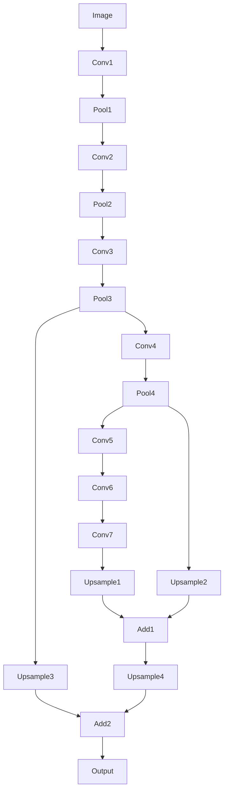

# FCN原理与代码实例讲解

## 1. 背景介绍
### 1.1 问题的由来
在计算机视觉领域,图像语义分割一直是一个极具挑战性的任务。传统的CNN虽然在图像分类任务上取得了巨大成功,但是由于其全连接层导致的空间信息丢失,使得其难以直接应用于像素级别的分割任务。为了解决这一问题,FCN(Fully Convolutional Networks)应运而生。
### 1.2 研究现状 
自从2015年FCN被提出以来,其在语义分割领域取得了突破性进展,后续大量的语义分割算法都是以FCN为基础,在其架构上进行改进和扩展。目前FCN已经成为了语义分割领域的经典网络架构之一。
### 1.3 研究意义
FCN开创性地将CNN引入语义分割,解决了CNN难以应用于像素级分类的难题,极大地推动了语义分割技术的发展。深入理解和掌握FCN的原理与实现,对于从事计算机视觉研究和开发的人员来说具有重要意义。
### 1.4 本文结构
本文将从以下几个方面对FCN进行详细阐述:首先介绍FCN的核心概念与创新点,然后详细讲解FCN的网络架构与原理,并给出基于PyTorch的代码实现。接着分析FCN的优缺点,探讨其适用的场景。最后总结FCN的贡献与影响,并展望其未来的发展方向。

## 2. 核心概念与联系
FCN的核心思想是用卷积层替代全连接层,从而使网络能够接受任意大小的输入,并输出相应大小的分割结果。FCN通过转置卷积层对最后一个卷积层的feature map进行上采样, 使其恢复到输入图像的尺寸,从而可以逐像素地进行分类。与此同时,FCN在网络的中间层引入了skip connection,将浅层的位置信息与深层的语义信息进行融合,提升了分割的精度。

下面是FCN的网络架构示意图:


## 3. 核心算法原理 & 具体操作步骤
### 3.1 算法原理概述
FCN的主体是卷积神经网络,通过堆叠卷积层和池化层提取图像的层级特征。与传统CNN不同的是,FCN将最后的全连接层替换为1x1卷积,使网络输出的是一张2维的feature map而不是固定长度的向量。之后通过转置卷积对feature map逐步上采样,恢复到输入的尺寸,并利用浅层信息进行精修,最终得到每个像素的类别概率图。
### 3.2 算法步骤详解
1. 用预训练的分类网络(如VGG)初始化FCN的前半部分,并去掉原始的全连接层。
2. 在最后一个卷积层后面添加1x1卷积层,将通道数映射为类别数K。得到的feature map记为f7。
3. 对f7进行上采样(stride=32),得到f7_up。
4. 取VGG中第4个池化层之前的feature map记为f4,对其做1x1卷积,将通道数映射为K得到f4_1x1。
5. 将f4_1x1上采样(stride=16)得到f4_up。 
6. 将f7_up和f4_up相加,得到f74。
7. 取VGG中第3个池化层之前的feature map记为f3,对其做1x1卷积得到f3_1x1。
8. 将f3_1x1上采样(stride=8)得到f3_up。
9. 将f74和f3_up相加,得到f743。
10. 对f743进行8x上采样,得到与输入尺寸相同的预测结果。

### 3.3 算法优缺点
优点:
- 可以接受任意大小的输入图像,输出相应尺寸的分割结果
- 利用了CNN强大的特征提取能力,语义信息丰富
- 引入skip connection,融合了不同层级的特征,提升分割精度
- 端到端训练,无需复杂的后处理

缺点:  
- 空间精度不够高,上采样过程中存在信息丢失
- 对小目标和细节的刻画能力有限
- 没有考虑像素之间的关联性,缺乏空间一致性

### 3.4 算法应用领域
FCN是语义分割领域的开山之作,其思想被广泛应用于医学图像分割、遥感图像分割、无人驾驶等诸多场景。FCN简洁高效的特点使其在资源受限的移动设备上也有一定的应用。此外,FCN还被用来解决交互式图像分割等问题。

## 4. 数学模型和公式 & 详细讲解 & 举例说明
### 4.1 数学模型构建
FCN本质上是一个端到端的像素分类模型,对一张$H\times W\times 3$的RGB图像,FCN最终学习到一个非线性映射$\mathcal{F}$:
$$
\mathcal{F}: \mathbb{R}^{H\times W\times 3}\rightarrow \mathbb{R}^{H\times W\times K}
$$
其中$K$为类别数。$\mathcal{F}$将图像的每个像素映射为一个$K$维的概率向量,表示该像素属于每个类别的概率。

网络的训练过程就是最小化预测概率分布与真实标签分布之间的交叉熵损失:
$$
\mathcal{L} = -\frac{1}{HW}\sum_{i=1}^{H}\sum_{j=1}^{W}\sum_{k=1}^{K} y_{ijk}\log p_{ijk}
$$
其中$y_{ijk}$表示像素$(i,j)$真实标签的one-hot向量的第$k$个元素,$p_{ijk}$表示FCN预测该像素属于第$k$类的概率。

### 4.2 公式推导过程
FCN使用VGG16作为backbone,其卷积层和池化层的计算公式为:
$$
\begin{aligned}
z^{(l)}_{i,j} &= \sum_{m}\sum_{n} w^{(l)}_{m,n} a^{(l-1)}_{i+m-1,j+n-1} + b^{(l)} \\
a^{(l)}_{i,j} &= f(z^{(l)}_{i,j})
\end{aligned}
$$
其中$l$表示层数,$w$和$b$分别为卷积核和偏置,$f$为激活函数(如ReLU)。

对于转置卷积层,其输出的计算公式为:
$$
\begin{aligned}
z^{(l)}_{i,j} &= \sum_{m}\sum_{n} w^{(l)}_{m,n} a^{(l-1)}_{\lfloor \frac{i-m}{s} \rfloor,\lfloor \frac{j-n}{s} \rfloor} + b^{(l)} \\
a^{(l)}_{i,j} &= f(z^{(l)}_{i,j})
\end{aligned}
$$
其中$s$为步长stride。转置卷积可以看作卷积的逆过程,通过插值扩大feature map的尺寸。

对于1x1卷积,其输出为:
$$
\begin{aligned}
z^{(l)}_{i,j} &= \sum_{k} w^{(l)}_{k} a^{(l-1)}_{i,j,k} + b^{(l)} \\
a^{(l)}_{i,j} &= f(z^{(l)}_{i,j})
\end{aligned}
$$
1x1卷积可以在不改变feature map尺寸的情况下,调整其通道数。

### 4.3 案例分析与讲解
下面以一个$224\times 224$的RGB图像为例,分析FCN的前向传播过程。

1. 输入图像通过VGG16的5个卷积段,得到一个$7\times 7\times 512$的feature map。
2. 对该feature map做1x1卷积,得到$7\times 7\times K$的f7。
3. 对f7做32x上采样(转置卷积stride=32),得到$224\times 224\times K$的f7_up。
4. 取第4个池化层之前的feature map(尺寸为$14\times 14\times 512$),做1x1卷积得到$14\times 14\times K$的f4_1x1。
5. 对f4_1x1做16x上采样,得到$224\times 224\times K$的f4_up。
6. 将f7_up和f4_up逐元素相加,得到融合后的$224\times 224\times K$的f74。
7. 取第3个池化层之前的feature map(尺寸为$28\times 28\times 256$),做1x1卷积得到$28\times 28\times K$的f3_1x1。
8. 对f3_1x1做8x上采样,得到$224\times 224\times K$的f3_up。
9. 将f74和f3_up逐元素相加,得到融合后的$224\times 224\times K$的f743。

最终f743中每个像素位置上的$K$维向量,就表示该像素属于$K$个类别的概率。

### 4.4 常见问题解答
Q: FCN中为什么使用1x1卷积?
A: 主要有两个作用,一是在不改变feature map尺寸的情况下调整通道数,二是进行跨通道的信息整合。将最后一层卷积的通道映射为类别数,相当于为每个类别学习了一个模板。

Q: 为什么FCN需要skip connection?
A: 随着网络加深,feature map的分辨率越来越低,空间信息丢失严重。Skip connection将底层的位置信息与高层的语义信息结合,能够兼顾分割的精度与细节。

Q: FCN可以处理任意大小的输入吗?
A: 理论上是可以的,因为FCN全部由卷积层组成,没有对输入尺寸的限制。但实际操作中,由于显存限制,输入图像的尺寸不能太大。

Q: FCN对图像分割的效果如何?
A: FCN是语义分割领域的奠基之作,其分割精度相比传统方法有了极大提升。但FCN也存在一些不足,如分割边界不够平滑,小目标容易丢失等。后续工作如DeepLab、PSPNet等在此基础上进行了改进。

## 5. 项目实践：代码实例和详细解释说明
### 5.1 开发环境搭建
- 操作系统: Ubuntu 16.04
- 深度学习框架: PyTorch 1.1
- Python: 3.7
- CUDA: 10.0
- 硬件: Intel i7-9700K, 32GB RAM, NVIDIA GTX 1080Ti

### 5.2 源代码详细实现
下面给出FCN在PyTorch中的实现代码:
```python
import torch
import torch.nn as nn

class FCN(nn.Module):
    def __init__(self, num_classes):
        super(FCN, self).__init__()
        
        # 前5段卷积取自VGG16的features部分
        self.features = nn.Sequential(
            # conv1
            nn.Conv2d(3, 64, 3, padding=100),
            nn.ReLU(inplace=True),
            nn.Conv2d(64, 64, 3, padding=1),
            nn.ReLU(inplace=True),
            nn.MaxPool2d(2, stride=2, ceil_mode=True),  # 1/2
            
            # conv2 
            nn.Conv2d(64, 128, 3, padding=1),
            nn.ReLU(inplace=True),
            nn.Conv2d(128, 128, 3, padding=1),
            nn.ReLU(inplace=True),
            nn.MaxPool2d(2, stride=2, ceil_mode=True),  # 1/4
            
            # conv3
            nn.Conv2d(128, 256, 3, padding=1), 
            nn.ReLU(inplace=True),
            nn.Conv2d(256, 256, 3, padding=1),
            nn.ReLU(inplace=True),
            nn.Conv2d(256, 256, 3, padding=1),
            nn.ReLU(inplace=True),
            nn.MaxPool2d(2, stride=2, ceil_mode=True),  # 1/8
            
            # conv4
            nn.Conv2d(256, 512, 3, padding=1),
            nn.ReLU(inplace=True),
            nn.Conv2d(512,