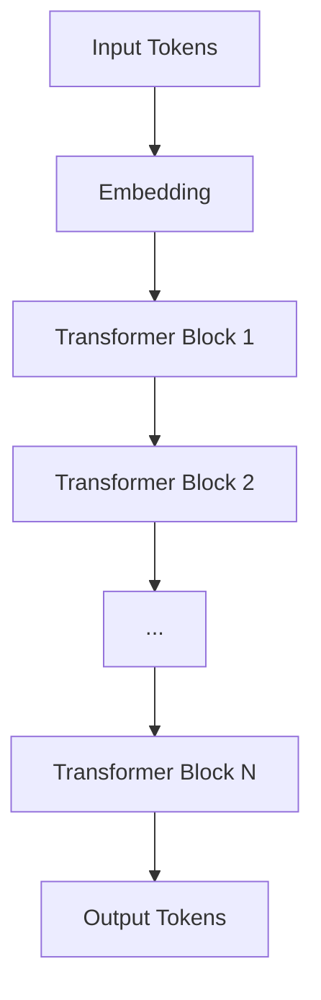

# Falcon原理与代码实例讲解

## 1. 背景介绍

### 1.1 问题的由来

随着人工智能技术的飞速发展，大语言模型(Large Language Model, LLM)已经成为了自然语言处理领域的研究热点。传统的语言模型如BERT、GPT-3等虽然在许多NLP任务上取得了优异的成绩，但它们仍然存在一些局限性，如模型参数量巨大、推理速度较慢、生成文本质量有待提高等。为了进一步突破这些瓶颈，研究人员开始探索新的语言模型架构和训练方法。

### 1.2 研究现状

近年来，业界涌现出许多优秀的大语言模型，如谷歌的LaMDA、DeepMind的Chinchilla、Anthropic的Claude等。这些模型在通用语言理解和生成方面展现出了令人瞩目的能力。然而，它们大多采用了Transformer等经典架构，在模型效率和可扩展性上仍有较大的优化空间。

### 1.3 研究意义

Falcon的提出为大语言模型的发展带来了新的思路。它通过引入新颖的技术手段，在保证模型性能的同时大幅提升了训练和推理效率，为后续研究奠定了良好的基础。深入理解Falcon的原理和实现，对于推动语言模型技术的进步具有重要意义。

### 1.4 本文结构

本文将围绕Falcon模型展开深入探讨。首先，我们将介绍Falcon的核心概念和创新点。然后，详细阐述其算法原理和数学模型。接着，通过代码实例来演示如何实现一个Falcon模型。最后，讨论Falcon在实际应用中的场景，并对其未来发展趋势作出展望。

## 2. 核心概念与联系

Falcon是一个基于Transformer的自回归语言模型，其核心思想是通过一系列技术创新来优化模型架构和训练过程，从而在效率和性能之间取得更好的平衡。以下是Falcon的几个关键概念：

- **RMSNorm**：一种改进的归一化方法，可以加速模型收敛并提高稳定性。
- **Attention优化**：通过一些技巧（如Flash注意力）来降低自注意力机制的计算复杂度。
- **ALiBi位置编码**：一种新型的位置编码方案，可以避免常见的位置编码问题。
- **分层学习率**：为模型的不同部分设置不同的学习率，以适应各层的更新速度。
- **模型并行**：将模型切分到多个设备上，实现高效的分布式训练。

下图展示了Falcon模型的整体架构：



可以看到，Falcon采用了经典的Transformer架构，但在其内部做了许多优化和改进，以提升模型性能和效率。接下来，我们将详细介绍这些核心技术的算法原理和实现细节。

## 3. 核心算法原理 & 具体操作步骤

### 3.1 算法原理概述

Falcon的核心算法可以概括为以下几个方面：

1. **RMSNorm归一化**：与传统的LayerNorm不同，RMSNorm使用了指数移动平均(EMA)的方式来估计均值和方差，从而降低了对batch size的敏感性，提高了模型的鲁棒性。
2. **Flash Attention**：通过一些数学变换将原始的注意力计算分解为多个小的矩阵乘法，并利用内存优化技术，大大降低了计算和存储开销。
3. **ALiBi位置编码**：不同于绝对位置编码和相对位置编码，ALiBi通过在注意力计算中引入一个衰减因子来隐式地建模位置信息，避免了位置嵌入的问题。
4. **AdamW优化器**：在原始Adam优化器的基础上引入了权重衰减正则化，可以有效防止模型过拟合。
5. **ZeRO模型并行**：采用了Deepspeed的ZeRO-Infinity技术，通过将模型参数、梯度和优化器状态划分到不同的设备上，实现了高效的模型并行训练。

### 3.2 算法步骤详解

下面我们以Transformer Block的前向传播为例，详细说明Falcon中的核心算法步骤。

1. **词嵌入**：将输入的token ID映射为对应的词向量。
2. **RMSNorm归一化**：
   $$\hat{x} = \frac{x}{\sqrt{\text{EMA}(\text{Var}(x)) + \epsilon}}$$
   其中$x$为输入向量，$\text{EMA}$为指数移动平均，$\epsilon$为一个小的常数。
3. **Flash Attention**：
   $$\text{Attention}(Q,K,V) = \text{softmax}(\frac{QK^T}{\sqrt{d_k}} + \text{ALiBi})V$$
   其中$Q,K,V$分别为查询、键、值矩阵，$d_k$为键向量的维度，$\text{ALiBi}$为位置衰减因子。
4. **前馈网络**：由两个全连接层和一个非线性激活函数组成。
   $$\text{FFN}(x) = \text{ReLU}(xW_1 + b_1)W_2 + b_2$$
5. **残差连接和Layer Norm**：
   $$x = \text{LayerNorm}(x + \text{Sublayer}(x))$$
   其中$\text{Sublayer}$可以是注意力层或前馈层。

通过以上步骤，Falcon模型可以高效地对输入序列进行编码和生成。

### 3.3 算法优缺点

Falcon算法的主要优点包括：

- 通过RMSNorm和Flash Attention显著提升了模型的训练和推理速度。
- ALiBi位置编码避免了传统位置编码的局限性，提高了模型的泛化能力。
- 采用了先进的优化技术和并行策略，可以支持万亿规模参数的模型训练。

但Falcon也存在一些不足之处：

- 模型结构相对复杂，对硬件和工程实现要求较高。
- 超大规模的训练需要消耗大量的计算资源和能源。
- 在某些特定领域的任务上，性能可能不如针对性设计的模型。

### 3.4 算法应用领域

得益于其强大的语言理解和生成能力，Falcon模型可以应用于多个自然语言处理领域，例如：

- 问答系统：根据给定的问题生成准确、连贯的答案。
- 对话生成：与人进行多轮交互对话，提供个性化的回复。
- 文本摘要：自动提取文章的关键信息，生成简洁的摘要。
- 机器翻译：将一种语言的文本翻译成另一种语言，达到人类水平。
- 文本分类：对文本的主题、情感等进行分类。

此外，Falcon还可以作为基础模型，通过微调或提示学习的方式应用于更多的下游任务。

## 4. 数学模型和公式 & 详细讲解 & 举例说明

### 4.1 数学模型构建

Falcon的数学模型建立在Transformer的基础之上，其核心是自注意力机制和前馈网络。给定一个输入序列$\mathbf{x} = (x_1, \ldots, x_n)$，Transformer的编码器将其映射为一个输出序列$\mathbf{z} = (z_1, \ldots, z_n)$。

在自注意力层中，输入序列首先被转化为三个矩阵：查询矩阵$\mathbf{Q}$、键矩阵$\mathbf{K}$和值矩阵$\mathbf{V}$。
$$\mathbf{Q} = \mathbf{X} \mathbf{W}^Q, \mathbf{K} = \mathbf{X} \mathbf{W}^K, \mathbf{V} = \mathbf{X} \mathbf{W}^V$$

其中$\mathbf{W}^Q, \mathbf{W}^K, \mathbf{W}^V$为可学习的权重矩阵。然后，通过计算查询和键的点积并应用softmax函数，得到注意力权重：

$$\mathbf{A} = \text{softmax}(\frac{\mathbf{Q}\mathbf{K}^T}{\sqrt{d_k}})$$

最后，将注意力权重与值矩阵相乘，得到输出表示：

$$\mathbf{Z} = \mathbf{A} \mathbf{V}$$

在前馈网络中，使用两个全连接层对输入进行变换：

$$\text{FFN}(\mathbf{x}) = \text{ReLU}(\mathbf{x} \mathbf{W}_1 + \mathbf{b}_1) \mathbf{W}_2 + \mathbf{b}_2$$

其中$\mathbf{W}_1, \mathbf{W}_2$为权重矩阵，$\mathbf{b}_1, \mathbf{b}_2$为偏置向量。

通过堆叠多个编码器块（每个块包含自注意力层和前馈层），Transformer可以建模输入序列的复杂依赖关系。

### 4.2 公式推导过程

下面我们以RMSNorm为例，推导其归一化公式。假设输入向量为$\mathbf{x} = (x_1, \ldots, x_d)$，RMSNorm的目标是对其进行归一化处理。

首先，计算输入向量的均值和方差：

$$\mu = \frac{1}{d} \sum_{i=1}^d x_i$$

$$\sigma^2 = \frac{1}{d} \sum_{i=1}^d (x_i - \mu)^2$$

然后，使用指数移动平均来更新均值和方差的估计值：

$$\hat{\mu} \leftarrow \beta \hat{\mu} + (1 - \beta) \mu$$

$$\hat{\sigma}^2 \leftarrow \beta \hat{\sigma}^2 + (1 - \beta) \sigma^2$$

其中$\beta$为衰减因子，控制历史信息的权重。

最后，对输入向量进行归一化：

$$\hat{x}_i = \frac{x_i - \hat{\mu}}{\sqrt{\hat{\sigma}^2 + \epsilon}}$$

其中$\epsilon$为一个小的常数，用于防止分母为零。

通过以上步骤，RMSNorm可以自适应地调整归一化参数，从而提高模型的稳定性和收敛速度。

### 4.3 案例分析与讲解

为了直观地理解Falcon模型的工作原理，我们以一个简单的情感分类任务为例进行说明。假设我们有一条电影评论："This movie is great! I really enjoyed it."，需要判断其情感倾向（正面/负面）。

首先，将评论文本转化为token序列，并添加特殊的起始和结束标记：

```
[CLS] This movie is great ! [SEP] I really enjoyed it . [SEP]
```

然后，通过词嵌入层将每个token映射为一个词向量，得到输入表示$\mathbf{X}$。

接下来，输入表示经过多个Transformer编码器块的处理。在每个块中，自注意力机制捕捉token之间的依赖关系，前馈网络对特征进行非线性变换。例如，"great"和"enjoyed"这两个token可能会分配较高的注意力权重，表明它们对句子的情感倾向有重要影响。

经过多轮计算，Falcon模型得到句子的最终表示$\mathbf{z}$。将其输入到一个分类器（如softmax层），即可得到句子的情感标签（正面/负面）。

通过端到端的训练，Falcon可以自动学习如何理解和判断文本的情感倾向。同时，由于引入了RMSNorm、Flash Attention等优化技术，Falcon的训练和推理速度也得到了显著提升。

### 4.4 常见问题解答

**Q**: Falcon与传统的Transformer模型有何区别？

**A**: 主要区别在于Falcon引入了一系列优化技术，如RMSNorm、Flash Attention、ALiBi位置编码等，可以加速模型训练和推理，并提高模型的泛化能力。此外，Falcon还采用了先进的并行策略，支持更大规模的模型训练。

**Q**: RMSNorm相比LayerNorm有何优势？

**A**: RMSNorm使用指数移动平均来估计均值和方差，因此对batch size的变化不敏感，可以提高模型的鲁棒性。此外，RMSNorm还可以自适应地调整归一化参数，加速模型收敛。

**Q**: Flash