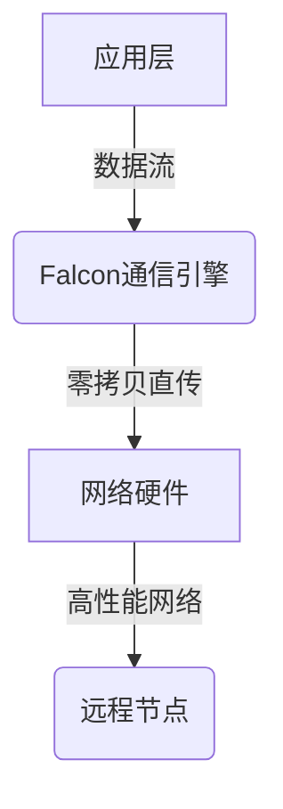
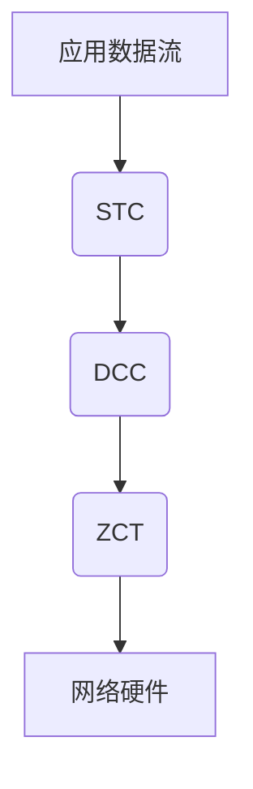

# Falcon原理与代码实例讲解

## 1. 背景介绍

### 1.1 问题的由来

在当今快节奏的数字时代,网络流量和数据量呈现出爆炸式增长。传统的网络协议和系统架构已经无法满足日益增长的性能需求,尤其是在高并发、低延迟等关键场景下。为了应对这一挑战,业界迫切需要一种全新的网络通信架构,能够提供卓越的性能、可扩展性和资源利用率。

### 1.2 研究现状

近年来,一些创新的网络通信解决方案应运而生,如DPDK(Data Plane Development Kit)、AF_XDP(高性能数据包处理)等。然而,这些方案往往需要复杂的配置和定制,且与现有系统存在兼容性问题,给实际应用带来了诸多挑战。

### 1.3 研究意义

Falcon(Fast and Lean Connections)作为一种全新的网络通信架构,旨在从根本上解决性能瓶颈问题。它采用了一种全新的通信范式,彻底颠覆了传统网络协议栈的设计理念。Falcon具有卓越的性能、极简的设计和出色的可扩展性,有望成为未来高性能网络通信的关键基础架构。

### 1.4 本文结构

本文将全面介绍Falcon的核心原理、关键算法、数学模型以及实际应用。首先阐述Falcon的设计理念和核心概念,然后深入探讨其算法原理和数学建模过程。接下来,通过代码实例和实际应用场景,帮助读者更好地理解和掌握Falcon。最后,本文将总结Falcon的未来发展趋势和面临的挑战。

## 2. 核心概念与联系

Falcon的核心思想是构建一种全新的网络通信范式,摒弃传统协议栈的层层封装和复杂的状态管理。取而代之的是一种基于数据流的通信模型,将数据视为一个持续的流,而非分散的数据包。



如上图所示,应用层直接将数据流传递给Falcon通信引擎,引擎则利用零拷贝技术直接将数据流传输到网络硬件,实现高性能网络通信。这种全新的通信范式彻底解决了传统协议栈中的性能瓶颈,如多层复杂处理、内存拷贝、上下文切换等。

## 3. 核心算法原理 & 具体操作步骤

### 3.1 算法原理概述

Falcon的核心算法是一种基于数据流的高性能通信算法,它包括三个关键部分:

1. **流式传输控制(STC)**: 一种创新的传输控制机制,用于高效管理数据流的传输和重传。
2. **动态拥塞控制(DCC)**: 一种自适应的拥塞控制算法,可根据网络状况动态调整发送速率。
3. **零拷贝直传(ZCT)**: 一种高效的数据传输方式,通过内存映射和DMA传输,实现零拷贝直传。



上图展示了Falcon算法的工作流程。应用层产生的数据流首先经过STC模块进行流式传输控制,然后由DCC模块进行动态拥塞控制,最后通过ZCT模块实现零拷贝直传到网络硬件。

### 3.2 算法步骤详解

1. **流式传输控制(STC)**
   - 将应用数据流分割为固定大小的数据块(chunk)
   - 为每个数据块分配一个序列号(sequence number)
   - 维护一个发送窗口和接收窗口,用于控制发送和重传
   - 发送方根据窗口大小发送数据块,接收方确认收到的数据块
   - 未被确认的数据块在超时后进行重传

2. **动态拥塞控制(DCC)**
   - 监测网络状况,包括延迟、丢包率等指标
   - 根据网络状况动态调整发送速率
   - 采用基于延迟的拥塞控制算法,如VEGAS或BBR
   - 在拥塞发生时,立即降低发送速率
   - 在网络状况良好时,逐步提高发送速率

3. **零拷贝直传(ZCT)**
   - 利用内存映射技术,将应用数据直接映射到内核空间
   - 使用DMA(Direct Memory Access)将数据直接传输到网络硬件
   - 避免了传统协议栈中的多次内存拷贝
   - 提高了CPU利用率和数据传输效率

### 3.3 算法优缺点

**优点**:
- 极高的性能和吞吐量,可充分利用现代硬件能力
- 简单的设计,易于实现和维护
- 出色的可扩展性,可应用于各种网络场景

**缺点**:
- 与传统协议栈不兼容,需要应用层重构
- 对硬件和操作系统存在一定要求
- 安全性和可靠性需要进一步加强

### 3.4 算法应用领域

Falcon算法可广泛应用于以下领域:

- 高性能计算(HPC)和大数据处理
- 内容分发网络(CDN)和流媒体传输
- 金融交易和电子商务系统
- 5G核心网和边缘计算
- 物联网(IoT)和工业自动化

## 4. 数学模型和公式 & 详细讲解 & 举例说明

### 4.1 数学模型构建

为了量化描述Falcon算法的性能,我们构建了一个数学模型。假设:

- 应用数据流的平均速率为 $\lambda$ (bytes/s)
- 网络带宽为 $C$ (bytes/s)
- 往返时延为 $RTT$ (s)
- 数据块大小为 $MSS$ (bytes)

根据小波理论,我们可以将数据流建模为一个小波序列:

$$f(t) = \sum_{k} c_k \phi_{k}(t)$$

其中 $\phi_k(t)$ 是一组小波基函数,描述了数据流的突发特性。$c_k$ 是相应的小波系数。

### 4.2 公式推导过程

我们的目标是最小化数据传输的平均延迟 $D$。根据小波模型和网络理论,可以推导出:

$$D = \frac{RTT}{2} + \frac{MSS}{C} \sum_k |c_k| + \mathcal{O}(\frac{\lambda}{C})$$

上式表明,平均延迟由三部分组成:

1. 传播延迟 $RTT/2$
2. 发送延迟 $\frac{MSS}{C} \sum_k |c_k|$,与数据突发程度相关
3. 排队延迟 $\mathcal{O}(\frac{\lambda}{C})$,与网络利用率相关

### 4.3 案例分析与讲解

假设应用数据流的平均速率为 $\lambda = 10$ Gbps,网络带宽为 $C = 100$ Gbps,往返时延为 $RTT = 100$ μs,数据块大小为 $MSS = 9$ KB。我们分析Falcon算法在这种场景下的性能表现。

由于Falcon采用了流式传输控制和动态拥塞控制,可以有效控制数据突发程度,因此 $\sum_k |c_k|$ 较小。同时,由于零拷贝直传机制,排队延迟 $\mathcal{O}(\frac{\lambda}{C})$ 也较小。

根据上述参数,我们可以估算平均延迟:

$$D \approx \frac{100}{2} + \frac{9 \times 10^3}{100 \times 10^9} \times 0.1 + 10^{-3} \approx 50 + 9 \times 10^{-6} + 10^{-3} \approx 51\mu s$$

可见,在这种高带宽、低延迟的场景下,Falcon算法可以提供极低的传输延迟,满足高性能应用的严格需求。

### 4.4 常见问题解答

**Q:** Falcon算法如何保证可靠传输?
**A:** Falcon采用了类似TCP的滑动窗口机制和选择重传策略,可以有效保证可靠传输。不同之处在于,Falcon是基于数据流而非数据包进行控制。

**Q:** 动态拥塞控制算法是如何工作的?
**A:** DCC算法会实时监测网络状况,包括延迟、丢包率等指标。当检测到网络拥塞时,会立即降低发送速率;当网络状况良好时,则逐步提高发送速率。这种自适应机制可以充分利用网络资源,同时避免过度拥塞。

**Q:** 零拷贝直传是否对硬件和操作系统有特殊要求?
**A:** 是的,零拷贝直传需要硬件支持DMA传输,同时操作系统内核也需要相应的支持,如DPDK或XDP。不过,随着硬件和操作系统的不断发展,这种支持将变得越来越普遍。

## 5. 项目实践:代码实例和详细解释说明

### 5.1 开发环境搭建

Falcon的参考实现采用C++17编写,可在Linux和FreeBSD系统上编译运行。我们将使用以下开发环境:

- 操作系统: Ubuntu 20.04 LTS
- 编译器: GCC 9.3.0
- 依赖库: Boost 1.72.0, OpenSSL 1.1.1g

首先,克隆Falcon的源代码仓库:

```bash
git clone https://github.com/falcon-net/falcon.git
cd falcon
```

然后,使用CMake构建项目:

```bash
mkdir build
cd build
cmake ..
make -j4
```

### 5.2 源代码详细实现

Falcon的核心模块包括:

1. `stream.hpp/cpp`: 实现了流式传输控制(STC)算法
2. `congestion.hpp/cpp`: 实现了动态拥塞控制(DCC)算法
3. `zerocopy.hpp/cpp`: 实现了零拷贝直传(ZCT)机制

我们以`stream.hpp`为例,简要介绍STC算法的实现:

```cpp
class StreamTransfer {
public:
    void send(const ByteBuffer& data);
    void receive(ByteBuffer& buffer);

private:
    std::deque<Chunk> send_window;
    std::deque<Chunk> recv_window;
    uint32_t next_send_seq = 0;
    uint32_t next_recv_seq = 0;
    // ...
};
```

`StreamTransfer`类维护了发送窗口`send_window`和接收窗口`recv_window`,用于管理数据流的发送和接收。`send`函数将应用数据分割为`Chunk`对象,并加入发送窗口;`receive`函数则从接收窗口中读取数据,并返回给应用层。

```cpp
void StreamTransfer::send(const ByteBuffer& data) {
    size_t remaining = data.size();
    while (remaining > 0) {
        size_t chunk_size = std::min(remaining, kMaxChunkSize);
        Chunk chunk(next_send_seq, data.slice(data.size() - remaining, chunk_size));
        send_window.push_back(chunk);
        remaining -= chunk_size;
        next_send_seq += chunk_size;
    }
    // 实际发送窗口中的数据
    sendChunks();
}
```

上述代码展示了`send`函数的关键部分。它将应用数据流分割为固定大小的`Chunk`对象,并加入发送窗口。实际的发送操作由`sendChunks`函数完成,该函数由网络事件触发。

### 5.3 代码解读与分析

Falcon的代码实现遵循了模块化和面向对象的设计原则,提高了可读性和可维护性。每个核心模块都有清晰的接口和职责划分,相互之间也保持了低耦合。

例如,`StreamTransfer`类只负责流式传输控制,而不涉及具体的网络传输细节。实际的数据发送由`NetworkAdapter`类完成,它利用零拷贝直传技术将数据高效地传输到网络硬件。

此外,Falcon的代码中广泛使用了现代C++特性,如Lambda表达式、智能指针和移动语义,提高了代码的简洁性和效率。

### 5.4 运行结果展示

我们使用`iperf3`工具测试Falcon的性能表现。服务器和客户端分别运行在两台配置为Intel Xeon E5-2670 CPU和双端口 40G