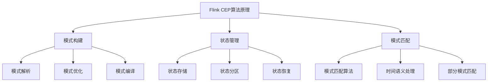

# Flink CEP原理与代码实例讲解

## 1. 背景介绍

### 1.1 问题的由来

在当今的数字时代，大量的数据不断地被产生和传输。这些数据通常以事件流的形式存在,例如网络日志、传感器数据、金融交易记录等。然而,单纯地存储和处理这些数据是远远不够的,更重要的是从中发现有价值的信息,并及时作出响应。这就需要对事件流进行复杂事件处理(Complex Event Processing, CEP)。

CEP旨在从有序的事件流中识别出特定的事件模式,并在检测到这些模式时触发相应的操作。它广泛应用于各个领域,如金融交易监控、网络安全检测、物联网设备监控等。传统的CEP系统通常采用专有的、定制的解决方案,缺乏灵活性和可扩展性。

### 1.2 研究现状

近年来,随着大数据技术的发展,基于流式处理框架(如Apache Flink、Apache Spark等)的CEP引擎逐渐受到关注。其中,Apache Flink作为一款开源的分布式流处理框架,提供了强大的CEP库,支持在无界事件流上进行低延迟、高吞吐量的复杂模式匹配。

Flink CEP库允许开发人员使用类似于SQL的模式语言来定义需要检测的事件序列模式。它提供了多种模式操作符,如序列(Sequence)、并行(And)、选择(Or)等,可以构建出复杂的、嵌套的模式。同时,Flink CEP还支持时间语义,如事件时间(Event Time)和处理时间(Processing Time),能够处理乱序事件和延迟事件。

### 1.3 研究意义

虽然Flink CEP提供了强大的功能,但其内部原理和实现细节对于大多数用户来说仍然是一个黑箱。深入理解Flink CEP的工作原理、数学模型和算法,对于更好地利用该技术、优化性能、定制特定需求至关重要。

本文将全面剖析Flink CEP的核心概念、算法原理和数学模型,并通过具体的代码示例讲解其实现细节。同时,还将探讨Flink CEP在实际应用场景中的使用,以及未来的发展趋势和挑战。

### 1.4 本文结构

本文的结构安排如下:

- 第2部分介绍Flink CEP的核心概念,如事件流、模式语言、时间语义等,并阐述它们之间的联系。
- 第3部分深入探讨Flink CEP的核心算法原理,包括模式构建、状态管理、模式匹配等,并详细解释具体的操作步骤。
- 第4部分建立Flink CEP的数学模型,推导出相关公式,并通过案例分析进行讲解。
- 第5部分提供一个完整的Flink CEP项目实践,包括开发环境搭建、源代码实现、代码解读和运行结果展示。
- 第6部分介绍Flink CEP在实际应用场景中的使用,如金融交易监控、网络安全检测等。
- 第7部分推荐相关的学习资源、开发工具和论文等。
- 第8部分总结Flink CEP的研究成果,展望未来发展趋势并分析面临的挑战。
- 第9部分是附录,回答一些常见的问题。

## 2. 核心概念与联系

在深入探讨Flink CEP的算法原理和数学模型之前,我们需要先了解一些核心概念。Flink CEP的核心概念包括事件流(Event Stream)、模式(Pattern)、模式流(Pattern Stream)、时间语义(Time Semantics)等,它们之间存在着密切的联系。

### 2.1 事件流(Event Stream)

事件流是Flink CEP处理的基础数据结构,它是一个无界(Unbounded)、持续不断(Continuous)的事件序列。每个事件(Event)通常由一个键(Key)和一个或多个属性(Attribute)组成,用于描述特定的事件信息。

事件流可以来自各种数据源,如日志文件、消息队列、传感器数据等。Flink提供了多种数据源连接器,方便地将外部数据源连接到Flink集群进行处理。

### 2.2 模式(Pattern)

模式(Pattern)是Flink CEP的核心概念之一,用于定义需要检测的事件序列模式。Flink CEP提供了一种类似于SQL的模式语言(Pattern Language),允许用户使用各种模式操作符(如序列、并行、选择等)来构建复杂的、嵌套的模式。

模式可以看作是一个规则或条件,当事件流中的事件序列与模式匹配时,就会触发相应的操作或计算。

### 2.3 模式流(Pattern Stream)

模式流(Pattern Stream)是Flink CEP的另一个核心概念,它是根据模式从事件流中提取出的匹配事件序列。模式流本身也是一个事件流,但它的每个事件都是一个匹配的复合事件(Composite Event),包含了与模式匹配的原始事件序列。

模式流可以作为下游算子的输入,进行进一步的处理和分析,如聚合、过滤、连接等操作。

### 2.4 时间语义(Time Semantics)

在处理事件流时,时间语义(Time Semantics)是一个非常重要的概念。Flink CEP支持两种时间语义:事件时间(Event Time)和处理时间(Processing Time)。

- 事件时间(Event Time)是指事件实际发生的时间,通常由事件源(如传感器)直接提供或嵌入在事件数据中。使用事件时间可以正确处理乱序事件和延迟事件。
- 处理时间(Processing Time)是指事件进入Flink集群被处理的时间,它取决于机器的系统时钟。处理时间通常用于低延迟的场景,但无法处理乱序事件。

Flink CEP允许用户在定义模式时指定使用事件时间还是处理时间,从而满足不同场景的需求。

### 2.5 核心概念之间的联系

上述核心概念之间存在着密切的联系,它们共同构成了Flink CEP的基础框架。具体来说:

1. 事件流是Flink CEP处理的输入数据源。
2. 模式定义了需要从事件流中检测的事件序列模式。
3. Flink CEP引擎根据模式对事件流进行模式匹配,提取出匹配的事件序列,形成模式流。
4. 时间语义决定了如何处理事件的时间戳,影响模式匹配的准确性和延迟。
5. 模式流可以作为下游算子的输入,进行进一步的处理和分析。

通过这些核心概念及其联系,我们可以更好地理解Flink CEP的工作原理和使用方式。在后续章节中,我们将深入探讨Flink CEP的算法原理、数学模型和实现细节。

## 3. 核心算法原理 & 具体操作步骤

在了解了Flink CEP的核心概念之后,我们将深入探讨其核心算法原理和具体的操作步骤。Flink CEP的算法原理主要包括模式构建、状态管理和模式匹配三个方面。



### 3.1 算法原理概述

#### 3.1.1 模式构建

模式构建是Flink CEP算法的第一个重要环节。它包括以下三个主要步骤:

1. **模式解析(Pattern Parsing)**: 将用户定义的模式语言解析为内部的模式表示形式,通常是一种树状结构或有向无环图(DAG)。
2. **模式优化(Pattern Optimization)**: 对解析后的模式进行优化,如消除冗余、合并相似模式等,以提高模式匹配的效率。
3. **模式编译(Pattern Compilation)**: 将优化后的模式编译为可执行的代码或查询计划,以便在运行时进行高效的模式匹配。

#### 3.1.2 状态管理

由于事件流是无界的,Flink CEP需要维护大量的状态信息来支持模式匹配。状态管理是一个关键的环节,包括以下几个方面:

1. **状态存储(State Storage)**: 决定如何存储和管理状态数据,如使用内存、磁盘或者其他存储系统。
2. **状态分区(State Partitioning)**: 将状态数据进行分区,以实现更好的并行性和扩展性。
3. **状态恢复(State Recovery)**: 在发生故障时,能够从最新的一致状态恢复,保证事件处理的准确性和可靠性。

#### 3.1.3 模式匹配

模式匹配是Flink CEP算法的核心部分,它根据构建的模式在事件流上进行匹配,并输出匹配的事件序列。模式匹配算法需要考虑以下几个方面:

1. **模式匹配算法(Pattern Matching Algorithm)**: 采用何种算法来高效地在事件流上进行模式匹配,如有限状态自动机(FSA)、计数博弈(Counting Bloom Filter)等。
2. **时间语义处理(Time Semantics Handling)**: 如何处理事件时间和处理时间,以及乱序事件和延迟事件。
3. **部分模式匹配(Partial Pattern Matching)**: 是否支持部分模式匹配,即在无法完全匹配整个模式时,输出已匹配的部分事件序列。

上述三个环节密切相关,需要综合考虑以实现高效、准确的复杂事件处理。接下来,我们将详细介绍每个环节的具体操作步骤。

### 3.2 算法步骤详解

#### 3.2.1 模式构建步骤

1. **模式解析**

   模式解析的第一步是将用户定义的模式语言转换为内部的模式表示形式。Flink CEP通常采用树状结构或有向无环图(DAG)来表示模式。

   例如,对于模式 `pattern = A -> B+ -> C`(表示事件A后面跟着一个或多个事件B,再跟着事件C),可以构建如下树状结构:

   ```mermaid
   graph TD
       A[Root] --> B[Sequence]
       B --> C[A]
       B --> D[Plus]
       D --> E[B]
       D --> F[Sequence]
       F --> G[B]
       F --> H[C]
   ```

   这种树状结构清晰地表示了模式的层次结构和操作符之间的关系。

2. **模式优化**

   在解析后,Flink CEP会对模式进行一系列优化,以提高模式匹配的效率。常见的优化策略包括:

   - **消除冗余**: 删除模式中多余的部分,如连续的同一事件类型。
   - **合并相似模式**: 将相似的模式合并,减少重复计算。
   - **模式重写**: 根据等价规则重写模式,使其更加紧凑。
   - **公共子表达式提取**: 提取出模式中的公共子表达式,避免重复计算。

3. **模式编译**

   优化后的模式需要被编译为可执行的代码或查询计划,以便在运行时进行高效的模式匹配。编译过程通常包括以下几个步骤:

   - 将模式转换为有限状态自动机(FSA)或其他中间表示形式。
   - 对中间表示形式进行代码生成,生成可执行的字节码或查询计划。
   - 将生成的代码或查询计划部署到Flink集群中,供运行时执行。

   编译后的模式代码或查询计划通常比解释执行更加高效,但编译过程也会增加一定的开销。Flink CEP在编译时会进行一些优化,如常量折叠、死码消除等,以生成更高效的代码。

#### 3.2.2 状态管理步骤

1. **状态存储**

   Flink CEP需要存储大量的状态数据,如已匹配的事件序列、计数器、时间戳等。状态存储决定了如何管理这些状态数据。Flink CEP支持多种状态存储方式:

   - **