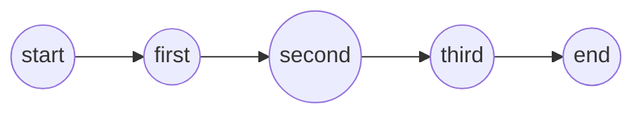

# Flink CEP原理与代码实例讲解

关键词：Flink CEP, 复杂事件处理, 事件流, 模式匹配, 状态机, NFA, 正则表达式

## 1. 背景介绍
### 1.1 问题的由来
在大数据时代，海量数据的实时处理和分析已成为各行各业的迫切需求。传统的批处理模式难以满足实时性要求，而流式计算以其低延迟、高吞吐的特点脱颖而出。然而，在实际应用中，我们经常需要从复杂的事件流中发现有价值的信息，例如异常行为检测、欺诈识别、物联网设备监控等。这就需要一种强大的工具来处理复杂事件，而 Flink CEP（Complex Event Processing）应运而生。

### 1.2 研究现状
目前，复杂事件处理已成为流式计算领域的研究热点。国内外学者对 CEP 的理论基础、系统架构、性能优化等方面进行了深入探索。Flink 作为 Apache 顶级项目，其 CEP 库在社区得到了广泛应用和验证，成为复杂事件处理的重要工具之一。不过，对于初学者来说，Flink CEP 的原理和使用方法仍有一定门槛，需要系统性的学习和实践。

### 1.3 研究意义
深入研究 Flink CEP 的原理和应用，对于掌握复杂事件处理技术具有重要意义。通过学习 Flink CEP，我们可以：

1. 理解复杂事件处理的基本概念和原理，掌握事件流的处理方法。
2. 学习 Flink CEP 的 API 使用方法，能够灵活应用到实际项目中。  
3. 借鉴 Flink CEP 的设计思想，对复杂事件处理系统的架构设计有更深刻的认识。
4. 探索 Flink CEP 在不同领域的应用场景，挖掘更多潜在价值。

### 1.4 本文结构
本文将从以下几个方面对 Flink CEP 进行详细讲解：

1. 介绍 Flink CEP 的核心概念和基本原理。
2. 深入剖析 Flink CEP 的内部实现机制和算法细节。
3. 结合实际案例，演示 Flink CEP 的 API 使用方法和代码实践。
4. 总结 Flink CEP 的特点优势，展望其未来的发展方向。

## 2. 核心概念与联系
在正式介绍 Flink CEP 之前，我们需要了解一些核心概念：

- 事件（Event）：事件是指在某个时间点发生的事情，通常带有时间戳和属性信息。例如，用户下单、传感器数据上报等。
- 事件流（Event Stream）：由一系列连续的事件构成，按照时间顺序排列。
- 模式（Pattern）：定义事件之间的复杂关系，用于从事件流中提取感兴趣的事件序列。
- 匹配（Match）：根据给定的模式，从事件流中找到符合条件的事件序列。

Flink CEP 的核心思想就是在事件流上定义模式，然后寻找与模式匹配的事件序列，进行相应的处理和分析。这里的关键是如何定义模式以及高效地匹配事件序列。

## 3. 核心算法原理 & 具体操作步骤
### 3.1 算法原理概述
Flink CEP 采用了 NFA（非确定有限自动机）算法进行事件序列的匹配。NFA 是一种状态机模型，可以表示正则表达式的匹配过程。Flink CEP 将模式转换为 NFA，然后在事件流上进行状态转移，找到匹配的事件序列。

### 3.2 算法步骤详解
1. 定义模式：用户使用 Pattern API 定义所需的模式，指定事件之间的关系、条件、时间约束等。
2. 创建 NFA：Flink CEP 根据用户定义的模式，构建对应的 NFA 状态机。
3. 事件处理：事件流中的每个事件都会输入到 NFA 中，触发状态转移。
4. 匹配输出：当到达 NFA 的终止状态时，说明找到了一个匹配的事件序列，将其输出到下游算子。
5. 状态管理：随着事件的不断处理，NFA 会产生大量状态。Flink CEP 采用状态后端对状态进行管理，并支持状态的序列化、持久化等。

### 3.3 算法优缺点
NFA 算法的优点在于：

- 可以表示复杂的模式，支持各种关系和条件的组合。
- 状态转移的过程清晰明了，易于理解和实现。
- 可以增量式处理事件，每个事件到达时触发状态转移，延迟低。

但 NFA 算法也存在一些局限性：

- 状态数量随着模式复杂度增加而快速膨胀，对存储和计算资源要求较高。
- 事件乱序到达可能导致匹配错误，需要引入额外的处理机制。

### 3.4 算法应用领域
NFA 算法是 CEP 系统的核心，除了 Flink CEP，很多其他 CEP 工具如 Esper、Siddhi 等也采用了类似的方法。NFA 在正则表达式、编译原理、XML 解析等领域也有广泛应用。

## 4. 数学模型和公式 & 详细讲解 & 举例说明
### 4.1 数学模型构建
我们可以用一个五元组 $(Q, \Sigma, \Delta, q_0, F)$ 来表示 NFA，其中：

- $Q$ 是有限状态集合
- $\Sigma$ 是有限字母表，即输入事件的集合
- $\Delta$ 是状态转移函数，$\Delta: Q \times \Sigma \rightarrow 2^Q$
- $q_0$ 是初始状态，$q_0 \in Q$
- $F$ 是终止状态集合，$F \subseteq Q$

### 4.2 公式推导过程
对于当前状态 $q \in Q$，输入事件 $e \in \Sigma$，下一个状态 $q' \in \Delta(q, e)$，即状态 $q$ 通过事件 $e$ 转移到状态 $q'$。

从初始状态 $q_0$ 出发，不断读入事件并进行状态转移，直到到达某个终止状态 $q_f \in F$，此时输出匹配的事件序列。

形式化地，我们可以用以下公式表示 NFA 的匹配过程：

$$
q_0 \stackrel{e_1}{\longrightarrow} q_1 \stackrel{e_2}{\longrightarrow} \dots \stackrel{e_n}{\longrightarrow} q_n \in F
$$

其中，$e_1, e_2, \dots, e_n$ 是输入的事件序列，$q_0, q_1, \dots, q_n$ 是状态转移的过程。

### 4.3 案例分析与讲解
下面我们用一个简单的例子来说明 NFA 的工作原理。假设要从事件流中检测连续三次登录失败的用户，我们可以定义如下模式：

```
pattern = Pattern.begin("first").where(_.eventType == "fail")
  .next("second").where(_.eventType == "fail")
  .next("third").where(_.eventType == "fail")
```

对应的 NFA 如下图所示：



假设输入事件序列为：`["fail", "success", "fail", "fail"]`，NFA 的状态转移过程如下：

1. 初始状态为 start，读入第一个事件 "fail"，匹配成功，转移到状态 first。
2. 读入第二个事件 "success"，不匹配 "fail"，状态不变。
3. 读入第三个事件 "fail"，匹配成功，从状态 first 转移到状态 second。
4. 读入第四个事件 "fail"，匹配成功，从状态 second 转移到状态 third，到达终止状态，输出匹配的事件序列 `["fail", "fail", "fail"]`。

### 4.4 常见问题解答
Q: Flink CEP 是否支持事件乱序的情况？
A: 是的，Flink CEP 提供了 within 和 allowedLateness 等选项来处理事件乱序。within 指定模式的有效时间窗口，allowedLateness 指定允许的最大延迟时间。

Q: Flink CEP 的状态存储在哪里？是否支持容错？
A: Flink CEP 的状态默认存储在 JVM 堆内存中，也支持使用 RocksDB 等外部存储。通过配置 Checkpoint，可以将状态持久化到可靠存储，实现容错和故障恢复。

## 5. 项目实践：代码实例和详细解释说明 
### 5.1 开发环境搭建
首先需要搭建 Flink 开发环境，可以使用 Maven 或 Gradle 创建 Flink 项目，添加必要的依赖：

```xml
<dependency>
  <groupId>org.apache.flink</groupId>
  <artifactId>flink-cep_2.12</artifactId>
  <version>1.13.1</version>
</dependency>
```

### 5.2 源代码详细实现
下面是一个使用 Flink CEP 进行模式匹配的完整示例：

```scala
object FlinkCEPExample {
  def main(args: Array[String]): Unit = {
    val env = StreamExecutionEnvironment.getExecutionEnvironment
    env.setParallelism(1)

    // 读取事件流
    val loginEventStream = env.fromElements(
      LoginEvent("user1", "fail", 1000L),
      LoginEvent("user2", "success", 2000L),
      LoginEvent("user1", "fail", 3000L),
      LoginEvent("user1", "fail", 4000L)
    )

    // 定义模式
    val loginFailPattern = Pattern.begin[LoginEvent]("first").where(_.eventType == "fail")
      .next("second").where(_.eventType == "fail")
      .next("third").where(_.eventType == "fail")
      .within(Time.seconds(10))

    // 在事件流上应用模式
    val patternStream = CEP.pattern(loginEventStream.keyBy(_.userId), loginFailPattern)

    // 处理匹配到的事件序列
    val loginFailDataStream = patternStream.select(new PatternSelectFunction[LoginEvent, String] {
      override def select(map: util.Map[String, util.List[LoginEvent]]): String = {
        val first = map.get("first").get(0)
        val second = map.get("second").get(0)
        val third = map.get("third").get(0)

        s"${first.userId} 连续三次登录失败！失败时间：${first.timestamp}, ${second.timestamp}, ${third.timestamp}"
      }
    })

    loginFailDataStream.print()

    env.execute("Flink CEP Example")
  }
}

case class LoginEvent(userId: String, eventType: String, timestamp: Long)
```

### 5.3 代码解读与分析
1. 首先创建 StreamExecutionEnvironment，设置并行度为1。
2. 使用 env.fromElements 创建测试数据，模拟用户登录事件流。
3. 定义登录失败的模式：连续三次登录失败，时间跨度不超过10秒。
4. 调用 CEP.pattern 在事件流上应用模式，得到 PatternStream。
5. 定义 PatternSelectFunction，处理匹配到的事件序列，输出报警信息。
6. 打印匹配到的登录失败事件，启动作业执行。

### 5.4 运行结果展示
运行程序，可以看到控制台输出以下信息：

```
user1 连续三次登录失败！失败时间：1000, 3000, 4000
```

说明程序成功检测出了符合模式的登录失败事件序列。

## 6. 实际应用场景
Flink CEP 可以应用于多个领域，解决实际业务中的复杂事件处理问题，例如：

- 实时风控：识别欺诈、洗钱等异常行为模式，实时预警和阻断。
- 系统监控：通过日志、指标等事件，发现系统故障、性能瓶颈等问题。
- 物联网分析：从海量传感器数据中提取有价值的事件模式，如设备故障、异常状态等。
- 用户行为分析：挖掘用户行为事件背后的规律和趋势，如购买路径、流失预警等。

### 6.4 未来应用展望
随着数字化转型的深入和新技术的发展，CEP 将在更多场景发挥价值：

- 与人工智能结合，实现智能化的复杂事件检测和预测。