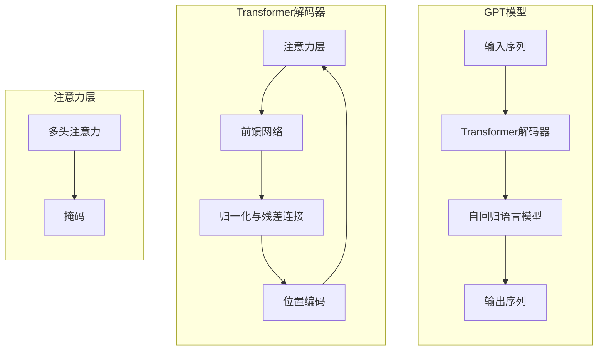

以下是对《GPT原理与代码实例讲解》这一主题的详细技术博客文章：

# GPT原理与代码实例讲解

## 1. 背景介绍

### 1.1 问题的由来

在过去几年中,自然语言处理(NLP)领域取得了长足的进步,很大程度上归功于transformer模型的出现和发展。Transformer是一种基于注意力机制的序列到序列模型,最初被提出用于机器翻译任务。2017年,Transformer模型在机器翻译任务上取得了卓越的成绩,随后迅速在NLP的各种下游任务中得到广泛应用,展现出强大的表现力。

然而,标准的Transformer模型存在一些固有的局限性。例如,由于自注意力层的计算复杂度随着序列长度的平方增长,因此很难处理超长序列。此外,Transformer缺乏对输入的归纳偏置,需要从大量数据中学习模式。为了解决这些问题,研究人员提出了各种改进的Transformer变体,其中以GPT(Generative Pre-trained Transformer)模型最为突出。

### 1.2 研究现状

GPT是一种基于Transformer解码器的自回归语言模型,由OpenAI于2018年首次提出。GPT通过在大型文本语料库上进行预训练,学习到通用的语言表示,然后可以通过微调(fine-tuning)的方式快速适应各种下游NLP任务。GPT的出现引发了预训练语言模型的热潮,掀起了NLP领域的新革命。

随后,GPT的改进版本GPT-2和GPT-3陆续问世,在模型规模、训练语料、下游任务表现等方面都有了大幅提升。GPT-3更是以其惊人的175亿参数规模,在各种NLP任务上展现出了接近人类的能力,引发了广泛关注和热议。

### 1.3 研究意义

GPT系列模型在NLP领域产生了深远的影响,体现了以下几个重要意义:

1. **通用语言表示能力**:GPT通过自监督方式在大规模语料上预训练,学习到了通用的语言表示,可以有效地迁移到各种下游NLP任务,显著提高了性能。
2. **大模型优势**:GPT-3等大规模模型展现了"规模优先"的重要性,证明了在数据和计算资源充足的情况下,大模型往往能够学习到更强的表示能力。
3. **少样本学习**:由于预训练的通用性,GPT可以在少量标注数据的情况下,通过微调快速适应新任务,实现了有效的少样本学习。
4. **多模态能力**:GPT不仅在文本领域表现优异,还展现出跨模态的能力,如视觉问答、图像描述等,为多模态AI奠定了基础。

总的来说,GPT系列模型代表了NLP领域的前沿水平,对于推动自然语言理解和生成技术的发展具有重要意义。

### 1.4 本文结构

本文将从以下几个方面全面介绍GPT模型:

1. **核心概念与联系**:介绍GPT模型的核心思想、基本架构以及与其他模型的联系。
2. **核心算法原理与操作步骤**:深入解析GPT模型的注意力机制、transformer结构、自回归语言模型等核心算法原理,并给出具体的操作步骤。
3. **数学模型和公式详解**:推导和讲解GPT模型中涉及的主要数学模型和公式,如注意力分数、掩码多头注意力等。
4. **代码实例和详细解释**:提供GPT模型的代码实现示例,并对关键模块进行逐步解释和分析。
5. **实际应用场景**:介绍GPT模型在自然语言生成、问答系统、机器翻译等领域的实际应用案例。
6. **工具和学习资源推荐**:总结GPT模型相关的优秀工具、学习资源、论文等,为读者提供进一步学习的途径。
7. **总结与展望**:对GPT模型的研究成果进行总结,并对未来的发展趋势和挑战进行前瞻性分析和展望。

接下来,我们将逐一深入探讨上述各个方面的内容。

## 2. 核心概念与联系

GPT(Generative Pre-trained Transformer)模型是一种基于Transformer解码器的自回归语言模型。其核心思想是:

1. **预训练**:在大规模无标注文本语料上进行自监督训练,学习通用的语言表示。
2. **自回归**:以自回归(Autoregressive)的方式生成序列,每个时间步的预测都依赖于之前的输出。
3. **Transformer解码器**:使用Transformer的解码器部分,包含多层注意力层和前馈网络。
4. **注意力机制**:通过自注意力机制捕捉序列中元素之间的长程依赖关系。

GPT模型的输入是一个文本序列,经过Transformer解码器的多层处理后,输出一个自回归的语言模型。解码器中的注意力层利用多头注意力和掩码机制,实现对输入序列的编码和自注意力计算。

GPT模型与经典的语言模型(如N-gram、RNN等)相比,具有以下优势:

1. **长程依赖建模**:基于注意力机制,能够有效捕捉长期依赖关系,不受序列长度的限制。
2. **并行计算**:Transformer的结构使得训练和推理可以高度并行,提高了计算效率。
3. **无顺序偏置**:与RNN不同,Transformer对序列元素无固有的顺序偏置,更加通用。
4. **可解释性**:注意力分数可视化,有助于理解模型内部机理。

GPT模型的出现,为NLP领域带来了新的范式,促进了预训练语言模型的发展。后续的BERT、XLNet、GPT-2、GPT-3等模型都是在GPT的基础上进行改进和扩展。

## 3. 核心算法原理与具体操作步骤

### 3.1 算法原理概述

GPT模型的核心算法原理包括以下几个方面:

1. **Transformer解码器结构**
2. **多头注意力机制**
3. **掩码自注意力**
4. **自回归语言模型**

这些算法原理相互关联、环环相扣,共同构建了GPT模型的核心框架。下面我们将逐一进行详细阐述。

### 3.2 算法步骤详解

#### 3.2.1 Transformer解码器结构

Transformer解码器是GPT模型的基础架构,由多个相同的解码器层堆叠而成。每个解码器层包含以下几个子层:

1. **多头注意力子层**:对输入序列进行自注意力编码,捕捉元素间的依赖关系。
2. **前馈网络子层**:对注意力输出进行进一步的非线性变换,提取高阶特征。
3. **残差连接和层归一化**:残差连接和层归一化用于促进梯度传播,提高模型收敛性。

解码器层的具体计算过程如下所示:

1. 输入序列 $X$ 首先通过位置编码,注入序列位置信息,得到 $X'$。
2. $X'$ 进入第一个解码器层,经过多头注意力子层和前馈网络子层的变换,得到该层的输出 $Z^1$。
3. 对于第 $l$ 个解码器层,其输入为上一层的输出 $Z^{l-1}$,计算过程为:

$$Z^l = \text{LayerNorm}(Z^{l-1} + \text{FeedForward}(\text{LayerNorm}(Z^{l-1} + \text{MultiHeadAttention}(Z^{l-1}))))$$

4. 最后一个解码器层的输出 $Z^L$ 即为整个Transformer解码器的输出,送入后续的自回归语言模型中。

#### 3.2.2 多头注意力机制

多头注意力机制是Transformer的核心,允许模型同时关注输入序列中的不同位置。具体计算步骤如下:

1. 将输入 $X$ 线性映射到查询(Query)、键(Key)和值(Value)向量:

$$\begin{aligned}
Q &= XW^Q \\
K &= XW^K \\
V &= XW^V
\end{aligned}$$

其中 $W^Q$、$W^K$、$W^V$ 为可学习的权重矩阵。

2. 计算注意力分数:

$$\text{Attention}(Q, K, V) = \text{softmax}(\frac{QK^T}{\sqrt{d_k}})V$$

其中 $d_k$ 为缩放因子,用于防止较深层次的注意力值过小。

3. 多头注意力通过并行计算 $h$ 个注意力头,再进行拼接得到最终输出:

$$\text{MultiHead}(Q, K, V) = \text{Concat}(\text{head}_1, ..., \text{head}_h)W^O$$

$$\text{where } \text{head}_i = \text{Attention}(QW_i^Q, KW_i^K, VW_i^V)$$

其中 $W_i^Q$、$W_i^K$、$W_i^V$ 和 $W^O$ 为可学习的投影矩阵。

#### 3.2.3 掩码自注意力

在自回归语言模型中,我们需要防止模型利用将来的信息,因此在计算自注意力时,需要对未来的位置进行掩码。具体做法是:在计算注意力分数前,将注意力矩阵的上三角(对应未来位置)用一个很小的常数值(如 $-\infty$)进行掩码,这样一来,注意力就只能分配到当前和过去的位置上。

形式化地,掩码自注意力的计算公式为:

$$\text{MaskedAttention}(Q, K, V) = \text{softmax}(\frac{QK^T + M}{\sqrt{d_k}})V$$

其中 $M$ 为掩码矩阵,对应未来位置的元素为 $-\infty$,其余位置为 $0$。

#### 3.2.4 自回归语言模型

GPT模型的最终目标是学习一个自回归的语言模型,即给定过去的词 $x_1, ..., x_t$,预测下一个词 $x_{t+1}$ 的概率分布:

$$P(x_{t+1} | x_1, ..., x_t)$$

具体来说,自回归语言模型的计算步骤为:

1. 将输入序列 $X$ 通过Transformer解码器,得到每个位置的隐层表示 $Z$。
2. 对每个位置的隐层表示 $z_t$ 进行线性变换和 softmax 运算,得到该位置的词的概率分布:

$$P(x_t | x_1, ..., x_{t-1}) = \text{softmax}(z_tW + b)$$

其中 $W$ 和 $b$ 为可学习的参数。

3. 在训练阶段,最小化语言模型的交叉熵损失函数:

$$\mathcal{L} = -\sum_t \log P(x_t | x_1, ..., x_{t-1})$$

4. 在推理阶段,给定起始序列,通过贪婪搜索或束搜索等方法,自回归地生成新序列。

通过上述自监督的预训练方式,GPT模型可以在大规模语料上学习到通用的语言表示,并具备强大的文本生成能力。

### 3.3 算法优缺点

#### 优点

1. **长程依赖建模**:基于自注意力机制,GPT能够有效捕捉输入序列中元素之间的长程依赖关系,不受序列长度的限制。
2. **并行计算**:Transformer的结构使得训练和推理可以高度并行,提高了计算效率。
3. **无顺序偏置**:与RNN不同,Transformer对序列元素无固有的顺序偏置,更加通用。
4. **可解释性**:注意力分数可视化,有助于理解模型内部机理。
5. **通用语言表示**:通过大规模预训练,GPT可以学习到通用的语