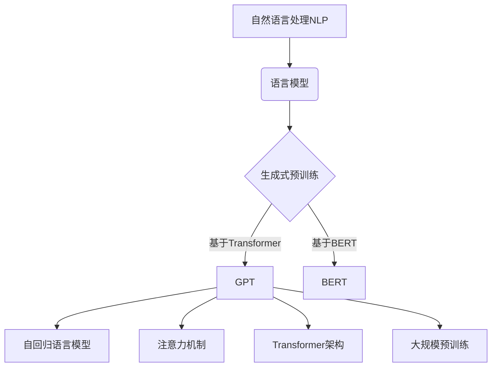

以下是关于《GPT原理与代码实例讲解》的技术博客文章正文内容：

# GPT原理与代码实例讲解

## 1. 背景介绍

### 1.1 问题的由来

在过去几年中,自然语言处理(NLP)领域取得了长足的进步。其中,生成式预训练转换器(Generative Pre-trained Transformer,GPT)模型展现出了强大的语言生成能力,在多个任务中取得了令人瞩目的成绩。GPT模型通过在大规模语料库上进行预训练,学习到了丰富的语言知识,从而能够生成高质量、连贯的文本。然而,GPT模型的工作原理及其内在机制仍然存在一些未解之谜,需要我们进一步探索和剖析。

### 1.2 研究现状  

目前,已有大量研究致力于探索和解释GPT模型的工作原理。研究人员从不同角度分析了GPT模型,包括注意力机制、transformer架构、语言模型预训练策略等。一些研究工作还尝试通过可视化技术来直观地理解GPT模型的内部表示和决策过程。然而,由于GPT模型的复杂性,很多细节仍然有待进一步探索和阐释。

### 1.3 研究意义

深入理解GPT模型的工作原理对于进一步提高其性能、扩展其应用场景至关重要。通过剖析GPT模型的内在机制,我们可以发现其中的关键因素和潜在瓶颈,从而优化模型结构、训练策略等,进一步提升模型的生成质量和泛化能力。此外,对GPT模型的深入理解也将为其在新领域的应用奠定基础,推动自然语言处理技术的发展。

### 1.4 本文结构

本文将全面解析GPT模型的工作原理,内容包括:

1. 核心概念与联系
2. 核心算法原理及具体操作步骤
3. 数学模型和公式详细讲解及案例分析
4. 代码实例和详细解释说明
5. 实际应用场景分析
6. 工具和资源推荐
7. 总结及未来发展趋势与挑战
8. 附录:常见问题与解答

接下来,我们将逐一探讨上述内容。

## 2. 核心概念与联系

GPT模型是自然语言处理(NLP)领域中的一种语言模型,它基于生成式预训练策略,利用Transformer架构构建了一种自回归语言模型。GPT模型的核心概念包括:

1. **自回归语言模型**: GPT模型属于自回归语言模型的范畴。自回归语言模型是一种基于序列的生成模型,它根据之前生成的词来预测下一个词,从而生成整个序列。与此不同,另一类语言模型(如BERT)则是基于掩码语言模型,通过预测被掩蔽的词来学习语言表示。

2. **注意力机制**: GPT模型采用了自注意力(Self-Attention)机制,这是Transformer架构的核心部分。注意力机制允许模型在生成每个词时,关注输入序列中的不同位置,捕捉长距离依赖关系。

3. **Transformer架构**: GPT模型基于Transformer架构,该架构完全依赖于注意力机制,摒弃了传统的卷积或循环神经网络结构。Transformer架构使模型能够高效地并行计算,从而加速训练和推理过程。

4. **大规模预训练**: GPT模型在大规模语料库上进行了预训练,从而学习到了丰富的语言知识。预训练过程使用了自监督学习策略,通过最大化语言模型的似然函数来优化模型参数。

上述核心概念相互关联、相辅相成,共同赋予了GPT模型强大的语言生成能力。接下来,我们将详细探讨GPT模型的核心算法原理及具体实现步骤。

## 3. 核心算法原理 & 具体操作步骤

### 3.1 算法原理概述

GPT模型的核心算法原理基于自回归语言模型和Transformer架构。自回归语言模型的目标是最大化给定上文的条件下,生成正确下文的概率。具体来说,对于一个长度为n的序列$X=(x_1, x_2, ..., x_n)$,自回归语言模型需要学习条件概率分布:

$$P(X) = \prod_{t=1}^{n}P(x_t|x_1, x_2, ..., x_{t-1})$$

其中,每个条件概率$P(x_t|x_1, x_2, ..., x_{t-1})$表示生成第t个词的概率,给定之前生成的所有词。

为了高效地建模上述条件概率分布,GPT模型采用了Transformer架构,利用注意力机制捕捉输入序列中词与词之间的依赖关系。具体来说,Transformer由编码器(Encoder)和解码器(Decoder)两部分组成。在GPT模型中,只使用了Decoder部分,因为它是一个纯解码器(Decoder-only)模型。

Decoder的核心是多头自注意力(Multi-Head Self-Attention)机制,它允许每个位置的词与输入序列中的其他位置交互,捕捉长距离依赖关系。此外,Decoder还包括前馈神经网络(Feed-Forward Neural Network)和残差连接(Residual Connection),以提高模型的表达能力和优化效率。

### 3.2 算法步骤详解

GPT模型的训练和推理过程可以概括为以下几个主要步骤:

1. **输入表示**:将输入文本序列转换为词嵌入(Word Embedding)向量表示。

2. **位置编码**:为每个词嵌入添加位置编码(Positional Encoding),使模型能够捕捉词序信息。

3. **多头自注意力**:计算每个词与输入序列中其他词的注意力权重,并根据权重对词嵌入进行加权求和,生成新的表示向量。

4. **前馈神经网络**:对注意力输出进行非线性变换,提取更高层次的特征表示。

5. **残差连接**:将注意力输出和前馈神经网络输出相加,形成残差连接,有助于梯度传播和模型优化。

6. **生成概率**:对最终的输出向量进行线性变换和softmax操作,得到生成每个词的概率分布。

7. **损失计算**:将生成概率与真实标签进行比较,计算交叉熵损失。

8. **梯度下降**:基于损失函数,使用优化器(如Adam)进行梯度下降,更新模型参数。

在推理阶段,GPT模型根据给定的上文,自回归地生成下一个词,并将其作为输入,重复上述过程,直到生成完整序列或达到最大长度。

### 3.3 算法优缺点

GPT模型具有以下优点:

1. **强大的生成能力**:通过预训练,GPT模型学习到了丰富的语言知识,能够生成高质量、连贯的文本。

2. **长距离依赖建模**:注意力机制使GPT模型能够有效捕捉长距离依赖关系,克服了传统序列模型的局限性。

3. **高效并行计算**:Transformer架构摒弃了循环或卷积结构,允许高效的并行计算,加速了训练和推理过程。

4. **可解释性**:通过可视化注意力权重,我们可以直观地理解模型的决策过程。

然而,GPT模型也存在一些缺点和局限性:

1. **单向性**:作为一种自回归模型,GPT只能从左到右生成序列,无法利用右侧上下文信息。

2. **计算资源需求高**:由于模型规模庞大,GPT模型对计算资源的需求较高,训练和推理成本较大。

3. **生成偏差**:GPT模型可能会产生不合理或有偏差的生成结果,需要进一步的控制和优化。

4. **领域迁移能力有限**:预训练语料的领域决定了模型的知识范围,跨领域迁移能力仍有待提高。

### 3.4 算法应用领域

由于其强大的语言生成能力,GPT模型在多个领域都有广泛的应用前景:

1. **自然语言生成(NLG)**:包括文本生成、机器写作、对话系统、创意写作等。

2. **机器翻译**:GPT可用于构建高质量的神经机器翻译系统。

3. **问答系统**:通过预训练,GPT模型可用于构建具备一定推理能力的问答系统。

4. **代码生成**:GPT模型也可应用于代码自动补全、代码生成等任务。

5. **其他领域**:GPT模型还可能在信息检索、推荐系统、知识图谱构建等领域发挥作用。

总的来说,GPT模型为自然语言处理领域带来了新的发展机遇,其影响正在逐步扩展到更多领域。

## 4. 数学模型和公式 & 详细讲解 & 举例说明

### 4.1 数学模型构建

GPT模型的数学模型基于自回归语言模型和Transformer架构。我们将分步骤构建该模型的数学表示。

1. **自回归语言模型**

我们定义一个长度为n的序列$X=(x_1, x_2, ..., x_n)$,其中$x_t$表示第t个词。自回归语言模型的目标是最大化生成整个序列的概率:

$$P(X) = \prod_{t=1}^{n}P(x_t|x_1, x_2, ..., x_{t-1})$$

其中,每个条件概率$P(x_t|x_1, x_2, ..., x_{t-1})$表示生成第t个词的概率,给定之前生成的所有词。

2. **Transformer架构**

为了高效地建模上述条件概率分布,GPT模型采用了Transformer架构。我们定义Transformer的输入为$X$,输出为$Y$,其中$Y$也是一个长度为n的序列,表示生成的词的概率分布。

Transformer由多个相同的层组成,每一层包含一个多头自注意力(Multi-Head Self-Attention)子层和一个前馈神经网络(Feed-Forward Neural Network)子层。我们用$\text{Attention}(\cdot)$和$\text{FFN}(\cdot)$分别表示这两个子层的计算过程。

对于第$l$层,其计算过程可以表示为:

$$\begin{aligned}
\tilde{X}^{(l)} &= \text{Attention}(X^{(l)}) \\
X^{(l+1)} &= \text{FFN}(\tilde{X}^{(l)})
\end{aligned}$$

其中,$X^{(l)}$表示第$l$层的输入,$\tilde{X}^{(l)}$表示经过自注意力子层后的输出,$X^{(l+1)}$表示经过前馈神经网络子层后的输出,也是下一层的输入。

3. **注意力机制**

注意力机制是Transformer架构的核心部分。对于一个查询向量$q$、键向量$k$和值向量$v$,注意力计算过程如下:

$$\text{Attention}(q, k, v) = \text{softmax}\left(\frac{qk^T}{\sqrt{d_k}}\right)v$$

其中,$d_k$是缩放因子,用于防止点积过大导致梯度消失。

在GPT模型中,查询、键和值向量都来自同一个输入序列$X$。具体来说,对于第$l$层的第$i$个位置,其查询向量$q_i^{(l)}$、键向量$k_i^{(l)}$和值向量$v_i^{(l)}$分别为:

$$\begin{aligned}
q_i^{(l)} &= X_i^{(l)}W_q^{(l)} \\
k_i^{(l)} &= X_i^{(l)}W_k^{(l)} \\
v_i^{(l)} &= X_i^{(l)}W_v^{(l)}
\end{aligned}$$

其中,$W_q^{(l)}$、$W_k^{(l)}$和$W_v^{(l)}$是可学习的权重矩阵。

多头自注意力机制将多个注意力头的输出进行拼接,从而捕捉不同的依赖关系