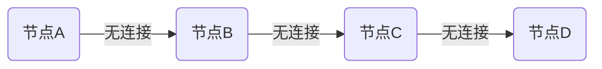
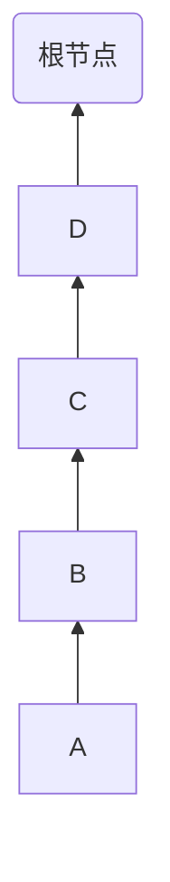
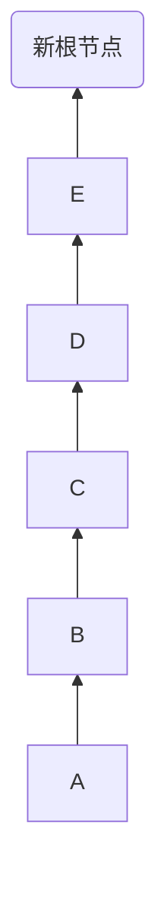
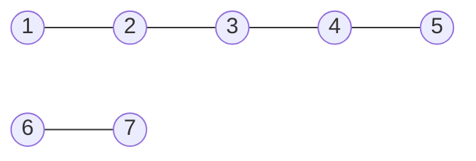

好的，我了解了您的要求。以下是标题为《Graph Connected Components算法原理与代码实例讲解》的技术博客文章正文部分:

# Graph Connected Components算法原理与代码实例讲解

## 1. 背景介绍

### 1.1 问题的由来

在图论和计算机科学中,连通分量(Connected Component)是无向图或有向图中极为重要的概念。一个连通分量由若干节点组成,这些节点之间存在路径相互连通,而与其他连通分量中的节点没有连接关系。能够快速高效地找出图中的所有连通分量,对于网络拓扑分析、社交网络分析、计算机视觉目标检测等许多领域都有重要应用价值。

### 1.2 研究现状  

传统的连通分量查找算法主要有深度优先搜索(DFS)、广度优先搜索(BFS)和并查集(Union-Find)等。近年来,随着大规模图数据的出现,高效的并行化连通分量算法也成为研究热点。此外,一些基于图神经网络(GNN)的新型算法也展现出良好的性能表现。

### 1.3 研究意义

高效的连通分量识别算法可以为大规模网络拓扑分析、社交网络分析、计算机视觉目标检测等应用提供强有力的支持。同时,研究这些算法的并行化和分布式实现,可以帮助我们更好地处理大规模图数据。

### 1.4 本文结构

本文将首先介绍连通分量的核心概念,然后详细阐述基于并查集的经典连通分量算法原理、数学模型及实现细节,并通过实例代码讲解其应用。最后,我们将探讨算法的实际应用场景、发展趋势和面临的挑战。

## 2. 核心概念与联系

在无向图G=(V,E)中,如果从节点u到节点v存在一条路径,那么我们称u和v是连通的。一个连通分量是指所有节点之间互相连通的最大节点集合。有向图中的连通分量概念类似,只是路径的定义是单向的。

连通分量与图的其他重要概念也存在密切联系:

- 生成树(Spanning Tree):一个无环连通子图,包含了图中所有节点。每个连通分量都对应一棵生成树。
- 割点(Articulation Point)和桥(Bridge):如果去掉某个节点或边后,会导致连通分量数量增加,那么该节点或边就是割点或桥。
- 双连通分量(Biconnected Component):如果去掉任意一个节点和与它相连的边,图仍保持连通,则称这个子图为双连通分量。

因此,研究连通分量算法不仅可以解决连通性问题,也能为相关的图理论问题提供算法支持。

## 3. 核心算法原理 & 具体操作步骤

### 3.1 算法原理概述

并查集(Union-Find)是一种高效的连通分量查找算法。它的核心思想是使用一个父节点数组来存储每个节点所属的连通分量。初始时,每个节点都属于不同的连通分量。然后通过Union和Find两个基本操作来动态维护连通分量信息。

### 3.2 算法步骤详解

1. **初始化**:遍历所有节点,将每个节点的父节点设置为自身,表示初始时每个节点都是一个独立的连通分量。



2. **Find操作**:通过不断查找当前节点的父节点,直到找到连通分量的根节点。这一过程可以使用路径压缩(Path Compression)来加速。



3. **Union操作**:将两个连通分量的根节点进行合并,使它们属于同一个连通分量。这里可以使用按秩合并(Union by Rank)来加速。



4. **查找连通分量**:遍历所有边,对于每一条边(u,v),先找到u和v分别所属的根节点root_u和root_v。如果root_u != root_v,则进行Union操作,将两个连通分量合并。



重复第4步,直到所有边都被处理完毕。此时,连通分量的数量就是根节点的个数。

### 3.3 算法优缺点

**优点**:
- 时间复杂度较低,在满足适当条件时可以达到接近线性的平均时间复杂度。
- 实现简单,代码量少。
- 适用于静态图和动态图。

**缺点**:
- 不适合超大规模图,因为需要维护大量的父节点信息。
- 不能直接得到每个连通分量中节点的具体信息,需要额外遍历。

### 3.4 算法应用领域

并查集算法可以广泛应用于以下领域:

- **网络拓扑分析**: 分析网络中的连通性和故障隔离情况。
- **计算机视觉**: 用于图像分割和目标检测。
- **社交网络分析**: 发现社交网络中的社区结构。
- **电路设计**: 检测电路中的环路和等效节点。
- **操作系统**: 磁盘空间管理和文件系统设计。

## 4. 数学模型和公式 & 详细讲解 & 举例说明

### 4.1 数学模型构建

令无向图G=(V,E)的节点集合为V={0,1,2,...,n-1}。定义一个长度为n的父节点数组parent,初始时parent[i]=i,表示每个节点都属于不同的连通分量。

定义Find(x)操作为查找节点x所属的根节点:

$$
\text{Find}(x) = 
\begin{cases}
x & \text{if } \text{parent}[x]=x\\
\text{parent}[x] = \text{Find}(\text{parent}[x]) & \text{otherwise}
\end{cases}
$$

定义Union(x,y)操作为将节点x和y所在的两个连通分量合并:

$$
\text{Union}(x, y) = 
\begin{cases}
\text{parent}[\text{root}_x] = \text{root}_y & \text{if } \text{rank}(\text{root}_x) < \text{rank}(\text{root}_y)\\
\text{parent}[\text{root}_y] = \text{root}_x & \text{if } \text{rank}(\text{root}_x) \geq \text{rank}(\text{root}_y)
\end{cases}
$$

其中$\text{root}_x$和$\text{root}_y$分别表示x和y的根节点,$\text{rank}$是一个辅助函数,用于记录每个根节点所在树的高度,以实现按秩合并。

### 4.2 公式推导过程

我们可以用数学归纳法证明Find和Union操作的正确性。

**Find操作**:
- 初始时,对任意x,$\text{Find}(x)=x$,显然成立。
- 假设对任意y,$\text{Find}(y)$可以正确找到y所在连通分量的根节点。
- 对任意x,如果$\text{parent}[x]=x$,则$\text{Find}(x)=x$成立。否则,$\text{Find}(x)$会递归调用$\text{Find}(\text{parent}[x])$,由归纳假设可知后者会正确返回$\text{parent}[x]$所在连通分量的根节点。同时,路径压缩操作$\text{parent}[x]=\text{Find}(\text{parent}[x])$会将x直接指向该根节点。

**Union操作**:
- 初始时,每个节点都是一个独立的连通分量,故Union操作是正确的。
- 假设在合并之前,x和y分别已经正确地找到了各自连通分量的根节点$\text{root}_x$和$\text{root}_y$。
- 如果$\text{rank}(\text{root}_x)<\text{rank}(\text{root}_y)$,则将$\text{root}_x$的树并入$\text{root}_y$的树,保证了新树的最大高度不超过$\text{rank}(\text{root}_y)+1$。
- 如果$\text{rank}(\text{root}_x)\geq\text{rank}(\text{root}_y)$,则将$\text{root}_y$的树并入$\text{root}_x$的树,新树的最大高度也不超过$\text{rank}(\text{root}_x)+1$。
- 由于按秩合并保证了树的最大高度最多增加1,因此Union操作是正确的。

### 4.3 案例分析与讲解

假设有一个无向图G,节点集合为V={0,1,2,3,4,5,6,7,8},边集合为E={(0,1),(1,2),(3,4),(4,5),(6,7),(6,8)}。我们用并查集算法来找出G的连通分量。

1. 初始化parent数组:
```
parent = [0, 1, 2, 3, 4, 5, 6, 7, 8]
```

2. 处理第一条边(0,1):
```
parent = [0, 0, 2, 3, 4, 5, 6, 7, 8]  # Union(0, 1)
```

3. 处理第二条边(1,2):
```
parent = [0, 0, 0, 3, 4, 5, 6, 7, 8]  # Union(2, 0)  
```

4. 处理第三条边(3,4):
```
parent = [0, 0, 0, 3, 3, 3, 6, 7, 8]  # Union(4, 3)
```

5. 处理第四条边(4,5):
```
parent = [0, 0, 0, 3, 3, 3, 6, 7, 8]  # 4,5已经在同一连通分量
```

6. 处理第五条边(6,7):
```
parent = [0, 0, 0, 3, 3, 3, 6, 6, 8]  # Union(7, 6)
```

7. 处理第六条边(6,8):
```
parent = [0, 0, 0, 3, 3, 3, 6, 6, 6]  # Union(8, 6)
```

最终,parent数组中有3个根节点0、3、6,因此图G有3个连通分量:
- 连通分量1: {0, 1, 2}
- 连通分量2: {3, 4, 5} 
- 连通分量3: {6, 7, 8}

### 4.4 常见问题解答

**Q: 为什么需要路径压缩和按秩合并?**

A: 路径压缩(Path Compression)可以将树的高度控制在一个较小的常数级别,从而使Find操作的平均时间复杂度接近常数级。按秩合并(Union by Rank)则可以防止树的高度过高,从而使Union操作的时间复杂度也接近常数级。这两种优化策略共同保证了并查集算法的高效性。

**Q: 并查集算法是否适用于有向图?**

A: 并查集算法本身是针对无向图设计的,但也可以通过一些变体来处理有向图。一种常见做法是将有向图转化为无向图,即对于每条有向边(u,v),都添加一条无向边(u,v)和(v,u)。然后在这个无向图上运行并查集算法即可。但这种做法会增加边的数量,对于稠密图可能会导致额外的时空开销。

**Q: 并查集算法是否可以处理边权值?**

A: 经典的并查集算法只能处理无权图,如果需要处理有权图,则需要结合其他算法,比如Kruskal算法用于求最小生成树。具体做法是先对所有边按权值从小到大排序,然后从小到大遍历每条边,如果该边的两个端点不在同一个连通分量中,就将它们所在的连通分量合并。最终剩下的边集就构成了最小生成树。

## 5. 项目实践:代码实例和详细解释说明  

### 5.1 开发环境搭建

本示例使用Python编程语言,版本为3.8。你可以使用任何支持Python的IDE或者代码编辑器,比如PyCharm、Visual Studio Code等。

### 5.2 源代码详细实现

```python
class UnionFind:
    def __init__(self, n):
        self.parent = list(range