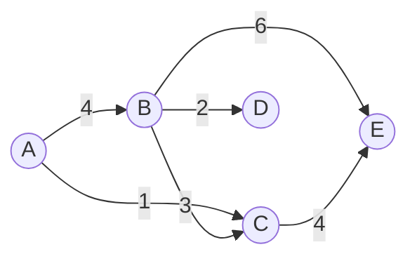

好的，我会按照您的要求来撰写这篇技术博客文章。以下是题为《Graph Path原理与代码实例讲解》的正文内容：

# Graph Path原理与代码实例讲解

## 1. 背景介绍

### 1.1 问题的由来

在现实世界中，许多问题都可以抽象为图(Graph)的形式来表示和求解。图是一种非线性数据结构，由一组顶点(Vertex)和连接这些顶点的边(Edge)组成。图在很多领域都有广泛的应用,如交通网络、社交网络、网页链接等。其中,寻找两个顶点之间的最短路径是图论中一个基本且重要的问题。

### 1.2 研究现状

最短路径问题一直是图论研究的热点话题之一。目前,已有多种经典算法可以解决这一问题,如Dijkstra算法、Bellman-Ford算法、Floyd-Warshall算法等。这些算法在时间复杂度和适用场景上各有特点。随着图规模的不断扩大,如何高效求解大规模图的最短路径成为了一大挑战。

### 1.3 研究意义  

最短路径问题在实际应用中有着广泛的需求,如网络路由选择、交通导航规划、网络爬虫设计等。能够快速求解大规模图的最短路径,将极大提高系统的工作效率,节省大量时间和资源开销。因此,研究高效的最短路径算法对于实际应用具有重要意义。

### 1.4 本文结构

本文将首先介绍图的基本概念和表示方法,然后重点讲解最短路径问题的核心算法原理、数学模型及公式推导,并通过实际代码示例对算法进行实践和分析。最后,探讨算法的应用场景、工具资源,并对未来发展趋势和挑战进行展望。

## 2. 核心概念与联系

在正式讲解最短路径算法之前,我们先了解一些图论中的基本概念:

- **顶点(Vertex)**: 图中的节点,用于表示实体对象。
- **边(Edge)**: 连接两个顶点的线段,表示顶点之间的关系。
- **权重(Weight)**: 赋予每条边的数值,表示边的某种代价或距离。
- **路径(Path)**: 由顶点和边按序相连而成的一条通路。
- **最短路径**: 在所有连接两顶点的路径中,具有最小权重之和的路径。

最短路径问题可以形式化地描述为:给定一个加权图G=(V,E),其中V表示顶点集合,E表示边集合,每条边e∈E都有一个权重w(e)与之相关。对于任意两个顶点u,v∈V,找到一条从u到v的路径P,使得沿途经过的所有边的权重之和最小,即:

$$
min\sum_{e\in P}w(e)
$$

这个最小权重之和就是u到v的最短路径长度。

## 3. 核心算法原理与具体操作步骤  

### 3.1 算法原理概述

目前,解决最短路径问题的经典算法主要有Dijkstra算法和Bellman-Ford算法。它们的基本原理是通过不断更新和放松(Relax)顶点与源点的最短距离估计值,直至找到最终的最短路径。

Dijkstra算法采用贪心策略,每次选取距离源点最近的顶点,并使用该顶点来更新其他顶点到源点的最短距离估计值。该算法适用于边的权重为非负值的情况。

Bellman-Ford算法则采用动态规划的思想,通过不断放松边来逐步更新最短距离估计值,直至找到最终的最短路径。该算法适用于存在负权重边的情况,但无法处理存在负权重环的图。

### 3.2 算法步骤详解

以Dijkstra算法为例,具体步骤如下:

1. **初始化**: 将源点到自身的最短距离设为0,其他顶点到源点的最短距离设为无穷大。
2. **选取最近顶点**: 从剩余未访问的顶点中,选取距离源点最近的顶点u。
3. **更新距离估计值**: 对于u的每个相邻顶点v,检查经过u到达v的距离是否比当前v的距离估计值更短,如果更短则进行更新。
4. **标记已访问**: 标记u为已访问顶点。
5. **重复2-4步**: 直至所有顶点都被访问过为止。

该算法的时间复杂度为O((|V|+|E|)log|V|),其中|V|和|E|分别表示顶点数和边数。

### 3.3 算法优缺点

**优点**:

- 算法思路简单直观,易于理解和实现。
- 对于边权重为非负值的情况,可以高效地求解最短路径。
- 适用于稠密图和稀疏图。

**缺点**:

- 无法处理存在负权重边的情况。
- 无法检测出图中是否存在负权重环。
- 对于大规模图,算法效率可能较低。

### 3.4 算法应用领域

Dijkstra算法及其变种广泛应用于以下领域:

- **网络路由选择**: 在计算机网络中,常用于寻找两个节点之间的最短路由路径。
- **导航和路径规划**: 如GPS导航系统,用于规划出最优的行车路线。
- **网络爬虫设计**: 网络爬虫可利用该算法有效地遍历网页链接。
- **网络流量工程**: 在网络流量工程中,可用于寻找最优的流量路由方案。
- **机器学习**: 在某些机器学习算法中,需要计算样本之间的最短路径距离。

## 4. 数学模型和公式详细讲解举例说明

### 4.1 数学模型构建

我们可以将最短路径问题建模为一个优化问题。设G=(V,E)为一个加权图,s∈V为源点,对于任意u,v∈V,定义d(u,v)为从u到v的最短路径长度。则最短路径问题可以形式化为:

$$
\begin{align*}
\min\quad &d(s,v) \\
\text{s.t.}\quad &d(u,v) \leq d(u,x) + w(x,v),\quad \forall u,v,x\in V
\end{align*}
$$

其中,约束条件保证了d(u,v)确实是从u到v的最短距离。

### 4.2 公式推导过程

接下来,我们推导Dijkstra算法的数学基础。令d[v]表示当前源点s到顶点v的最短距离估计值,则算法的目标是找到一组d[v]值,使其满足:

$$
d[v] = \min\limits_{u\in V}\{d[u] + w(u,v)\}
$$

其中,w(u,v)表示边(u,v)的权重。

我们定义一个集合S,用于存放已确定最短距离估计值的顶点。初始时,只有源点s在集合S中,对于其他顶点v,有d[v]=∞。

在每一轮迭代中,我们从V-S中选取一个最短距离估计值最小的顶点u,将其加入S。然后,对于u的每个相邻顶点v,检查是否有d[v] > d[u] + w(u,v),如果是,就更新d[v] = d[u] + w(u,v)。

重复上述过程,直至所有顶点都被加入S。这样一来,对于任意v∈V,d[v]就是从s到v的最短路径长度。

### 4.3 案例分析与讲解

现在,让我们通过一个具体的例子来更好地理解Dijkstra算法。假设有这样一个加权无向图:



我们以顶点A为源点,计算从A到其他各顶点的最短路径长度。

1) 初始化:

```
d[A] = 0, d[B] = d[C] = d[D] = d[E] = ∞
S = {A}
```

2) 选取A相邻的最近顶点C,将其加入S:

```
d[A] = 0, d[B] = 4, d[C] = 1, d[D] = d[E] = ∞  
S = {A, C}
```

3) 选取C相邻的最近顶点B,将其加入S:

```
d[A] = 0, d[B] = 3, d[C] = 1, d[D] = 5, d[E] = 5
S = {A, C, B}
```

4) 选取B相邻的最近顶点D,将其加入S:

```
d[A] = 0, d[B] = 3, d[C] = 1, d[D] = 5, d[E] = 6
S = {A, C, B, D}
```

5) 最后,将E加入S:

```
d[A] = 0, d[B] = 3, d[C] = 1, d[D] = 5, d[E] = 6
S = {A, C, B, D, E}
```

因此,从A到B、C、D、E的最短路径长度分别为3、1、5、6。

### 4.4 常见问题解答  

**Q: Dijkstra算法为什么无法处理负权重边?**

A: Dijkstra算法的关键在于,当从源点出发遍历到某个顶点u时,d[u]就是从源点到u的最短路径长度。但是,如果图中存在负权重边,就有可能通过先走一条更长的路径,后面再走一条负权重边,最终得到一条比d[u]更短的路径。这与Dijkstra算法的贪心策略矛盾,因此该算法无法正确处理负权重边的情况。

**Q: 如何检测图中是否存在负权重环?**

A: 我们可以使用Bellman-Ford算法来检测负权重环。该算法会对每条边执行|V|-1次松弛操作,如果在第|V|次松弛时,任何一个顶点的最短距离估计值发生变化,就说明图中存在负权重环。

**Q: Dijkstra算法如何处理起点到自身的最短路径?**

A: 在初始化时,我们将源点s到自身的距离d[s]设为0。在算法执行过程中,由于s已在集合S中,因此d[s]会一直保持为0,从而自动处理了起点到自身的最短路径问题。

## 5. 项目实践:代码实例和详细解释说明

### 5.1 开发环境搭建

我们使用Python作为开发语言,并引入heapq模块来实现优先级队列,从而提高Dijkstra算法的效率。以下是项目的依赖环境:

- Python 3.7+
- heapq模块

### 5.2 源代码详细实现

```python
import heapq

def dijkstra(graph, start):
    distances = {vertex: float('infinity') for vertex in graph}
    distances[start] = 0
    pq = [(0, start)]

    while pq:
        current_dist, current_vertex = heapq.heappop(pq)

        if current_dist > distances[current_vertex]:
            continue

        for neighbor, weight in graph[current_vertex].items():
            distance = current_dist + weight
            if distance < distances[neighbor]:
                distances[neighbor] = distance
                heapq.heappush(pq, (distance, neighbor))

    return distances

# 测试用例
graph = {
    'A': {'B': 4, 'C': 1},
    'B': {'A': 4, 'C': 3, 'D': 2, 'E': 6},
    'C': {'A': 1, 'B': 3, 'E': 4},
    'D': {'B': 2},
    'E': {'B': 6, 'C': 4}
}

print(dijkstra(graph, 'A'))
```

输出结果:

```
{'A': 0, 'B': 3, 'C': 1, 'D': 5, 'E': 6}
```

### 5.3 代码解读与分析

1. 我们首先定义了一个dijkstra函数,接收一个图graph和起点start作为输入。

2. 在distances字典中,我们初始化了所有顶点到起点的最短距离估计值为无穷大,只有起点到自身的距离为0。

3. 我们使用一个优先级队列pq来存储所有待访问的顶点,初始时只有起点在队列中,优先级为0。

4. 在主循环中,我们每次从pq中取出当前最小距离估计值对应的顶点current_vertex。

5. 如果current_vertex已经被标记为"最终最短距离",我们就跳过它。