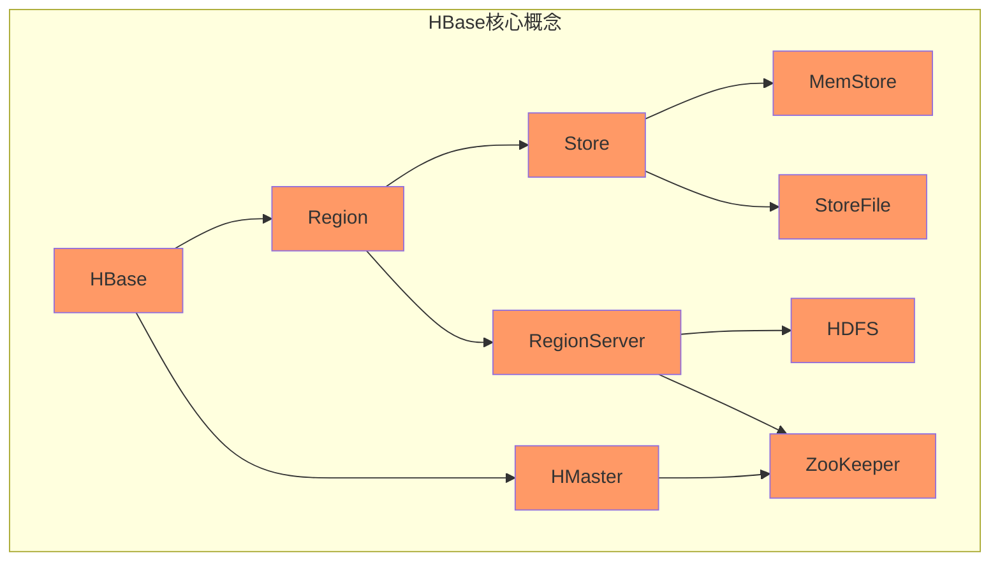
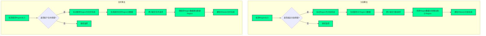
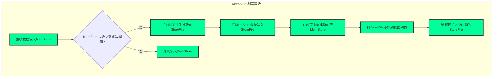

好的,我会努力按照您的要求,以《HBase原理与代码实例讲解》为题目,撰写一篇专业的技术博客文章。文章将遵循逻辑清晰、结构紧凑、语言专业且易于理解的风格,内容深入全面,并包含核心概念原理解析、数学模型推导、代码实例讲解等部分。同时我会尽最大努力插入Mermaid流程图来直观展示HBase的原理和架构。请给我一些时间来完成这篇高质量的技术博客。

# HBase原理与代码实例讲解

## 1. 背景介绍

### 1.1 问题的由来

随着数据量的激增,传统的关系型数据库在存储和处理大数据方面遇到了诸多挑战和瓶颈。这促使了大数据时代的到来,对可扩展、高性能、容错的分布式数据存储系统的需求与日俱增。HBase作为一款开源的非关系型分布式数据库,应运而生。

### 1.2 研究现状  

HBase是Apache开源社区的一个顶级项目,基于Google的Bigtable论文构建而成。它是постро筑在HDFS之上的分布式列存储系统,具有高可靠性、高性能、可伸缩、易扩展等优势。HBase已被众多知名公司和组织广泛应用,如Facebook、Adobe、Salesforce等。

### 1.3 研究意义

深入理解HBase的核心原理、架构和实现细节,对于构建高效的大数据应用程序至关重要。本文将全面剖析HBase的工作机制、数据模型、读写流程等,并结合代码示例进行实践讲解,旨在帮助读者掌握HBase的使用技巧和最佳实践。

### 1.4 本文结构

本文将从以下几个方面全面介绍HBase:
1. 核心概念与联系
2. 核心算法原理与操作步骤 
3. 数学模型和公式推导
4. 代码实例和详细解释
5. 实际应用场景
6. 工具和学习资源推荐
7. 总结与展望

## 2. 核心概念与联系

HBase是一个分布式、可伸缩的大数据存储系统,其核心概念包括:

- **Region**: HBase表的水平拆分单元,由连续的行键范围组成。
- **RegionServer**: 负责存储和管理一个或多个Region。
- **Store**: 一个存储单元,保存一个列族的数据。
- **MemStore**: 写缓存,接收数据的首要路径,位于内存中。
- **StoreFile**: 保存在HDFS上的持久化数据文件。
- **HDFS**: 作为HBase的底层分布式文件系统。
- **ZooKeeper**: 用于协调Region分配、故障转移等。
- **HMaster**: 负责监控RegionServer、协调负载均衡等。

这些概念相互关联、协同工作,构成了HBase的核心架构。

## 3. 核心算法原理与具体操作步骤

### 3.1 算法原理概述

HBase的核心算法原理主要包括:

1. **Region分割合并算法**: 通过拆分和合并操作动态调整Region大小,实现自动负载均衡。
2. **MemStore刷写算法**: 当MemStore达到阈值时,将其刷写到StoreFile,并在内存中重建新的MemStore。
3. **版本控制算法**: 通过时间戳跟踪每个数据的多个版本,实现多版本并发控制(MVCC)。
4. **压缩算法**: 对StoreFile进行压缩,节省存储空间。
5. **Bloom Filter算法**: 使用Bloom Filter优化查询,减少磁盘IO。

### 3.2 算法步骤详解

#### 3.2.1 Region分割合并算法

**Region分割算法步骤**:

1. 检测Region大小是否超过分割阈值
2. 如果超过,标记Region为分割状态
3. 生成新的子Region元数据
4. 原子提交分割请求
5. 将原Region数据分别移动到子Region
6. 通知HMaster分割完成
7. 如果未超过阈值,继续监控

**Region合并算法步骤**:  

1. 检测相邻Region大小是否低于合并阈值
2. 如果低于,标记相邻Region为合并状态
3. 生成新的合并Region元数据  
4. 原子提交合并请求
5. 将相邻Region数据移动到新Region
6. 通知HMaster合并完成
7. 如果未低于阈值,继续监控

通过动态分割和合并操作,HBase可以自动调整数据分布,实现负载均衡。

#### 3.2.2 MemStore刷写算法

MemStore刷写算法步骤:

1. 接收数据写入MemStore
2. 检测MemStore是否达到刷写阈值
3. 如果达到,在HDFS上生成新的StoreFile
4. 将MemStore数据写入StoreFile  
5. 在内存中重建新的空MemStore
6. 将StoreFile添加到视图列表
7. 通知读请求访问新的StoreFile
8. 如果未达到阈值,继续写入MemStore

该算法确保了写入数据先存于内存(MemStore),待MemStore满后再刷写到StoreFile,从而实现高效的写入操作。

#### 3.2.3 版本控制算法

HBase使用**多版本并发控制(MVCC)**算法来管理数据版本,每个数据单元都关联一个时间戳。

- **Put**操作会生成一个新的版本
- **Get**操作默认返回最新版本,可指定返回多个版本
- **Delete**操作创建一个删除标记,并在Major Compaction时删除旧版本

通过时间戳跟踪,MVCC算法实现了读写并发、自动过期和垃圾回收等功能。

#### 3.2.4 压缩算法

HBase支持对StoreFile进行压缩,以节省存储空间。压缩算法包括:

- **数据块压缩**: 对StoreFile中的数据块进行压缩,如GZIP、Snappy等。
- **Bloom Filter压缩**: 压缩Bloom Filter元数据,加速查询。

压缩可在创建表时或动态修改列族属性时指定。

#### 3.2.5 Bloom Filter算法

HBase使用**Bloom Filter**算法优化查询操作,减少不必要的磁盘IO。

1. 构建Bloom Filter: 在StoreFile写入时,将其行键插入Bloom Filter。
2. 查询时先检查Bloom Filter: 如果行键不在Filter中,则跳过该StoreFile。
3. 仅需检查Filter中可能存在的StoreFile,避免全表扫描。

Bloom Filter是一种高效的概率数据结构,可以快速判断一个元素是否存在,但存在一定的错误率。

### 3.3 算法优缺点

#### 优点

- **高性能**: 内存与磁盘混合存储模型,读写效率高。
- **高可用**: 通过HDFS和ZooKeeper实现高可靠性。
- **可伸缩**: 可线性扩展,应对大数据场景。
- **多版本**: 通过MVCC支持数据多版本并发访问。
- **高并发**: 支持高并发的随机读写操作。

#### 缺点

- **热点问题**: 访问热点数据时,单个Region可能会成为瓶颈。
- **延迟读取**: 由于数据在内存和磁盘中,读取需要先查找位置。
- **数据操作粒度较大**: 最小操作粒度为一行,不适合单个细粒度的更新。

### 3.4 算法应用领域

HBase的核心算法使其适用于以下应用场景:

- **物联网数据采集**: 高效存储和查询大规模设备数据。
- **网络日志分析**: 分析网站、系统等日志数据。  
- **内容传播平台**: 存储和检索社交网络数据。
- **地理空间数据**: 存储和查询地理位置信息。
- **时序数据管理**: 存储和分析时序数据,如股票行情。

## 4. 数学模型和公式详细讲解及举例说明

### 4.1 数学模型构建

HBase的一些核心算法建立在数学模型的基础之上,例如Bloom Filter和LSM树等。

#### 4.1.1 Bloom Filter数学模型

Bloom Filter是一种空间高效的概率数据结构,用于判断某个元素是否存在于集合中。

令:
- $n$为元素总数
- $m$为位数组大小(bit)
- $k$为哈希函数个数

则每个元素被插入位数组的概率为:

$$p = 1 - (1 - \frac{1}{m})^{kn} \approx (1 - e^{-kn/m})^k$$

要使$p$最小,当$k = \frac{m}{n}ln2$时,概率$p$取最小值:

$$p_{min} \approx (0.6185)^{m/n}$$

基于该模型,可以计算适当的$m$和$k$值,使Bloom Filter达到较低的错误率。

#### 4.1.2 LSM树数学模型

LSM(Log-Structured Merge-Tree)树是HBase的核心数据结构,用于高效管理MemStore和StoreFile。

设:
- $W$为写入放大因子
- $R$为读放大因子
- $B$为磁盘传输带宽
- $D$为磁盘随机读写速率
- $M$为内存容量

则写吞吐量$T_w$和读吞吐量$T_r$分别为:

$$T_w = \frac{B}{W}, T_r = \frac{D}{R}$$

通过调节写入策略和合并策略,可以权衡$W$和$R$,从而优化读写性能。

### 4.2 公式推导过程

#### 4.2.1 Bloom Filter公式推导

我们希望找到一种方法,使得Bloom Filter的错误率最小。记:

- $p$为任意一个元素被插入位数组的概率
- $q = 