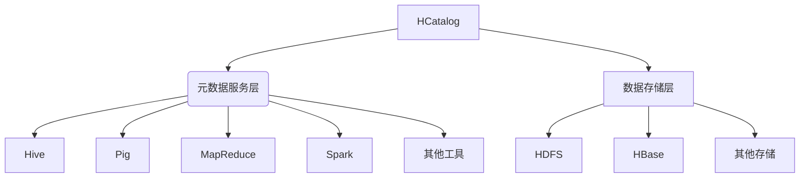

# HCatalog原理与代码实例讲解

## 1. 背景介绍

### 1.1 问题的由来

在大数据时代,数据存储和管理变得越来越重要和复杂。Apache Hive作为构建在Hadoop之上的数据仓库基础架构,为结构化数据提供了一种简单高效的查询方式。然而,随着数据量和种类的快速增长,Hive面临着一些挑战,比如:

- 元数据管理不够灵活和可扩展
- 缺乏统一的元数据服务
- 不同工具和框架之间缺乏互操作性

为了解决这些问题,Apache HCatalog应运而生。

### 1.2 研究现状

HCatalog最初是作为Hive的一个子项目开发的,旨在提供一个统一的元数据服务层。随着时间的推移,HCatalog逐渐发展成为一个独立的项目,被广泛应用于Hadoop生态系统中。

目前,HCatalog不仅为Hive提供元数据服务,还支持其他大数据框架和工具,如Apache Pig、Apache MapReduce、Apache Spark等。它提供了一个统一的元数据API,使得不同工具和框架可以共享和访问相同的元数据。

### 1.3 研究意义

HCatalog的引入为Hadoop生态系统带来了诸多好处:

1. **元数据共享和互操作性**:不同工具和框架可以共享和访问统一的元数据,提高了数据的可用性和一致性。

2. **简化元数据管理**:HCatalog提供了一个集中式的元数据服务,简化了元数据的管理和维护。

3. **提高开发效率**:开发人员可以利用HCatalog提供的API,更加方便地访问和操作元数据,提高了开发效率。

4. **支持多种数据格式**:HCatalog支持多种数据格式,如RCFile、SequenceFile、Avro等,提高了数据存储和访问的灵活性。

### 1.4 本文结构

本文将全面介绍HCatalog的原理和实现细节,内容包括:

1. HCatalog的核心概念和架构
2. HCatalog的算法原理和实现步骤
3. HCatalog的数学模型和公式推导
4. HCatalog的代码实例和详细解释
5. HCatalog在实际应用中的场景
6. HCatalog相关的工具和资源推荐
7. HCatalog的发展趋势和面临的挑战

## 2. 核心概念与联系



HCatalog是一个元数据服务层,位于Hadoop生态系统的核心位置。它为上层的数据处理框架和工具(如Hive、Pig、MapReduce、Spark等)提供统一的元数据访问接口,同时也与下层的数据存储层(如HDFS、HBase等)进行交互。

HCatalog的核心概念包括:

1. **表(Table)**: 表是HCatalog中最基本的元数据单元,用于描述数据的结构和属性。

2. **分区(Partition)**: 分区是表的一个子集,用于对表进行逻辑划分,提高查询效率。

3. **存储格式(Storage Format)**: HCatalog支持多种存储格式,如RCFile、SequenceFile、Avro等,用于存储数据。

4. **元数据服务(Metadata Service)**: HCatalog提供了一个集中式的元数据服务,用于管理和访问元数据。

5. **API**: HCatalog提供了一套标准的API,供上层工具和框架访问和操作元数据。

这些核心概念相互关联,共同构建了HCatalog的整体架构和功能。

## 3. 核心算法原理 & 具体操作步骤

### 3.1 算法原理概述

HCatalog的核心算法原理是基于元数据服务器(MetaStore Server)和客户端(Client)之间的交互。MetaStore Server负责管理和存储元数据,而Client则通过API与MetaStore Server进行通信,执行元数据的创建、读取、更新和删除等操作。

算法的主要流程如下:

1. 客户端向MetaStore Server发送元数据操作请求。
2. MetaStore Server接收请求,并根据请求类型执行相应的操作。
3. 如果是读取操作,MetaStore Server从元数据存储中查询相应的元数据,并将结果返回给客户端。
4. 如果是写入操作,MetaStore Server会先进行合法性检查,然后将新的元数据写入元数据存储。
5. 客户端接收MetaStore Server的响应,并根据需要进行后续处理。

### 3.2 算法步骤详解

1. **客户端初始化**

   客户端首先需要初始化HCatalog客户端对象,并配置MetaStore Server的连接信息。

   ```java
   HCatClient client = HCatClient.create(conf);
   ```

2. **创建表**

   客户端可以通过调用`createTable`方法创建一个新表。需要提供表名、列信息、存储格式等元数据。

   ```java
   List<HCatFieldSchema> cols = Arrays.asList(
     new HCatFieldSchema("id", HCatFieldSchema.Type.INT, ""),
     new HCatFieldSchema("name", HCatFieldSchema.Type.STRING, "")
   );
   HCatCreateTableDesc desc = new HCatCreateTableDesc(dbName, tableName)
     .setCols(cols)
     .setFileFormat(HCatConstants.FILE_FORMAT_TEXTFILE);
   client.createTable(desc);
   ```

3. **读取元数据**

   客户端可以通过调用`getTable`、`getPartitions`等方法读取表、分区等元数据信息。

   ```java
   HCatTable table = client.getTable(dbName, tableName);
   List<HCatPartition> partitions = client.getPartitions(table);
   ```

4. **更新元数据**

   客户端可以通过调用`alterTable`、`addPartition`等方法更新表、分区等元数据信息。

   ```java
   HCatUpdateTableDesc updateDesc = new HCatUpdateTableDesc(dbName, tableName)
     .addCol(new HCatFieldSchema("age", HCatFieldSchema.Type.INT, ""));
   client.updateTable(updateDesc);
   ```

5. **删除元数据**

   客户端可以通过调用`dropTable`、`dropPartition`等方法删除表、分区等元数据信息。

   ```java
   client.dropTable(dbName, tableName, true);
   ```

### 3.3 算法优缺点

**优点**:

1. **简单高效**: HCatalog算法原理简单,通过客户端与MetaStore Server的交互实现元数据操作,高效且易于实现。

2. **统一标准**: HCatalog提供了统一的元数据API,使得不同工具和框架可以共享和访问相同的元数据。

3. **扩展性强**: HCatalog的架构设计具有良好的扩展性,可以方便地集成新的存储格式和数据处理框架。

**缺点**:

1. **单点故障**: MetaStore Server作为元数据服务的核心,存在单点故障的风险。

2. **性能瓶颈**: 随着数据量和并发请求的增加,MetaStore Server可能会成为性能瓶颈。

3. **事务支持有限**: HCatalog对事务支持有限,无法保证元数据操作的完全一致性。

### 3.4 算法应用领域

HCatalog算法广泛应用于Hadoop生态系统中,为多种数据处理框架和工具提供元数据服务支持,包括但不限于:

- **Apache Hive**: Hive是构建在Hadoop之上的数据仓库基础架构,HCatalog为其提供元数据服务。

- **Apache Pig**: Pig是一种高级数据流语言,用于并行计算大数据,可以利用HCatalog访问和管理元数据。

- **Apache MapReduce**: MapReduce是Hadoop的核心计算框架,可以通过HCatalog访问和操作元数据。

- **Apache Spark**: Spark是一种快速、通用的大数据处理引擎,可以与HCatalog集成,共享元数据。

- **Apache Impala**: Impala是一种低延迟的SQL查询引擎,可以利用HCatalog访问Hive元数据。

除了上述框架和工具,HCatalog还可以与其他大数据组件集成,提供统一的元数据服务。

## 4. 数学模型和公式 & 详细讲解 & 举例说明

在HCatalog中,并没有直接涉及复杂的数学模型和公式。但是,为了更好地理解HCatalog的工作原理,我们可以从概率论和信息论的角度来分析元数据的存储和查询过程。

### 4.1 数学模型构建

假设我们有一个包含 $N$ 个表的元数据存储系统,每个表都有 $M$ 个字段。我们可以将元数据存储系统看作一个离散的信源,其中每个表代表一个可能的事件。

令 $X$ 表示一个随机变量,代表查询的目标表。由于每个表都有相同的被查询的概率,因此 $X$ 服从均匀分布:

$$
P(X=i) = \frac{1}{N}, \quad i=1,2,\ldots,N
$$

对于每个表,我们可以将其字段看作一个离散的信源,其中每个字段代表一个可能的事件。令 $Y$ 表示一个随机变量,代表查询的目标字段。同样,由于每个字段都有相同的被查询的概率,因此 $Y$ 也服从均匀分布:

$$
P(Y=j) = \frac{1}{M}, \quad j=1,2,\ldots,M
$$

### 4.2 公式推导过程

根据信息论的定义,信息熵 $H(X)$ 可以用来衡量一个随机变量的不确定性。对于均匀分布的随机变量 $X$,其信息熵为:

$$
H(X) = -\sum_{i=1}^{N} P(X=i) \log_2 P(X=i) = -N \cdot \frac{1}{N} \log_2 \frac{1}{N} = \log_2 N
$$

同理,对于随机变量 $Y$,其信息熵为:

$$
H(Y) = \log_2 M
$$

由于查询一个表的过程可以看作是先查询表,再查询字段,因此查询的总信息熵为:

$$
H(X, Y) = H(X) + H(Y) = \log_2 N + \log_2 M
$$

这个公式表明,查询的总信息熵与表的数量 $N$ 和每个表的字段数量 $M$ 有关。当 $N$ 或 $M$ 增加时,查询的不确定性也会增加,从而需要更多的信息来确定查询目标。

### 4.3 案例分析与讲解

假设我们有一个包含 1000 个表的元数据存储系统,每个表都有 10 个字段。根据上述公式,我们可以计算出查询的总信息熵:

$$
H(X, Y) = \log_2 1000 + \log_2 10 \approx 9.97 + 3.32 = 13.29 \text{ bits}
$$

这意味着,在最坏的情况下,我们需要大约 13.29 bits 的信息来确定查询的目标表和字段。

如果我们将表按照一定规则进行分区,例如按照业务领域或数据类型进行划分,那么查询的不确定性就会降低。假设我们将 1000 个表划分为 10 个分区,每个分区包含 100 个表。此时,查询的总信息熵为:

$$
H(X, Y) = \log_2 10 + \log_2 100 + \log_2 10 \approx 3.32 + 6.64 + 3.32 = 13.28 \text{ bits}
$$

我们可以看到,通过分区的方式,查询的总信息熵基本保持不变,但是查询过程变得更加有序和高效。

### 4.4 常见问题解答

**Q: 为什么需要使用信息熵来分析元数据查询?**

A: 信息熵是一个衡量不确定性的概念,可以帮助我们更好地理解元数据查询过程中的复杂性和效率。通过建立数学模型和推导公式,我们可以量化查询的不确定性,并探索优化查询效率的方法。

**Q: 在实际应用中,如何确定表的分区策略?**

A:确定表的分区策略需要综合考虑多个因素,如数据量、查询模式、业务需求等。通常情况下