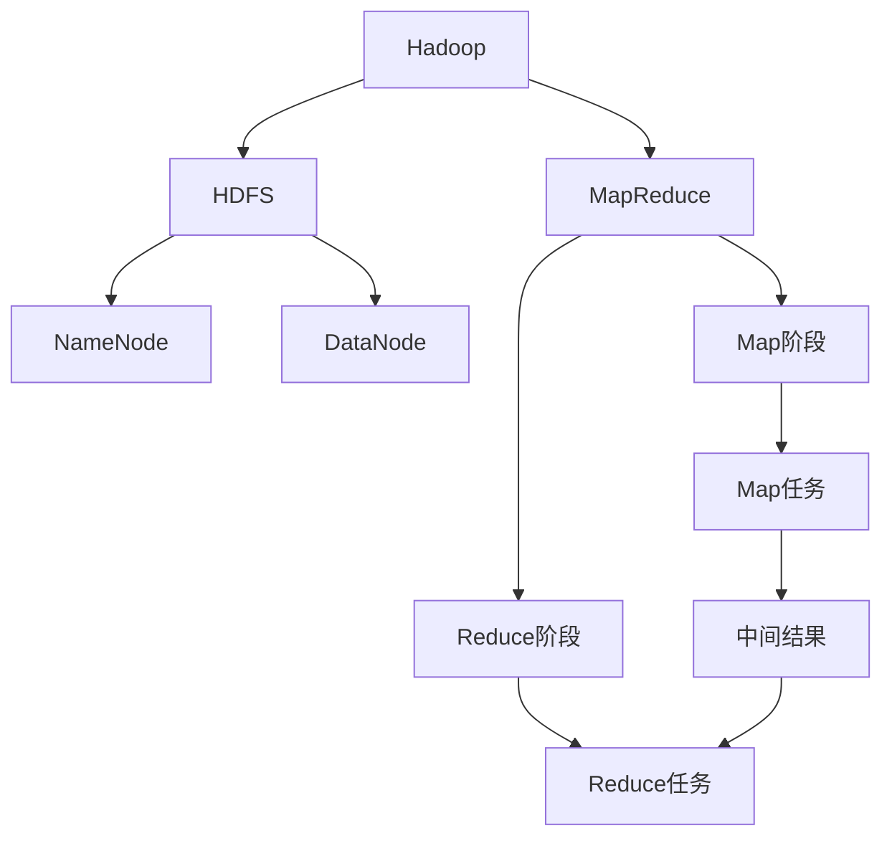

# Hadoop原理与代码实例讲解

## 1. 背景介绍

### 1.1 问题的由来

在当今大数据时代，海量的结构化和非结构化数据正以前所未有的速度被生成和积累。传统的数据处理系统已经无法满足对大规模数据集进行高效存储、管理和分析的需求。这种数据量的爆炸性增长,对现有的数据处理能力提出了巨大挑战。

### 1.2 研究现状

为了解决这一问题,Google提出了MapReduce编程模型,并在2004年发表了描述该模型的论文。MapReduce是一种软件框架,它允许用户在大规模计算机集群上并行处理和生成大型数据集。这种编程模型极大地简化了大规模数据处理的复杂性,使得开发人员可以专注于解决问题的逻辑,而不必关注分布式系统的细节。

受到Google MapReduce的启发,Apache Hadoop项目应运而生。Hadoop是一个用Java语言编写的开源分布式系统基础架构,它能够在廉价的计算机集群上可靠地存储和处理大规模数据。Hadoop由两个核心组件组成:HDFS(Hadoop分布式文件系统)和MapReduce。

### 1.3 研究意义

Hadoop的出现为大数据处理带来了革命性的变化。它提供了一种高效、可扩展和容错的方式来处理海量数据,为各行各业的数据密集型应用程序开辟了新的可能性。Hadoop的广泛应用不仅限于互联网公司,还扩展到金融、制造、医疗保健、科学研究等诸多领域。深入理解Hadoop的原理和实现对于充分利用其强大功能至关重要。

### 1.4 本文结构

本文将全面探讨Hadoop的核心概念、原理和实现细节。首先,我们将介绍Hadoop的核心组件HDFS和MapReduce,并解释它们的工作原理和设计理念。接下来,我们将深入探讨MapReduce编程模型的核心算法和数学模型,并通过代码示例和详细解释说明其实现过程。此外,我们还将讨论Hadoop在实际应用场景中的使用,以及相关工具和资源的推荐。最后,我们将总结Hadoop的发展趋势和面临的挑战,并对其未来发展提出展望。

## 2. 核心概念与联系

Hadoop的核心由两个主要组件组成:HDFS(Hadoop分布式文件系统)和MapReduce编程模型。

**HDFS**是一个高度容错的分布式文件系统,旨在运行在廉价的硬件集群上。它具有以下关键特性:

1. **高容错性**:HDFS通过数据块复制和分布式存储来实现高容错性,即使部分节点发生故障,也不会导致数据丢失。
2. **高吞吐量**:HDFS针对大文件设计,支持数据的流式访问,从而实现高吞吐量的数据访问。
3. **大规模扩展性**:HDFS可以在廉价的计算机集群上线性扩展,支持PB级别的数据存储。

**MapReduce**是一种编程模型,用于在大规模计算机集群上并行处理和生成大型数据集。它将计算过程分为两个阶段:Map阶段和Reduce阶段。

1. **Map阶段**:输入数据被拆分为多个块,并在集群中的多个节点上并行执行Map任务。每个Map任务会处理一个数据块,产生一系列键值对作为中间结果。
2. **Reduce阶段**:MapReduce框架会对Map阶段产生的中间结果进行合并和排序,然后将具有相同键的值传递给同一个Reduce任务进行处理,最终生成最终结果。

HDFS和MapReduce紧密协作,共同构建了Hadoop的核心架构。HDFS为MapReduce提供了可靠的分布式存储,而MapReduce则利用HDFS上的数据进行并行计算和处理。这种紧密集成的设计使得Hadoop能够高效地处理大规模数据集,并具有良好的可扩展性和容错性。

## 3. 核心算法原理 & 具体操作步骤

### 3.1 算法原理概述

MapReduce编程模型的核心算法原理可以概括为以下几个步骤:

1. **输入拆分**:输入数据被拆分为多个独立的数据块,这些数据块被分发到集群中的多个节点上进行处理。
2. **Map阶段**:每个Map任务会处理一个数据块,并产生一系列键值对作为中间结果。
3. **洗牌和排序**:MapReduce框架会对Map阶段产生的中间结果进行合并和排序,将具有相同键的值组合在一起。
4. **Reduce阶段**:具有相同键的值被传递给同一个Reduce任务进行处理,生成最终结果。
5. **输出合并**:Reduce任务的输出结果被合并成最终的输出文件。

### 3.2 算法步骤详解

1. **输入拆分**

   输入数据通常存储在HDFS上,MapReduce框架会将输入数据拆分为固定大小的数据块(默认为128MB)。这些数据块被分发到集群中的不同节点上进行处理,以实现并行计算。

2. **Map阶段**

   每个Map任务会处理一个数据块,并执行用户定义的Map函数。Map函数的输入是一个键值对,输出也是一个键值对。Map任务会对输入数据进行转换、过滤或其他操作,并产生一系列中间键值对作为输出。

   Map任务的输出会被缓存在内存中,当内存缓存达到一定阈值时,中间结果会被排序和分区,然后写入本地磁盘。

3. **洗牌和排序**

   MapReduce框架会收集所有Map任务的输出,并对中间结果进行合并和排序。具有相同键的值会被组合在一起,形成一个键值对列表。这个过程被称为"洗牌"。

   排序是为了确保具有相同键的值能够被传递给同一个Reduce任务进行处理。排序通常是基于键进行的,但也可以根据用户定义的分区函数对键进行分区。

4. **Reduce阶段**

   在Reduce阶段,MapReduce框架会将具有相同键的值传递给同一个Reduce任务进行处理。Reduce任务会执行用户定义的Reduce函数,将这些值合并或聚合成一个较小的结果集。

   Reduce函数的输入是一个键和与该键关联的值列表。Reduce函数会对这些值进行处理,并产生一个新的键值对作为输出。

5. **输出合并**

   Reduce任务的输出结果会被合并成最终的输出文件,并存储在HDFS或其他文件系统中。输出文件的格式由用户定义的输出格式决定。

### 3.3 算法优缺点

**优点**:

1. **高度并行化**:MapReduce算法能够在大规模计算机集群上并行执行,从而实现高效的数据处理。
2. **容错性**:MapReduce算法具有良好的容错性,能够自动处理节点故障和数据丢失,确保计算的可靠性。
3. **可扩展性**:MapReduce算法可以在廉价的硬件集群上线性扩展,支持PB级别的数据处理。
4. **简单编程模型**:MapReduce提供了一种简单的编程模型,使开发人员能够专注于解决问题的逻辑,而不必关注分布式系统的细节。

**缺点**:

1. **高延迟**:MapReduce算法适合于批处理作业,但对于需要低延迟的实时数据处理任务,它可能不太合适。
2. **数据局部性**:MapReduce算法假设计算应该尽可能地移动到数据所在的位置,而不是将数据移动到计算节点。这可能会导致数据传输开销较大。
3. **迭代计算低效**:MapReduce算法更适合于单次计算作业,对于需要多次迭代的算法(如机器学习算法),它可能会导致性能低下。
4. **不支持记录级更新**:MapReduce算法通常需要读取整个输入文件,即使只需要更新其中的一小部分数据。这可能会导致资源浪费。

### 3.4 算法应用领域

MapReduce算法广泛应用于各种大数据处理场景,包括但不限于:

1. **网络日志分析**:分析网站访问日志,了解用户行为模式和流量趋势。
2. **机器学习和数据挖掘**:在大规模数据集上训练机器学习模型,进行数据挖掘和模式发现。
3. **生物信息学**:处理基因组序列数据,进行基因表达分析和蛋白质结构预测。
4. **文本处理**:对大量文本数据进行索引、搜索和分析,如网页爬虫和自然语言处理。
5. **科学计算**:处理大规模科学数据,如气象数据、天文数据和物理模拟数据。
6. **商业智能**:分析客户数据、交易记录和销售数据,支持商业决策和市场营销策略。

## 4. 数学模型和公式 & 详细讲解 & 举例说明

在MapReduce算法中,常见的数学模型和公式包括:

### 4.1 数学模型构建

1. **数据划分模型**

   为了实现并行计算,MapReduce需要将输入数据划分为多个独立的数据块。常见的数据划分模型包括:

   - 基于大小的划分:将输入数据划分为固定大小的数据块,例如128MB。
   - 基于记录的划分:将输入数据按照记录边界进行划分,每个数据块包含一定数量的记录。

   数据划分模型可以用以下公式表示:

   $$
   N = \left\lceil \frac{S}{B} \right\rceil
   $$

   其中,N是数据块的数量,S是输入数据的总大小,B是每个数据块的大小。

2. **任务调度模型**

   MapReduce需要在集群中的多个节点上调度Map和Reduce任务,以实现并行计算。常见的任务调度模型包括:

   - 基于数据位置的调度:尽可能将任务调度到存储相应数据块的节点上,以减少数据传输开销。
   - 基于资源利用率的调度:根据节点的资源利用情况(CPU、内存等)动态调度任务,实现资源的均衡利用。

   任务调度模型可以用以下公式表示:

   $$
   T_i = f(D_i, R_i)
   $$

   其中,T_i是分配给节点i的任务数量,D_i是节点i上存储的数据块数量,R_i是节点i的资源利用情况。

### 4.2 公式推导过程

1. **Map任务输出估计**

   假设输入数据的大小为S,每个Map任务的输出大小为O_m,Map任务的数量为N_m,则Map阶段的总输出大小可以估计为:

   $$
   O_{map} = N_m \times O_m
   $$

   由于Map任务的输出会被缓存在内存中,因此需要确保内存足够容纳所有Map任务的输出。

2. **Reduce任务输入估计**

   假设Map阶段的总输出大小为O_{map},Reduce任务的数量为N_r,则每个Reduce任务的平均输入大小可以估计为:

   $$
   I_r = \frac{O_{map}}{N_r}
   $$

   这个估计值可以用于确定Reduce任务所需的内存大小和磁盘空间。

3. **作业完成时间估计**

   假设Map阶段的总执行时间为T_m,Reduce阶段的总执行时间为T_r,则整个MapReduce作业的完成时间可以估计为:

   $$
   T_{total} = T_m + T_r
   $$

   这个估计值可以用于预测作业的执行时间,并根据需要调整集群资源。

### 4.3 案例分析与讲解

假设我们有一个文本文件,包含了大量的英文单词及其出现次数。我们希望使用MapReduce来统计每个单词在整个文件中出现的总