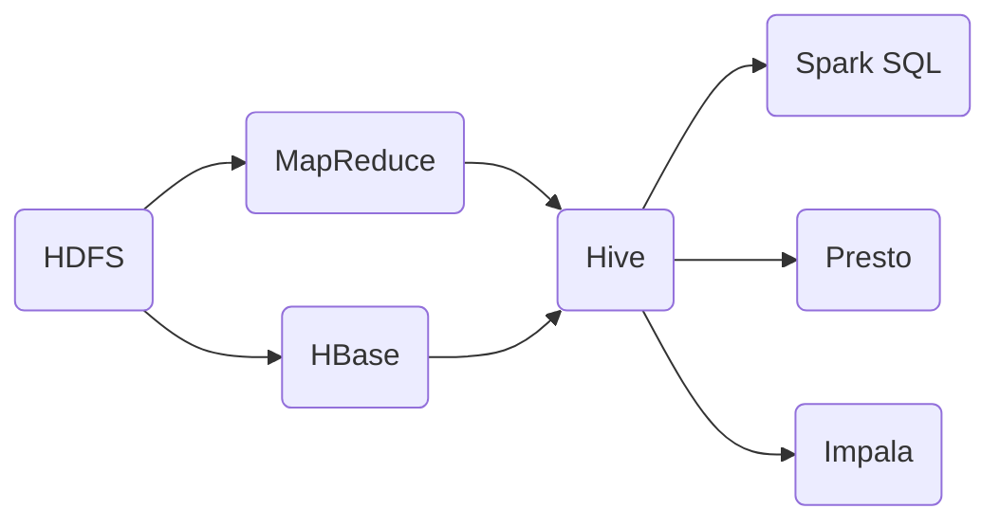

# Hive原理与代码实例讲解

## 1. 背景介绍
### 1.1  问题的由来
在大数据时代,海量数据的存储和处理是每个企业都要面临的问题。传统的关系型数据库已经无法满足海量数据的存储和分析需求。Hadoop的出现为解决大数据问题提供了新的思路,其中HDFS为海量数据提供了可靠的存储,MapReduce提供了高效的计算框架。但是MapReduce使用Java API进行编程,不够直观,也不易于维护。

### 1.2  研究现状
为了简化海量数据分析,Facebook开发了Hive,将SQL引入到Hadoop中,使得数据分析人员能够通过类SQL语句查询和分析数据。Hive在Hadoop生态系统中扮演着重要角色,成为了数据仓库的标准工具。目前各大公司广泛使用Hive进行数据仓库的搭建和数据分析。

### 1.3  研究意义
深入研究Hive的原理和应用,对于更好地利用Hadoop处理海量数据具有重要意义。通过学习Hive,可以掌握如何在Hadoop上构建企业级数据仓库,如何用类SQL语句进行数据查询和分析。这不仅能够提高工作效率,还能够挖掘出数据的价值。

### 1.4  本文结构
本文将详细介绍Hive的原理、架构和使用方法。内容安排如下:
- 第2部分介绍Hive的核心概念,包括Hive与传统数据库的区别,以及Hive在Hadoop生态中的位置。
- 第3部分讲解Hive的核心原理,包括Hive的系统架构、查询处理流程、数据存储格式等。
- 第4部分建立数学模型,推导Hive查询的代价公式,并举例说明如何优化Hive查询。 
- 第5部分通过代码实例讲解如何使用Hive进行数据分析,包括Hive SQL、UDF、UDAF的使用方法。
- 第6部分介绍Hive在实际项目中的应用案例,展望Hive的发展前景。
- 第7部分推荐Hive相关的学习资源、开发工具和研究论文。
- 第8部分总结全文,分析Hive技术的发展趋势和面临的挑战。

## 2. 核心概念与联系
### 2.1 Hive与传统数据库对比
Hive是构建在Hadoop之上的数据仓库工具,它提供了类SQL的语言HiveQL,可以将结构化的数据文件映射为数据库表,并提供HiveQL查询功能。这使得具备SQL语言基础的用户可以快速上手Hive进行大数据的分析。

与传统的关系型数据库相比,Hive具有以下特点:
1. Hive采用了类SQL的语言HiveQL,学习成本相对较低。而关系型数据库使用标准SQL。 
2. Hive可以直接处理HDFS和HBase上的结构化、半结构化数据,而关系型数据库处理的是结构化数据。
3. Hive底层执行引擎是MapReduce,处理延迟大,主要用于数据仓库的离线分析。关系型数据库有自己的执行引擎,延迟小,可以用于联机事务处理。
4. Hive没有定义专门的数据格式,数据可以存储在HDFS或HBase上。关系型数据库以行存储数据。
5. Hive通过表来组织数据,但表的schema可以动态改变。关系型数据库的表schema相对固定。

### 2.2 Hive在Hadoop生态中的位置
Hive是Hadoop生态系统中的重要组件,在数据仓库和数据分析领域发挥着关键作用。Hive与Hadoop其他组件的关系如下:



从图中可以看出:
- Hive构建在HDFS和MapReduce之上,Hive将HiveQL转换为MapReduce任务执行。
- Hive可以读写HBase上的数据。
- Spark SQL、Presto、Impala等SQL on Hadoop引擎可以访问Hive的元数据并执行HiveQL。

## 3. 核心算法原理 & 具体操作步骤
### 3.1  算法原理概述
Hive的核心是将HiveQL转换为MapReduce任务,Hive的执行过程分为以下6个阶段:
1. 语法解析:Antlr定义SQL的语法规则,完成SQL词法,语法解析,将SQL转化为抽象语法树AST Tree。
2. 语义解析:遍历AST Tree,抽象出查询的基本组成单元QueryBlock。
3. 生成逻辑执行计划:遍历QueryBlock,翻译为执行操作树OperatorTree。
4. 优化逻辑执行计划:逻辑层优化器进行OperatorTree变换,合并不必要的ReduceSinkOperator,减少shuffle数据量。
5. 生成物理执行计划:遍历OperatorTree,翻译为MapReduce任务。
6. 优化物理执行计划:物理层优化器进行MapReduce任务的变换,生成最终的执行计划。

### 3.2  算法步骤详解
下面以一个HiveQL查询为例,详细讲解Hive的执行过程。

查询语句:
```sql
SELECT o.id, sum(oi.amount) as total 
FROM orders o JOIN order_items oi
ON o.id = oi.order_id
WHERE o.dt = '2022-01-01'  
GROUP BY o.id
HAVING total > 1000;
```

1. 语法解析
使用Antlr对SQL进行词法和语法分析,生成AST Tree:

```
TOK_QUERY
  TOK_FROM
    TOK_JOIN
      TOK_TABREF
        TOK_TABNAME
          orders
        o
      TOK_TABREF
        TOK_TABNAME
          order_items
        oi
      =
        .
          TOK_TABLE_OR_COL
            o
          id
        .
          TOK_TABLE_OR_COL
            oi
          order_id
  TOK_INSERT
    TOK_DESTINATION
      TOK_DIR
        TOK_TMP_FILE
    TOK_SELECT
      TOK_SELEXPR
        .
          TOK_TABLE_OR_COL
            o
          id
      TOK_SELEXPR
        TOK_FUNCTION
          sum
          TOK_TABLE_OR_COL
            oi
            amount
        total
    TOK_WHERE
      =
        .
          TOK_TABLE_OR_COL
            o
          dt
        '2022-01-01'
    TOK_GROUPBY
      .
        TOK_TABLE_OR_COL
          o
        id
    TOK_HAVING
      >
        TOK_TABLE_OR_COL
          total
        1000
```

2. 语义解析
遍历AST Tree,抽象出QueryBlock:

```
QB_0
  QB_1 (select o.id, sum(oi.amount) as total from orders o join order_items oi on o.id = oi.order_id)
    QB_2 (select o.id from orders o)
    QB_3 (select sum(oi.amount) as total from order_items oi)
```

3. 生成逻辑执行计划
将QueryBlock转换为OperatorTree:

```
TableScan(orders)         TableScan(order_items)  
     |                             |
     Join(o.id = oi.order_id)
     |
     Filter(o.dt = '2022-01-01')
     |
     GroupBy(o.id)
     |
     Select(o.id, sum(oi.amount) as total)
     |  
     Having(total > 1000)
```

4. 优化逻辑执行计划
Hive的逻辑层优化器会对OperatorTree进行等价变换,例如:
- 谓词下推:将Filter算子下推到TableScan之上。
- 列剪裁:去掉查询不需要的列。

优化后的OperatorTree:

```
TableScan(orders,o.id,o.dt)    TableScan(order_items,oi.order_id,oi.amount)  
       |                                 |
       Filter(o.dt = '2022-01-01')       |
       |                                 |
       Join(o.id = oi.order_id)
       |
       GroupBy(o.id)
       |
       Select(o.id, sum(oi.amount) as total)
       |  
       Having(total > 1000)  
```

5. 生成物理执行计划
Hive遍历优化后的OperatorTree,翻译为MapReduce任务,主要分以下两个阶段:
- Map阶段
  - TableScan将HDFS上的数据读入
  - Map端进行列剪裁、谓词过滤、映射
  - 按照Join key对数据进行shuffle
- Reduce阶段  
  - 从Map端拉取数据
  - 根据Join key进行Join、Group by、Having过滤
  - 将结果写回HDFS

生成的MapReduce任务:

```
Stage-1:
  Map:
    TableScan(orders,o.id,o.dt) 
    Filter(o.dt = '2022-01-01')
    ExtractJoinKey(o.id)
    Shuffle(o.id)

  Map:  
    TableScan(order_items,oi.order_id,oi.amount)
    ExtractJoinKey(oi.order_id)
    Shuffle(oi.order_id)

  Reduce:
    FetchData(o.id)
    FetchData(oi.amount)
    Join(o.id = oi.order_id)
    GroupBy(o.id)
    Select(o.id, sum(oi.amount) as total)
    Having(total > 1000)
    FileSink
```

6. 优化物理执行计划
Hive物理层优化器会对MapReduce任务进行变换,例如: 
- 小表Join:如果Join的一张表很小,可以将小表全部加载到内存进行Map端Join,避免Shuffle。
- 本地模式:如果输入数据量很小,可以用本地模式在单台机器上执行,只启动1个Map和1个Reduce。

### 3.3  算法优缺点
Hive将SQL转换为MapReduce的优点是:
- 统一了SQL on Hadoop,为用户屏蔽了MapReduce细节。
- 延续了SQL语言,学习成本低。
- 通过Hive可以访问HDFS和HBase上的海量数据。

但Hive也存在一些缺点:
- 底层执行引擎是MapReduce,延迟比较大,不适合交互式查询。
- 优化器做的优化还比较简单,很多复杂查询还需要通过子查询、UDF等方式绕过。
- 元数据存在单点故障,NameNode宕机会导致Hive不可用。

### 3.4  算法应用领域
Hive是最广泛使用的SQL on Hadoop工具,在以下领域有广泛应用:
- 日志分析:将服务器、App产生的日志导入Hive中,通过HiveQL进行统计分析。
- 用户行为分析:分析用户的搜索、点击、收藏等行为数据,挖掘用户兴趣。
- 海量结构化数据分析:Hive可以访问HDFS和HBase上的PB级数据,支持SQL分析。
- 数据仓库:Hive可以用来构建企业级数据仓库,支持T+1的离线分析。

## 4. 数学模型和公式 & 详细讲解 & 举例说明
### 4.1  数学模型构建
Hive查询的执行时间主要由以下几个部分组成:
- Map阶段:扫描数据文件,进行过滤、映射等操作。
- Shuffle阶段:将Map输出按照Key进行分区、排序,通过网络传输到Reduce。
- Reduce阶段:从Map拉取数据,进行聚合、关联等操作。

我们定义以下变量:
- $M$:Map个数
- $R$:Reduce个数
- $S_m$:单个Map的输入大小
- $S_r$:单个Reduce的输入大小
- $T_m$:单个Map任务的执行时间
- $T_r$:单个Reduce任务的执行时间
- $BW$:集群网络带宽
- $T_s$:单次Shuffle传输的时间

则整个查询的执行时间可以表示为:

$T = \max\limits_{1 \leq i \leq M} T_{m_i} + \max\limits_{1 \leq j \leq R} (T_{s_j} + T_{r_j})$

其中,Map任务执行时间:

$T_m = \frac{S_m}{v_m}$

$v_m$表示单个Map任务每秒处理的数据量。

Shuffle传输时间:

$T_s = \frac{S_r}{BW}$

Reduce任务执行时间:

$T_r = \frac{S_r}{v_r}$

$v_r$表示单个Reduce任务每秒处理的数据量。

### 4.2  公式推导过程
将$T_m$、$T_s$、$T_r$的表达式带入