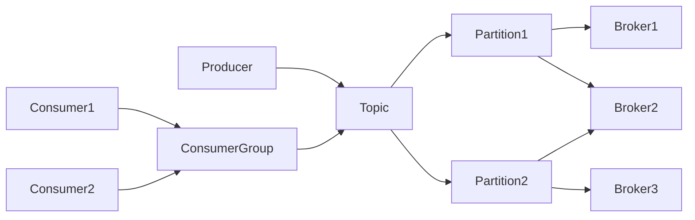

# Kafka Producer原理与代码实例讲解

## 1. 背景介绍
### 1.1 问题的由来
在大数据时代,数据的产生、收集、处理和分析已成为各行各业关注的焦点。如何高效、可靠地收集和传输海量数据是一个巨大的挑战。传统的消息队列系统如ActiveMQ在面对海量数据时,其性能和可扩展性都受到了限制。因此,急需一种高吞吐、低延迟、可扩展的分布式消息队列系统。

### 1.2 研究现状
Apache Kafka应运而生,它是一个分布式的流处理平台,专为高吞吐量的实时数据feed而设计。目前在业界得到了广泛应用,尤其在大数据领域,已成为事实上的标准。Kafka以其优异的性能和可扩展性,在数据收集、日志聚合、流处理、事件源等场景得到了大规模应用。

### 1.3 研究意义 
深入理解Kafka Producer的工作原理和实现,对于构建大规模数据管道、流处理应用至关重要。通过研究Kafka Producer,可以掌握如何编写高效、可靠的Kafka生产者程序,为海量数据的收集和处理奠定基础。同时对Kafka的原理和最佳实践有深入认识,有助于优化Kafka集群的性能和稳定性。

### 1.4 本文结构
本文将从以下几个方面对Kafka Producer展开深入讨论：

1. Kafka Producer的核心概念和工作原理
2. Producer发送消息的过程和关键算法
3. Producer的可靠性保证机制
4. 提高Producer吞吐量的优化配置
5. 代码实例解析
6. 最佳实践和注意事项

通过系统全面的讲解,让读者对Kafka Producer的原理和使用有清晰的认识,并能应用到实际项目中。

## 2. 核心概念与联系

在讨论Kafka Producer原理前,我们先来了解一下Kafka的一些核心概念：

- Broker：Kafka集群中的服务器节点,负责消息的存储和转发。
- Topic：消息的主题或者类别,生产者发送消息到特定的Topic。
- Partition：Topic物理上的分组,一个Topic可以分为多个Partition,提高并行度。
- Producer：消息生产者,负责发布消息到Kafka的Topic。
- Consumer：消息消费者,负责订阅Topic并消费消息。
- ConsumerGroup：消费者组,多个Consumer可以组成一个Group,共同消费一个Topic的消息,提高消费能力。

它们的关系如下图所示：



从图中可以看出：
- Producer将消息发送到指定的Topic
- Topic可以划分为多个Partition,提高并行度
- 每个Partition可以分布在不同的Broker上,实现负载均衡
- 多个Consumer组成ConsumerGroup,共同消费一个Topic的数据

这种架构设计使得Kafka具有高吞吐、可扩展、容错等特性。而Producer作为数据引入的入口,其性能和可靠性直接影响了整个系统。

## 3. 核心算法原理 & 具体操作步骤
### 3.1 算法原理概述
Kafka Producer采用异步发送和批量发送的方式来提高吞吐量。其核心算法可以概括为：

1. 消息追加到内存缓冲区(RecordAccumulator)
2. 根据batch.size和linger.ms将消息分批,触发发送
3. 选择合适的分区(Partitioner)
4. 将消息批次送入发送队列(KafkaProducer)
5. Sender线程从发送队列获取消息批次并通过网络发送
6. 处理响应,更新元数据,可能触发重试

### 3.2 算法步骤详解

1. 消息先追加到一个内存缓冲区(RecordAccumulator),缓冲区根据Topic-Partition分组,每个分组对应一个双端队列。

2. 有两种情况会触发将消息分批并放入发送队列:
   - batch.size：当某个分组的消息字节数达到batch.size参数值
   - linger.ms：当某个分组的第一条消息的等待时长超过linger.ms参数值
  
3. 如果消息指定了Partition,则直接使用;否则根据key和Partitioner策略选择一个Partition。默认策略是：
   - 如果指定了key,则对key做hash后取模
   - 如果没指定key,则采用轮询(Round-Robin)策略

4. 将消息批次放入发送队列,等待Sender线程发送

5. Sender线程负责将消息通过网络发送到Broker,步骤如下:
   - 获取分组对应的Broker地址,如无则更新元数据 
   - 将相同Broker的批次合并,构造一个Produce请求
   - 将请求放入到I/O线程的队列,I/O线程负责具体的网络传输
   - I/O线程发送完成后,将结果封装为Response返回

6. Sender线程处理Response,根据结果更新元数据。如果发送失败且可重试,则放回发送队列重试。

### 3.3 算法优缺点

优点：
- 批量发送提高了吞吐量,减少了网络传输的次数
- 异步发送隐藏了网络延迟,提高了响应速度  
- 失败自动重试保证了可靠性

缺点：
- 增加了消息的端到端延迟
- 过大的批次会占用较多内存
- 异步发送不能严格保证消息的顺序

### 3.4 算法应用领域
Kafka Producer的异步发送、批量发送的算法广泛应用于海量数据的收集、日志聚合、事件溯源等领域。一些典型的应用场景包括：

- 日志收集：将分布式系统的日志通过Producer高效发送到Kafka
- 用户行为跟踪：将用户的浏览、点击等行为数据实时发送到Kafka
- 监控数据聚合：将服务器、应用的监控指标数据发送到Kafka
- 流式数据处理：将实时数据流引入到Kafka,供下游的流处理应用消费

## 4. 数学模型和公式 & 详细讲解 & 举例说明
### 4.1 数学模型构建
我们可以用一个简单的数学模型来描述Kafka Producer的吞吐量和延迟之间的关系。假设：

- $\lambda$表示Producer发送消息的速率(条/秒) 
- $B$表示批次大小的上限(字节)
- $L$表示最大等待时间(秒)
- $T$表示发送一个批次的平均时间(秒)

则单个批次的平均大小为$\lambda L$,而发送批次的频率为$\frac{\lambda L}{B}$,所以吞吐量为:

$$
Throughput = \frac{\lambda L}{T}
$$

而平均延迟为批次大小除以发送速率,再加上发送时间:

$$
Latency = \frac{B}{2\lambda} + T
$$

### 4.2 公式推导过程
上面的公式可以这样推导：

1. 批次大小的计算:
   - 根据发送速率,在$L$时间内会累积$\lambda L$条消息
   - 但批次大小不能超过$B$,所以实际平均批次大小为$min(\lambda L, B)$

2. 发送批次的频率计算:
   - 在$L$时间内会累积$\lambda L$条消息,那么发送批次的间隔时间就是$\frac{L}{\lambda L / B} = \frac{B}{\lambda}$
   - 所以发送批次的频率为$\frac{\lambda L}{B}$

3. 吞吐量的计算:
   - 每秒发送的批次数为$\frac{\lambda L}{B}$
   - 每个批次的发送时间为$T$
   - 所以吞吐量为$\frac{\lambda L}{T}$

4. 延迟的计算:
   - 假设批次内的消息满足均匀分布,则平均等待时间为$\frac{B}{2\lambda}$
   - 再加上批次的发送时间$T$,就得到了平均延迟

### 4.3 案例分析与讲解
我们来看一个具体的例子。假设：

- Producer 发送速率为1000条/秒
- 批次大小上限为16KB
- 最大等待时间为100ms
- 发送一个批次的平均时间为5ms

代入公式：
- 平均批次大小：$min(1000 * 0.1, 16KB) = 12.8KB$
- 发送批次频率：$1000 * 0.1 / 16 = 6.25$
- 吞吐量：$1000 * 0.1 / 0.005 = 20000条/秒$
- 平均延迟：$16 / 2 / 1000 + 0.005 = 13ms$

可以看出,通过调整批次大小和等待时间,可以在吞吐量和延迟之间进行权衡。增大批次和等待时间可以提高吞吐量,但会增加延迟;反之可以降低延迟,但吞吐量也会下降。

### 4.4 常见问题解答

1. Q: Kafka的批次大小和等待时间如何设置？
   
   A: 默认情况下,批次大小为16KB,等待时间为0。但实际设置需要根据具体的场景和需求。一般建议:
   - 如果对延迟要求高,可以减小批次大小,降低等待时间;
   - 如果对吞吐量要求高,可以增大批次大小,提高等待时间;
   - 建议批次大小不要超过1MB,等待时间不要超过500ms。

2. Q: 生产环境的最佳实践是什么？
   
   A: 几点建议：
   - 将linger.ms设为50~100ms,可以显著提高吞吐量
   - batch.size根据实际的消息大小设置,建议为16~64KB
   - 设置acks为all,确保消息不丢失
   - 设置retries为3,启用重试机制
   - 设置max.in.flight.requests.per.connection为1,确保消息的顺序

3. Q: 如何提高Producer的吞吐量？
   
   A: 主要有以下几种方法：
   - 增大batch.size参数,减少I/O次数
   - 增大linger.ms参数,让消息在客户端缓存更长时间
   - 压缩消息,减少网络传输量
   - 增加缓冲区内存,减少阻塞
   - 调整acks参数,减少等待响应的时间

## 5. 项目实践：代码实例和详细解释说明
### 5.1 开发环境搭建
要使用Kafka,首先需要搭建好开发环境。这里我们以Java为例：

1. 安装JDK 8+并配置JAVA_HOME环境变量
2. 从官网下载Kafka安装包并解压
3. 启动Zookeeper和Kafka服务器
4. 添加Kafka客户端依赖,例如Maven项目:

```xml
<dependency>
    <groupId>org.apache.kafka</groupId>
    <artifactId>kafka-clients</artifactId>
    <version>2.5.0</version>
</dependency>
```

### 5.2 源代码详细实现
下面是一个简单的Kafka Producer示例代码：

```java
public class SimpleProducer {
    public static void main(String[] args) {
        // 配置信息
        Properties props = new Properties();
        props.put("bootstrap.servers", "localhost:9092");
        props.put("key.serializer", "org.apache.kafka.common.serialization.StringSerializer");
        props.put("value.serializer", "org.apache.kafka.common.serialization.StringSerializer");
        props.put("acks", "all");
        props.put("retries", 3);
        props.put("batch.size", 16384);
        props.put("linger.ms", 100);
        
        // 创建Producer
        Producer<String, String> producer = new KafkaProducer<>(props);
        
        // 发送消息
        for (int i = 0; i < 100; i++) {
            producer.send(new ProducerRecord<>("my-topic", Integer.toString(i), "message-" + i));
        }
        
        // 关闭Producer
        producer.close();
    }
}
```

### 5.3 代码解读与分析
我们来详细分析一下上面的代码:

1. 首先创建一个Properties对象,配置Producer的参数:
   - bootstrap.servers: Kafka服务器地址
   - key.serializer/value.serializer: 指定消息的键和值的序列化器
   - acks: 指定消息确认机制,all表示所有副本都写入成功才算成功
   - retries: 失败重