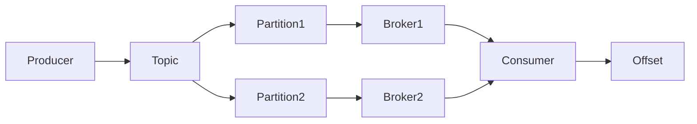

# Kafka分布式消息队列原理与代码实例讲解

关键词：Kafka、分布式、消息队列、发布订阅、生产者消费者、源码分析

## 1. 背景介绍
### 1.1  问题的由来
在当今大数据时代，数据的实时处理和分析变得越来越重要。企业需要构建高性能、高吞吐量的数据管道，以支撑海量数据的实时传输和处理。传统的消息队列系统如ActiveMQ、RabbitMQ等，在高并发、大数据量的场景下往往难以满足性能要求。因此，一个高吞吐、低延迟、高可靠的分布式消息队列系统应运而生，那就是Apache Kafka。

### 1.2  研究现状
Kafka最初由LinkedIn公司开发，用于处理海量的日志数据，后来捐献给Apache基金会，成为顶级开源项目。目前，Kafka已经被广泛应用于日志聚合、流式数据处理、事件溯源、消息系统等领域，成为大数据生态系统中不可或缺的重要组件。许多互联网巨头如Netflix、Uber、Twitter、Airbnb等都在生产环境中大规模使用Kafka。

### 1.3  研究意义
深入研究Kafka的原理和实现，对于构建大规模实时数据处理系统具有重要意义：

1. 理解Kafka的设计思想和架构原理，有助于我们设计出高性能、高可靠的分布式系统。
2. 掌握Kafka的使用方法和最佳实践，可以帮助我们更好地应用Kafka解决实际问题。  
3. 分析Kafka的源码实现，能够让我们学习到优秀的编程思想和代码技巧，写出更加专业、高质量的代码。

### 1.4  本文结构
本文将分为以下几个部分：

- 第2部分介绍Kafka的核心概念和基本原理
- 第3部分重点讲解Kafka的核心算法和关键步骤
- 第4部分给出Kafka系统的数学模型和公式推导
- 第5部分通过代码实例和源码分析Kafka的实现细节  
- 第6部分总结Kafka的实际应用场景
- 第7部分推荐Kafka相关的学习资源和开发工具
- 第8部分展望Kafka未来的发展趋势和挑战
- 第9部分的附录解答一些常见问题

## 2. 核心概念与联系

在讨论Kafka的原理之前，我们先来了解一下Kafka的一些核心概念：

- Producer：消息生产者，负责将消息发布到Kafka中。
- Consumer：消息消费者，负责从Kafka中订阅和消费消息。
- Broker：Kafka服务器，负责存储和管理消息。 
- Topic：消息的主题，生产者发布消息到指定主题，消费者订阅主题来消费消息。
- Partition：Topic的分区，一个Topic可以分为多个Partition，以实现负载均衡和水平扩展。
- Offset：消息在Partition中的偏移量，唯一标识一条消息。

下图展示了这些概念之间的关系：



可以看到，Producer将消息发布到指定Topic，Topic按照一定规则分成多个Partition分布在不同Broker上。Consumer通过订阅Topic来消费消息，并且记录消费的Offset。

## 3. 核心算法原理 & 具体操作步骤
### 3.1  算法原理概述
Kafka的核心是基于日志结构（Log-structured）的消息引擎。每个Partition本质上是一个不可变、有序的消息日志文件。当新消息不断追加写入日志文件时，旧消息会被自动清理删除。这种数据结构具有以下优点：

- 顺序写入：始终在文件末尾追加写入，避免了磁盘随机写的开销。
- 快速查找：通过Offset可以快速定位到任意一条消息。
- 容易扩展：可以方便地增加新的Partition。
- 数据持久：所有消息都持久化到磁盘，宕机后能恢复。

### 3.2  算法步骤详解
具体来说，Kafka的消息读写流程如下：

1. Producer将消息封装成ProducerRecord对象，指定Topic和Partition（可选）。
2. Producer将消息序列化，并发送给Broker。
3. Broker收到消息后，将其追加到指定Partition的日志文件中，并返回ACK。
4. Consumer采用Pull模式主动从Broker拉取消息。
5. Broker根据Consumer的要求，从指定Offset位置读取Partition的消息返回。
6. Consumer收到消息后进行反序列化，然后进行业务处理。
7. Consumer定期向Broker汇报其消费进度，即提交Offset。

可以看到，Kafka通过Partition实现了负载均衡，每个Consumer只需要消费部分Partition。同时，Offset提交机制解耦了Consumer和Broker，实现了消费的进度控制。

### 3.3  算法优缺点

Kafka这种基于日志的消息引擎有如下优点：
- 高吞吐：可以实现每秒数十万甚至数百万条消息的传输。
- 低延迟：可以做到毫秒级的消息投递延迟。
- 高可靠：消息持久化到磁盘，多副本容错，保证数据不丢失。
- 易扩展：可以方便地添加新的Broker和Partition。

同时也存在一些局限性：
- 有序性：只能保证Partition内消息有序，无法做到全局有序。
- 消息积压：消费者消费慢于生产者生产时，会产生消息积压。
- 消息重复：At-least-once语义可能导致消息重复。

### 3.4  算法应用领域
得益于其优异的性能，Kafka被广泛应用于以下场景：

- 日志聚合：收集各种服务、应用的日志数据，用于监控、分析等。
- 流式处理：构建实时流处理管道，进行实时数据分析、ETL等。
- 事件溯源：记录系统产生的各种事件，用于数据恢复、问题追踪等。
- 消息系统：用作分布式的发布订阅消息系统，解耦生产者和消费者。

## 4. 数学模型和公式 & 详细讲解 & 举例说明
### 4.1  数学模型构建
我们可以用一个简单的数学模型来描述Kafka的消息传输过程。假设有$m$个Producer和$n$个Consumer，Kafka集群中有$p$个Partition。定义以下变量：

- $\lambda_i$：第$i$个Producer的消息发布速率
- $\mu_j$：第$j$个Consumer的消息消费速率
- $\theta_k$：第$k$个Partition的消息处理速率

则整个系统的吞吐量$T$可以表示为：

$$T = \min(\sum_{i=1}^m \lambda_i, \sum_{k=1}^p \theta_k, \sum_{j=1}^n \mu_j)$$

直观地说，系统的吞吐量取决于Producer、Kafka、Consumer三者的处理能力。

### 4.2  公式推导过程
我们来推导一下这个公式。首先，Kafka集群的处理能力等于所有Partition的处理能力之和，即$\sum_{k=1}^p \theta_k$。

其次，所有Producer的生产速度之和为$\sum_{i=1}^m \lambda_i$，如果超过了Kafka的处理能力，就会产生消息积压。

同理，所有Consumer的消费速度之和为$\sum_{j=1}^n \mu_j$，如果小于Kafka的处理能力，也会造成消息积压。

因此，系统的实际吞吐量就是Producer、Kafka、Consumer三者能力的最小值，从而得到上面的公式。

### 4.3  案例分析与讲解
举个例子，假设有3个Producer，发布速率分别为10000条/秒、8000条/秒、5000条/秒。Kafka集群有4个Partition，每个Partition的处理速率为6000条/秒。有5个Consumer，消费速率均为4500条/秒。

代入公式可得：

$$T = \min(10000+8000+5000, 4*6000, 5*4500) = 22500 (条/秒)$$

可见，此时系统的吞吐量主要取决于Consumer的消费能力。如果要进一步提高性能，可以考虑增加Consumer的数量或者提升单个Consumer的处理能力。

### 4.4  常见问题解答
问：Kafka的消息是否可能丢失？
答：正常情况下，Kafka能够保证消息不丢失。但如果Producer发送失败或者Consumer提交Offset失败，则有可能导致消息重复。

问：Kafka的消息是否可能乱序？ 
答：在一个Partition内，Kafka可以保证消息的顺序。但是多个Partition之间，并不能保证消息的全局顺序。

问：Kafka的吞吐量瓶颈在哪里？
答：Kafka的性能主要取决于网络和磁盘的I/O能力。通过增加Partition数量、配置合适的Batch参数可以显著提升吞吐量。

## 5. 项目实践：代码实例和详细解释说明
### 5.1  开发环境搭建
要使用Kafka，首先需要搭建好开发环境。具体步骤如下：

1. 安装JDK，Kafka依赖Java运行环境。 
2. 从官网下载Kafka安装包，解压到本地目录。
3. 启动Zookeeper服务，Kafka依赖它进行元数据管理。
4. 启动Kafka服务，包括Server和Client。

可以用下面的命令来启动Zookeeper和Kafka：

```bash
# 启动Zookeeper
bin/zookeeper-server-start.sh config/zookeeper.properties

# 启动Kafka Server
bin/kafka-server-start.sh config/server.properties
```

### 5.2  源代码详细实现
下面我们通过一个简单的Java代码示例，来演示如何使用Kafka的Producer API发送消息：

```java
public class ProducerExample {
    public static void main(String[] args) {
        // 配置Producer参数
        Properties props = new Properties();
        props.put("bootstrap.servers", "localhost:9092");
        props.put("key.serializer", "org.apache.kafka.common.serialization.StringSerializer");
        props.put("value.serializer", "org.apache.kafka.common.serialization.StringSerializer");
        
        // 创建Producer实例
        Producer<String, String> producer = new KafkaProducer<>(props);
        
        // 发送10条消息
        for (int i = 0; i < 10; i++) {
            ProducerRecord<String, String> record = new ProducerRecord<>("my-topic", "message-" + i);
            producer.send(record);
        }
        
        // 关闭Producer
        producer.close();
    }
}
```

可以看到，使用Kafka的Java API还是比较简单的，主要步骤如下：

1. 配置Producer的参数，包括Kafka服务器地址、序列化方式等。
2. 创建KafkaProducer实例。
3. 创建ProducerRecord对象，指定Topic和具体消息。
4. 调用send方法发送消息。
5. 关闭Producer实例。

Consumer的使用方式也类似，就不再赘述。

### 5.3  代码解读与分析
我们再来详细分析一下这段代码。

首先是创建KafkaProducer实例：

```java
Producer<String, String> producer = new KafkaProducer<>(props);
```

注意泛型参数中的String类型，表示消息的Key和Value都是字符串。如果是其他类型，需要自定义相应的序列化器。

接着是构造消息对象ProducerRecord：

```java
ProducerRecord<String, String> record = new ProducerRecord<>("my-topic", "message-" + i);
```

第一个参数指定发送的Topic，第二个参数是消息的具体内容。这里我们循环发送了10条消息。

最后，调用send方法发送消息：

```java
producer.send(record);
```

值得注意的是，send方法是异步的，它会立即返回一个Future对象。可以通过get方法同步获取发送结果，或者传入一个Callback在发送完成时执行。

### 5.4  运行结果展示
我们可以在控制台运行这个Producer程序，然后通过Kafka自带的命令行工具消费消息：

```bash
bin/kafka-console-consumer.sh --bootstrap-server localhost:9092 --topic my-topic --from-beginning
```

运行结果如下：

```
message-0
message-1
message-2
...
message-9
```

可以看到，我们成功地发送和消费了10条消息。

## 6. 实际应用场景
Kafka凭借其高吞吐、低延迟、可