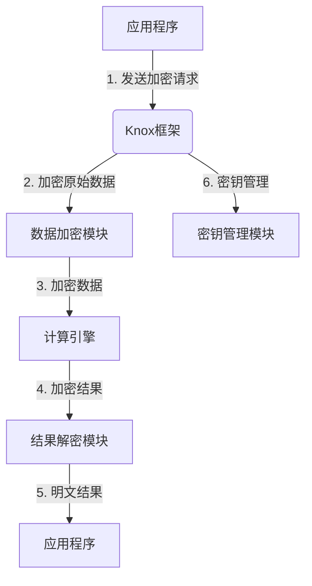
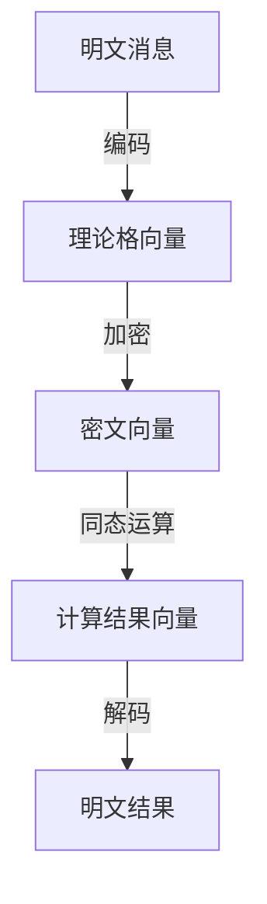

# Knox原理与代码实例讲解

## 1. 背景介绍

### 1.1 问题的由来

在现代计算机系统中,数据安全和隐私保护是一个日益重要的问题。随着数据量的不断增长和数据处理需求的提高,传统的数据存储和处理方式已经无法满足现代应用的需求。因此,需要一种新的数据处理范式来解决这些挑战。

Knox是一种新兴的数据处理框架,旨在提供安全、高效和可扩展的数据处理能力。它基于同态加密技术,允许在加密数据上直接执行计算,而无需先解密数据。这种方法可以保护数据的隐私和机密性,同时提高计算效率。

### 1.2 研究现状

同态加密技术已经存在了几十年,但由于计算复杂度高和效率低的问题,一直难以在实际应用中广泛使用。近年来,随着密码学和计算机硬件的发展,同态加密技术得到了长足的进步。一些公司和研究机构开始探索将同态加密技术应用于实际场景,如云计算、金融、医疗等领域。

Knox是同态加密技术在实际应用中的一个代表性框架。它由一家名为Duality Technologies的初创公司开发,旨在为企业提供安全的数据处理解决方案。Knox已经在金融、医疗和政府等领域得到了一些应用。

### 1.3 研究意义

Knox的出现为解决数据安全和隐私保护问题提供了一种全新的思路。通过在加密数据上直接执行计算,Knox可以保护数据的机密性,同时提高计算效率。这对于一些对数据安全和隐私有严格要求的领域(如金融、医疗等)来说,具有重要的意义。

此外,Knox还提供了一种新的数据处理范式,可以促进数据处理技术的创新和发展。它为解决大数据、人工智能等领域的数据隐私和安全问题提供了一种可行的解决方案。

### 1.4 本文结构

本文将全面介绍Knox的原理、算法和实现细节。文章的主要内容包括:

1. Knox的核心概念和基本原理
2. Knox的核心算法及其数学模型
3. Knox的代码实现和实例分析
4. Knox在实际应用场景中的应用
5. Knox的发展趋势和面临的挑战

通过本文的介绍,读者可以深入了解Knox的工作原理,掌握其核心算法和实现细节,并了解其在实际应用中的应用前景和发展趋势。

## 2. 核心概念与联系

在介绍Knox的核心原理和算法之前,我们需要先了解一些基本概念和背景知识。

### 2.1 同态加密

同态加密(Homomorphic Encryption)是一种允许在加密数据上直接执行计算的加密技术。与传统的加密方案不同,同态加密不需要先解密数据,就可以对加密数据执行加法、乘法等运算,并得到正确的加密结果。

同态加密可以分为部分同态加密(Partially Homomorphic Encryption)和全同态加密(Fully Homomorphic Encryption,FHE)两种类型。部分同态加密只支持加法或乘法运算,而全同态加密则支持任意的加法和乘法运算。

全同态加密是一种理想的加密方案,但由于其计算复杂度极高,目前在实际应用中还存在一些挑战。Knox主要采用了部分同态加密技术,并针对实际应用场景进行了优化和改进。

### 2.2 Knox架构概览

Knox是一个基于同态加密技术的数据处理框架,它由以下几个主要组件组成:

1. **数据加密模块**: 负责对原始数据进行同态加密,生成加密数据。
2. **计算引擎**: 在加密数据上执行各种计算操作,如加法、乘法、比较等。
3. **结果解密模块**: 对计算结果进行解密,得到最终的明文结果。
4. **密钥管理模块**: 负责生成、分发和管理加密密钥。
5. **应用接口**: 提供标准的API接口,方便应用程序与Knox框架进行集成。

下图展示了Knox的基本架构:

在这个架构中,应用程序将原始数据发送给Knox框架进行加密和计算。Knox框架首先使用数据加密模块对原始数据进行同态加密,然后将加密数据传递给计算引擎进行计算操作。计算结果由结果解密模块解密,得到最终的明文结果,并返回给应用程序。整个过程中,密钥管理模块负责生成、分发和管理加密密钥。

### 2.3 Knox的优势

相比传统的数据处理方式,Knox具有以下几个主要优势:

1. **数据隐私保护**: 由于数据在整个处理过程中都是加密状态,因此可以有效保护数据的隐私和机密性。
2. **计算效率提升**: 通过在加密数据上直接执行计算,Knox可以避免数据解密和重新加密的开销,提高计算效率。
3. **安全性增强**: Knox采用了多层次的安全措施,如密钥管理、访问控制等,可以有效防止数据泄露和未经授权的访问。
4. **可扩展性强**: Knox框架具有良好的模块化设计,可以方便地集成到各种应用程序中,并支持横向扩展以满足大规模计算需求。

## 3. 核心算法原理 & 具体操作步骤

### 3.1 算法原理概述

Knox的核心算法基于部分同态加密技术,主要支持加法和乘法同态运算。具体来说,Knox采用了一种名为BGV(Brakerski-Gentry-Vaikuntanathan)的同态加密方案。

BGV方案是一种基于理论格的全同态加密方案,它支持任意次数的加法同态和有限次数的乘法同态。在Knox中,BGV方案被优化和改进,以支持更高效的加法和乘法同态运算。

BGV方案的基本思路是将明文信息编码为一个理论格向量,并使用一个短向量作为密钥对其进行加密。加密后的密文也是一个理论格向量。通过对密文向量进行一些特殊的运算,可以实现加法和乘法同态。

下图展示了BGV同态加密方案的基本流程:

在这个流程中,明文消息首先被编码为一个理论格向量,然后使用密钥对其进行加密,得到密文向量。在密文向量上执行同态运算(如加法或乘法),可以得到计算结果向量。最后,通过解码操作,可以从结果向量中恢复出明文结果。

需要注意的是,BGV方案中的乘法同态运算是有限制的,只能执行有限次数的乘法运算。这是因为每次乘法运算都会导致噪声的增加,当噪声超过一定阈值时,就无法正确解码得到明文结果。因此,在实际应用中,需要根据具体的计算需求来平衡加法和乘法运算的次数。

### 3.2 算法步骤详解

下面我们将详细介绍BGV同态加密算法的具体步骤。

#### 3.2.1 参数选择

在BGV算法中,需要首先选择一些密码学参数,如环的维数 $n$、模数 $q$、标准偏差 $\sigma$ 等。这些参数的选择将直接影响加密方案的安全性和效率。

一般来说,环的维数 $n$ 越大,加密方案的安全性就越高,但计算开销也会增加。模数 $q$ 决定了加密空间的大小,需要根据明文消息的范围来选择合适的值。标准偏差 $\sigma$ 控制了密钥的分布,它需要足够小以确保安全性,但也不能太小以至于影响解码的正确性。

#### 3.2.2 密钥生成

在BGV算法中,密钥包括一个秘密密钥 $sk$ 和一个公开密钥 $pk$。密钥生成过程如下:

1. 选择一个短向量 $\vec{s}$ 作为秘密密钥 $sk$,其分量服从于 $D_{\mathbb{Z},\sigma}$ 分布。
2. 计算 $\vec{b} = \vec{a} \cdot \vec{s} + \vec{e}$,其中 $\vec{a}$ 是一个随机向量,而 $\vec{e}$ 是一个小的错误向量,服从于 $D_{\mathbb{Z},\sigma}$ 分布。
3. 将 $(\vec{a},\vec{b})$ 作为公开密钥 $pk$。

#### 3.2.3 加密

加密过程将一个明文消息 $m$ 映射到一个密文向量 $\vec{c}$。具体步骤如下:

1. 将明文消息 $m$ 编码为一个理论格向量 $\vec{m}$。
2. 选择一个随机向量 $\vec{u}$,服从于 $D_{\mathbb{Z},\sigma}$ 分布。
3. 计算密文向量 $\vec{c} = \vec{m} + \vec{a} \cdot \vec{u} \pmod{q}$。

#### 3.2.4 加法同态

对于两个密文向量 $\vec{c}_1$ 和 $\vec{c}_2$,它们对应的明文消息分别为 $m_1$ 和 $m_2$,我们可以通过简单的向量相加来实现加法同态:

$$\vec{c}_1 + \vec{c}_2 = (\vec{m}_1 + \vec{a} \cdot \vec{u}_1) + (\vec{m}_2 + \vec{a} \cdot \vec{u}_2) = \vec{m}_1 + \vec{m}_2 + \vec{a} \cdot (\vec{u}_1 + \vec{u}_2) \pmod{q}$$

可以看出,相加后的密文向量对应的明文消息就是 $m_1 + m_2$,因此实现了加法同态。

#### 3.2.5 乘法同态

乘法同态的实现比加法同态更加复杂。我们首先需要计算一个重新随机化密钥 $rlk$,它由一个二次向量 $\vec{c}$ 和一个掩码向量 $\vec{r}$ 组成。

计算过程如下:

1. 选择一个随机向量 $\vec{r}$,服从于 $D_{\mathbb{Z},\sigma}$ 分布。
2. 计算 $\vec{e}_1 = \vec{a} \cdot \vec{r} \pmod{q}$。
3. 计算 $\vec{e}_2 = \vec{b} \cdot \vec{r} \pmod{q}$。
4. 将 $rlk = (\vec{c},\vec{r})$,其中 $\vec{c} = (-\vec{e}_1,\vec{e}_2)$。

有了重新随机化密钥 $rlk$,我们就可以对两个密文向量 $\vec{c}_1$ 和 $\vec{c}_2$ 执行乘法同态运算了。具体步骤如下:

1. 计算 $\vec{c}_{mul} = \vec{c}_1 \otimes \vec{c}_2$,其中 $\otimes$ 表示一种特殊的张量积运算。
2. 使用重新随机化密钥 $rlk$ 对 $\vec{c}_{mul}$ 进行重新随机化,得到新的密文向量 $\vec{c}_{mul}'$。

重新随机化的目的是控制噪声的增长,以确保解码的正确性。经过这一步骤,我们得到的 $\vec{c}_{mul}'$ 对应的明文消息就是 $m_1 \cdot m_2$,从而实现了乘法同态。

需要注意的是,由于噪声的积累,乘法同态运算只能执行有限次数。当噪声超过一定阈值时,就无法正确解码得到明文结果。因此,在实际应用中,需要根据