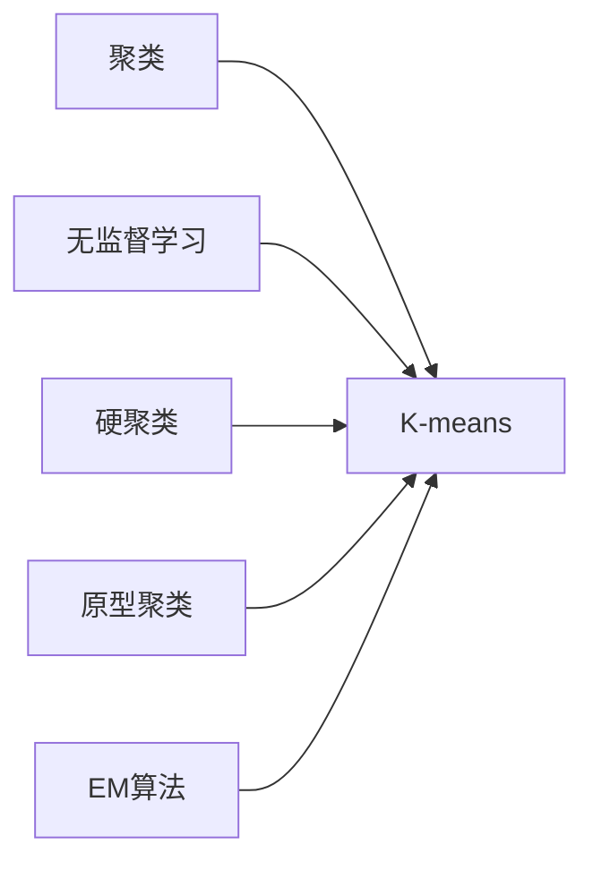

# K-均值聚类K-means原理与代码实例讲解

关键词：K-means聚类、无监督学习、欧氏距离、数据挖掘

## 1. 背景介绍
### 1.1 问题的由来
在大数据时代,面对海量的数据,如何从中发现有价值的信息和知识,是数据挖掘领域面临的重要课题。聚类分析作为数据挖掘的一个重要分支,在模式识别、图像分割、信息检索等领域有着广泛的应用。其中,K-means聚类以其简单、高效的特点,成为最常用的聚类算法之一。

### 1.2 研究现状
K-means聚类算法由MacQueen在1967年首次提出,经过半个多世纪的发展,已经衍生出多个变种,如Kernel K-means、Fuzzy C-means等。近年来,随着大数据和人工智能的兴起,K-means聚类在诸多领域得到了新的应用,如推荐系统、异常检测、语音识别等。同时,一些改进的K-means算法也被提出,如K-means++、Mini Batch K-means等,以进一步提升算法的性能。

### 1.3 研究意义
深入理解和掌握K-means聚类算法,对于从事数据挖掘、机器学习等相关工作的人员来说至关重要。一方面,K-means作为一种基础性的聚类算法,是学习其他聚类方法的基础;另一方面,在实际应用中,直接使用或改进K-means算法,可以解决许多聚类问题。因此,本文旨在全面剖析K-means聚类的原理,并给出具体的代码实例,让读者在理论和实践两个层面都能掌握这一算法。

### 1.4 本文结构
本文将分为以下几个部分展开:
- 第2部分介绍K-means聚类的核心概念及其与其他概念的联系
- 第3部分详细讲解K-means的算法原理和步骤
- 第4部分建立K-means的数学模型,推导相关公式,并举例说明
- 第5部分给出K-means的代码实现,结合实例进行讲解
- 第6部分分析K-means在实际场景中的应用
- 第7部分推荐K-means聚类的学习资源、工具和文献
- 第8部分总结全文,展望算法的发展趋势和面临的挑战
- 第9部分列出一些常见问题,并给出解答

## 2. 核心概念与联系
K-means聚类的核心概念包括:
- 聚类(Clustering):将物理或抽象对象的集合组织成多个类或簇的过程,使得在同一个簇中的对象彼此相似,而不同簇中的对象存在差异。
- 质心(Centroid):每个簇的中心点,通常使用簇内所有点的均值表示。
- 距离度量(Distance Measure):度量数据对象之间差异性的方法,常用的有欧氏距离、曼哈顿距离等。

K-means与其他一些概念的联系如下:
- 无监督学习:K-means是一种无监督学习算法,即训练样本没有标签,算法需要自行发现数据内在的结构和关系。
- 硬聚类:K-means是硬聚类的代表,每个对象只能属于一个类别,不存在模糊的概念。
- 原型聚类:K-means通过迭代找到每个簇的质心,从而实现聚类,属于原型聚类的一种。
- EM算法:K-means可以看作EM算法的一个特例,E步骤是根据当前质心划分簇,M步骤是更新质心。



## 3. 核心算法原理 & 具体操作步骤
### 3.1 算法原理概述
K-means算法以空间中k个点为中心进行聚类,对最靠近他们的对象归类。通过迭代的方法,逐次更新各聚类中心的值,直至得到最好的聚类结果。
其基本思想是:以空间中k个点为中心进行聚类,对最靠近他们的对象归类,重新计算聚类中心,直至聚类中心不再发生变化或达到最大迭代次数。

### 3.2 算法步骤详解
1. 随机选取K个对象作为初始的聚类中心(质心)
2. 计算每个对象与各个质心之间的距离,并将其分配到距离最近的簇 
3. 重新计算每个簇的质心(取簇中所有对象的均值)
4. 重复2-3步骤,直到簇的分配不再发生变化或达到最大迭代次数

可以用下面的伪代码表示:
```
初始化k个质心 
repeat
    将每个点指派到最近的质心,形成k个簇
    重新计算每个簇的质心
until 簇不再发生变化或达到最大迭代次数
```

### 3.3 算法优缺点
优点:
- 原理简单,易于实现
- 聚类效果较好,实用性强
- 算法的可解释性强
- 通过调参,可以适应不同场景

缺点:  
- 需要预先确定k值
- 对噪声和异常点敏感
- 容易陷入局部最优
- 对初始质心的位置敏感

### 3.4 算法应用领域
- 市场细分:根据顾客特征进行客户群划分
- 图像分割:将图像像素按照纹理、颜色等特征分组
- 文本聚类:对文本库进行主题发现和文档组织
- 异常检测:检测不属于任何一个簇的异常点

## 4. 数学模型和公式 & 详细讲解 & 举例说明 
### 4.1 数学模型构建
假设我们有一个数据集 $D=\{x_1,x_2,...,x_n\}$,每个数据对象 $x_i$ 用 $d$ 维实数向量表示。令 $C=\{C_1,C_2,...,C_k\}$ 代表聚类结果,其中 $C_i$ 表示第 $i$ 个簇。令 $\mu_i$ 表示簇 $C_i$ 的质心。

我们的目标是最小化所有对象与其所属簇质心的距离平方和,即最小化代价函数:

$$J(C,\mu)=\sum_{i=1}^k \sum_{x \in C_i} ||x-\mu_i||^2$$

其中 $||\cdot||$ 表示欧氏距离。

### 4.2 公式推导过程
求解上述最优化问题,我们可以使用迭代优化的策略:固定 $\mu$ 优化 $C$,再固定 $C$ 优化 $\mu$,交替进行直至收敛。

- 固定 $\mu$ 优化 $C$:
$$C_i=\{x_p:||x_p-\mu_i||^2 \leq ||x_p-\mu_j||^2,\forall j,1 \leq j \leq k\}$$
即每个对象被分配到距离最近的质心所在的簇。

- 固定 $C$ 优化 $\mu$:
$$\mu_i=\frac{1}{|C_i|} \sum_{x \in C_i} x$$
即每个簇的质心更新为簇内所有对象的均值。

### 4.3 案例分析与讲解
下面我们以一个简单的二维数据集为例,展示K-means聚类的过程。

假设有以下10个数据点:
```
(1,1),(1,2),(2,1),(2,2),(5,5),(5,6),(6,5),(6,6),(8,1),(9,1)
```
取 $k=3$,随机选择(1,1),(5,5),(8,1)作为初始质心。

迭代过程:
1. 对每个点,计算与3个质心的距离,并划分到最近的簇:
$$C_1=\{(1,1),(1,2),(2,1),(2,2)\}$$
$$C_2=\{(5,5),(5,6),(6,5),(6,6)\}$$
$$C_3=\{(8,1),(9,1)\}$$

2. 更新每个簇的质心:
$$\mu_1=(1.5,1.5),\mu_2=(5.5,5.5),\mu_3=(8.5,1)$$

3. 重复1-2步,直至簇的划分不再变化。

最终我们得到3个簇,分别代表左下、右上、右下三个区域的点。通过调整k值,我们可以得到粒度不同的聚类结果。

### 4.4 常见问题解答
- 如何选择k值?
  - 根据先验知识
  - 尝试不同的k,对聚类结果进行评估
  - 使用手肘法等启发式方法

- 如何应对噪声数据?
  - 数据预处理,去除异常点
  - 使用更鲁棒的聚类算法,如K-medoids
  - 允许噪声点单独成为一个簇

- 如何避免局部最优?
  - 多次运行算法,选择最优解
  - 使用K-means++等优化初始质心的方法
  - 尝试层次聚类等其他算法

## 5. 项目实践：代码实例和详细解释说明
### 5.1 开发环境搭建
本项目使用Python 3.x作为开发语言,需要安装以下库:
- numpy:数值计算库
- matplotlib:绘图库
- scikit-learn:机器学习库

可以使用pip安装:
```bash
pip install numpy matplotlib scikit-learn
```

### 5.2 源代码详细实现
下面给出K-means聚类的Python实现:

```python
import numpy as np
import matplotlib.pyplot as plt

class KMeans:
    def __init__(self, n_clusters=3, max_iter=100):
        self.n_clusters = n_clusters
        self.max_iter = max_iter
        self.centroids = None
        
    def fit(self, X):
        # 随机选择初始质心
        idx = np.random.choice(X.shape[0], self.n_clusters, replace=False)
        self.centroids = X[idx]
        
        for _ in range(self.max_iter):
            # 计算每个点到质心的距离
            distances = self._calc_distances(X)
            
            # 将每个点分配到最近的簇
            labels = np.argmin(distances, axis=1)
            
            # 更新质心
            for i in range(self.n_clusters):
                self.centroids[i] = X[labels == i].mean(axis=0)
                
    def predict(self, X):
        distances = self._calc_distances(X)
        return np.argmin(distances, axis=1)
    
    def _calc_distances(self, X):
        return np.sqrt(((X[:, np.newaxis] - self.centroids) ** 2).sum(axis=2))

# 生成示例数据
X = np.array([[1,1],[1,2],[2,1],[2,2],[5,5],[5,6],[6,5],[6,6],[8,1],[9,1]])

# 训练模型
kmeans = KMeans(n_clusters=3)
kmeans.fit(X)

# 预测类别
labels = kmeans.predict(X)

# 可视化结果
plt.scatter(X[:,0], X[:,1], c=labels)
plt.scatter(kmeans.centroids[:,0], kmeans.centroids[:,1], marker='x', s=200, c='r')
plt.xlabel('x')
plt.ylabel('y') 
plt.title('K-means clustering')
plt.show()
```

### 5.3 代码解读与分析
- 首先定义了一个KMeans类,构造函数接受聚类数和最大迭代次数两个参数。
- fit方法实现了K-means的训练过程,predict方法根据训练好的质心对新数据进行分类。
- _calc_distances是一个辅助方法,用于计算每个数据点与所有质心的距离。
- 在主函数部分,我们首先生成了一个简单的二维数据集,然后训练K-means模型,对数据进行聚类,最后对结果进行可视化。

### 5.4 运行结果展示
运行上述代码,我们得到以下聚类结果:


可以看到,算法成功地将数据点划分为3个簇,每个簇的质心用红色叉号表示。

## 6. 实际应用场景
K-means聚类在实际中有非常广泛的应用,下面列举几个典型场景:

- 客户细分:通过客户的消费行为、人口统计学特征等,将客户划分为不同的群体,实现精准营销。
- 图像分割:将图像像素按照颜色、纹理等特征进行聚类,实现图像的分割。
- 文