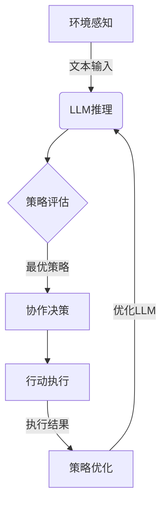

# LLM-based Multi-Agent System

## 1. 背景介绍

### 1.1 问题的由来

在当今快速发展的数字时代，智能系统的需求与日俱增。传统的单一智能体系统在处理复杂任务时往往会遇到瓶颈,难以满足现实世界中多样化、动态和不确定的需求。为了应对这一挑战,多智能体系统(Multi-Agent System, MAS)应运而生。

多智能体系统是一种由多个智能体(Agent)组成的分布式人工智能系统。这些智能体可以是软件代理、机器人或其他自主实体,它们通过协作、竞争或两者兼而有之的方式相互作用,以完成特定的任务或目标。与单一智能体系统相比,多智能体系统具有更强的灵活性、可扩展性和鲁棒性,能够更好地处理复杂、动态和不确定的环境。

然而,传统的多智能体系统也面临着一些挑战,例如智能体之间的协调、通信和决策制定等。近年来,大语言模型(Large Language Model, LLM)的兴起为多智能体系统带来了新的发展机遇。LLM通过从海量文本数据中学习,获得了广泛的知识和强大的语言理解能力,为智能体提供了更好的决策支持和协作能力。

### 1.2 研究现状

LLM在多智能体系统中的应用是一个新兴的研究领域,目前已有一些初步的探索和成果。一些研究人员尝试将LLM作为智能体的决策模块,利用其强大的语言理解和推理能力来制定行动策略。另一些研究则关注于利用LLM进行智能体之间的通信和协调,以提高系统的整体性能。

然而,现有的研究大多局限于特定的应用场景或任务,缺乏一个通用的LLM-based多智能体系统框架。此外,如何有效地将LLM与传统的多智能体系统技术(如规划、协商、学习等)相结合,也是一个亟待解决的问题。

### 1.3 研究意义

构建一个通用的LLM-based多智能体系统框架,不仅可以充分发挥LLM的优势,同时也能借鉴传统多智能体系统的理论和技术,从而实现智能体之间更高效、更智能的协作。这种框架将为复杂任务的解决提供一种新的范式,并在诸多领域产生广泛的应用价值,如智能制造、智能交通、智能家居、智能医疗等。

此外,研究LLM-based多智能体系统也将推动人工智能理论和技术的发展,为解决更加复杂的问题提供新的思路和方法。

### 1.4 本文结构

本文将首先介绍LLM-based多智能体系统的核心概念和原理,包括智能体、LLM、多智能体系统等。接下来,将详细阐述系统的核心算法和数学模型,并通过案例分析加深读者的理解。然后,我们将展示一个实际项目的代码实现,并对关键部分进行解释和分析。最后,本文将探讨LLM-based多智能体系统在不同领域的应用场景,介绍相关的工具和资源,并对未来的发展趋势和挑战进行总结和展望。

## 2. 核心概念与联系

在深入探讨LLM-based多智能体系统之前,我们需要先了解一些核心概念及它们之间的联系。

#### 智能体(Agent)

智能体是一个能够感知环境、处理信息、做出决策并采取行动的自主实体。它可以是软件代理、机器人或其他具有一定智能的系统。智能体通常具有以下几个关键特征:

1. **自主性(Autonomy)**: 智能体能够独立做出决策和行动,而不需要人工干预。
2. **反应性(Reactivity)**: 智能体能够感知环境的变化并作出相应的反应。
3. **主动性(Pro-activeness)**: 智能体不仅能够对环境作出反应,还能够根据自身的目标主动采取行动。
4. **社会性(Social Ability)**: 智能体能够与其他智能体进行交互和协作,以完成更复杂的任务。

#### 大语言模型(LLM)

大语言模型(Large Language Model, LLM)是一种基于深度学习的自然语言处理模型,通过从大量文本数据中学习,获得了广泛的知识和强大的语言理解能力。LLM可以用于各种自然语言处理任务,如机器翻译、文本生成、问答系统等。

LLM的核心是一个巨大的神经网络模型,通常采用Transformer架构,能够有效捕捉文本中的上下文信息和语义关系。训练过程中,LLM会从海量的文本数据中学习单词的表示、语法规则和语义知识,从而获得对自然语言的深刻理解。

一些著名的LLM包括GPT-3、BERT、XLNet等。这些模型展现出了令人印象深刻的语言生成和理解能力,为智能系统的发展带来了新的机遇。

#### 多智能体系统(MAS)

多智能体系统(Multi-Agent System, MAS)是一种由多个智能体组成的分布式人工智能系统。这些智能体可以是软件代理、机器人或其他自主实体,它们通过协作、竞争或两者兼而有之的方式相互作用,以完成特定的任务或目标。

多智能体系统具有以下几个关键特征:

1. **分布性(Distribution)**: 系统中的智能体是分布式的,彼此独立且具有自主性。
2. **开放性(Openness)**: 系统可以动态地加入或移除智能体,具有很强的开放性和灵活性。
3. **协作(Cooperation)**: 智能体之间需要通过协作来完成复杂的任务,这需要有效的协调和通信机制。
4. **竞争(Competition)**: 在某些情况下,智能体之间也可能存在竞争关系,需要采取相应的策略。

多智能体系统能够更好地处理复杂、动态和不确定的环境,具有很强的鲁棒性和可扩展性。它已经在许多领域得到了广泛的应用,如智能制造、智能交通、电子商务等。

#### LLM-based多智能体系统

LLM-based多智能体系统是将大语言模型(LLM)与多智能体系统(MAS)相结合的一种新型智能系统。在这种系统中,LLM被用作智能体的决策模块或通信模块,利用其强大的语言理解和推理能力来支持智能体之间的协作和决策制定。

通过将LLM引入多智能体系统,我们可以获得以下几个主要优势:

1. **增强决策能力**: LLM可以为智能体提供更好的决策支持,帮助它们做出更明智、更合理的决策。
2. **改善通信协作**: LLM可以促进智能体之间的通信和协作,使它们能够更好地理解彼此的意图和行为。
3. **知识共享**: LLM可以作为知识库,为智能体提供广泛的知识支持,促进知识的共享和传播。
4. **动态适应**: LLM具有强大的学习能力,可以根据环境的变化动态调整自身的行为策略。

通过合理设计和优化,LLM-based多智能体系统有望在复杂任务的解决、动态环境的适应等方面取得突破性的进展。

## 3. 核心算法原理 & 具体操作步骤

### 3.1 算法原理概述

LLM-based多智能体系统的核心算法是基于大语言模型(LLM)和多智能体系统理论,旨在实现智能体之间的高效协作和决策制定。该算法主要包括以下几个关键步骤:

1. **环境感知**: 智能体通过传感器感知当前环境状态,并将其转换为文本形式的输入。
2. **LLM推理**: 智能体将环境状态输入到LLM中,LLM根据其所学习的知识和语义信息,推理出可能的行动策略。
3. **策略评估**: 智能体根据自身的目标和约束条件,评估LLM推理出的各种策略,选择最优策略。
4. **协作决策**: 智能体与其他智能体进行通信和协商,共同制定出一个协调一致的行动计划。
5. **行动执行**: 智能体执行协商后的行动计划,并将执行结果反馈到环境中。
6. **策略优化**: 根据行动执行的结果,智能体可以对LLM进行优化和调整,以提高未来决策的准确性。

该算法的核心思想是利用LLM的强大语言理解和推理能力,为智能体提供决策支持和知识支撑。同时,通过智能体之间的协作和反馈优化,不断提高系统的整体性能和适应能力。

### 3.2 算法步骤详解

#### 步骤1: 环境感知

在这一步骤中,智能体需要通过各种传感器(如视觉、声音、温度等)感知当前环境的状态。这些感知数据通常是非结构化的,需要转换为LLM能够理解的文本形式。

例如,对于一个视觉传感器,我们可以使用计算机视觉技术将图像转换为文本描述。对于其他类型的传感器,也可以采用相应的方法将数据转换为文本。

#### 步骤2: LLM推理

智能体将环境状态的文本描述输入到LLM中,LLM根据其所学习的知识和语义信息,推理出一系列可能的行动策略。这些策略通常是以自然语言的形式表示的。

LLM的推理过程可以看作是一个条件概率模型,它根据给定的环境状态文本,预测出最可能的后续行动序列。具体来说,LLM会计算出每个可能的行动序列的条件概率:

$$P(action\_sequence | environment\_state)$$

其中,`action_sequence`表示一系列可能的行动,`environment_state`表示当前的环境状态描述。LLM会输出概率最高的几个行动序列作为候选策略。

#### 步骤3: 策略评估

智能体接收到LLM推理出的候选策略后,需要根据自身的目标和约束条件对这些策略进行评估,选择出最优策略。

评估过程可以考虑多个因素,如策略的预期效用、执行成本、风险水平等。智能体可以建立一个多目标优化模型,将这些因素综合考虑,从而选择出最优的策略。

具体来说,我们可以定义一个效用函数 $U(s, a)$,表示在状态 $s$ 下执行行动 $a$ 的效用值。智能体的目标是最大化其预期效用:

$$\max\limits_{a} \mathbb{E}[U(s, a)]$$

其中,预期效用可以通过蒙特卡罗模拟或其他方法来估计。在评估过程中,智能体还需要考虑其他约束条件,如成本、时间等,从而选择出最优策略。

#### 步骤4: 协作决策

在多智能体系统中,单个智能体的决策往往无法满足复杂任务的需求,因此需要智能体之间进行协作和协商,共同制定出一个协调一致的行动计划。

协作决策过程可以采用各种协商机制,如投票、拍卖、契约网等。智能体需要相互交换信息,协调各自的行动,以达成一致的决策。

在LLM-based多智能体系统中,智能体可以利用LLM的语言生成能力,以自然语言的形式进行信息交换和协商。每个智能体都可以向其他智能体解释自己的决策依据和建议,并考虑其他智能体的反馈,最终达成一致。

此外,LLM还可以为协商过程提供知识支持,帮助智能体更好地理解彼此的意图和行为,从而促进协作决策的顺利进行。

#### 步骤5: 行动执行

经过协商后,智能体将执行协调一致的行动计划,并将执行结果反馈到环境中。这一步骤需